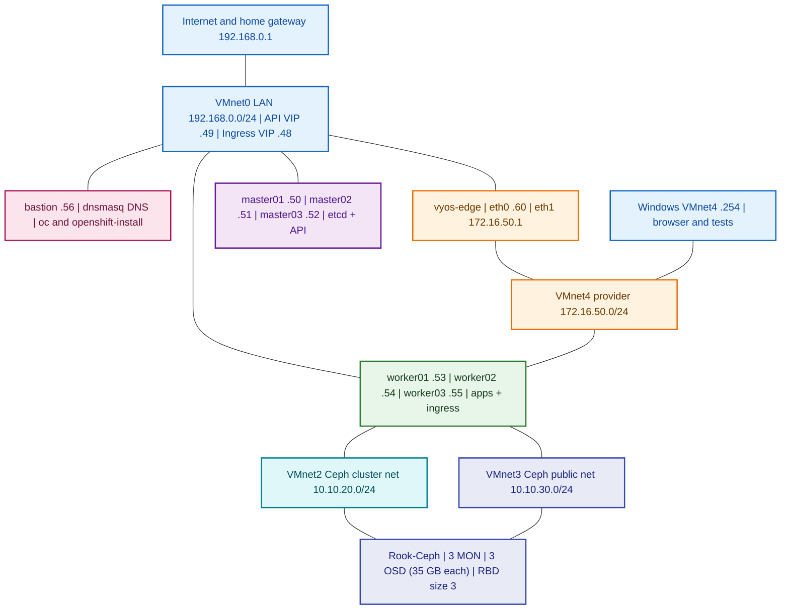

# Six-Node OpenShift HA Lab on VMware Workstation

## OpenShift 4.22 Agent-based Installer + OVN-Kubernetes + VyOS Stream + Rook-Ceph RBD

**Prepared:** 6 October 2026
**OpenShift release used:** 4.22 (Kubernetes 1.35, CRI-O, RHCOS based on RHEL 9.8), installed from the `stable-4.22` channel
**Install method:** Agent-based Installer, `platform: baremetal` with API and Ingress VIPs (no external load balancer needed)
**Host OS for tooling:** CentOS Stream 10 `bastion` VM
**Storage:** Rook-Ceph (upstream) with RBD block storage on a dedicated disk per worker
**Edge router:** VyOS Stream `2026.03` (same VM and config style as the OpenStack lab)
**Lab platform:** VMware Workstation on Windows (same VMnet0/2/3/4 layout as the OpenStack lab)

> [!IMPORTANT]
> **Read this first: what this document is and is not**
>
> - **Not a transcript of the video.** The YouTube link
>   (`GXpaHKI-QBc`, `t=1182s`) could not be loaded when this guide was written
>   (HTTP 429), so none of its steps are copied here. The procedure follows the
>   documented Red Hat **Agent-based Installer** workflow for 4.22 and your
>   OpenStack lab's network design.
> - **Outputs are representative, not captured.** Every block titled
>   *Expected output* shows the shape and typical values you should see. It was
>   **not** recorded from a live run, so hostnames, IDs, timestamps, and
>   z-stream versions will differ. If your output differs in *meaning* (a
>   degraded operator, a missing node), treat that as a real problem.
> - **Lab-only, unsupported platform.** VMware Workstation is not a Red Hat
>   supported OpenShift platform. This is a learning topology. Do not use it
>   for business data.
> - **Latest version.** 4.22 is the latest generally available minor release I
>   could confirm on 6 October 2026 (4.22.16 was the newest z-stream listed in
>   the release notes). OpenShift 5.0 appears in Red Hat's upstream CI and
>   tracking, but I could **not** confirm it as generally available. Before you
>   start, check
>   <https://mirror.openshift.com/pub/openshift-v4/x86_64/clients/ocp/>
>   and the 4.22 release notes. If 5.0 is GA, re-check the installer
>   parameters before reusing these manifests.

> [!CAUTION]
> Rook creates Ceph OSDs on `/dev/sdb` and **erases** it. This guide assumes
> `/dev/sdb` is a new, empty virtual disk on each worker. Verify the device
> before applying the Ceph cluster manifest.

---

## Table of contents

1. [Start here: which machine runs each command](#start-here--which-machine-runs-each-command)
2. [Architecture](#1-architecture)
3. [Network and IP plan](#2-network-and-ip-plan)
4. [Resource plan](#3-resource-plan)
5. [Phase 1: VMware networks](#4-phase-1--vmware-workstation-networks)
6. [Phase 2: create the eight VMs](#5-phase-2--create-the-vms)
7. [Phase 3: VyOS edge](#6-phase-3--vyos-edge)
8. [Phase 4: bastion, DNS, and tools](#7-phase-4--bastion-dns-and-tools)
9. [Phase 5: installer manifests](#8-phase-5--create-the-installer-manifests-and-iso)
10. [Phase 6: boot nodes and install](#9-phase-6--boot-the-nodes-and-install)
11. [Phase 7: validate the cluster](#10-phase-7--validate-the-cluster)
12. [Phase 8: first admin user](#11-phase-8--create-a-real-admin-user)
13. [Phase 9: Rook-Ceph storage](#12-phase-9--rook-ceph-storage-on-vmnet2-and-vmnet3)
14. [Phase 10: image registry on Ceph](#13-phase-10--image-registry-on-ceph-optional)
15. [Phase 11: sample application](#14-phase-11--deploy-a-sample-application)
16. [Phase 12: HA tests](#15-phase-12--validate-high-availability)
17. [Phase 13: MetalLB on VMnet4 (optional, advanced)](#16-phase-13--metallb-on-vmnet4-optional-advanced)
18. [Operations: backup, shutdown, upgrade](#17-operations)
19. [Troubleshooting](#18-troubleshooting)
20. [Acceptance checklist](#19-final-acceptance-checklist)
21. [References](#20-references)

---

## Start here — which machine runs each command

| When | Machine | Work |
|---|---|---|
| Phases 1-2 | **Windows laptop, VMware Workstation UI** | Create VMnet2/3/4, create eight VMs, attach NICs and disks. |
| Phase 3 | **`vyos-edge` VMware console**, then Windows for `ping`/`scp` | Install VyOS, configure routing, firewall, NAT. |
| Phase 4 | **`bastion` console, then SSH** | Static IP, DNS server (`dnsmasq`), `oc`, `openshift-install`. |
| Phases 5-8 | **`bastion` as `cloudadmin`** | Build manifests, ISO, watch install, run `oc`. |
| Phase 6 (boot) | **Windows laptop, VMware Workstation UI** | Attach the agent ISO to the six cluster VMs and power them on. |
| Phase 9-11 | **`bastion`** with `oc` | Rook-Ceph, registry, sample app. |
| Phase 12 | **`bastion`** + VMware UI | Power off one node at a time and verify recovery. |
| Operations | **`bastion`** | Backups, graceful shutdown, upgrades. |

The six **OpenShift nodes** are `master01-03` and `worker01-03`. `vyos-edge` and
`bastion` are **separate extra VMs**. Never paste a VyOS `set ...` command into a
Linux shell.

---

## 1. Architecture

### 1.1 What maps from the OpenStack lab and what changes

You asked for the same architecture as the OpenStack document. The physical
layout is kept (six nodes, VyOS edge, four VMnets, Ceph on three disks). A few
roles move because OpenShift works differently from OpenStack:

| OpenStack lab | This OpenShift lab | Why it differs |
|---|---|---|
| `ctrl01-03` (controllers, `.50-.52`) | `master01-03` (control plane, `.50-.52`) | Same IPs, same quorum-of-three idea (etcd instead of Galera). |
| `compute01-03` (`.53-.55`) | `worker01-03` (`.53-.55`) | Same IPs. Workers also carry the Ceph OSD disk. |
| API VIP `192.168.0.49` (Keepalived + HAProxy) | API VIP `192.168.0.49` (Keepalived managed by OpenShift) | Same VIP, now OpenShift-managed. |
| none | Ingress VIP `192.168.0.48` | OpenShift routes apps through an ingress VIP. |
| deployment host = `ctrl01` | separate `bastion` VM (`.56`) | Holds DNS, installer, and `oc`. Keeps the cluster nodes clean. |
| VMnet2 = OVN Geneve tunnels | VMnet2 = **Ceph cluster (replication) network** | OVN-Kubernetes builds its Geneve overlay on the node's primary interface (VMnet0). It cannot simply be pinned to a second NIC at install time. |
| VMnet3 = Ceph public | VMnet3 = **Ceph public network** | Same role. Rook binds Ceph to it using host networking. |
| VMnet4 on controllers, floating IPs `.100-.199` | VMnet4 on **workers**, optional MetalLB pool `.100-.199` | OpenShift ingress and LoadBalancer pods run on workers, not masters. |
| VyOS `eth0 .60`, `eth1 .1` | identical | Edge router, firewall, SNAT. |

### 1.2 Color architecture



### 1.3 How the install flows

```mermaid
flowchart LR
    classDef step fill:#E8F5E9,stroke:#2E7D32,color:#163B1B,stroke-width:2px
    classDef node fill:#F3E5F5,stroke:#6A1B9A,color:#4A148C,stroke-width:2px
    A["bastion: install-config.yaml + agent-config.yaml"]:::step
    B["openshift-install agent create image"]:::step
    C["agent.x86_64.iso"]:::step
    D["Boot all 6 VMs from ISO"]:::node
    E["master01 = rendezvous host (.50) runs the assisted service"]:::node
    F["All hosts register, RHCOS written to disk, nodes reboot"]:::node
    G["Cluster installed: API VIP .49, apps VIP .48"]:::step
    A --> B --> C --> D --> E --> F --> G
```



### 1.4 Traffic in plain language

1. You administer the cluster through `https://api.ocp.lab.example.com:6443`,
   which resolves to the API VIP `192.168.0.49`. One master holds that VIP at a time.
2. Web apps and the console use `*.apps.ocp.lab.example.com`, which resolves to
   the ingress VIP `192.168.0.48`, held by one worker running a router pod.
3. Pod-to-pod traffic uses the OVN-Kubernetes overlay over the node's VMnet0 address.
4. Ceph client traffic (RBD) uses VMnet3. Ceph OSD replication uses VMnet2.
5. Nodes reach the Internet (image pulls, Red Hat registries) through
   `192.168.0.1` on VMnet0. VyOS is **not** in the default path of the cluster
   nodes. It is the edge for the VMnet4 provider network, as in the OpenStack lab.

---

## 2. Network and IP plan

### 2.1 VMware virtual networks

| VMnet | Type | Subnet | VMware DHCP | Connected devices | Purpose |
|---|---|---|---|---|---|
| VMnet0 | Bridged | `192.168.0.0/24` | Not used | All eight VMs | Management, API, apps, Internet. |
| VMnet2 | Host-only | `10.10.20.0/24` | **Disabled** | worker01-03 | Ceph cluster (replication) traffic. |
| VMnet3 | Host-only | `10.10.30.0/24` | **Disabled** | worker01-03 | Ceph public (client/RBD) traffic. |
| VMnet4 | Host-only | `172.16.50.0/24` | **Disabled** | worker01-03, VyOS `eth1`, Windows adapter | Provider/external network. |

### 2.2 Node IP plan

| Host | `ens33` VMnet0 | `ens37` VMnet2 | `ens38` VMnet3 | `ens39` VMnet4 | Role |
|---|---|---|---|---|---|
| `master01` | `192.168.0.50/24` | n/a | n/a | n/a | Control plane, **rendezvous host** |
| `master02` | `192.168.0.51/24` | n/a | n/a | n/a | Control plane |
| `master03` | `192.168.0.52/24` | n/a | n/a | n/a | Control plane |
| `worker01` | `192.168.0.53/24` | `10.10.20.21/24` | `10.10.30.21/24` | `172.16.50.21/24` | Worker + OSD `/dev/sdb` |
| `worker02` | `192.168.0.54/24` | `10.10.20.22/24` | `10.10.30.22/24` | `172.16.50.22/24` | Worker + OSD `/dev/sdb` |
| `worker03` | `192.168.0.55/24` | `10.10.20.23/24` | `10.10.30.23/24` | `172.16.50.23/24` | Worker + OSD `/dev/sdb` |
| `bastion` | `192.168.0.56/24` | n/a | n/a | n/a | DNS, tools |
| `vyos-edge` | `eth0` `192.168.0.60/24` | n/a | n/a | `eth1` `172.16.50.1/24` | Edge router |

The interface names above are examples. **The MAC address is authoritative.**
You verify the mapping before you write `agent-config.yaml`.

### 2.3 Cluster and shared addresses

| Item | Value |
|---|---|
| Base domain | `lab.example.com` |
| Cluster name | `ocp` |
| API name | `api.ocp.lab.example.com` → `192.168.0.49` |
| Internal API | `api-int.ocp.lab.example.com` → `192.168.0.49` |
| Wildcard apps | `*.apps.ocp.lab.example.com` → `192.168.0.48` |
| Home gateway | `192.168.0.1` |
| DNS server for the cluster | `192.168.0.56` (bastion `dnsmasq`) |
| Pod network | `10.128.0.0/14`, host prefix `/23` |
| Service network | `172.30.0.0/16` |
| Optional MetalLB pool | `172.16.50.100-172.16.50.199` |
| Windows VMnet4 adapter | `172.16.50.254/24` (no gateway) |

None of these ranges overlap. Reserve `.48-.56` and `.60` in your home router's
DHCP server before you start, and confirm nothing else uses them.

---

## 3. Resource plan

Red Hat's published minimum for a control plane machine is **4 vCPU, 16 GB RAM,
100 GB disk**, and for a worker **2 vCPU, 8 GB RAM, 100 GB disk**.

| VM | vCPU | RAM | OS disk | Extra | NICs |
|---|---:|---:|---:|---|---|
| `master01-03` | 4 | 16 GB | 120 GB thin | none | 1 (VMnet0) |
| `worker01-03` | 4 | 12 GB | 120 GB thin | **35 GB** `/dev/sdb` | 4 (VMnet0/2/3/4) |
| `bastion` | 2 | 4 GB | 40 GB thin | none | 1 (VMnet0) |
| `vyos-edge` | 2 | 4 GB | 10 GB thin | none | 2 (VMnet0, VMnet4) |

Total: about **92 GB RAM** assigned. Plan for a laptop with **128 GB RAM**,
16 or more CPU threads, and a fast SSD with at least 600 GB free. With 96 GB it
may start but memory pressure will cause etcd, Ceph, and operator failures that
look like product bugs. Masters below 16 GB are below Red Hat's minimum and are
not recommended.

Three 35 GB OSD disks give 105 GB raw and about 35 GB usable at replica size 3.
That is a **teaching size**. Keep the demo data well below it and watch
`ceph df`. Nested virtualization is **not** required (you are not running
OpenShift Virtualization).

---

## 4. Phase 1 — VMware Workstation networks

Run on the **Windows laptop**. Power off all VMs before you add or reorder NICs.

1. Start VMware Workstation. Select **Edit → Virtual Network Editor → Change Settings** (approve the UAC prompt).
2. Leave **VMnet0** bridged to the NIC that reaches `192.168.0.1`.
3. Add and configure the other three networks:

| VMnet | Type | Subnet IP | Mask | DHCP | Host virtual adapter |
|---|---|---|---|---|---|
| VMnet2 | Host-only | `10.10.20.0` | `255.255.255.0` | **Off** | Off (stronger isolation) |
| VMnet3 | Host-only | `10.10.30.0` | `255.255.255.0` | **Off** | Off |
| VMnet4 | Host-only | `172.16.50.0` | `255.255.255.0` | **Off** | **On** (Windows testing) |

4. Select **Apply**, then **OK**.
5. Set the Windows VMnet4 adapter: press **Windows+R**, run `ncpa.cpl`, open
   **VMware Network Adapter VMnet4 → Properties → IPv4**, set `172.16.50.254` /
   `255.255.255.0`, and leave gateway and DNS **empty**.

Verify in PowerShell:

```powershell
Get-NetIPAddress -AddressFamily IPv4 |
  Where-Object InterfaceAlias -Like '*VMnet*' |
  Format-Table InterfaceAlias,IPAddress,PrefixLength
```

**Expected output (representative):**

```text
InterfaceAlias                  IPAddress      PrefixLength
--------------                  ---------      ------------
VMware Network Adapter VMnet4   172.16.50.254            24
```

> [!NOTE]
> Never choose generic "Host-only" in a VM's NIC settings. It attaches to
> VMnet1. Always choose **Custom: Specific virtual network** and the exact VMnet.

---

## 5. Phase 2 — create the VMs

Create eight VMs. For the six cluster VMs, choose **I will install the operating
system later** and a **64-bit Linux** guest type (they boot the agent ISO later).

| VM | NIC 1 | NIC 2 | NIC 3 | NIC 4 | Disks |
|---|---|---|---|---|---|
| `master01-03` | Custom VMnet0 | none | none | none | 120 GB |
| `worker01-03` | Custom VMnet0 | Custom VMnet2 | Custom VMnet3 | Custom VMnet4 | 120 GB **+ 35 GB** |
| `bastion` | Custom VMnet0 | none | none | none | 40 GB (CentOS Stream 10) |
| `vyos-edge` | Custom VMnet0 (VMXNET3) | Custom VMnet4 (VMXNET3) | none | none | 10 GB |

For every NIC select **Connected** and **Connect at power on**. Keep the NIC
order identical within each VM group.

**Record every MAC address.** Open each NIC's **Advanced** dialog and write it
down. You need them for `agent-config.yaml`. A table like this helps:

| VM | NIC | Network | MAC (record yours) |
|---|---|---|---|
| master01 | 1 | VMnet0 | `00:0c:29:__:__:__` |
| worker01 | 1 / 2 / 3 / 4 | VMnet0 / 2 / 3 / 4 | `00:0c:29:__:__:__` each |
| ... | | | |

Firmware: either BIOS or UEFI works with the agent ISO. Leave **Secure Boot
off**. Keep the default boot order (hard disk before CD/DVD) so an empty disk
falls through to the ISO and an installed disk boots RHCOS.

> [!IMPORTANT]
> Add the **35 GB** disk to each **worker** only. It should appear as `/dev/sdb`
> because the 120 GB OS disk is `/dev/sda`. The masters have a single disk.

### Pre-boot checklist

- [ ] VMnet0 bridged, VMnet2/3/4 host-only with DHCP disabled.
- [ ] Windows VMnet4 is `172.16.50.254/24` with no gateway.
- [ ] Masters have 1 NIC, workers 4 NICs, bastion 1, VyOS 2.
- [ ] Each worker has the extra 35 GB disk.
- [ ] All MAC addresses are recorded.

---

## 6. Phase 3 — VyOS edge

VyOS provides the provider-network gateway, a default-deny firewall, and source
NAT, as in the OpenStack lab. It follows the same steps and the same IPs.

### 6.1 Download and verify the ISO (on Windows)

Pinned image: `vyos-2026.03-generic-amd64.iso` from
<https://vyos.net/get/stream/> (free, no account). Download the ISO and its
`.minisig`, then verify with the public key printed on that page:

```powershell
winget install --id jedisct1.minisign -e
# open a new PowerShell window
Set-Location "$HOME\Downloads"
minisign -Vm .\vyos-2026.03-generic-amd64.iso -P RWTR1ty93Oyontk6caB9WqmiQC4fgeyd/ejgRxCRGd2MQej7nqebHneP
```

Continue only after `Signature and comment signature verified` appears.

### 6.2 Install to disk (on the `vyos-edge` console)

Boot the ISO, log in with `vyos` / `vyos`, then:

```text
install image
```

Accept the default image name, set a strong password, choose **KVM** console,
select the single 10 GB disk, confirm erase, accept the default boot
configuration. When it finishes, disconnect the ISO and run `reboot`.

```text
show version
show interfaces
```

**Expected output (representative):**

```text
Interface        IP Address          MAC                VRF        MTU  S/L    Description
---------        ----------          ---                ---        ---  ---    -----------
eth0             -                   00:0c:29:aa:10:01  default   1500  u/u
eth1             -                   00:0c:29:aa:10:02  default   1500  u/u
lo               127.0.0.1/8         00:00:00:00:00:00  default  65536  u/u
```

Match `eth0` to the VMnet0 NIC and `eth1` to the VMnet4 NIC by MAC. If they are
reversed, fix the VM NIC order (VM powered off) before you continue.

### 6.3 Configure routing, firewall, NAT, SSH

```text
configure

set system host-name 'vyos-edge'
set system domain-name 'openhelp.net'
set system name-server '192.168.0.1'
set system name-server '1.1.1.1'
set system time-zone 'UTC'

set interfaces ethernet eth0 description 'OUTSIDE_AND_MGMT_VMNET0'
set interfaces ethernet eth0 address '192.168.0.60/24'
set interfaces ethernet eth1 description 'OPENSHIFT_PROVIDER_VMNET4'
set interfaces ethernet eth1 address '172.16.50.1/24'

set protocols static route 0.0.0.0/0 next-hop '192.168.0.1'

set service ssh port '22'
set service ssh listen-address '192.168.0.60'

set nat source rule 100 description 'SNAT_PROVIDER_TO_LAN'
set nat source rule 100 outbound-interface name 'eth0'
set nat source rule 100 source address '172.16.50.0/24'
set nat source rule 100 translation address 'masquerade'

set firewall global-options state-policy established action 'accept'
set firewall global-options state-policy related action 'accept'
set firewall global-options state-policy invalid action 'drop'

set firewall ipv4 input filter default-action 'drop'
set firewall ipv4 input filter rule 10 action 'accept'
set firewall ipv4 input filter rule 10 inbound-interface name 'lo'
set firewall ipv4 input filter rule 20 action 'accept'
set firewall ipv4 input filter rule 20 inbound-interface name 'eth0'
set firewall ipv4 input filter rule 20 protocol 'icmp'
set firewall ipv4 input filter rule 20 source address '192.168.0.0/24'
set firewall ipv4 input filter rule 30 action 'accept'
set firewall ipv4 input filter rule 30 inbound-interface name 'eth1'
set firewall ipv4 input filter rule 30 protocol 'icmp'
set firewall ipv4 input filter rule 30 source address '172.16.50.0/24'
set firewall ipv4 input filter rule 40 action 'accept'
set firewall ipv4 input filter rule 40 inbound-interface name 'eth0'
set firewall ipv4 input filter rule 40 protocol 'tcp'
set firewall ipv4 input filter rule 40 destination port '22'
set firewall ipv4 input filter rule 40 source address '192.168.0.0/24'

set firewall ipv4 forward filter default-action 'drop'
set firewall ipv4 forward filter rule 100 action 'accept'
set firewall ipv4 forward filter rule 100 inbound-interface name 'eth1'
set firewall ipv4 forward filter rule 100 outbound-interface name 'eth0'
set firewall ipv4 forward filter rule 100 source address '172.16.50.0/24'

commit
save
exit
```

`commit` activates the change. `save` writes it to `/config/config.boot` so it
survives a reboot. For later remote edits, use `commit-confirm 5`, test, then
`confirm` and `save`.

### 6.4 Validate VyOS

```text
show ip route
ping 192.168.0.1 count 3
ping 1.1.1.1 count 3
```

**Expected output (representative):**

```text
Codes: K - kernel route, C - connected, S - static, ...

S>* 0.0.0.0/0 [1/0] via 192.168.0.1, eth0, weight 1, 00:02:11
C>* 172.16.50.0/24 is directly connected, eth1, weight 1, 00:02:40
C>* 192.168.0.0/24 is directly connected, eth0, weight 1, 00:02:40

PING 192.168.0.1 (192.168.0.1) 56(84) bytes of data.
64 bytes from 192.168.0.1: icmp_seq=1 ttl=64 time=0.9 ms
...
3 packets transmitted, 3 received, 0% packet loss
```

From Windows:

```powershell
ping 192.168.0.60
ping 172.16.50.1
Test-NetConnection 192.168.0.60 -Port 22
```

Back up the configuration (store it encrypted):

```powershell
scp vyos@192.168.0.60:/config/config.boot .\vyos-edge-config.boot
```

---

## 7. Phase 4 — bastion, DNS, and tools

OpenShift needs working DNS **before** the install. The bastion runs `dnsmasq`
for the cluster records. Install CentOS Stream 10 on the `bastion` VM (minimal
install is fine) and create a user `cloudadmin` with `sudo` rights.

### 7.1 Static IP (on `bastion`)

```bash
CON=$(nmcli -g GENERAL.CONNECTION device show ens33)
sudo nmcli con mod "$CON" ipv4.method manual \
  ipv4.addresses 192.168.0.56/24 \
  ipv4.gateway 192.168.0.1 \
  ipv4.dns 192.168.0.1
sudo nmcli con up "$CON"
ip -br addr show ens33
```

**Expected output (representative):**

```text
ens33            UP             192.168.0.56/24 fe80::20c:29ff:fe12:3456/64
```

If your interface is not `ens33`, use the name that matches the VMnet0 NIC MAC.

### 7.2 Duplicate-address check

Run **before** you assign or use `.48`, `.49`, `.50-.55`, `.60`:

```bash
sudo dnf install -y iputils
for ip in 192.168.0.48 192.168.0.49 192.168.0.50 192.168.0.51 192.168.0.52 \
          192.168.0.53 192.168.0.54 192.168.0.55 192.168.0.60; do
  echo -n "$ip: "
  sudo arping -D -I ens33 -c 2 $ip >/dev/null 2>&1 && echo "free" || echo "IN USE"
done
```

`.60` should show `IN USE` once VyOS is up. Every other address must say
`free`.

### 7.3 Packages and time

```bash
sudo dnf -y update
sudo dnf install -y dnsmasq nmstate bind-utils jq httpd-tools git curl tar \
  bash-completion firewalld chrony
sudo systemctl enable --now chronyd firewalld
chronyc tracking | head -3
```

**Expected output (representative):**

```text
Reference ID    : A29FC801 (time.example.net)
Stratum         : 3
Ref time (UTC)  : Tue Oct 06 10:15:02 2026
```

`nmstate` is required because the installer validates the static network
configuration in `agent-config.yaml`.

### 7.4 DNS records with `dnsmasq`

```bash
sudo tee /etc/dnsmasq.d/ocp.conf >/dev/null <<'EOF'
listen-address=127.0.0.1,192.168.0.56
bind-interfaces
no-resolv
domain-needed
bogus-priv
server=192.168.0.1
server=1.1.1.1

# API (all three masters sit behind the keepalived VIP)
address=/api.ocp.lab.example.com/192.168.0.49
address=/api-int.ocp.lab.example.com/192.168.0.49

# Wildcard apps. This matches apps.ocp... and every name below it.
address=/apps.ocp.lab.example.com/192.168.0.48

# Node A + PTR records
host-record=master01.ocp.lab.example.com,192.168.0.50
host-record=master02.ocp.lab.example.com,192.168.0.51
host-record=master03.ocp.lab.example.com,192.168.0.52
host-record=worker01.ocp.lab.example.com,192.168.0.53
host-record=worker02.ocp.lab.example.com,192.168.0.54
host-record=worker03.ocp.lab.example.com,192.168.0.55
host-record=bastion.ocp.lab.example.com,192.168.0.56
host-record=vyos-edge.ocp.lab.example.com,192.168.0.60
EOF

sudo dnsmasq --test
sudo firewall-cmd --permanent --add-service=dns
sudo firewall-cmd --reload
sudo systemctl enable --now dnsmasq
```

**Expected output (representative):**

```text
dnsmasq: syntax check OK.
success
success
```

Point the bastion at its own DNS and test every record:

```bash
CON=$(nmcli -g GENERAL.CONNECTION device show ens33)
sudo nmcli con mod "$CON" ipv4.dns 192.168.0.56
sudo nmcli con up "$CON"

dig +short api.ocp.lab.example.com
dig +short api-int.ocp.lab.example.com
dig +short test.apps.ocp.lab.example.com
dig +short console-openshift-console.apps.ocp.lab.example.com
dig +short worker02.ocp.lab.example.com
dig +short -x 192.168.0.50
dig +short redhat.com | head -1
```

**Expected output (representative):**

```text
192.168.0.49
192.168.0.49
192.168.0.48
192.168.0.48
192.168.0.54
master01.ocp.lab.example.com.
52.xx.xx.xx
```

Do not continue until all seven answers are correct. Wrong DNS is the most
common cause of a failed install.

### 7.5 Windows access to the cluster names

Either set the Windows LAN adapter's DNS to `192.168.0.56`, or add these lines
to `C:\Windows\System32\drivers\etc\hosts` (run the editor as administrator):

```text
192.168.0.49 api.ocp.lab.example.com
192.168.0.48 console-openshift-console.apps.ocp.lab.example.com
192.168.0.48 oauth-openshift.apps.ocp.lab.example.com
192.168.0.48 downloads-openshift-console.apps.ocp.lab.example.com
192.168.0.48 prometheus-k8s-openshift-monitoring.apps.ocp.lab.example.com
192.168.0.48 alertmanager-main-openshift-monitoring.apps.ocp.lab.example.com
192.168.0.48 thanos-querier-openshift-monitoring.apps.ocp.lab.example.com
```

### 7.6 Download `oc` and `openshift-install`

```bash
mkdir -p ~/ocp/src ~/ocp/ocp-install && cd ~/ocp
BASE=https://mirror.openshift.com/pub/openshift-v4/x86_64/clients/ocp/stable-4.22

curl -fLO $BASE/openshift-install-linux.tar.gz
curl -fLO $BASE/openshift-client-linux.tar.gz
curl -fLO $BASE/sha256sum.txt
sha256sum -c --ignore-missing sha256sum.txt

tar xzf openshift-install-linux.tar.gz openshift-install
tar xzf openshift-client-linux.tar.gz oc kubectl
sudo install -m 0755 oc kubectl openshift-install /usr/local/bin/

openshift-install version
oc version --client
```

**Expected output (representative):**

```text
openshift-install-linux.tar.gz: OK
openshift-client-linux.tar.gz: OK

openshift-install 4.22.16
built from commit 0123456789abcdef0123456789abcdef01234567
release image quay.io/openshift-release-dev/ocp-release@sha256:...
release architecture amd64

Client Version: 4.22.16
Kustomize Version: v5.x.x
```

Your z-stream may be newer than `4.22.16`. That is fine. Keep `oc` and the
installer on the same version. Enable shell completion:

```bash
oc completion bash | sudo tee /etc/bash_completion.d/oc >/dev/null
```

### 7.7 Pull secret and SSH key

1. Sign in (free Red Hat account) at <https://console.redhat.com/openshift/install/pull-secret> and download your pull secret.
2. Copy it to the bastion as `~/pull-secret.txt`.
3. Create an SSH key for the `core` user on the nodes:

```bash
ssh-keygen -t ed25519 -N '' -f ~/.ssh/ocp_ed25519
jq . ~/pull-secret.txt >/dev/null && echo "pull secret is valid JSON"
```

**Expected output (representative):**

```text
Generating public/private ed25519 key pair.
Your public key has been saved in /home/cloudadmin/.ssh/ocp_ed25519.pub
pull secret is valid JSON
```

Treat the pull secret like a password. Do not commit it to GitHub.

---

## 8. Phase 5 — create the installer manifests and ISO

### 8.1 Verify the NIC MAC addresses

Before you write the hosts file, confirm the MAC-to-network mapping you recorded
in Phase 2. The VMware UI is authoritative. On the nodes themselves you can
check later with `ip -br link`.

### 8.2 Write `install-config.yaml`

```bash
cd ~/ocp/src
cat > install-config.yaml <<EOF
apiVersion: v1
baseDomain: lab.example.com
compute:
- architecture: amd64
  hyperthreading: Enabled
  name: worker
  replicas: 3
controlPlane:
  architecture: amd64
  hyperthreading: Enabled
  name: master
  replicas: 3
metadata:
  name: ocp
networking:
  clusterNetwork:
  - cidr: 10.128.0.0/14
    hostPrefix: 23
  machineNetwork:
  - cidr: 192.168.0.0/24
  networkType: OVNKubernetes
  serviceNetwork:
  - 172.30.0.0/16
platform:
  baremetal:
    apiVIPs:
    - 192.168.0.49
    ingressVIPs:
    - 192.168.0.48
pullSecret: '$(jq -c . ~/pull-secret.txt)'
sshKey: '$(cat ~/.ssh/ocp_ed25519.pub)'
EOF
```

Key points:

| Field | Meaning |
|---|---|
| `platform.baremetal.apiVIPs` / `ingressVIPs` | OpenShift runs Keepalived on the nodes for these two floating addresses. No external load balancer is needed. |
| `machineNetwork` | The VMnet0 subnet. Both VIPs must be inside it. |
| `networkType: OVNKubernetes` | The only supported default network plugin. |
| `replicas: 3` / `3` | Three masters, three workers. |

### 8.3 Generate `agent-config.yaml`

Edit the MAC addresses in the arrays below to the values you recorded, then run
the script. It writes one host block per node with a static IP configuration.

```bash
cd ~/ocp/src

# ---- EDIT THESE: MAC addresses from VMware (Advanced dialog) ----
declare -A MAC0=( [master01]=00:0c:29:aa:01:01 [master02]=00:0c:29:aa:02:01 [master03]=00:0c:29:aa:03:01
                  [worker01]=00:0c:29:aa:11:01 [worker02]=00:0c:29:aa:12:01 [worker03]=00:0c:29:aa:13:01 )
declare -A MAC2=( [worker01]=00:0c:29:aa:11:02 [worker02]=00:0c:29:aa:12:02 [worker03]=00:0c:29:aa:13:02 )
declare -A MAC3=( [worker01]=00:0c:29:aa:11:03 [worker02]=00:0c:29:aa:12:03 [worker03]=00:0c:29:aa:13:03 )
declare -A MAC4=( [worker01]=00:0c:29:aa:11:04 [worker02]=00:0c:29:aa:12:04 [worker03]=00:0c:29:aa:13:04 )
# ------------------------------------------------------------------

declare -A IP0=( [master01]=192.168.0.50 [master02]=192.168.0.51 [master03]=192.168.0.52
                 [worker01]=192.168.0.53 [worker02]=192.168.0.54 [worker03]=192.168.0.55 )
DOM=ocp.lab.example.com

cat > agent-config.yaml <<EOF
apiVersion: v1alpha1
kind: AgentConfig
metadata:
  name: ocp
rendezvousIP: 192.168.0.50
hosts:
EOF

for h in master01 master02 master03 worker01 worker02 worker03; do
  role=worker; [[ $h == master* ]] && role=master
  n=${h: -1}
  cat >> agent-config.yaml <<EOF
- hostname: ${h}.${DOM}
  role: ${role}
  rootDeviceHints:
    deviceName: /dev/sda
  interfaces:
  - name: ens33
    macAddress: ${MAC0[$h]}
EOF
  if [[ $role == worker ]]; then
    cat >> agent-config.yaml <<EOF
  - name: ens37
    macAddress: ${MAC2[$h]}
  - name: ens38
    macAddress: ${MAC3[$h]}
  - name: ens39
    macAddress: ${MAC4[$h]}
EOF
  fi
  cat >> agent-config.yaml <<EOF
  networkConfig:
    interfaces:
    - name: ens33
      type: ethernet
      state: up
      mac-address: ${MAC0[$h]}
      ipv4:
        enabled: true
        dhcp: false
        address:
        - ip: ${IP0[$h]}
          prefix-length: 24
      ipv6:
        enabled: false
EOF
  if [[ $role == worker ]]; then
    w=$((20 + n))
    for ifn in ens37 ens38 ens39; do
      case $ifn in
        ens37) mac=${MAC2[$h]}; addr=10.10.20.$w ;;
        ens38) mac=${MAC3[$h]}; addr=10.10.30.$w ;;
        ens39) mac=${MAC4[$h]}; addr=172.16.50.$w ;;
      esac
      cat >> agent-config.yaml <<EOF
    - name: ${ifn}
      type: ethernet
      state: up
      mac-address: ${mac}
      ipv4:
        enabled: true
        dhcp: false
        address:
        - ip: ${addr}
          prefix-length: 24
      ipv6:
        enabled: false
EOF
    done
  fi
  cat >> agent-config.yaml <<EOF
    dns-resolver:
      config:
        server:
        - 192.168.0.56
    routes:
      config:
      - destination: 0.0.0.0/0
        next-hop-address: 192.168.0.1
        next-hop-interface: ens33
        table-id: 254
EOF
done

echo "--- generated; first master and first worker blocks:"
sed -n '1,45p' agent-config.yaml
```

> [!NOTE]
> Only `ens33` gets a default route. VMnet2, VMnet3, and VMnet4 get addresses
> and **no gateway**, as in the OpenStack lab ("only VMnet0 has a default
> gateway").

Validate the YAML and check that every MAC is unique:

```bash
python3 -c "import yaml; d=yaml.safe_load(open('agent-config.yaml')); print('agent-config.yaml parses,', len(d['hosts']), 'hosts')" \
  || echo "install python3-pyyaml to run the parse check"

# each MAC appears once under 'interfaces:' (macAddress); duplicates here mean a copy/paste error
DUPS=$(grep -E '^\s+macAddress:' agent-config.yaml | awk '{print tolower($2)}' | sort | uniq -d)
[ -z "$DUPS" ] && echo "all MAC addresses are unique" || echo "DUPLICATE MAC(S): $DUPS"
```

**Expected output (representative):**

```text
agent-config.yaml parses, 6 hosts
all MAC addresses are unique
```

### 8.4 Build the ISO

The installer **consumes and deletes** the two YAML files in the target
directory, so you keep the originals in `~/ocp/src`.

```bash
cp ~/ocp/src/install-config.yaml ~/ocp/src/agent-config.yaml ~/ocp/ocp-install/
openshift-install agent create image --dir ~/ocp/ocp-install --log-level=info
ls -lh ~/ocp/ocp-install
```

**Expected output (representative):**

```text
INFO Configuration has 3 master replicas and 3 worker replicas
INFO The rendezvous host IP (node0 IP) is 192.168.0.50
INFO Extracting base ISO from release payload
INFO Base ISO obtained from release and cached at [/home/cloudadmin/.cache/agent/image_cache/coreos-x86_64.iso]
INFO Consuming Install Config from target directory
INFO Consuming Agent Config from target directory
INFO Generated ISO at /home/cloudadmin/ocp/ocp-install/agent.x86_64.iso.

total 1.2G
-rw-r--r--. 1 cloudadmin cloudadmin 1.2G Oct  6 10:42 agent.x86_64.iso
drwxr-x---. 2 cloudadmin cloudadmin   50 Oct  6 10:42 auth
-rw-r-----. 1 cloudadmin cloudadmin  ... .openshift_install_state.json
```

If you see an nmstate or MAC validation error, fix `agent-config.yaml` in
`~/ocp/src`, re-copy it, and re-run the command.

Copy the ISO to the Windows laptop so VMware can mount it:

```powershell
scp cloudadmin@192.168.0.56:ocp/ocp-install/agent.x86_64.iso "$HOME\Downloads\"
```

---

## 9. Phase 6 — boot the nodes and install

### 9.1 Attach the ISO and power on

On the **Windows laptop**, for each of the six cluster VMs:

1. **VM → Settings → CD/DVD → Use ISO image file**, choose `agent.x86_64.iso`.
2. Tick **Connected** and **Connect at power on**.
3. Power on `master01` first, then the other five in any order.

Each node boots the agent image, applies its static IP, and registers with the
rendezvous host `master01` (`192.168.0.50`), which runs the assisted service.
The workers wait until the control plane is up.

### 9.2 Watch from the bastion

Open two terminals on the bastion.

**Terminal 1: bootstrap**

```bash
openshift-install agent wait-for bootstrap-complete \
  --dir ~/ocp/ocp-install --log-level=info
```

**Expected output (representative):**

```text
INFO Waiting for cluster install to initialize. Sleeping for 30 seconds
INFO Cluster is not ready for install. Check validations
INFO Host master01.ocp.lab.example.com: Successfully registered
INFO Host master02.ocp.lab.example.com: Successfully registered
...
INFO Host: master01.ocp.lab.example.com, reached installation stage Writing image to disk: 45%
INFO Bootstrap Kube API Initialized
INFO Bootstrap configMap status is complete
INFO cluster bootstrap is complete
```

**Terminal 2: full install**

```bash
openshift-install agent wait-for install-complete \
  --dir ~/ocp/ocp-install --log-level=info
```

**Expected output (representative):**

```text
INFO Bootstrap Kube API Initialized
INFO Bootstrap configMap status is complete
INFO cluster bootstrap is complete
INFO Cluster is installed
INFO Install complete!
INFO To access the cluster as the system:admin user when using 'oc', run
INFO     export KUBECONFIG=/home/cloudadmin/ocp/ocp-install/auth/kubeconfig
INFO Access the OpenShift web-console here: https://console-openshift-console.apps.ocp.lab.example.com
INFO Login to the console with user: "kubeadmin", and password: "xxxxx-xxxxx-xxxxx-xxxxx"
```

A typical lab install takes **45 to 90 minutes**, depending on disk and Internet
speed. Nodes reboot once during the install.

### 9.3 If a node boots the ISO again after installing

With the default firmware order (hard disk before CD), an installed node should
boot RHCOS. If it returns to the agent image, **disconnect the ISO** from that
VM (Settings → CD/DVD → uncheck Connected) and reset it.

### 9.4 Look inside during the install

Use the SSH key you created. Useful on the rendezvous host:

```bash
ssh -i ~/.ssh/ocp_ed25519 core@192.168.0.50
sudo journalctl -b -f -u agent.service -u assisted-service.service
```

---

## 10. Phase 7 — validate the cluster

```bash
export KUBECONFIG=$HOME/ocp/ocp-install/auth/kubeconfig
echo 'export KUBECONFIG=$HOME/ocp/ocp-install/auth/kubeconfig' >> ~/.bashrc

oc get clusterversion
oc get nodes -o wide
oc get co
oc get mcp
```

**Expected output (representative):**

```text
NAME      VERSION   AVAILABLE   PROGRESSING   SINCE   STATUS
version   4.22.16   True        False         12m     Cluster version is 4.22.16

NAME                           STATUS   ROLES                  AGE   VERSION   INTERNAL-IP
master01.ocp.lab.example.com   Ready    control-plane,master   58m   v1.35.x   192.168.0.50
master02.ocp.lab.example.com   Ready    control-plane,master   58m   v1.35.x   192.168.0.51
master03.ocp.lab.example.com   Ready    control-plane,master   58m   v1.35.x   192.168.0.52
worker01.ocp.lab.example.com   Ready    worker                 41m   v1.35.x   192.168.0.53
worker02.ocp.lab.example.com   Ready    worker                 41m   v1.35.x   192.168.0.54
worker03.ocp.lab.example.com   Ready    worker                 41m   v1.35.x   192.168.0.55

NAME                          VERSION   AVAILABLE   PROGRESSING   DEGRADED   SINCE
authentication                4.22.16   True        False         False      20m
console                       4.22.16   True        False         False      18m
etcd                          4.22.16   True        False         False      52m
ingress                       4.22.16   True        False         False      30m
kube-apiserver                4.22.16   True        False         False      50m
network                       4.22.16   True        False         False      55m
...

NAME     CONFIG                    UPDATED   UPDATING   DEGRADED   MACHINECOUNT
master   rendered-master-xxxxxxx   True      False      False      3
worker   rendered-worker-xxxxxxx   True      False      False      3
```

Every cluster operator must show `AVAILABLE True`, `PROGRESSING False`,
`DEGRADED False`. Some may take 10-20 minutes after the installer says
"complete". Wait with:

```bash
watch -n 15 "oc get co | grep -v 'True *False *False'"
```

When that prints only the header, the operators are settled.

### 10.1 Check the VIPs and etcd

```bash
for n in 50 51 52; do
  echo "== 192.168.0.$n"
  ssh -i ~/.ssh/ocp_ed25519 -o StrictHostKeyChecking=accept-new core@192.168.0.$n \
    "ip -br addr show ens33"
done
oc -n openshift-etcd get pods -l app=etcd
oc get infrastructure cluster -o jsonpath='{.status.platform}{"\n"}'
```

**Expected output (representative):** one master shows **two** addresses
(`.5x` and the VIP `192.168.0.49`).

```text
== 192.168.0.50
ens33   UP   192.168.0.50/24 192.168.0.49/32
== 192.168.0.51
ens33   UP   192.168.0.51/24
== 192.168.0.52
ens33   UP   192.168.0.52/24

NAME                                READY   STATUS    RESTARTS   AGE
etcd-master01.ocp.lab.example.com   4/4     Running   0          52m
etcd-master02.ocp.lab.example.com   4/4     Running   0          51m
etcd-master03.ocp.lab.example.com   4/4     Running   0          50m

BareMetal
```

The ingress VIP `192.168.0.48` is held by one **worker**. Check the same way on
`.53-.55`.

### 10.2 Open the web console

From the Windows browser (after §7.5): `https://console-openshift-console.apps.ocp.lab.example.com`.
Accept the self-signed certificate warning. Sign in as `kubeadmin` with the password from
`~/ocp/ocp-install/auth/kubeadmin-password`:

```bash
cat ~/ocp/ocp-install/auth/kubeadmin-password; echo
```

---

## 11. Phase 8 — create a real admin user

The `kubeadmin` account is temporary. Create an `admin` user with an HTPasswd
identity provider and `cluster-admin` rights.

```bash
cd ~/ocp
htpasswd -c -B -b users.htpasswd admin 'ChangeMe-Str0ng!'
oc create secret generic htpass-secret \
  --from-file=htpasswd=$HOME/ocp/users.htpasswd -n openshift-config

cat <<'EOF' | oc apply -f -
apiVersion: config.openshift.io/v1
kind: OAuth
metadata:
  name: cluster
spec:
  identityProviders:
  - name: local-htpasswd
    mappingMethod: claim
    type: HTPasswd
    htpasswd:
      fileData:
        name: htpass-secret
EOF

oc adm policy add-cluster-role-to-user cluster-admin admin
```

**Expected output (representative):**

```text
secret/htpass-secret created
oauth.config.openshift.io/cluster configured
clusterrole.rbac.authorization.k8s.io/cluster-admin added: "admin"
```

Wait for the OAuth pods to roll, then log in:

```bash
oc -n openshift-authentication rollout status deployment/oauth-openshift
oc login -u admin -p 'ChangeMe-Str0ng!' https://api.ocp.lab.example.com:6443 \
  --insecure-skip-tls-verify=true
oc whoami
```

**Expected output (representative):**

```text
Login successful.
You have access to 72 projects, the list has been suppressed.
admin
```

After you confirm `admin` works in the console and CLI, you may remove
`kubeadmin`:

```bash
oc delete secret kubeadmin -n kube-system
```

> [!WARNING]
> Do this only after you have logged in as `admin` and confirmed
> `cluster-admin` rights. The deletion cannot be undone.

---

## 12. Phase 9 — Rook-Ceph storage on VMnet2 and VMnet3

This installs **upstream Rook** (free) with a Ceph cluster on the three worker
disks. Red Hat's supported packaging of the same stack is **OpenShift Data
Foundation**, which needs a subscription. This guide uses upstream Rook because
it matches the OpenStack lab's Ceph RBD design.

### 12.1 Check the disks

```bash
for w in worker01 worker02 worker03; do
  echo "== $w"
  oc debug node/$w.ocp.lab.example.com -q -- chroot /host lsblk -d -o NAME,SIZE,TYPE,MOUNTPOINT
done
```

**Expected output (representative):**

```text
== worker01
NAME  SIZE TYPE MOUNTPOINT
sda   120G disk
sdb    35G disk
== worker02
...
```

Each worker must show an empty 35 GB `sdb`. If a disk has old signatures, wipe it
**only after confirming the device is the new Ceph disk**:

```bash
oc debug node/worker01.ocp.lab.example.com -q -- chroot /host wipefs -a /dev/sdb
```

### 12.2 Check the Ceph networks on the workers

```bash
ssh -i ~/.ssh/ocp_ed25519 core@192.168.0.53 "ip -br addr"
ssh -i ~/.ssh/ocp_ed25519 core@192.168.0.53 "ping -c 2 10.10.30.22; ping -c 2 10.10.20.22"
```

**Expected output (representative):**

```text
ens33   UP   192.168.0.53/24
ens37   UP   10.10.20.21/24
ens38   UP   10.10.30.21/24
ens39   UP   172.16.50.21/24
...
2 packets transmitted, 2 received, 0% packet loss
2 packets transmitted, 2 received, 0% packet loss
```

### 12.3 Install the Rook operator

Pick the current Rook release at <https://github.com/rook/rook/releases>. At the
time of writing, `v1.20.2` was the most recent tagged release I found. Verify
it, then:

```bash
cd ~
ROOK_VERSION=v1.20.2
git clone --single-branch --branch $ROOK_VERSION https://github.com/rook/rook.git
cd rook/deploy/examples

oc create -f crds.yaml -f common.yaml -f operator-openshift.yaml
oc -n rook-ceph rollout status deploy/rook-ceph-operator --timeout=300s
oc -n rook-ceph get pods
```

`operator-openshift.yaml` is the OpenShift variant that includes the security
context constraints Rook needs.

**Expected output (representative):**

```text
deployment "rook-ceph-operator" successfully rolled out

NAME                                  READY   STATUS    RESTARTS   AGE
rook-ceph-operator-7d9c6f9d5b-abcde   1/1     Running   0          45s
```

### 12.4 Create the Ceph cluster on VMnet3 and VMnet2

This custom manifest places Ceph on the **workers only**, uses `/dev/sdb`, binds
the **public** network to VMnet3 and the **cluster** network to VMnet2, and keeps
memory small for the lab.

```bash
cat > ~/rook-cluster.yaml <<'EOF'
apiVersion: ceph.rook.io/v1
kind: CephCluster
metadata:
  name: rook-ceph
  namespace: rook-ceph
spec:
  cephVersion:
    # Use the Tentacle (v20) image tag listed in the cluster.yaml of YOUR Rook release.
    image: quay.io/ceph/ceph:v20.2.2
    allowUnsupported: false
  dataDirHostPath: /var/lib/rook
  skipUpgradeChecks: false
  continueUpgradeAfterChecksEvenIfNotHealthy: false
  mon:
    count: 3
    allowMultiplePerNode: false
  mgr:
    count: 2
    allowMultiplePerNode: false
    modules:
    - name: rook
      enabled: true
  dashboard:
    enabled: true
    ssl: true
  network:
    provider: host
    addressRanges:
      public:
      - "10.10.30.0/24"
      cluster:
      - "10.10.20.0/24"
  crashCollector:
    disable: false
  storage:
    useAllNodes: true
    useAllDevices: false
    deviceFilter: "^sdb$"
  placement:
    all:
      nodeAffinity:
        requiredDuringSchedulingIgnoredDuringExecution:
          nodeSelectorTerms:
          - matchExpressions:
            - key: node-role.kubernetes.io/worker
              operator: Exists
  resources:
    mon:
      requests: { cpu: "250m", memory: "1Gi" }
      limits:   { memory: "1536Mi" }
    mgr:
      requests: { cpu: "250m", memory: "512Mi" }
      limits:   { memory: "1Gi" }
    osd:
      requests: { cpu: "500m", memory: "2Gi" }
      limits:   { memory: "3Gi" }
  disruptionManagement:
    managePodBudgets: true
EOF

oc create -f ~/rook-cluster.yaml
```

> [!NOTE]
> The Ceph image tag above is my best-known Tentacle tag at the time of
> writing. Rook only supports certain Ceph versions per release. Open
> `deploy/examples/cluster.yaml` in your cloned Rook version and use the
> `image:` it lists if it differs.

Watch it come up (this takes 5-15 minutes while images pull):

```bash
watch -n 10 "oc -n rook-ceph get pods -o wide | sed 's/ocp.lab.example.com//'"
oc -n rook-ceph get cephcluster
```

**Expected output (representative):**

```text
NAME                                       READY   STATUS      NODE
rook-ceph-mon-a-...                        2/2     Running     worker01
rook-ceph-mon-b-...                        2/2     Running     worker02
rook-ceph-mon-c-...                        2/2     Running     worker03
rook-ceph-mgr-a-...                        3/3     Running     worker01
rook-ceph-mgr-b-...                        3/3     Running     worker02
rook-ceph-osd-0-...                        2/2     Running     worker01
rook-ceph-osd-1-...                        2/2     Running     worker02
rook-ceph-osd-2-...                        2/2     Running     worker03
rook-ceph-operator-...                     1/1     Running     worker03
csi-rbdplugin-...                          3/3     Running     (one per worker)

NAME        DATADIRHOSTPATH   MONCOUNT   AGE   PHASE   MESSAGE                        HEALTH
rook-ceph   /var/lib/rook     3          9m    Ready   Cluster created successfully   HEALTH_OK
```

### 12.5 Install the toolbox and verify

```bash
oc create -f ~/rook/deploy/examples/toolbox.yaml
oc -n rook-ceph rollout status deploy/rook-ceph-tools
oc -n rook-ceph exec deploy/rook-ceph-tools -- ceph -s
oc -n rook-ceph exec deploy/rook-ceph-tools -- ceph osd tree
oc -n rook-ceph exec deploy/rook-ceph-tools -- ceph config get mon public_network
```

**Expected output (representative):**

```text
  cluster:
    id:     3f1c2b9e-0000-0000-0000-000000000000
    health: HEALTH_OK

  services:
    mon: 3 daemons, quorum a,b,c (age 8m)
    mgr: a(active, since 7m), standbys: b
    osd: 3 osds: 3 up (since 6m), 3 in (since 6m)

  data:
    pools:   1 pools, 1 pgs
    usage:   80 MiB used, 105 GiB / 105 GiB avail
    pgs:     1 active+clean

ID  CLASS  WEIGHT   TYPE NAME          STATUS  REWEIGHT  PRI-AFF
-1         0.10258  root default
-3         0.03419      host worker01
 0    hdd  0.03419          osd.0          up   1.00000  1.00000
...

10.10.30.0/24
```

Confirm the networks are really used (monitors on VMnet3):

```bash
oc -n rook-ceph exec deploy/rook-ceph-tools -- ceph mon dump | grep addr
```

You should see monitor addresses in `10.10.30.x`.

### 12.6 Create the RBD pool and StorageClass

```bash
oc create -f ~/rook/deploy/examples/csi/rbd/storageclass.yaml
oc patch storageclass rook-ceph-block -p \
  '{"metadata":{"annotations":{"storageclass.kubernetes.io/is-default-class":"true"}}}'
oc get storageclass
oc -n rook-ceph get cephblockpool
```

**Expected output (representative):**

```text
NAME                        PROVISIONER                  RECLAIMPOLICY   VOLUMEBINDINGMODE
rook-ceph-block (default)   rook-ceph.rbd.csi.ceph.com   Delete          Immediate

NAME          PHASE
replicapool   Ready
```

Verify the pool is replica size 3, failure domain host:

```bash
oc -n rook-ceph exec deploy/rook-ceph-tools -- ceph osd pool ls detail
```

**Expected output (representative):**

```text
pool 2 'replicapool' replicated size 3 min_size 2 crush_rule 1 object_hash rjenkins pg_num 32 ...
```

### 12.7 Test a PVC

```bash
cat <<'EOF' | oc apply -f -
apiVersion: v1
kind: Namespace
metadata:
  name: storage-test
---
apiVersion: v1
kind: PersistentVolumeClaim
metadata:
  name: test-pvc
  namespace: storage-test
spec:
  accessModes: [ReadWriteOnce]
  resources:
    requests:
      storage: 1Gi
  storageClassName: rook-ceph-block
---
apiVersion: v1
kind: Pod
metadata:
  name: test-pod
  namespace: storage-test
spec:
  containers:
  - name: shell
    image: registry.access.redhat.com/ubi9/ubi-minimal
    command: ["/bin/sh","-c","echo hello-from-ceph > /data/proof.txt && cat /data/proof.txt && sleep 3600"]
    volumeMounts:
    - { name: data, mountPath: /data }
  volumes:
  - name: data
    persistentVolumeClaim:
      claimName: test-pvc
EOF

oc -n storage-test wait --for=condition=Ready pod/test-pod --timeout=180s
oc -n storage-test get pvc
oc -n storage-test logs test-pod
```

**Expected output (representative):**

```text
pod/test-pod condition met
NAME       STATUS   VOLUME                                     CAPACITY   ACCESS MODES   STORAGECLASS
test-pvc   Bound    pvc-7c1b...                                1Gi        RWO            rook-ceph-block
hello-from-ceph
```

Clean up:

```bash
oc delete namespace storage-test
```

---

## 13. Phase 10 — image registry on Ceph (optional)

On `platform: baremetal` the integrated image registry starts as **Removed**
because there is no default object storage. Give it an RBD volume:

```bash
oc get configs.imageregistry.operator.openshift.io cluster -o jsonpath='{.spec.managementState}{"\n"}'

oc patch configs.imageregistry.operator.openshift.io cluster --type merge -p \
  '{"spec":{"managementState":"Managed","replicas":1,"rolloutStrategy":"Recreate","storage":{"pvc":{"claim":""}}}}'

oc -n openshift-image-registry get pvc
oc get co image-registry
```

**Expected output (representative):**

```text
Removed
config.imageregistry.operator.openshift.io/cluster patched

NAME                     STATUS   VOLUME      CAPACITY   ACCESS MODES   STORAGECLASS
image-registry-storage   Bound    pvc-...     100Gi      RWO            rook-ceph-block

NAME             VERSION   AVAILABLE   PROGRESSING   DEGRADED
image-registry   4.22.16   True        False         False
```

One replica with `Recreate` is required because the volume is `ReadWriteOnce`.
The default claim is large (about 100 GiB, thin provisioned). Only about 35 GB
of replicated Ceph capacity exists in this lab, so watch `ceph df` and keep
real image data small, or set an explicit smaller PVC through the web console.

---

## 14. Phase 11 — deploy a sample application

```bash
oc new-project demo
oc new-app --name hello --image=registry.access.redhat.com/ubi9/httpd-24:latest
oc expose service/hello
oc get route hello
```

Wait a minute, then:

```bash
curl -sI http://$(oc get route hello -o jsonpath='{.spec.host}') | head -1
```

**Expected output (representative):**

```text
NAME    HOST/PORT                                  PATH   SERVICES   PORT       TERMINATION
hello   hello-demo.apps.ocp.lab.example.com               hello      8080-tcp

HTTP/1.1 403 Forbidden
```

A `403 Forbidden` from the stock httpd image (no content) proves the route,
router, DNS wildcard, and ingress VIP work end to end. For a page, mount content
or use an image that serves one.

---

## 15. Phase 12 — validate high availability

Run each test **one at a time** and let the cluster settle before the next.
Never power off two masters.

### 15.1 Find and fail the API VIP owner

```bash
for n in 50 51 52; do
  echo -n "192.168.0.$n: "
  ssh -i ~/.ssh/ocp_ed25519 core@192.168.0.$n "ip -br addr show ens33" | grep -c 192.168.0.49
done
```

The master that prints `1` holds the API VIP. In VMware, use **Power → Power
Off** (hard) on **that** master, then from the bastion:

```bash
watch -n 5 "oc get nodes; echo; ip neigh | grep 192.168.0.49"
oc get nodes
```

**Expected output (representative):** the API stays reachable within seconds
(maybe a short blip), the master shows `NotReady`, and the VIP moves.

```text
master01.ocp.lab.example.com   NotReady   control-plane,master   1h   v1.35.x
master02.ocp.lab.example.com   Ready      control-plane,master   1h   v1.35.x
master03.ocp.lab.example.com   Ready      control-plane,master   1h   v1.35.x
```

```bash
oc -n openshift-etcd get pods -l app=etcd
oc get co etcd kube-apiserver
```

etcd keeps quorum with 2 of 3 members. Power the master back on and wait for
`Ready` and all operators to return to `True False False`.

### 15.2 Fail the ingress VIP owner (a worker)

Find the worker holding `192.168.0.48`, power it off, and test the route:

```bash
for n in 53 54 55; do
  echo -n "192.168.0.$n: "
  ssh -i ~/.ssh/ocp_ed25519 core@192.168.0.$n "ip -br addr show ens33" | grep -c 192.168.0.48
done
while true; do date +%T; curl -s -o /dev/null -w "%{http_code}\n" \
  http://hello-demo.apps.ocp.lab.example.com; sleep 2; done
```

Expect a brief interruption while the VIP moves and pods reschedule.

### 15.3 Ceph failure

Power off **one** worker (one OSD):

```bash
oc -n rook-ceph exec deploy/rook-ceph-tools -- ceph -s
oc -n rook-ceph exec deploy/rook-ceph-tools -- ceph health detail
```

**Expected output (representative):**

```text
  health: HEALTH_WARN
          1 osds down
          1 host (1 osds) down
          Degraded data redundancy: ... pgs degraded
  osd: 3 osds: 2 up, 3 in
```

Pools are size 3 / min_size 2, so data stays readable and writable. Power the
worker on and watch `HEALTH_OK` return. Do not power off two workers at once.

---

## 16. Phase 13 — MetalLB on VMnet4 (optional, advanced)

This is the analogue of the OpenStack floating-IP pool: a pool
`172.16.50.100-172.16.50.199` for `LoadBalancer` services, reachable from the
Windows VMnet4 adapter.

> [!WARNING]
> **Not validated in this lab.** Advertising addresses on a **secondary**
> interface (`ens39`) requires extra OVN-Kubernetes routing settings. The 4.22
> release notes describe an NMState option to enable IPv4 forwarding on
> specific interfaces for exactly this case. Follow Red Hat's MetalLB
> documentation for the secondary-network prerequisites before relying on this.
> Verify with a test service before depending on it.

### 16.1 Install the operator

```bash
cat <<'EOF' | oc apply -f -
apiVersion: v1
kind: Namespace
metadata:
  name: metallb-system
---
apiVersion: operators.coreos.com/v1
kind: OperatorGroup
metadata:
  name: metallb-operator
  namespace: metallb-system
spec: {}
---
apiVersion: operators.coreos.com/v1alpha1
kind: Subscription
metadata:
  name: metallb-operator
  namespace: metallb-system
spec:
  channel: stable
  name: metallb-operator
  source: redhat-operators
  sourceNamespace: openshift-marketplace
EOF

oc -n metallb-system get csv
```

**Expected output (representative):**

```text
NAME                                   DISPLAY            VERSION   PHASE
metallb-operator.v4.22.0-2026...       MetalLB Operator   4.22.0    Succeeded
```

### 16.2 Create the instance, pool, and L2 advertisement

```bash
cat <<'EOF' | oc apply -f -
apiVersion: metallb.io/v1beta1
kind: MetalLB
metadata:
  name: metallb
  namespace: metallb-system
---
apiVersion: metallb.io/v1beta1
kind: IPAddressPool
metadata:
  name: provider-pool
  namespace: metallb-system
spec:
  addresses:
  - 172.16.50.100-172.16.50.199
  autoAssign: true
---
apiVersion: metallb.io/v1beta1
kind: L2Advertisement
metadata:
  name: provider-l2
  namespace: metallb-system
spec:
  ipAddressPools:
  - provider-pool
  interfaces:
  - ens39
EOF

oc -n metallb-system get pods
```

Test with a `LoadBalancer` service and reach it from the Windows laptop:

```bash
oc -n demo expose deployment hello --type=LoadBalancer --port=8080 --name=hello-lb
oc -n demo get svc hello-lb
```

```powershell
Test-NetConnection 172.16.50.100 -Port 8080
```

---

## 17. Operations

### 17.1 Back up etcd

Run regularly and copy the result **off** the laptop:

```bash
oc debug node/master01.ocp.lab.example.com -q -- \
  chroot /host /usr/local/bin/cluster-backup.sh /home/core/assets/backup
scp -i ~/.ssh/ocp_ed25519 core@192.168.0.50:/home/core/assets/backup/* ~/ocp/backup/
```

**Expected output (representative):**

```text
found latest kube-apiserver: /etc/kubernetes/static-pod-resources/kube-apiserver-pod-N
found latest kube-controller-manager: ...
found latest etcd: ...
...
{"level":"info","msg":"saved","path":"/home/core/assets/backup/snapshot_2026-10-06_120000.db"}
snapshot db and kube resources are successfully saved to /home/core/assets/backup
```

Also back up `~/ocp/src/`, `~/ocp/ocp-install/auth/`, `/etc/dnsmasq.d/ocp.conf`,
and the VyOS `config.boot` (encrypted, off-cluster).

### 17.2 Ceph: set `noout` before planned shutdowns

```bash
oc -n rook-ceph exec deploy/rook-ceph-tools -- ceph osd set noout
```

### 17.3 Graceful shutdown of the whole lab

Follow Red Hat's graceful shutdown procedure. In short, make sure certificates
are valid for at least 24 hours, back up etcd, set Ceph `noout`, then:

```bash
for node in $(oc get nodes -o jsonpath='{.items[*].metadata.name}'); do
  oc debug node/${node} -q -- chroot /host shutdown -h 1
done
```

Shut down the cluster VMs first, then `bastion`, then `vyos-edge`. Do not hard
power off a running cluster if you can avoid it.

### 17.4 Restart order

1. Start `vyos-edge`, then `bastion` (DNS must be up).
2. Start the three **masters**, wait until the API answers.
3. Start the three **workers**.
4. Check for pending certificate requests and approve **only** ones you expect:

```bash
oc get csr | grep Pending
oc get csr -o name | xargs oc adm certificate approve   # only if every pending CSR is expected
```

5. Wait until `oc get co` is clean, then clear Ceph `noout`:

```bash
oc -n rook-ceph exec deploy/rook-ceph-tools -- ceph osd unset noout
oc -n rook-ceph exec deploy/rook-ceph-tools -- ceph -s
```

### 17.5 Upgrade (z-stream and minor)

```bash
oc adm upgrade
oc adm upgrade recommend
oc adm upgrade channel stable-4.22
oc adm upgrade --to-latest=true
watch -n 30 "oc get clusterversion; oc get co | grep -v 'True *False *False'"
```

Back up etcd first. Minor upgrades move one minor version at a time. Check
Rook's compatibility with the new Kubernetes version before upgrading.

---

## 18. Troubleshooting

| Symptom | Likely cause | Check or fix |
|---|---|---|
| `agent create image` fails on network config | Bad nmstate YAML or unreadable MAC | Re-check `agent-config.yaml`. Confirm `nmstate` is installed. |
| Hosts never register | Rendezvous IP unreachable, wrong NIC mapping | Console of a node shows its IP. `ping 192.168.0.50` from another node. Compare MACs with VMware. |
| Validation: DNS resolution failed | `dnsmasq` records wrong | `dig +short api.ocp.lab.example.com @192.168.0.56` |
| Validation: NTP not synchronized | No time source or clock skew | Check Internet via `192.168.0.1`. Compare VM time. |
| Validation: disk too small | `rootDeviceHints` wrong or disk under 100 GB | Use a 120 GB `/dev/sda`. |
| Node boots ISO again | CD before disk in boot order | Disconnect the ISO from that VM. |
| API VIP never appears | VIP outside `machineNetwork` or in use | `arping -D` the VIP. Check `apiVIPs`. |
| `*.apps` unreachable | Ingress VIP DNS or no router pod | `dig test.apps...`, `oc -n openshift-ingress get pods -o wide` |
| Nodes `NotReady` after restart | Pending CSRs | `oc get csr`, approve expected ones. |
| Rook has no OSDs | `/dev/sdb` has signatures, wrong filter, or SCC issue | `oc -n rook-ceph logs job/rook-ceph-osd-prepare-...`, wipe disk if intended. |
| Ceph `HEALTH_WARN` clock skew | Time drift between workers | Check chrony on workers. |
| Operators `Degraded` right after install | Still converging | Wait 15-20 minutes. Then `oc describe co/<name>`. |

Collect data for a support or forum question:

```bash
oc adm must-gather --dest-dir=~/ocp/must-gather
oc get events -A --sort-by=.lastTimestamp | tail -30
```

---

## 19. Final acceptance checklist

### VMware and VyOS

- [ ] VMnet0 bridged. VMnet2/3/4 host-only with DHCP disabled.
- [ ] Windows VMnet4 adapter is `172.16.50.254/24`, no gateway.
- [ ] VyOS `eth0` is `192.168.0.60`, `eth1` is `172.16.50.1`, default route to `192.168.0.1`.
- [ ] VyOS default-drop firewall and SNAT are active.

### Bastion and DNS

- [ ] `dnsmasq` answers `api`, `api-int`, `*.apps`, and all six nodes (A and PTR).
- [ ] `oc` and `openshift-install` are the same 4.22.x version.
- [ ] `~/ocp/src` is backed up (pull secret excluded from any public repository).

### OpenShift

- [ ] Six nodes are `Ready` (3 control-plane, 3 worker).
- [ ] Every cluster operator shows `True False False`.
- [ ] API VIP `.49` and ingress VIP `.48` each live on exactly one node.
- [ ] etcd has three healthy members.
- [ ] Web console opens and the `admin` user has `cluster-admin`.
- [ ] A sample route answers through `*.apps`.

### Ceph and workloads

- [ ] Three MON in quorum, three OSD `up` and `in`.
- [ ] Monitors use `10.10.30.x`; the cluster network is `10.10.20.0/24`.
- [ ] `replicapool` is size 3, min_size 2.
- [ ] A test PVC binds and the pod writes to it.
- [ ] Losing one master or one worker keeps the cluster usable.

### Operations

- [ ] etcd backup copied off the laptop and tested for readability.
- [ ] Graceful shutdown and restart order rehearsed.
- [ ] Known gaps recorded: single laptop, single VyOS, no TLS from a trusted CA, no external monitoring, unsupported platform.

---

## 20. References

- [OpenShift Container Platform 4.22 documentation](https://docs.redhat.com/en/documentation/openshift_container_platform/4.22)
- [OpenShift Container Platform 4.22 release notes](https://docs.redhat.com/en/documentation/openshift_container_platform/4.22/html/release_notes/ocp-4-22-release-notes)
- [OpenShift client and installer downloads](https://mirror.openshift.com/pub/openshift-v4/x86_64/clients/ocp/)
- [Red Hat pull secret download](https://console.redhat.com/openshift/install/pull-secret)
- [Rook documentation](https://rook.io/docs/rook/latest/)
- [Rook releases](https://github.com/rook/rook/releases)
- [Ceph releases](https://docs.ceph.com/en/latest/releases/)
- [VyOS Stream downloads](https://vyos.net/get/stream/)
- [VyOS NAT44](https://docs.vyos.io/en/rolling/configuration/nat/nat44.html)
- [VyOS IPv4 firewall](https://docs.vyos.io/en/rolling/configuration/firewall/ipv4.html)

Search the 4.22 documentation for these topics when you need the authoritative
detail: *Installing an on-premise cluster with the Agent-based Installer*,
*Installation configuration parameters for the Agent-based Installer*,
*Shutting down the cluster gracefully*, *Restarting the cluster gracefully*,
*Backing up etcd data*, and *Load balancing with MetalLB*.
