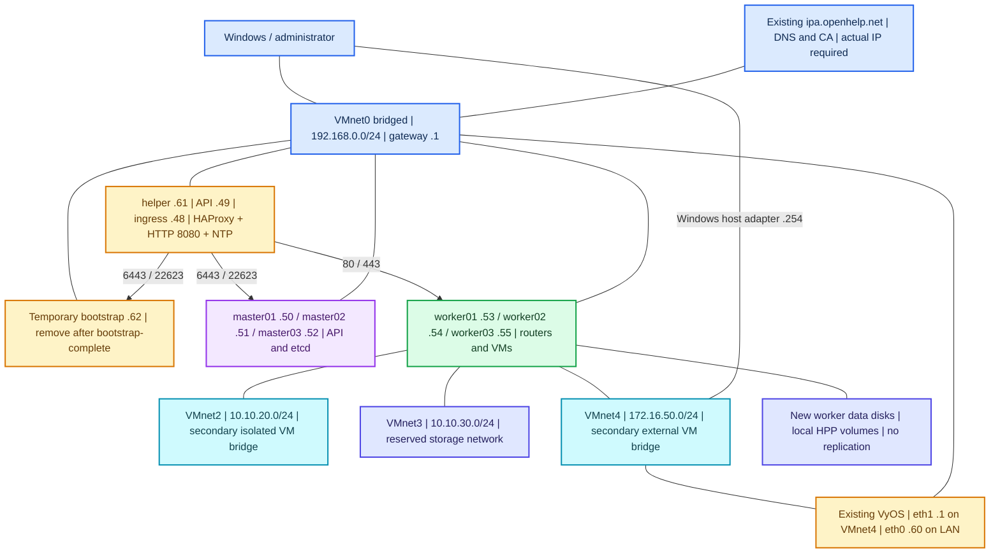
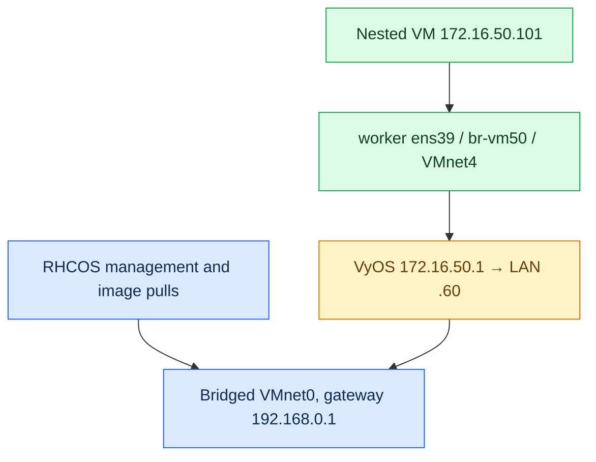
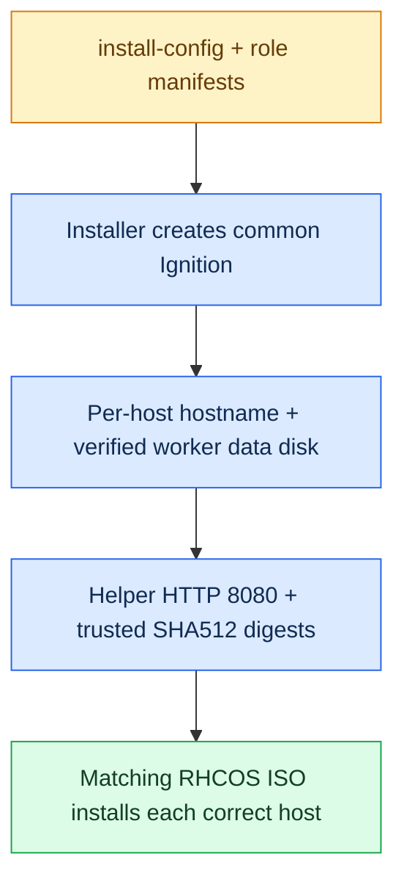
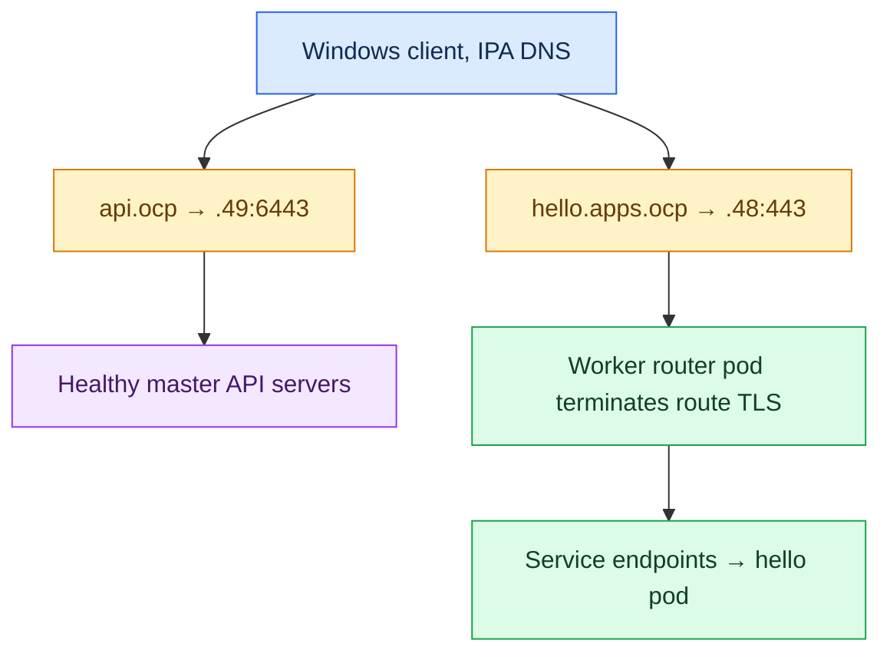
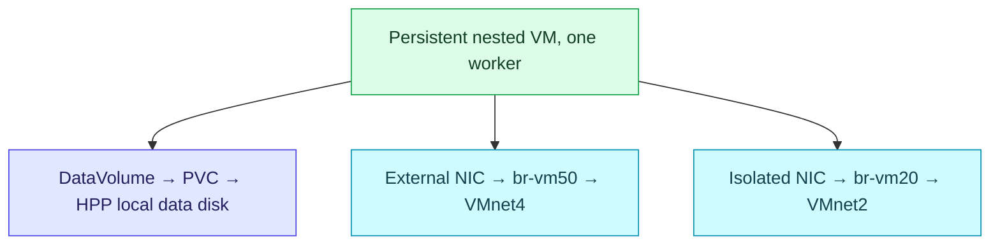

# OpenShift 4.22 on VMware Workstation — complete six-node UPI installation

**Prepared:** 6 October 2026  
**Verified release:** OpenShift Container Platform **4.22.16**, published 29 September 2026  
**Cluster:** `ocp.openhelp.net`  
**Method:** platform-agnostic, user-provisioned infrastructure (UPI), RHCOS live ISO and Ignition  
**Permanent cluster nodes:** three control-plane nodes plus three workers  
**Additional infrastructure:** one permanent Linux helper and one temporary bootstrap VM; existing FreeIPA and optional VyOS remain separate  
**Includes:** static networking, FreeIPA DNS, TCP load balancing, installation, expected outputs, certificates, OpenShift Virtualization, secondary VM networks, local VM storage, disconnected-install procedure, recovery and shutdown.

> [!IMPORTANT]
> This is a learning lab on VMware Workstation. It is not a certified production deployment of OpenShift Virtualization. Nested KVM, a single laptop, a single helper/load balancer and local VM disks have practical and availability limits. Three control-plane nodes provide etcd quorum; they do not make the laptop or the helper highly available.

> [!CAUTION]
> RHCOS installation erases the selected OS disk. The worker storage configuration also formats a **new, empty secondary disk**. Do not point either operation at an existing OpenStack/Ceph disk. If you reuse the `.48–.62` addresses below, power off conflicting OpenStack/helper VMs first and exclude the addresses from LAN DHCP. Do not destroy the old lab to make this guide work: new empty VMs are the preferred starting point.

## Read this first

This guide follows the UPI workflow associated with your [video](https://www.youtube.com/watch?v=Uvm6JTdJZNw&t=4847s): prepare infrastructure, create installation configuration, generate manifests and Ignition, install bootstrap/control-plane/workers, complete bootstrap, approve verified node certificates, and validate the cluster. The full video transcript and the files in its [training repository](https://github.com/krnetworktraining1/ocp4-metal-install) could not be retrieved during preparation. Accordingly, this is **not a claimed line-by-line transcription** of the video. The executable procedure is adapted and checked against current [Red Hat platform-agnostic UPI documentation](https://docs.redhat.com/en/documentation/openshift_container_platform/4.22/html-single/installing_on_any_platform/index).

Your attached `OPENSTACK_6_NODE_HA_CENTOS_KOLLA_CEPH_VYOS_V5_ENS33_VALIDATED (2)(1).md` is the source for the VMware network ranges. OpenShift has different network ownership, so preserve the switches/ranges and adapt their roles as described below.

**What “six nodes” means:** the six permanent cluster machines are `master01–03` and `worker01–03`. A control-plane node is also commonly called a master. You do **not** create three controllers plus three additional masters. The helper and bootstrap are extra VMs; FreeIPA and VyOS are not OpenShift nodes.

**Which installation path to use:** Steps 1–100 give a connected lab installation, with a proxy option. If cluster nodes cannot reach Red Hat/Quay registries, complete **Appendix A before Step 37**. Downloading `oc`, `openshift-install` and an ISO does not download the release payload or the Operator images.

**Command labels:** run each block only on its named machine. Linux/bash, PowerShell, VyOS and Kubernetes YAML are different environments. All displayed outputs are **illustrative expected outputs**, not records of a deployment performed on your laptop. The guide has been checked for consistency and syntax; it has not been executed against your VMs.

**Only environment values you must supply:** your actual FreeIPA IPv4 address; a valid pull secret; the SSH public key generated below; any required corporate proxy or mirror credentials; and the verified disk/interface names. The FreeIPA address is deliberately not invented.

## Navigation

- [Architecture and IP plan](#architecture-and-ip-plan)
- [Phase 1 — VMware and capacity, Steps 1–13](#phase-1--vmware-and-capacity-steps-113)
- [Phase 2 — helper, FreeIPA and load balancing, Steps 14–29](#phase-2--helper-freeipa-and-load-balancing-steps-1429)
- [Phase 3 — current binaries and installation assets, Steps 30–45](#phase-3--current-binaries-and-installation-assets-steps-3045)
- [Phase 4 — per-host RHCOS installation, Steps 46–63](#phase-4--per-host-rhcos-installation-steps-4663)
- [Phase 5 — bootstrap and installation completion, Steps 64–78](#phase-5--bootstrap-and-installation-completion-steps-6478)
- [Phase 6 — virtualization, networks and storage, Steps 79–95](#phase-6--virtualization-networks-and-storage-steps-7995)
- [Phase 7 — FreeIPA TLS and handover, Steps 96–100](#phase-7--freeipa-tls-and-handover-steps-96100)
- [Appendix A — disconnected installation](#appendix-a--disconnected-installation)
- [Appendix B — timeout and failure recovery](#appendix-b--timeout-and-failure-recovery)
- [Appendix C — safe shutdown and restart](#appendix-c--safe-shutdown-and-restart)
- [Appendix D — sources and validation scope](#appendix-d--sources-and-validation-scope)

## Architecture and IP plan

### Color architecture


The downloadable PNG is a companion to this Markdown; keep both files in the same GitHub folder. The diagram below provides a native Mermaid version too.



### How the OpenStack network becomes the OpenShift network

| VMware switch | Existing range | OpenStack reference role | OpenShift role in this guide |
|---|---|---|---|
| VMnet0 | `192.168.0.0/24` | Host management, APIs and default route | Node management, API, ingress, image pulls and **primary OVN-Kubernetes underlay** |
| VMnet2 | `10.10.20.0/24` | Dedicated OVN Geneve tunnel network | Secondary isolated network for nested VMs, using `br-vm20` on workers |
| VMnet3 | `10.10.30.0/24` | Ceph storage | Static, isolated storage-facing interfaces; reserved for a future external CSI/storage service |
| VMnet4 | `172.16.50.0/24` | Provider/floating-IP network, connected to controllers | Secondary external VM network, using `br-vm50` on **workers** |

**A necessary change:** in this UPI design, OVN-Kubernetes chooses its primary node underlay through the node network/default route on VMnet0. Adding an IP to `ens37` does not automatically move its tunnels to VMnet2. This guide does not modify OVS internals to imitate Neutron. OpenShift does not create Neutron routers, floating IPs, or Kolla `br-ex` objects.

**Storage distinction:** a network interface on VMnet3 does not create Ceph or persistent storage. The executable storage example uses new worker-local disks through the Hostpath Provisioner (HPP). It does not reuse the old OpenStack Ceph cluster, and it does not provide live migration or replicated disks. An external supported CSI driver or ODF/RWX storage is a separate design.

### Addresses and interfaces

The names `ens33/ens37/ens38/ens39` are targets. Verify them by MAC address on every VM before using them.

| Machine | VMnet0 `ens33` | VMnet2 `ens37` | VMnet3 `ens38` | VMnet4 `ens39` |
|---|---|---|---|---|
| `master01.ocp.openhelp.net` | `192.168.0.50/24` | Unused, no IP | `10.10.30.11/24` | Not needed |
| `master02.ocp.openhelp.net` | `192.168.0.51/24` | Unused, no IP | `10.10.30.12/24` | Not needed |
| `master03.ocp.openhelp.net` | `192.168.0.52/24` | Unused, no IP | `10.10.30.13/24` | Not needed |
| `worker01.ocp.openhelp.net` | `192.168.0.53/24` | Bridge port, no host IP | `10.10.30.21/24` | Bridge port, no host IP |
| `worker02.ocp.openhelp.net` | `192.168.0.54/24` | Bridge port, no host IP | `10.10.30.22/24` | Bridge port, no host IP |
| `worker03.ocp.openhelp.net` | `192.168.0.55/24` | Bridge port, no host IP | `10.10.30.23/24` | Bridge port, no host IP |
| `helper.ocp.openhelp.net` | `192.168.0.61/24` | Not needed | Not needed | Not needed |
| `bootstrap.ocp.openhelp.net` | `192.168.0.62/24` | Not needed | Not needed | Not needed |

| Shared object | Address/name | Owner |
|---|---|---|
| Default gateway | `192.168.0.1` | Existing LAN router |
| FreeIPA DNS/CA | `ipa.openhelp.net`, actual existing IPv4 | Existing IPA server |
| API endpoint | `api.ocp.openhelp.net → 192.168.0.49` | Secondary address on helper; HAProxy TCP 6443 |
| Internal API/MCS | `api-int.ocp.openhelp.net → 192.168.0.49` | Same helper; TCP 6443/22623 |
| Ingress wildcard | `*.apps.ocp.openhelp.net → 192.168.0.48` | Secondary address on helper; HAProxy TCP 80/443 |
| Asset HTTP server | `http://192.168.0.61:8080/` | Helper; temporarily serves Ignition |
| Lab NTP server | `192.168.0.61`, UDP 123 | Helper chronyd with a working upstream time source |
| Pod CIDR | `10.128.0.0/14`, host prefix `/23` | OVN-Kubernetes |
| Service CIDR | `172.30.0.0/16` | Kubernetes; not VMnet4 |
| Nested VM examples | `172.16.50.101`, `.102` | Guest OS on secondary bridged VMnet4 |
| Windows VMnet4 | `172.16.50.254/24` | Windows; no gateway/DNS on that adapter |
| VyOS | LAN `.60`, provider `172.16.50.1` | Existing optional edge router |

The API/ingress addresses are ordinary secondary IPs on **one helper**, not Keepalived-managed HA VIPs. The address choices match the reference lab's ranges; you must resolve collisions before using them.

### Can we avoid masquerading?

Yes, for the **helper** and the demonstrated **nested VM attachment**:

- The six RHCOS nodes use bridged VMnet0 and the existing gateway directly. The helper is not their router. Do not enable `ip_forward`, VMware NAT, or a helper `iptables` masquerade rule.
- The nested VM attaches to VMnet4 with `bridge: {}`. It receives its own `172.16.50.x` IP and does not use KubeVirt `masquerade: {}`.
- OVN-Kubernetes still manages its own pod networking, including the NAT behavior it needs. Do not disable its internal rules.
- Internet access from a private LAN ordinarily uses NAT at your home/enterprise edge. Avoiding an **extra lab NAT** is different from eliminating every NAT between private IPs and the public Internet.
- For fully routed VMnet4 access without VyOS source NAT, upstream routers need a return route to `172.16.50.0/24` through `192.168.0.60`. Their Internet egress/firewall must also accept that source subnet. Appendix B explains both routed and explicit-SNAT choices.



### Where commands run

| Label in the guide | Location |
|---|---|
| **Windows** | PowerShell, VMware Workstation, browser or Windows network settings |
| **IPA** | Existing `ipa.openhelp.net` or an enrolled administrative Linux client, authenticated with `kinit admin` |
| **Helper** | RHEL 9 helper, normal `cloudadmin` account with sudo, unless marked root |
| **RHCOS live console** | VMware console of the specific node booted from the matching RHCOS ISO |
| **RHCOS installed node** | `ssh core@IP` from helper, after disk installation |
| **Cluster admin** | Helper shell with `KUBECONFIG` pointing to this cluster |
| **VyOS** | Existing VyOS console; optional routing appendix only |

## Phase 1 — VMware and capacity, Steps 1–13

### Step 1 — protect the existing lab and confirm the six roles

**Windows.** Keep the old OpenStack VMs stopped if reusing their IPs. Create six **new empty** VMs named `master01`, `master02`, `master03`, `worker01`, `worker02`, `worker03`. Keep FreeIPA running. A separate helper and bootstrap are required for this manual UPI path.

Success: there are six intended cluster VMs, a helper, a bootstrap, and no duplicate running machines on the planned addresses. Never install RHCOS over a Ceph OSD or the Windows disk.

### Step 2 — choose a valid connectivity path

| Situation | Procedure |
|---|---|
| Nodes reach Red Hat/Quay over HTTPS | Main steps directly |
| Nodes only reach the Internet through an approved HTTP(S) proxy | Add `proxy` and its CA in Step 37; validate access through it |
| Nodes have no registry access, including no proxy | Complete Appendix A and apply the mirror configuration before creating Ignition |

RHCOS can be installed from local media, but bootstrap still needs its release images. Test this before starting the certificate clock. Operators and guest images also need registry access or mirroring.

### Step 3 — select one exact supported release

**Helper, later after OS setup.** This guide pins `4.22.16`, the newest patch visible in the [4.22 release notes](https://docs.redhat.com/en/documentation/openshift_container_platform/4.22/html/release_notes/ocp-4-22-release-notes) when checked. Recheck the official release notes/download listing on the installation day. If a newer GA patch is present, change `OCP_VERSION` once before generating assets and use that same version throughout.

Do not mix a video-era installer, a different client minor release, and an arbitrary RHCOS ISO. Do not choose nightly, release-candidate or OKD files for this OCP procedure.

### Step 4 — reserve enough CPU, RAM and disk

| VM | vCPU | RAM | OS disk | Extra storage |
|---|---:|---:|---:|---|
| Each of three control-plane nodes | 4 | 16 GB | 120 GB | None |
| Each of three workers, base OpenShift | 2 minimum; 4–6 preferred | 8 GB minimum; 12–16 GB for virtualization | 120 GB | New 120 GB data disk for the HPP example |
| Bootstrap, temporary | 4 | 16 GB | 120 GB | None |
| Helper | 2 | 4 GB | 60 GB | More space if hosting downloads |
| Existing FreeIPA | Its existing allocation | Its existing allocation | Existing disk | Keep independent |
| Existing VyOS, optional | Its existing allocation | Its existing allocation | Existing disk | Keep independent |

The documented base node minima total **88 GB including bootstrap**: 48 GB control plane + 24 GB workers + 16 GB bootstrap. Add helper, FreeIPA, Windows and any VyOS allocation. A 128 GB laptop is a practical starting point; a virtualization lab with 16 GB workers needs more headroom. With a 64 GB laptop, this exact seven-RHCOS-machine bootstrap cannot meet documented minimum RAM simultaneously. Do not silently reduce masters/bootstrap to 8 GB.

Use SSD/NVMe. Keep enough actual free disk for image extraction, VM writes and snapshots; thin provisioning does not create physical capacity. Avoid sustained Windows swapping or slow snapshot chains during etcd/bootstrap.

### Step 5 — enable hardware and nested virtualization

**Windows/firmware.** Enable Intel VT-x/VT-d or AMD-V/SVM in BIOS/UEFI. Restart Windows. With each worker powered off, open **VM Settings → Processors → Virtualization engine** and select **Virtualize Intel VT-x/EPT or AMD-V/RVI**. Expose the feature to every worker. Control-plane nodes do not need nested virtualization to run containers, but consistent CPU capabilities are useful.

If Workstation reports that nested virtualization is unavailable, resolve the host/Hyper-V/VBS conflict using the installed Workstation version's official guidance before continuing with virtualization. Disabling Windows security features is not a routine installation step. Validate the resulting `/dev/kvm` in Step 79.

Success: workers can start with the virtualization checkbox enabled. RHCOS 4.22 requires an x86-64-v2-capable CPU; confirm the exact laptop CPU rather than its marketing name.

### Step 6 — configure the VMware virtual switches

**Windows.** Open **Edit → Virtual Network Editor → Change Settings**.

| VMnet | Type | Subnet/mask | VMware DHCP | Host adapter |
|---|---|---|---|---|
| VMnet0 | Bridged to the active physical LAN NIC | Existing `192.168.0.0/24` LAN | LAN DHCP stays outside this procedure | Existing physical Windows NIC |
| VMnet2 | Host-only | `10.10.20.0 / 255.255.255.0` | Disabled | Optional; no gateway/DNS |
| VMnet3 | Host-only | `10.10.30.0 / 255.255.255.0` | Disabled | Optional; no gateway/DNS |
| VMnet4 | Host-only | `172.16.50.0 / 255.255.255.0` | Disabled | Enabled |

Select **Custom: Specific virtual network** in each VM's adapter settings. Generic “Host-only” can select VMnet1. Do not select VMware NAT for these networks. If bridged Wi-Fi rejects additional MACs or guest traffic, use a wired adapter or fix bridging before diagnosing OpenShift.

### Step 7 — configure the Windows VMnet4 adapter

**Windows.** Run `ncpa.cpl`. Open **VMware Network Adapter VMnet4 → IPv4 Properties**. Set `172.16.50.254`, mask `255.255.255.0`, and leave gateway and DNS blank. `.1` is reserved for VyOS.

```powershell
Get-NetIPAddress -AddressFamily IPv4 |
  Where-Object InterfaceAlias -Like '*VMnet4*' |
  Format-Table InterfaceAlias,IPAddress,PrefixLength
```

Expected: the VMnet4 adapter has `172.16.50.254/24`. Windows continues using its physical LAN adapter for DNS/default routing.

### Step 8 — create helper and temporary bootstrap VMs

**Windows.** Create `helper` with one adapter on VMnet0 and a supported RHEL 9 x86_64 installation ISO. The helper is mutable Linux, not RHCOS. A separately entitled RHEL helper or compatible lab Linux is distinct from the OpenShift evaluation entitlement.

Create `bootstrap` with one adapter on VMnet0, 4 vCPU, 16 GB RAM and an empty 120 GB OS disk. Leave its OS uninstalled until the RHCOS ISO is obtained. Use the same firmware mode throughout the lab; UEFI is suitable. Keep boot order consistent and disconnect installation media after installation.

### Step 9 — create the control-plane VMs

**Windows.** Each master gets its empty OS disk and these adapters:

1. Adapter 1 → VMnet0, expected `ens33`.
2. Adapter 2 → VMnet2, expected `ens37`, reserved without IP.
3. Adapter 3 → VMnet3, expected `ens38`.

No VMnet4 adapter is needed on masters for this design. Do not install CentOS, Kubernetes, Docker or Kolla packages on them. The installer uses RHCOS with CRI-O.

### Step 10 — create workers and their storage disks

**Windows.** Each worker gets four adapters, VMnet0/2/3/4 in that order, and two new disks: 120 GB OS plus 120 GB data. Make adapter MACs unique. Enable **Connected** and **Connect at power on**. Enable nested virtualization from Step 5.

The data disk is expected to appear as `/dev/sdb` only in this new, consistent disk layout. Record its controller/unit/size. Actual Linux device identification in Step 47 overrides the example. Your earlier OpenStack lab had a compute with reversed OS/OSD names, so do not reuse that assumption here.

### Step 11 — record every NIC's MAC-to-VMnet mapping

**Windows.** In each adapter's **Advanced** settings, record MAC address and VMnet. Later match with:

```bash
ip -br link
nmcli -f GENERAL.DEVICE,GENERAL.HWADDR,GENERAL.CONNECTION device show
```

Example mapping:

```text
ens33 → adapter MAC on VMnet0
ens37 → adapter MAC on VMnet2
ens38 → adapter MAC on VMnet3
ens39 → adapter MAC on VMnet4, workers only
```

Do not guess an interface's VMnet from the `ens` number alone. If names differ, substitute them consistently in the live network commands and NNCP manifests.

### Step 12 — verify disk identities before generating destructive storage configuration

**RHCOS live console, after Step 36; preparation requirement.** If disks are not yet visible, defer asset generation until you have booted the live ISO and run:

```bash
lsblk -e7 -o NAME,SIZE,TYPE,FSTYPE,MOUNTPOINTS,MODEL,SERIAL
sudo wipefs -n /dev/sdb
```

Expected on a new worker: an OS target disk and a separate empty data disk; `wipefs -n` prints no signatures on that data disk. The live ISO is not the installation target. Do not use an occupied partition. Write the verified data device into the per-host dictionary in Step 43. If it is not `/dev/sdb`, change that worker's entry.

### Step 13 — reserve and check the LAN addresses

**LAN administration and helper console.** Exclude `.48–.55`, `.60–.62` from LAN DHCP. `.60` can remain the legitimate existing VyOS address. After helper networking works, check unused addresses before assigning them:

```bash
sudo arping -D -I ens33 -c 3 192.168.0.48
sudo arping -D -I ens33 -c 3 192.168.0.49
sudo arping -D -I ens33 -c 3 192.168.0.61
sudo arping -D -I ens33 -c 3 192.168.0.62
```

Unused addresses normally show zero responses and status 0. An ARP test cannot identify a powered-off device; also check the DHCP lease table and your inventory. Check `.50–.55` before starting the new nodes. Do not probe an address already assigned to the current helper as if it were unused.

## Phase 2 — helper, FreeIPA and load balancing, Steps 14–29

### Step 14 — install the helper OS

**Helper VMware console.** Install RHEL 9 with a `cloudadmin` account, sudo access, 60 GB OS disk and one LAN NIC. Set a strong local password. Use a supported package repository/subscription or a preconfigured authorized local mirror for the helper packages. This guide does not run `subscription-manager register` with credentials embedded in scripts.

Success: you can log in as `cloudadmin` and `sudo -v` succeeds. The helper survives the bootstrap VM's removal.

### Step 15 — set the helper's hostname and primary address

**Helper console.** Confirm `ens33` is the VMnet0 NIC, then enter the actual IPA address:

```bash
read -r -p 'Actual IPv4 address of ipa.openhelp.net: ' IPA_IP
sudo hostnamectl set-hostname helper.ocp.openhelp.net
MGMT_PROFILE=$(nmcli -g GENERAL.CONNECTION device show ens33)
printf 'Active management profile: %s\n' "$MGMT_PROFILE"
sudo nmcli connection modify "$MGMT_PROFILE" \
  ipv4.method manual ipv4.addresses 192.168.0.61/24 \
  ipv4.gateway 192.168.0.1 ipv4.dns "$IPA_IP" \
  ipv4.dns-search 'ocp.openhelp.net,openhelp.net' \
  ipv6.method disabled connection.autoconnect yes
sudo nmcli connection up "$MGMT_PROFILE"
ip -4 -br address show ens33
ip -4 route
```

Expected: `192.168.0.61/24` and one default route via `192.168.0.1`. Perform address changes from the VMware console because SSH can disconnect. If there is no active profile, create one with `nmcli connection add type ethernet ifname ens33 con-name ocp-helper` and use that profile name.

### Step 16 — install helper tools and start a persistent terminal

**Helper.**

```bash
sudo dnf install -y haproxy nginx chrony bind-utils curl tar \
  openssl python3 python3-pyyaml tmux iputils \
  policycoreutils-python-utils firewalld git
sudo systemctl enable --now chronyd firewalld
mkdir -p "$HOME/ocp-lab"/{downloads,cluster,logs,certs,backups}
chmod 700 "$HOME/ocp-lab" "$HOME/ocp-lab/cluster" "$HOME/ocp-lab/certs"
tmux new -s ocp-install
```

No `jq` command is needed anywhere in the installation. Inside tmux, press **Ctrl+B**, then **D** to detach; reconnect with `tmux attach -t ocp-install`. A lost SSH session no longer cancels a long-running installer wait.

### Step 17 — save this lab's nonsecret environment

**Helper.** If necessary, enter the IPA address again in the tmux shell.

```bash
read -r -p 'Actual IPA IPv4 address: ' IPA_IP
cat > "$HOME/ocp-lab/lab.env" <<EOF
export OCP_VERSION=4.22.16
export LAB_DIR="$HOME/ocp-lab"
export INSTALL_DIR="$HOME/ocp-lab/cluster"
export IPA_IP="$IPA_IP"
export CLUSTER_NAME=ocp
export BASE_DOMAIN=openhelp.net
EOF
chmod 600 "$HOME/ocp-lab/lab.env"
source "$HOME/ocp-lab/lab.env"
```

Run `source ~/ocp-lab/lab.env` whenever you reconnect. Do not put the pull secret, passwords or private keys into this environment file or a Git repository.

### Step 18 — verify IPA resolution and establish a real time source

**Helper.**

```bash
dig @"$IPA_IP" ipa.openhelp.net A +short
timedatectl
chronyc sources -v
chronyc tracking
```

The IPA query must return the existing server's correct address. The helper must have a synchronized source; look for `^*` in `chronyc sources` and `Leap status: Normal` in tracking. Do not assume FreeIPA automatically serves NTP. If its UDP 123 service is not configured, use another permitted LAN/enterprise NTP source or the helper's working upstream pools.

Allow nodes to query the helper:

```bash
printf '\nallow 192.168.0.0/24\n' | sudo tee -a /etc/chrony.conf
sudo systemctl restart chronyd
sudo firewall-cmd --permanent --add-service=ntp
sudo firewall-cmd --reload
```

If disconnected, replace unreachable pool entries in the helper's `/etc/chrony.conf` with your actual reachable NTP server before continuing. Do not fake synchronization with `local stratum` merely to get past installation checks.

### Step 19 — create or inspect the FreeIPA DNS zone

**IPA, authenticated administrative shell.**

```bash
kinit admin
ipa dnszone-show openhelp.net.
ipa dnszone-show ocp.openhelp.net.
```

If the child zone does not exist, create it:

```bash
ipa dnszone-add ocp.openhelp.net. \
  --name-server=ipa.openhelp.net. \
  --admin-email=hostmaster.openhelp.net.
```

If the parent zone is hosted in this IPA deployment and lacks a delegation, add:

```bash
ipa dnsrecord-add openhelp.net. ocp --ns-rec=ipa.openhelp.net.
```

Expected: the child zone is active and authoritative. If these records already exist, inspect them rather than adding duplicates. DNS setup does not require enrolling the RHCOS nodes into FreeIPA.

### Step 20 — create all forward records

**IPA.** These are new records in the cluster zone:

```bash
ipa dnsrecord-add ocp.openhelp.net. helper --a-rec=192.168.0.61
ipa dnsrecord-add ocp.openhelp.net. bootstrap --a-rec=192.168.0.62
ipa dnsrecord-add ocp.openhelp.net. master01 --a-rec=192.168.0.50
ipa dnsrecord-add ocp.openhelp.net. master02 --a-rec=192.168.0.51
ipa dnsrecord-add ocp.openhelp.net. master03 --a-rec=192.168.0.52
ipa dnsrecord-add ocp.openhelp.net. worker01 --a-rec=192.168.0.53
ipa dnsrecord-add ocp.openhelp.net. worker02 --a-rec=192.168.0.54
ipa dnsrecord-add ocp.openhelp.net. worker03 --a-rec=192.168.0.55
ipa dnsrecord-add ocp.openhelp.net. api --a-rec=192.168.0.49
ipa dnsrecord-add ocp.openhelp.net. api-int --a-rec=192.168.0.49
ipa dnsrecord-add ocp.openhelp.net. ingress --a-rec=192.168.0.48
ipa dnsrecord-add ocp.openhelp.net. '*.apps' --a-rec=192.168.0.48
```

If a record exists with an incorrect IP, use `ipa dnsrecord-show ZONE NAME`, then `ipa dnsrecord-mod ZONE NAME --a-rec=CORRECT_IP` to replace its A values. Do not leave an old IP beside the new IP. Wildcard DNS is essential: a Windows `hosts` entry cannot express `*.apps`.

### Step 21 — create or correct reverse DNS

**IPA.** Inspect the LAN reverse zone:

```bash
ipa dnszone-show 0.168.192.in-addr.arpa.
```

Create it only if it does not already exist and you administer that reverse space:

```bash
ipa dnszone-add 0.168.192.in-addr.arpa. \
  --name-server=ipa.openhelp.net. \
  --admin-email=hostmaster.openhelp.net.
```

For new reverse records:

```bash
ipa dnsrecord-add 0.168.192.in-addr.arpa. 48 --ptr-rec=ingress.ocp.openhelp.net.
ipa dnsrecord-add 0.168.192.in-addr.arpa. 49 --ptr-rec=api.ocp.openhelp.net.
ipa dnsrecord-add 0.168.192.in-addr.arpa. 50 --ptr-rec=master01.ocp.openhelp.net.
ipa dnsrecord-add 0.168.192.in-addr.arpa. 51 --ptr-rec=master02.ocp.openhelp.net.
ipa dnsrecord-add 0.168.192.in-addr.arpa. 52 --ptr-rec=master03.ocp.openhelp.net.
ipa dnsrecord-add 0.168.192.in-addr.arpa. 53 --ptr-rec=worker01.ocp.openhelp.net.
ipa dnsrecord-add 0.168.192.in-addr.arpa. 54 --ptr-rec=worker02.ocp.openhelp.net.
ipa dnsrecord-add 0.168.192.in-addr.arpa. 55 --ptr-rec=worker03.ocp.openhelp.net.
ipa dnsrecord-add 0.168.192.in-addr.arpa. 61 --ptr-rec=helper.ocp.openhelp.net.
ipa dnsrecord-add 0.168.192.in-addr.arpa. 62 --ptr-rec=bootstrap.ocp.openhelp.net.
```

For an address with an existing OpenStack PTR, replace that PTR only after retiring its previous owner. Example:

```bash
ipa dnsrecord-show 0.168.192.in-addr.arpa. 50
ipa dnsrecord-mod 0.168.192.in-addr.arpa. 50 --ptr-rec=master01.ocp.openhelp.net.
```

Do not change unrelated IPA, Kubernetes or OpenStack records. Old etcd SRV records from early OpenShift versions are not part of this procedure.

### Step 22 — validate DNS from the helper

**Helper.**

```bash
source ~/ocp-lab/lab.env
dig @"$IPA_IP" api.ocp.openhelp.net A +short
dig @"$IPA_IP" api-int.ocp.openhelp.net A +short
dig @"$IPA_IP" console-openshift-console.apps.ocp.openhelp.net A +short
dig @"$IPA_IP" random-test.apps.ocp.openhelp.net A +short
dig @"$IPA_IP" -x 192.168.0.53 +short
getent hosts master01.ocp.openhelp.net
```

Expected in order: `.49`, `.49`, `.48`, `.48`, `worker01.ocp.openhelp.net.`, and `.50` with the master name. Also confirm IPA can resolve external registry names when using a connected/proxy path. Public DNS servers do not replace IPA for this private cluster zone.

### Step 23 — make Windows resolve the private cluster zone

**Windows, administrator PowerShell.** Prefer a scoped NRPT rule so corporate/public DNS stays in its normal path. Enter your actual IPA address:

```powershell
$IpaIp = Read-Host 'Actual IPA IPv4 address'
Add-DnsClientNrptRule -Namespace '.ocp.openhelp.net' -NameServers $IpaIp
Clear-DnsClientCache
Resolve-DnsName api.ocp.openhelp.net
Resolve-DnsName console-openshift-console.apps.ocp.openhelp.net
```

Expected: `.49` and `.48`. If your Windows edition or VPN policy prevents NRPT, configure the physical LAN adapter to use IPA DNS when IPA has working forwarders, or use your organization's DNS conditional-forwarding method. Do not set an unrelated public resolver beside IPA and assume it will resolve this zone.

### Step 24 — add helper API and ingress addresses

**Helper console.**

```bash
MGMT_PROFILE=$(nmcli -g GENERAL.CONNECTION device show ens33)
sudo nmcli connection modify "$MGMT_PROFILE" \
  +ipv4.addresses 192.168.0.49/24 \
  +ipv4.addresses 192.168.0.48/24
sudo nmcli connection up "$MGMT_PROFILE"
ip -4 -br address show ens33
```

Expected: `.61`, `.49` and `.48` on the same LAN NIC, with one default gateway `.1`. Add addresses once; when resuming, inspect them first. There is no need for `net.ipv4.ip_nonlocal_bind` because HAProxy binds addresses actually assigned to the helper.

### Step 25 — configure TCP HAProxy with API readiness checks

**Helper.** Back up the supplied config, then create this lab configuration:

```bash
sudo cp -a /etc/haproxy/haproxy.cfg /etc/haproxy/haproxy.cfg.before-ocp
sudo tee /etc/haproxy/haproxy.cfg > /dev/null <<'EOF'
global
    log /dev/log local0
    maxconn 4000
    user haproxy
    group haproxy
    daemon

defaults
    log global
    mode tcp
    option tcplog
    timeout connect 10s
    timeout client 1h
    timeout server 1h

frontend ocp_api
    bind 192.168.0.49:6443
    default_backend ocp_api_nodes

backend ocp_api_nodes
    balance roundrobin
    option httpchk
    http-check connect ssl
    http-check send meth GET uri /readyz ver HTTP/1.1 hdr Host api.ocp.openhelp.net
    http-check expect status 200
    default-server inter 5s fall 3 rise 2
    server bootstrap 192.168.0.62:6443 check check-ssl verify none
    server master01 192.168.0.50:6443 check check-ssl verify none
    server master02 192.168.0.51:6443 check check-ssl verify none
    server master03 192.168.0.52:6443 check check-ssl verify none

frontend ocp_machine_config
    bind 192.168.0.49:22623
    default_backend ocp_machine_config_nodes

backend ocp_machine_config_nodes
    balance roundrobin
    default-server inter 5s fall 3 rise 2
    server bootstrap 192.168.0.62:22623 check
    server master01 192.168.0.50:22623 check
    server master02 192.168.0.51:22623 check
    server master03 192.168.0.52:22623 check

frontend ocp_http
    bind 192.168.0.48:80
    default_backend ocp_http_routers

backend ocp_http_routers
    balance source
    default-server inter 5s fall 3 rise 2
    server worker01 192.168.0.53:80 check
    server worker02 192.168.0.54:80 check
    server worker03 192.168.0.55:80 check

frontend ocp_https
    bind 192.168.0.48:443
    default_backend ocp_https_routers

backend ocp_https_routers
    balance source
    default-server inter 5s fall 3 rise 2
    server worker01 192.168.0.53:443 check
    server worker02 192.168.0.54:443 check
    server worker03 192.168.0.55:443 check
EOF
sudo haproxy -c -f /etc/haproxy/haproxy.cfg
```

Expected: `Configuration file is valid`. Client traffic remains raw TCP/TLS passthrough; the HTTPS `/readyz` requests are health probes. `verify none` applies only to the probe's temporary backend TLS verification. There is no TLS termination, API session persistence or certificate installation on HAProxy. Workers without a router pod simply fail the ingress TCP check and remain outside that pool.

### Step 26 — retain SELinux and open the helper firewall

**Helper.**

```bash
sudo setsebool -P haproxy_connect_any 1
sudo firewall-cmd --permanent --add-service=ssh
sudo firewall-cmd --permanent --add-port=6443/tcp
sudo firewall-cmd --permanent --add-port=80/tcp
sudo firewall-cmd --permanent --add-port=443/tcp
sudo firewall-cmd --permanent --add-rich-rule='rule family="ipv4" source address="192.168.0.0/24" port port="22623" protocol="tcp" accept'
sudo firewall-cmd --permanent --add-rich-rule='rule family="ipv4" source address="192.168.0.0/24" port port="8080" protocol="tcp" accept'
sudo firewall-cmd --reload
sudo systemctl enable --now haproxy
```

Ports 22623 and 8080 are internal installation services; do not expose them through an Internet router. Port 22623 remains necessary after bootstrap. SELinux stays enforcing. RHCOS node firewall/networking is managed by OpenShift; do not copy the OpenStack instructions that disable SELinux or install host Docker.

### Step 27 — check listeners before installing any cluster node

**Helper.**

```bash
sudo ss -lntp | awk '$4 ~ /:(80|443|6443|22623)$/ {print}'
sudo systemctl --no-pager status haproxy
```

Expected: four HAProxy listeners. Backend-down messages are expected while all RHCOS targets are empty; listener failures are not. A listener existing does not prove the API is healthy. `/readyz` starts succeeding only after bootstrap/control-plane services start.

### Step 28 — configure a separate HTTP port for assets

**Helper.** Nginx must not compete with HAProxy on port 80. This uses a small dedicated main configuration:

```bash
sudo cp -a /etc/nginx/nginx.conf /etc/nginx/nginx.conf.before-ocp
sudo mkdir -p /var/www/ocp
sudo tee /etc/nginx/nginx.conf > /dev/null <<'EOF'
user nginx;
worker_processes auto;
error_log /var/log/nginx/error.log;
pid /run/nginx.pid;
events { worker_connections 1024; }
http {
    include /etc/nginx/mime.types;
    default_type application/octet-stream;
    access_log /var/log/nginx/access.log;
    server {
        listen 192.168.0.61:8080;
        root /var/www/ocp;
        autoindex off;
        location / { try_files $uri =404; }
    }
}
EOF
printf 'ocp asset server ready\n' | sudo tee /var/www/ocp/health.txt
sudo restorecon -RF /var/www/ocp /etc/nginx
sudo semanage port -l | awk '$1 == "http_port_t" {print}'
sudo nginx -t
sudo systemctl enable --now nginx
curl --fail http://192.168.0.61:8080/health.txt
```

Expected: syntax test succeeds and `ocp asset server ready` is returned. If port 8080 is absent from the `http_port_t` list, add it with `sudo semanage port -a -t http_port_t -p tcp 8080`. If assigned to another type, inspect the existing assignment before changing it. Do not disable SELinux to solve a port label.

### Step 29 — create a progress checkpoint

**Helper.**

```bash
date -Is | tee "$LAB_DIR/logs/phase2-ready.txt"
cp "$LAB_DIR/lab.env" "$LAB_DIR/backups/lab.env"
sudo cp /etc/haproxy/haproxy.cfg "$LAB_DIR/backups/haproxy.cfg"
sudo cp /etc/nginx/nginx.conf "$LAB_DIR/backups/nginx.conf"
```

Gate: helper addressing, IPA A/PTR/wildcard resolution, NTP synchronization, HAProxy syntax and HTTP health checks must pass. Fix a failed gate before starting bootstrap. Installation waits cannot repair missing infrastructure.

## Phase 3 — current binaries and installation assets, Steps 30–45

### Step 30 — generate the SSH key for RHCOS

**Helper, cloudadmin.**

```bash
ssh-keygen -t ed25519 -f "$HOME/.ssh/ocp_ed25519" -C ocp-openhelp-lab
cat "$HOME/.ssh/ocp_ed25519.pub"
```

Choose a passphrase if desired. Use the public line in installation configuration. The login account on installed RHCOS is `core`; it is not `root`, `cloudadmin` or a password supplied by the ISO wizard. Keep the private key private.

### Step 31 — obtain the evaluation and pull secret

**Windows/browser on a permitted machine.** Use the [self-managed OpenShift trial page](https://www.redhat.com/en/technologies/cloud-computing/openshift/try-it) and your Red Hat account. Select a self-managed evaluation, not the short-lived Developer Sandbox. Confirm the actual evaluation duration and included products displayed for your account. RHCOS itself is the node OS, not a separate “60-day RHCOS product.”

Get the installation pull secret from [Red Hat OpenShift downloads / pull secret](https://console.redhat.com/openshift/downloads), then transfer the JSON to the helper as `$HOME/ocp-lab/pull-secret.json`. Console/portal access can occur from your personal permitted download machine; you do not need to use Assisted Installer or register this laptop through an installation UI. The payload still requires valid entitlement/registry access.

**Helper.**

```bash
chmod 600 "$LAB_DIR/pull-secret.json"
python3 -m json.tool "$LAB_DIR/pull-secret.json" > /dev/null
```

Success: valid JSON with registry authentication entries. Do not display its content in logs/screenshots or commit it to Git.

### Step 32 — download one exact installer/client version with bounded retries

**Helper, or an approved connected Linux download machine.**

```bash
source ~/ocp-lab/lab.env
cd "$LAB_DIR/downloads"
OCP_DOWNLOAD_BASE="https://mirror.openshift.com/pub/openshift-v4/x86_64/clients/ocp/$OCP_VERSION"
curl --fail --location --retry 5 --retry-delay 5 \
  --connect-timeout 15 --max-time 1800 \
  --output openshift-install-linux.tar.gz \
  "$OCP_DOWNLOAD_BASE/openshift-install-linux.tar.gz"
curl --fail --location --retry 5 --retry-delay 5 \
  --connect-timeout 15 --max-time 1800 \
  --output openshift-client-linux.tar.gz \
  "$OCP_DOWNLOAD_BASE/openshift-client-linux.tar.gz"
curl --fail --location --retry 5 --connect-timeout 15 --max-time 120 \
  --output sha256sum.txt "$OCP_DOWNLOAD_BASE/sha256sum.txt"
curl --fail --location --retry 5 --connect-timeout 15 --max-time 120 \
  --output release.txt "$OCP_DOWNLOAD_BASE/release.txt"
```

A 404 is a version/path problem; do not retry it indefinitely or switch silently to a nightly directory. Use the exact GA download entry on the official portal if a mirror filename changes. For a failed large download, a known-supported server can resume with `curl --continue-at -`; verify the final checksum afterward. Downloads are completed before generating time-sensitive Ignition.

### Step 33 — verify archives, install tools and record versions

**Helper.**

```bash
cd "$LAB_DIR/downloads"
awk '$2 ~ /openshift-(install|client)-linux.tar.gz$/ {print}' sha256sum.txt \
  > selected-sha256.txt
test "$(wc -l < selected-sha256.txt)" -eq 2
sha256sum --check selected-sha256.txt
mkdir -p tools
tar -xzf openshift-install-linux.tar.gz -C tools
tar -xzf openshift-client-linux.tar.gz -C tools
sudo install -m 0755 tools/openshift-install /usr/local/bin/openshift-install
sudo install -m 0755 tools/oc /usr/local/bin/oc
sudo install -m 0755 tools/kubectl /usr/local/bin/kubectl
openshift-install version | tee "$LAB_DIR/logs/installer-version.txt"
oc version --client | tee "$LAB_DIR/logs/client-version.txt"
```

Expected: both archives show `OK`, installer reports `4.22.16`, and the CLI is from the same release. If the checksum listing has a leading `*` or a path prefix, adapt the selection to that observed listing and retain its digest. The test intentionally fails if both archive checksums were not found. `oc version` can report an additional Kubernetes client version; that is normal.

### Step 34 — obtain RHCOS metadata from this installer

**Helper.**

```bash
openshift-install coreos print-stream-json > "$LAB_DIR/downloads/rhcos-stream.json"
python3 - "$LAB_DIR/downloads/rhcos-stream.json" <<'PY'
import json, sys
s = json.load(open(sys.argv[1]))
iso = s['architectures']['x86_64']['artifacts']['metal']['formats']['iso']['disk']
print('RHCOS live ISO URL:', iso['location'])
print('SHA256:', iso['sha256'])
PY
```

The ISO is selected from the metadata bundled with the exact installer, not guessed from the video or from a version-looking filename. RHCOS image build numbers need not equal the OCP patch number.

### Step 35 — download and verify the matching ISO

**Helper or connected download machine with the same tools/metadata.**

```bash
RHCOS_ISO_URL=$(python3 - "$LAB_DIR/downloads/rhcos-stream.json" <<'PY'
import json, sys
s = json.load(open(sys.argv[1]))
print(s['architectures']['x86_64']['artifacts']['metal']['formats']['iso']['disk']['location'])
PY
)
RHCOS_ISO_SHA=$(python3 - "$LAB_DIR/downloads/rhcos-stream.json" <<'PY'
import json, sys
s = json.load(open(sys.argv[1]))
print(s['architectures']['x86_64']['artifacts']['metal']['formats']['iso']['disk']['sha256'])
PY
)
curl --fail --location --retry 5 --retry-delay 5 \
  --connect-timeout 15 --max-time 3600 \
  --output "$LAB_DIR/downloads/rhcos-live.x86_64.iso" "$RHCOS_ISO_URL"
printf '%s  %s\n' "$RHCOS_ISO_SHA" "$LAB_DIR/downloads/rhcos-live.x86_64.iso" \
  | sha256sum --check -
```

Expected: `rhcos-live.x86_64.iso: OK`. An HTML error page saved with an `.iso` suffix fails this check. Keep the metadata file and checksum with your downloads.

### Step 36 — put the verified ISO where Workstation can read it

**Windows PowerShell.** Adjust the local destination folder if needed:

```powershell
New-Item -ItemType Directory -Force C:\OCP-Lab\ISO
scp cloudadmin@192.168.0.61:~/ocp-lab/downloads/rhcos-live.x86_64.iso C:\OCP-Lab\ISO\
Get-FileHash C:\OCP-Lab\ISO\rhcos-live.x86_64.iso -Algorithm SHA256
```

Compare Windows' hash with Step 34/35. Attach this same ISO to bootstrap and all six cluster VMs. Boot the live console long enough to verify disks and NICs from Steps 11–12 **before** generating the final per-host configuration. Return to the helper afterward. The live ISO provides a console environment; booting it alone does not install a cluster.

### Step 37 — write the installation configuration

**Helper.** The following script inserts the real pull secret/public key into valid YAML without hand-escaping JSON. It refuses to overwrite assets in an already-used install directory.

```bash
source ~/ocp-lab/lab.env
python3 - "$LAB_DIR" "$INSTALL_DIR" "$HOME/.ssh/ocp_ed25519.pub" <<'PY'
import json, pathlib, sys, yaml
lab, target, key = map(pathlib.Path, sys.argv[1:])
if any(target.iterdir()):
    raise SystemExit('Install directory is not empty. Preserve it; use a new directory for a new attempt.')
secret = json.loads((lab / 'pull-secret.json').read_text())
if not secret.get('auths'):
    raise SystemExit('Pull secret has no auths entries.')
cfg = {
    'apiVersion': 'v1',
    'baseDomain': 'openhelp.net',
    'metadata': {'name': 'ocp'},
    'compute': [{'name': 'worker', 'hyperthreading': 'Enabled', 'replicas': 0}],
    'controlPlane': {'name': 'master', 'hyperthreading': 'Enabled', 'replicas': 3},
    'networking': {
        'networkType': 'OVNKubernetes',
        'machineNetwork': [{'cidr': '192.168.0.0/24'}],
        'clusterNetwork': [{'cidr': '10.128.0.0/14', 'hostPrefix': 23}],
        'serviceNetwork': ['172.30.0.0/16']},
    'platform': {'none': {}},
    'pullSecret': json.dumps(secret, separators=(',', ':')),
    'sshKey': key.read_text().strip()}
(target / 'install-config.yaml').write_text(yaml.safe_dump(cfg, sort_keys=False))
(target / 'install-config.yaml').chmod(0o600)
print('Wrote install-config.yaml; secret not displayed.')
PY
```

Its nonsecret structure is:

```yaml
apiVersion: v1
baseDomain: openhelp.net
metadata:
  name: ocp
compute:
- name: worker
  hyperthreading: Enabled
  replicas: 0
controlPlane:
  name: master
  hyperthreading: Enabled
  replicas: 3
networking:
  networkType: OVNKubernetes
  machineNetwork:
  - cidr: 192.168.0.0/24
  clusterNetwork:
  - cidr: 10.128.0.0/14
    hostPrefix: 23
  serviceNetwork:
  - 172.30.0.0/16
platform:
  none: {}
pullSecret: '<inserted automatically from your JSON>'
sshKey: '<inserted automatically from your public key>'
```

`platform: none` means infrastructure is user-managed. `compute.replicas: 0` means the installer does not provision workers; you will install **three real workers** manually. It does not mean there will be zero workers in the completed lab. Explicitly set control-plane scheduling in Step 40.

**If a proxy is required**, edit the generated YAML before Step 38 and add actual values:

```yaml
proxy:
  httpProxy: http://proxy.example.net:3128
  httpsProxy: http://proxy.example.net:3128
  noProxy: localhost,127.0.0.1,.openhelp.net,192.168.0.0/24,10.10.20.0/24,10.10.30.0/24,172.16.50.0/24,10.128.0.0/14,172.30.0.0/16
additionalTrustBundle: |
  -----BEGIN CERTIFICATE-----
  ACTUAL_PROXY_CA_PEM_CONTENT
  -----END CERTIFICATE-----
```

Only include `additionalTrustBundle` here if the proxy/mirror needs that CA. The helper's `curl`/`oc` download environment needs matching proxy settings separately; install-config does not configure the helper shell. Exclude the entire private cluster domain and subnets from proxying. If disconnected, substitute Appendix A's mirror authentication/trust configuration instead of pretending a proxy exists.

### Step 38 — validate and back up the configuration

**Helper.**

```bash
python3 - "$INSTALL_DIR/install-config.yaml" <<'PY'
import ipaddress, json, sys, yaml
c = yaml.safe_load(open(sys.argv[1]))
assert c['metadata']['name'] == 'ocp'
assert c['baseDomain'] == 'openhelp.net'
assert c['platform'] == {'none': {}}
assert c['controlPlane']['replicas'] == 3
assert c['compute'][0]['replicas'] == 0
json.loads(c['pullSecret'])
nets = [ipaddress.ip_network(x) for x in [
    '192.168.0.0/24','10.10.20.0/24','10.10.30.0/24','172.16.50.0/24',
    c['networking']['clusterNetwork'][0]['cidr'],c['networking']['serviceNetwork'][0]]]
assert not any(a.overlaps(b) for i,a in enumerate(nets) for b in nets[i+1:])
print('YAML, names, secret JSON and configured CIDR separation: OK')
PY
cp "$INSTALL_DIR/install-config.yaml" "$LAB_DIR/backups/install-config.yaml"
chmod 600 "$LAB_DIR/backups/install-config.yaml"
```

Also check these CIDRs against any active corporate VPN, other clusters and OVN reserved ranges in current networking documentation. This local comparison checks the listed lab ranges, not your entire network. The installer consumes configuration as it creates assets; keep this protected backup outside the install directory.

### Step 39 — create the Kubernetes manifests

**Helper, inside tmux.**

```bash
set -o pipefail
openshift-install create manifests --dir "$INSTALL_DIR" --log-level=info \
  2>&1 | tee "$LAB_DIR/logs/create-manifests.log"
```

Expected: manifests are created under `cluster/manifests` and `cluster/openshift`. If the installer fails, read the log and fix the cause before moving on. Re-running a wait is safe; re-generating assets for an already-booted attempt is a different operation and must not be done casually.

### Step 40 — keep application workloads off the control plane

**Helper.**

```bash
python3 - "$INSTALL_DIR/manifests/cluster-scheduler-02-config.yml" <<'PY'
import pathlib, sys, yaml
p = pathlib.Path(sys.argv[1])
c = yaml.safe_load(p.read_text())
assert c['kind'] == 'Scheduler'
c.setdefault('spec', {})['mastersSchedulable'] = False
p.write_text(yaml.safe_dump(c, sort_keys=False))
print('mastersSchedulable: false')
PY
```

This is important with manually provisioned workers. Expect three worker nodes to carry applications and ingress. If the filename differs in a newer installer, locate the generated `kind: Scheduler` manifest and edit that file; do not create a duplicate Scheduler object. Step 73 explicitly verifies the ingress placement.

### Step 41 — give nodes a consistent NTP source

**Helper.** Create one initial MachineConfig for each node role:

```bash
python3 - "$INSTALL_DIR/manifests" <<'PY'
import base64, pathlib, sys, yaml
out = pathlib.Path(sys.argv[1])
text = ('server 192.168.0.61 iburst\n'
        'driftfile /var/lib/chrony/drift\n'
        'makestep 1.0 3\nrtcsync\n'
        'logdir /var/log/chrony\n')
source = 'data:text/plain;charset=utf-8;base64,' + base64.b64encode(text.encode()).decode()
for role in ('master', 'worker'):
    doc = {'apiVersion':'machineconfiguration.openshift.io/v1',
        'kind':'MachineConfig',
        'metadata':{'name':f'99-{role}-lab-chrony',
                    'labels':{'machineconfiguration.openshift.io/role':role}},
        'spec':{'config':{'ignition':{'version':'3.4.0'},
            'storage':{'files':[{'path':'/etc/chrony.conf','mode':420,
                                'overwrite':True,'contents':{'source':source}}]}}}}
    (out / f'99-{role}-lab-chrony.yaml').write_text(yaml.safe_dump(doc, sort_keys=False))
print('Initial master and worker time configuration created.')
PY
```

The helper's clock must already be synchronized. These configs are included before first boot; they avoid a later unnecessary rolling node reconfiguration just to change NTP.

### Step 42 — create Ignition once for this attempt

**Helper.**

```bash
set -o pipefail
openshift-install create ignition-configs --dir "$INSTALL_DIR" --log-level=info \
  2>&1 | tee "$LAB_DIR/logs/create-ignition.log"
ls -lh "$INSTALL_DIR"/*.ign
date -Is | tee "$LAB_DIR/logs/ignition-created-at.txt"
```

Expected: `bootstrap.ign`, `master.ign`, `worker.ign` and an `auth` directory. Generated assets contain credentials and initial certificates. Start installation promptly, preferably within 12 hours; the initial certificates have a 24-hour lifetime. Complete large downloads/mirroring before generating these files. Preserve this directory for diagnostics and installer waits.

### Step 43 — create per-host Ignition with persistent hostnames and worker data mounts

**Helper.** `coreos-installer --copy-network` does **not** copy the system hostname. This script adds each hostname explicitly. It also prepares the three new, verified worker data disks at first boot, then creates persistent mount units for HPP.

> [!CAUTION]
> Edit the worker device entries below to match Step 12. These devices are intentionally wiped/formatted by Ignition. If you cannot positively identify an empty data disk, set that entry to `None` and skip HPP/persistent VM Steps 91–94 until you provision suitable storage. The base OpenShift/ephemeral VM installation can still proceed.

```bash
cat > "$LAB_DIR/create-host-ignition.py" <<'PY'
import base64, copy, json, pathlib, sys
root = pathlib.Path(sys.argv[1])
nodes = {
    'bootstrap': ('bootstrap', None),
    'master01': ('master', None),
    'master02': ('master', None),
    'master03': ('master', None),
    'worker01': ('worker', '/dev/sdb'),
    'worker02': ('worker', '/dev/sdb'),
    'worker03': ('worker', '/dev/sdb')}
for name, (role, data_disk) in nodes.items():
    cfg = copy.deepcopy(json.loads((root / f'{role}.ign').read_text()))
    storage = cfg.setdefault('storage', {})
    host_data = (name + '.ocp.openhelp.net\n').encode()
    host_file = {'path':'/etc/hostname','mode':420,'overwrite':True,
        'contents':{'source':'data:text/plain;charset=utf-8;base64,' +
                    base64.b64encode(host_data).decode()}}
    files = [f for f in storage.get('files', []) if f['path'] != '/etc/hostname']
    files.append(host_file)
    storage['files'] = files
    if data_disk:
        storage.setdefault('disks', []).append({
            'device':data_disk, 'wipeTable':True,
            'partitions':[{'number':1,'label':'hpp-data','sizeMiB':0}]})
        storage.setdefault('filesystems', []).append({
            'device':'/dev/disk/by-partlabel/hpp-data',
            'path':'/var/hpvolumes','format':'xfs','wipeFilesystem':True})
        mount = ('[Unit]\nDescription=Lab HPP data disk\nBefore=local-fs.target\n'
                 '[Mount]\nWhat=/dev/disk/by-partlabel/hpp-data\n'
                 'Where=/var/hpvolumes\nType=xfs\nOptions=defaults\n'
                 '[Install]\nWantedBy=local-fs.target\n')
        cfg.setdefault('systemd', {}).setdefault('units', []).append({
            'name':'var-hpvolumes.mount','enabled':True,'contents':mount})
    # Keep bootstrap.ign untouched: its hostname-specific file has a distinct name.
    filename = 'bootstrap-host.ign' if name == 'bootstrap' else f'{name}.ign'
    p = root / filename
    p.write_text(json.dumps(cfg, indent=2) + '\n')
    p.chmod(0o600)
    print(f'{filename}: hostname={name}.ocp.openhelp.net; data_disk={data_disk}')
PY
python3 "$LAB_DIR/create-host-ignition.py" "$INSTALL_DIR"
```

The generated files retain the installer's original Ignition version and merge/source configuration. Masters share the common master configuration but have distinct hostname files. Workers share their role configuration and get distinct hostname/data-disk selections. Original installer role files remain available.

If you need to change a data device before any affected node boots, regenerate only the host-specific files, republish them and obtain their new hashes. After nodes have booted, do not change first-boot disk config expecting it to rerun; recover deliberately as described in Appendix B.

### Step 44 — validate JSON, publish only per-host files and record trusted hashes

**Helper.**

```bash
python3 - "$INSTALL_DIR" <<'PY'
import json, pathlib, sys
r = pathlib.Path(sys.argv[1])
for name in ['bootstrap-host','master01','master02','master03','worker01','worker02','worker03']:
    p = r / (name + '.ign')
    c = json.loads(p.read_text())
    assert c['ignition']['version'].startswith('3.')
    assert any(f['path'] == '/etc/hostname' for f in c['storage']['files'])
    print(p.name, 'JSON and hostname entry: OK')
PY
for name in bootstrap-host master01 master02 master03 worker01 worker02 worker03; do
  sudo install -m 0644 "$INSTALL_DIR/$name.ign" "/var/www/ocp/$name.ign"
done
sudo restorecon -RF /var/www/ocp
sha512sum "$INSTALL_DIR"/bootstrap-host.ign \
  "$INSTALL_DIR"/master0{1,2,3}.ign "$INSTALL_DIR"/worker0{1,2,3}.ign \
  | tee "$LAB_DIR/logs/ignition-sha512.txt"
curl --fail -o /dev/null http://192.168.0.61:8080/master01.ign
```

Copy each **128-character SHA512 digest from this trusted helper console/SSH session** to its corresponding live-console install command. A hash downloaded alongside Ignition through the same untrusted HTTP path would not authenticate that path. `--ignition-hash` checks the bytes against the digest you trusted separately.

Do not publish `auth/kubeconfig`, `kubeadmin-password`, the install-config backup or the pull-secret file in `/var/www/ocp`. Bootstrap Ignition itself contains sensitive material; keep the HTTP server internal and remove the files after installation.

### Step 45 — final infrastructure gate and backup

**Helper.**

```bash
sudo haproxy -c -f /etc/haproxy/haproxy.cfg
curl --fail http://192.168.0.61:8080/health.txt
dig @"$IPA_IP" api-int.ocp.openhelp.net A +short
dig @"$IPA_IP" console-openshift-console.apps.ocp.openhelp.net A +short
chronyc tracking
cp -a "$INSTALL_DIR" "$LAB_DIR/backups/cluster-before-first-boot"
chmod -R go-rwx "$LAB_DIR/backups/cluster-before-first-boot"
```

Gate: correct DNS, synchronized time, matching ISO/tools, valid and correctly addressed assets, verified disks, sufficient free RAM, and a proven payload access path. Protect the backup because it contains administrator credentials. A full six-node OpenShift deployment has not happened yet.



## Phase 4 — per-host RHCOS installation, Steps 46–63

### Step 46 — boot the matching live ISO

**Windows / each VM console.** Boot bootstrap and the six cluster VMs from `rhcos-live.x86_64.iso`. Wait for the `core` live shell. Do not clone an already-installed RHCOS node: node identity and first-boot assets must be unique. If capacity is tight, prepare/install workers sequentially, but the final running nodes must still receive their documented RAM.

### Step 47 — verify devices in each live console

**Each RHCOS live console.**

```bash
ip -br link
nmcli -f GENERAL.DEVICE,GENERAL.HWADDR device show
lsblk -e7 -o NAME,SIZE,TYPE,FSTYPE,MOUNTPOINTS,MODEL,SERIAL
coreos-installer install --help
```

Match MACs to VMware settings. Select the empty OS target, usually `/dev/sda` in this controlled new layout. Workers must also show the independently verified empty data device encoded in their `.ign` file. Confirm that this installer's help includes `--offline` and `--copy-network`.

### Step 48 — define the common live-network function

**Every live console, separately.** Paste this function once in that console. It uses the specific variables entered in the next per-host step and writes persistent NetworkManager profiles under `/etc/NetworkManager/system-connections`.

```bash
configure_lab_network() {
  : "${NODE_NAME:?Set NODE_NAME first}"
  : "${NODE_IP:?Set NODE_IP first}"
  : "${IPA_IP:?Set actual IPA_IP first}"
  : "${MGMT_NIC:?Set verified MGMT_NIC first}"
  OLD_PROFILE=$(nmcli -g GENERAL.CONNECTION device show "$MGMT_NIC")
  if [ -n "$OLD_PROFILE" ] && [ "$OLD_PROFILE" != '--' ] && [ "$OLD_PROFILE" != ocp-mgmt ]; then
    sudo nmcli connection modify "$OLD_PROFILE" connection.autoconnect no
  fi
  if nmcli -g connection.id connection show ocp-mgmt > /dev/null 2>&1; then
    printf 'ocp-mgmt already exists. Inspect it before repeating configuration.\n'
    return 1
  fi
  sudo nmcli connection add type ethernet ifname "$MGMT_NIC" con-name ocp-mgmt \
    ipv4.method manual ipv4.addresses "$NODE_IP/24" \
    ipv4.gateway 192.168.0.1 ipv4.dns "$IPA_IP" \
    ipv4.dns-search 'ocp.openhelp.net,openhelp.net' \
    ipv6.method disabled connection.autoconnect yes
  sudo nmcli connection up ocp-mgmt || return 1
  sudo hostnamectl set-hostname "$NODE_NAME.ocp.openhelp.net"
  if [ -n "${STORAGE_IP:-}" ]; then
    sudo nmcli connection add type ethernet ifname "$STORAGE_NIC" con-name ocp-storage \
      ipv4.method manual ipv4.addresses "$STORAGE_IP/24" \
      ipv4.never-default yes ipv4.ignore-auto-dns yes \
      ipv6.method disabled connection.autoconnect yes
    sudo nmcli connection up ocp-storage || return 1
  fi
  for SECONDARY_NIC in ${SECONDARY_NICS:-}; do
    sudo nmcli connection add type ethernet ifname "$SECONDARY_NIC" \
      con-name "ocp-reserved-$SECONDARY_NIC" \
      ipv4.method disabled ipv6.method disabled connection.autoconnect yes
    sudo nmcli connection up "ocp-reserved-$SECONDARY_NIC" || return 1
  done
  ip -4 -br address
  ip -4 route
  sudo ls -l /etc/NetworkManager/system-connections/
}
```

RHCOS may later replace management networking with its OVN-managed bridge. That is normal. Secondary storage profiles have **no default gateway and no DNS**. Unused VMnet2/4 profiles have no IP/DHCP; NMState will manage the workers' bridge ports later. A hostname set only with `hostnamectl` here would not survive installation reliably, which is why Step 43 also embeds it in Ignition.

If repeating the function after a partial failure, inspect `nmcli connection show` and correct/delete only the exact lab profiles you created. Do not blindly delete the working management connection.

### Step 49 — configure bootstrap networking

**Bootstrap live console only.** Change interface names if Step 47 proves different ones.

```bash
NODE_NAME=bootstrap
NODE_IP=192.168.0.62
MGMT_NIC=ens33
STORAGE_IP=
SECONDARY_NICS=
read -r -p 'Actual IPA IPv4: ' IPA_IP
configure_lab_network
```

Expected: `.62/24` on VMnet0; one default route via `.1`.

### Step 50 — configure master01 networking

**Master01 live console only.**

```bash
NODE_NAME=master01
NODE_IP=192.168.0.50
MGMT_NIC=ens33
STORAGE_NIC=ens38
STORAGE_IP=10.10.30.11
SECONDARY_NICS=ens37
read -r -p 'Actual IPA IPv4: ' IPA_IP
configure_lab_network
```

Expected: `.50/24` management, `10.10.30.11/24` storage, VMnet2 without an IP.

### Step 51 — configure master02 networking

**Master02 live console only.**

```bash
NODE_NAME=master02
NODE_IP=192.168.0.51
MGMT_NIC=ens33
STORAGE_NIC=ens38
STORAGE_IP=10.10.30.12
SECONDARY_NICS=ens37
read -r -p 'Actual IPA IPv4: ' IPA_IP
configure_lab_network
```

Expected: `.51/24` management and `10.10.30.12/24` storage.

### Step 52 — configure master03 networking

**Master03 live console only.**

```bash
NODE_NAME=master03
NODE_IP=192.168.0.52
MGMT_NIC=ens33
STORAGE_NIC=ens38
STORAGE_IP=10.10.30.13
SECONDARY_NICS=ens37
read -r -p 'Actual IPA IPv4: ' IPA_IP
configure_lab_network
```

Expected: `.52/24` management and `10.10.30.13/24` storage.

### Step 53 — configure worker01 networking

**Worker01 live console only.**

```bash
NODE_NAME=worker01
NODE_IP=192.168.0.53
MGMT_NIC=ens33
STORAGE_NIC=ens38
STORAGE_IP=10.10.30.21
SECONDARY_NICS='ens37 ens39'
read -r -p 'Actual IPA IPv4: ' IPA_IP
configure_lab_network
```

Expected: `.53/24`, `10.10.30.21/24`, and no IP on VMnet2/4 bridge-port NICs.

### Step 54 — configure worker02 networking

**Worker02 live console only.**

```bash
NODE_NAME=worker02
NODE_IP=192.168.0.54
MGMT_NIC=ens33
STORAGE_NIC=ens38
STORAGE_IP=10.10.30.22
SECONDARY_NICS='ens37 ens39'
read -r -p 'Actual IPA IPv4: ' IPA_IP
configure_lab_network
```

Expected: `.54/24` and `10.10.30.22/24`. Check its disks individually; the old compute02 device reversal must not be carried into this guide.

### Step 55 — configure worker03 networking

**Worker03 live console only.**

```bash
NODE_NAME=worker03
NODE_IP=192.168.0.55
MGMT_NIC=ens33
STORAGE_NIC=ens38
STORAGE_IP=10.10.30.23
SECONDARY_NICS='ens37 ens39'
read -r -p 'Actual IPA IPv4: ' IPA_IP
configure_lab_network
```

Expected: `.55/24` and `10.10.30.23/24`.

### Step 56 — verify each live node and define a guarded disk-install function

**Every live console, after its own network step.**

```bash
ping -c 2 192.168.0.61
getent hosts api-int.ocp.openhelp.net
getent hosts console-openshift-console.apps.ocp.openhelp.net
curl --fail http://192.168.0.61:8080/health.txt
ip -4 route
```

Expected: helper reachable, `.49`/`.48` DNS, health text, one default route on management. Confirm payload access using your approved direct/proxy/mirror path. A registry's `/v2/` returning **401** can prove DNS/TLS/network reachability; it does not prove valid pull credentials.

Define this function in each live console:

```bash
install_lab_node() {
  : "${NODE_NAME:?Set NODE_NAME for this console}"
  : "${IGN_FILE:?Set matching IGN_FILE}"
  : "${OS_DISK:?Set verified empty OS_DISK}"
  : "${IGN_SHA512:?Paste digest from trusted helper session}"
  if ! printf '%s' "$IGN_SHA512" | grep -Eq '^[0-9a-fA-F]{128}$'; then
    printf 'STOP: SHA512 must contain exactly 128 hexadecimal characters.\n'
    return 1
  fi
  if [ ! -b "$OS_DISK" ]; then
    printf 'STOP: OS_DISK is not a block device.\n'
    return 1
  fi
  case "$NODE_NAME" in
    worker*)
      : "${DATA_DISK:?Set DATA_DISK to the device selected in this worker Ignition, or NONE if HPP was skipped}"
      if [ "$DATA_DISK" != NONE ]; then
        if [ ! -b "$DATA_DISK" ] || [ "$(readlink -f "$OS_DISK")" = "$(readlink -f "$DATA_DISK")" ]; then
          printf 'STOP: data disk must exist and must differ from the OS disk.\n'
          return 1
        fi
      fi
      ;;
  esac
  lsblk -e7 -o NAME,SIZE,TYPE,FSTYPE,MOUNTPOINTS,MODEL,SERIAL
  printf 'Review: node=%s, Ignition=%s, OS disk=%s\n' "$NODE_NAME" "$IGN_FILE" "$OS_DISK"
  printf 'For workers, verify the extra data device in their Ignition is a separate EMPTY disk.\n'
  read -r -p "Type ERASE-$NODE_NAME to install: " CONFIRM_NODE
  [ "$CONFIRM_NODE" = "ERASE-$NODE_NAME" ] || return 1
  sudo coreos-installer install "$OS_DISK" \
    --offline --copy-network \
    --ignition-url "http://192.168.0.61:8080/$IGN_FILE" \
    --ignition-hash "sha512-$IGN_SHA512"
}
```

`--offline` uses the live ISO's embedded OS installation data and prevents the disk installer from relying on a public OS-image download. It **does not make OpenShift bootstrap offline**; release images still need direct/proxy/mirror access. `--copy-network` copies the persistent NetworkManager keyfiles. The disk-erase prompt is part of your local execution safety, not an installer wizard.

### Step 57 — install bootstrap to disk

**Bootstrap live console only.**

```bash
IGN_FILE=bootstrap-host.ign
read -r -p 'Verified empty bootstrap OS disk, for example /dev/sda: ' OS_DISK
read -r -p 'Paste bootstrap-host.ign SHA512 from helper: ' IGN_SHA512
install_lab_node
```

Only after exit status 0 and a success message, disconnect the ISO in VMware, then:

```bash
sudo reboot
```

Do not reboot after a failed install. Expected after disk boot: bootstrap uses `.62` and begins bootkube/image preparation. It is temporary and must never become a normal worker.

### Step 58 — install master01 to disk

**Master01 live console only; its NODE_NAME must already be `master01`.**

```bash
IGN_FILE=master01.ign
read -r -p 'Verified empty master01 OS disk: ' OS_DISK
read -r -p 'Paste master01.ign SHA512 from helper: ' IGN_SHA512
install_lab_node
```

After successful installation, disconnect ISO and run `sudo reboot`. Expected persistent hostname: `master01.ocp.openhelp.net`.

### Step 59 — install master02 to disk

**Master02 live console only.**

```bash
IGN_FILE=master02.ign
read -r -p 'Verified empty master02 OS disk: ' OS_DISK
read -r -p 'Paste master02.ign SHA512 from helper: ' IGN_SHA512
install_lab_node
```

After success, disconnect ISO and run `sudo reboot`. Expected hostname: `master02.ocp.openhelp.net`.

### Step 60 — install master03 to disk

**Master03 live console only.**

```bash
IGN_FILE=master03.ign
read -r -p 'Verified empty master03 OS disk: ' OS_DISK
read -r -p 'Paste master03.ign SHA512 from helper: ' IGN_SHA512
install_lab_node
```

After success, disconnect ISO and run `sudo reboot`. Expected hostname: `master03.ocp.openhelp.net`.

### Step 61 — install worker01 to disk

**Worker01 live console only.** Verify its secondary device one last time:

```bash
lsblk -e7 -o NAME,SIZE,FSTYPE,MOUNTPOINTS,SERIAL
DATA_DISK=/dev/sdb  # Must match worker01 in Step 43; use NONE if HPP was skipped.
[ "$DATA_DISK" = NONE ] || sudo wipefs -n "$DATA_DISK"
IGN_FILE=worker01.ign
read -r -p 'Verified empty worker01 OS disk, distinct from its data disk: ' OS_DISK
read -r -p 'Paste worker01.ign SHA512 from helper: ' IGN_SHA512
install_lab_node
```

Use the actual data-device name instead of `/dev/sdb` if changed in Step 43. After success, disconnect ISO and run `sudo reboot`. On first disk boot Ignition creates the data filesystem/mount selected in its file.

### Step 62 — install worker02 to disk

**Worker02 live console only.**

```bash
lsblk -e7 -o NAME,SIZE,FSTYPE,MOUNTPOINTS,SERIAL
DATA_DISK=/dev/sdb  # Must match worker02 in Step 43; use NONE if HPP was skipped.
[ "$DATA_DISK" = NONE ] || sudo wipefs -n "$DATA_DISK"
IGN_FILE=worker02.ign
read -r -p 'Verified empty worker02 OS disk, distinct from its data disk: ' OS_DISK
read -r -p 'Paste worker02.ign SHA512 from helper: ' IGN_SHA512
install_lab_node
```

After success, disconnect ISO and run `sudo reboot`. Correct the demonstrated data-device check if that worker's entry differs.

### Step 63 — install worker03 to disk

**Worker03 live console only.**

```bash
lsblk -e7 -o NAME,SIZE,FSTYPE,MOUNTPOINTS,SERIAL
DATA_DISK=/dev/sdb  # Must match worker03 in Step 43; use NONE if HPP was skipped.
[ "$DATA_DISK" = NONE ] || sudo wipefs -n "$DATA_DISK"
IGN_FILE=worker03.ign
read -r -p 'Verified empty worker03 OS disk, distinct from its data disk: ' OS_DISK
read -r -p 'Paste worker03.ign SHA512 from helper: ' IGN_SHA512
install_lab_node
```

After success, disconnect ISO and run `sudo reboot`. All six permanent nodes now boot from their installed disks, not from an ISO loop. Bootstrap remains running until its completion gate passes.

## Phase 5 — bootstrap and installation completion, Steps 64–78

### Step 64 — verify first boot through SSH and logs

**Helper.** First verify the host key shown by SSH against the VMware console when appropriate, then connect using your installation key:

```bash
ssh -i ~/.ssh/ocp_ed25519 core@192.168.0.62 hostname
ssh -i ~/.ssh/ocp_ed25519 core@192.168.0.50 hostname
ssh -i ~/.ssh/ocp_ed25519 core@192.168.0.53 hostname
ssh -i ~/.ssh/ocp_ed25519 core@192.168.0.62 \
  'sudo journalctl -b -u bootkube.service --no-pager -n 60'
```

Expected hostnames: bootstrap, master01 and worker01 under `ocp.openhelp.net`. During early startup, API/etcd/image-pull retries can be normal. Repeated DNS errors, TLS time errors, `unauthorized`, disk failures or absent network profiles require investigation. A hostname of `localhost` means the correct per-host file did not apply.

### Step 65 — start the logged bootstrap wait inside tmux

**Helper, original tmux session.**

```bash
source ~/ocp-lab/lab.env
set -o pipefail
openshift-install wait-for bootstrap-complete --dir "$INSTALL_DIR" --log-level=info \
  2>&1 | tee "$LAB_DIR/logs/bootstrap-wait.log"
```

Typical progress:

```text
Waiting for the Kubernetes API ...
Waiting for bootstrapping to complete ...
```

Keep it running. Use another helper terminal for Steps 66–67 if needed. Workstation speed, image downloads and available RAM determine duration; no fixed completion time is promised. The command's timeout does not necessarily mean the cluster stopped progressing. Appendix B gives a safe resume procedure.

### Step 66 — inspect node CSRs in a second terminal

**Helper, second terminal.**

```bash
source ~/ocp-lab/lab.env
export KUBECONFIG="$INSTALL_DIR/auth/kubeconfig"
oc get nodes -o wide
oc get csr -o custom-columns='NAME:.metadata.name,SIGNER:.spec.signerName,REQUESTOR:.spec.username,CONDITIONS:.status.conditions[*].type'
```

If the API is not yet available, inspect bootstrap logs and wait for it; do not regenerate configuration. Newly installed workers often need an initial kubelet client CSR and then a kubelet serving CSR. Some control-plane requests are approved automatically. Empty `CONDITIONS` usually means pending; denied/rejected requests require diagnosis.

### Step 67 — verify an individual CSR before approving it

**Cluster admin.** This same inspection process is used again in Steps 70–71:

```bash
read -r -p 'Exact pending CSR name from oc get csr: ' CSR_NAME
oc get csr "$CSR_NAME" \
  -o custom-columns='NAME:.metadata.name,SIGNER:.spec.signerName,REQUESTOR:.spec.username,USAGES:.spec.usages'
oc get csr "$CSR_NAME" -o jsonpath='{.spec.request}' \
  | base64 --decode \
  | openssl req -noout -subject -text \
  | sed -n '/Subject:/p;/X509v3 Subject Alternative Name/,+1p'
```

| Request | Expected signer | Expected identity and content |
|---|---|---|
| Initial kubelet client | `kubernetes.io/kube-apiserver-client-kubelet` | Bootstrapper service account for this cluster; CSR CN `system:node:worker0N.ocp.openhelp.net`, organization `system:nodes`, client authentication usage |
| Kubelet serving | `kubernetes.io/kubelet-serving` | Requestor `system:node:worker0N.ocp.openhelp.net`; the same node subject; server authentication usage; SANs consistent with the node's actual hostname/IP |

Known worker addresses are `.53/.54/.55`. Check a serving request against `oc get node FULL_NODE_NAME -o yaml` and the actual VM inventory. Do not approve an unknown hostname, unexpected signer, incorrect IP, or unrelated request. Renewals can have a different already-authenticated requestor; inspect them as renewals rather than treating every request as initial bootstrap.

After verifying this exact request:

```bash
oc adm certificate approve "$CSR_NAME"
```

Expected: `certificatesigningrequest.certificates.k8s.io/NAME approved`. Approve each known request deliberately. There is no “approve every pending CSR” loop in this guide.

### Step 68 — remove bootstrap only after its completion message

**Helper.** The wait must report that bootstrap is complete and it is safe to remove the bootstrap resources. Then remove its two backend entries:

```bash
sudo cp /etc/haproxy/haproxy.cfg "$LAB_DIR/backups/haproxy-with-bootstrap.cfg"
sudo sed -i '/^[[:space:]]*server bootstrap /d' /etc/haproxy/haproxy.cfg
sudo haproxy -c -f /etc/haproxy/haproxy.cfg
sudo systemctl reload haproxy
```

Expected: API and MCS pools now contain masters `.50/.51/.52` only. Retain all frontend listeners, including 22623. Shut down the bootstrap VM:

```bash
ssh -i ~/.ssh/ocp_ed25519 core@192.168.0.62 'sudo systemctl poweroff'
```

Keep its VM/disk until final validation if you want diagnostics. You can retire them after installation. Do not shut down the helper or FreeIPA. A bootstrap VM is never converted to a worker by reusing its bootstrap-installed disk.

### Step 69 — establish the cluster administrator context

**Helper.**

```bash
source ~/ocp-lab/lab.env
export KUBECONFIG="$INSTALL_DIR/auth/kubeconfig"
oc whoami
oc cluster-info
oc get nodes -o wide
```

The installation kubeconfig authenticates a privileged administrative identity, commonly `system:admin`. It is separate from the web-console `kubeadmin` password. Do not copy it into a public repository or replace another cluster's default kubeconfig accidentally.

### Step 70 — finish the workers' kubelet client CSRs

**Cluster admin.**

```bash
oc get csr
oc get nodes -o wide
```

For each pending initial client request from worker01–03, repeat Step 67's signer/requestor/subject inspection and approve only the verified CSR. The node should then appear in `oc get nodes`, initially possibly `NotReady`. The bootstrapper requestor is normally `system:serviceaccount:openshift-machine-config-operator:node-bootstrapper`.

If a worker does not create a CSR, inspect its kubelet log and connectivity to `api-int`/22623; approving another worker's CSR cannot fix its missing network or wrong Ignition.

### Step 71 — finish the workers' serving CSRs

**Cluster admin.** Recheck after the initial client approvals:

```bash
oc get csr
oc get nodes -o wide
```

Verify and approve each serving request as in Step 67. Kubelet serving certificates are needed for operations such as node/pod logs, exec and metrics. A node listed as Ready does not by itself prove all serving requests are approved.

Expected stable node list:

```text
NAME                         STATUS   ROLES
master01.ocp.openhelp.net     Ready    control-plane,master
master02.ocp.openhelp.net     Ready    control-plane,master
master03.ocp.openhelp.net     Ready    control-plane,master
worker01.ocp.openhelp.net     Ready    worker
worker02.ocp.openhelp.net     Ready    worker
worker03.ocp.openhelp.net     Ready    worker
```

Additional columns, role labels and version strings can differ. Bootstrap should not be in this list.

### Step 72 — explicitly select the lab image-registry behavior

**Cluster admin.** Platform `none` supplies no automatic persistent backend. This guide enables a **single-replica ephemeral registry** for lab demonstrations:

```bash
oc patch configs.imageregistry.operator.openshift.io cluster --type=merge \
  -p '{"spec":{"managementState":"Managed","replicas":1,"rolloutStrategy":"Recreate","storage":{"emptyDir":{}}}}'
oc get pods -n openshift-image-registry
```

The emptyDir data is lost when its registry pod/storage is replaced. This is unsuitable for important built images or production. If you do not need the internal registry yet, keep it intentionally `Removed` instead:

```bash
oc patch configs.imageregistry.operator.openshift.io cluster --type=merge \
  -p '{"spec":{"managementState":"Removed"}}'
```

Choose one, not both. A permanent registry needs a supported persistent backend, appropriate access mode and rollout strategy. Do not interpret `Managed` with a missing PVC as a completed registry setup.

### Step 73 — verify ingress is on the worker pool

**Cluster admin.**

```bash
oc get scheduler cluster -o jsonpath='{.spec.mastersSchedulable}{"\n"}'
oc get ingresscontroller default -n openshift-ingress-operator -o yaml
oc patch ingresscontroller default -n openshift-ingress-operator --type=merge \
  -p '{"spec":{"replicas":2,"nodePlacement":{"nodeSelector":{"matchLabels":{"node-role.kubernetes.io/worker":""}}}}}'
oc get pods -n openshift-ingress -o wide
oc get mcp
```

Expected: `mastersSchedulable` is false; two router pods are spread onto eligible workers; platform-none ingress uses a host-network publishing strategy consistent with HAProxy targeting worker ports 80/443. Confirm `status.endpointPublishingStrategy.type` is `HostNetwork` in the observed ingress object. If a newer/custom install selects NodePort, reconcile the backend ports with that actual strategy rather than pointing HAProxy at nonexistent ports.

All three workers can remain in the load-balancer pool: only healthy router targets receive traffic. The MachineConfigPools should eventually show updated and not degraded.

### Step 74 — run the final installation wait

**Helper, inside tmux.**

```bash
set -o pipefail
openshift-install wait-for install-complete --dir "$INSTALL_DIR" --log-level=info \
  2>&1 | tee "$LAB_DIR/logs/install-wait.log"
```

Expected completion includes a console URL, a kubeconfig path and instructions for the initial administrator. The output can contain the initial password; keep this log private. A timeout with progressing Operators is a reason to inspect status and rerun this wait against the **same** directory, not to wipe a running cluster.

### Step 75 — validate the cluster before installing extra Operators

**Cluster admin.**

```bash
oc get clusterversion
oc get co
oc get nodes -o wide
oc get mcp
oc get pods -A --field-selector=status.phase=Pending
oc get events -A --sort-by=.lastTimestamp | tail -n 30
oc get --raw=/readyz
```

Success criteria:

- Installed release is the selected `4.22.16` (or the intentionally selected newer GA patch).
- Exactly six intended permanent nodes are Ready.
- Cluster Operators show Available=True, Progressing=False, Degraded=False, with any intentionally disabled capability understood.
- Master and worker MachineConfigPools are updated and not degraded.
- `/readyz` returns `ok`; no unexplained ongoing Pending/OOM/image-pull failures remain.

Completed pods and occasional harmless historical events are not installation failures. Investigate current repeated failures. Do not install virtualization over an unresolved base networking or storage problem.

### Step 76 — open the OpenShift console

**Cluster admin, then Windows browser.**

```bash
oc get route console -n openshift-console -o jsonpath='{.spec.host}{"\n"}'
cat "$INSTALL_DIR/auth/kubeadmin-password"
```

Open `https://console-openshift-console.apps.ocp.openhelp.net` and log in as `kubeadmin` with that initial password. The default ingress certificate is initially issued by the cluster's private CA; Steps 96–99 replace it with an IPA-issued certificate and install IPA CA trust. Do not confuse initial certificate trust with DNS or TCP reachability.

### Step 77 — deploy and validate a simple application route

**Cluster admin.**

```bash
oc new-project lab-apps
oc create deployment hello --image=registry.access.redhat.com/ubi9/httpd-24:latest
oc create configmap hello-page --from-literal=index.html='OpenShift installation verified.'
oc set volume deployment/hello --add --name=hello-content \
  --type=configmap --configmap-name=hello-page \
  --mount-path=/var/www/html --read-only
oc set resources deployment/hello \
  --requests=cpu=100m,memory=128Mi --limits=cpu=500m,memory=512Mi
oc expose deployment hello --port=8080 --target-port=8080
oc create route edge hello --service=hello \
  --hostname=hello.apps.ocp.openhelp.net
oc rollout status deployment/hello --timeout=300s
oc get pods,svc,route -n lab-apps
curl -k --fail --head https://hello.apps.ocp.openhelp.net
```

Expected: deployment available, a ClusterIP service, an admitted route, and a successful HTTP response. The ConfigMap provides an actual index page instead of depending on the image's default web content. `-k` is used here only to diagnose the initial cluster-issued certificate before the custom trust setup; after Step 99 validate with the CA and no `-k`. The public test image is a moving tag; pin its digest for repeatable applications. In a disconnected lab use its mirrored image/reference from Appendix A.

### Step 78 — understand the working packet paths



The helper selects a healthy backend. The API server handles `oc` requests; the ingress router handles application routes. A ClusterIP/pod address is not a Windows LAN address. VMnet4 bridge traffic in the next phase is a separate path from Kubernetes ingress.

Checkpoint: preserve the install directory, bootstrap/install logs, six-node status and working route test. You now have a base OpenShift installation; virtualization is the next layer.

## Phase 6 — virtualization, networks and storage, Steps 79–95

### Step 79 — verify KVM inside every worker

**Helper / workers.**

```bash
for ip in 192.168.0.53 192.168.0.54 192.168.0.55; do
  ssh -i ~/.ssh/ocp_ed25519 core@"$ip" \
    'hostname; lscpu | sed -n "/Virtualization:/p"; ls -l /dev/kvm; sudo test -c /dev/kvm'
done
```

Expected: virtualization capability is exposed and `/dev/kvm` is a character device on all three workers. If absent, power off the affected Workstation VM, fix hardware/nested virtualization exposure, restart, and recheck. Installing the Operator cannot manufacture missing CPU virtualization extensions. Do not enable software emulation to conceal a failed KVM gate in this guide.

### Step 80 — validate Operator catalog access and worker capacity

**Cluster admin.**

```bash
oc get co
oc get catalogsource -n openshift-marketplace
oc get packagemanifest kubevirt-hyperconverged -n openshift-marketplace
oc adm top nodes
```

`redhat-operators` must be reachable and healthy in the connected lab. On a disconnected cluster, use the mirrored CatalogSource from Appendix A and its name in the subscriptions below. Leave enough worker RAM for router/monitoring/virtualization infrastructure and the nested guests. The three base 8 GB worker allocations are not generous VM-host sizing.

### Step 81 — install the OpenShift Virtualization Operator

**Cluster admin.** Use the stable channel from the OCP 4.22 catalog; let OLM select the corresponding available 4.22 virtualization patch. Its patch number need not be `4.22.16`.

```bash
mkdir -p "$LAB_DIR/day2"
cat > "$LAB_DIR/day2/virtualization-subscription.yaml" <<'EOF'
apiVersion: v1
kind: Namespace
metadata:
  name: openshift-cnv
  labels:
    openshift.io/cluster-monitoring: "true"
---
apiVersion: operators.coreos.com/v1
kind: OperatorGroup
metadata:
  name: kubevirt-hyperconverged-group
  namespace: openshift-cnv
spec:
  targetNamespaces:
  - openshift-cnv
---
apiVersion: operators.coreos.com/v1alpha1
kind: Subscription
metadata:
  name: hco-operatorhub
  namespace: openshift-cnv
spec:
  source: redhat-operators
  sourceNamespace: openshift-marketplace
  name: kubevirt-hyperconverged
  channel: stable
  installPlanApproval: Automatic
EOF
oc apply -f "$LAB_DIR/day2/virtualization-subscription.yaml"
oc get subscription,installplan,csv -n openshift-cnv
```

Wait until the virtualization CSV shows `Succeeded`. Do not apply another subscription from an older video or force an unrelated Operator minor version. In the console, the equivalent is **Ecosystem/Operators → OperatorHub → OpenShift Virtualization**, namespace `openshift-cnv`, stable channel, automatic updates.

### Step 82 — create HyperConverged and verify the deployment

**Cluster admin.** After the CSV succeeds:

```bash
cat > "$LAB_DIR/day2/hyperconverged.yaml" <<'EOF'
apiVersion: hco.kubevirt.io/v1beta1
kind: HyperConverged
metadata:
  name: kubevirt-hyperconverged
  namespace: openshift-cnv
spec:
  enableCommonBootImageImport: false
EOF
oc apply -f "$LAB_DIR/day2/hyperconverged.yaml"
oc wait -n openshift-cnv hyperconverged/kubevirt-hyperconverged \
  --for=condition=Available --timeout=1800s
oc get hyperconverged kubevirt-hyperconverged -n openshift-cnv \
  -o jsonpath='{range .status.conditions[*]}{.type}{"="}{.status}{"\n"}{end}'
oc get pods -n openshift-cnv -o wide
```

Expected: Available=True, ReconcileComplete=True, Degraded=False and Progressing=False after convergence; virt-handler runs on eligible workers. Automatic common boot-image imports are disabled for this small lab; both explicit VM examples still work. Enable them later only after configuring a suitable default storage class and available/mirrored sources. This is a separate success gate from base installation.

### Step 83 — install Kubernetes NMState

**Cluster admin.**

```bash
cat > "$LAB_DIR/day2/nmstate-subscription.yaml" <<'EOF'
apiVersion: v1
kind: Namespace
metadata:
  name: openshift-nmstate
---
apiVersion: operators.coreos.com/v1
kind: OperatorGroup
metadata:
  name: nmstate-operators
  namespace: openshift-nmstate
spec:
  targetNamespaces:
  - openshift-nmstate
---
apiVersion: operators.coreos.com/v1alpha1
kind: Subscription
metadata:
  name: kubernetes-nmstate-operator
  namespace: openshift-nmstate
spec:
  name: kubernetes-nmstate-operator
  channel: stable
  source: redhat-operators
  sourceNamespace: openshift-marketplace
  installPlanApproval: Automatic
EOF
oc apply -f "$LAB_DIR/day2/nmstate-subscription.yaml"
oc get csv -n openshift-nmstate
```

Wait for `Succeeded` before using its CRDs. If the observed catalog advertises a different supported channel, inspect the package manifest and use that actual channel. On a disconnected lab, set the mirrored source name.

### Step 84 — enable NMState and recheck the secondary NICs

**Cluster admin.**

```bash
cat > "$LAB_DIR/day2/nmstate.yaml" <<'EOF'
apiVersion: nmstate.io/v1
kind: NMState
metadata:
  name: nmstate
spec: {}
EOF
oc apply -f "$LAB_DIR/day2/nmstate.yaml"
oc get pods -n openshift-nmstate
oc get nns
ssh -i ~/.ssh/ocp_ed25519 core@192.168.0.53 'ip -br link; ip -4 route'
```

Verify NMState handlers are running and the workers still map `ens37` to VMnet2 and `ens39` to VMnet4. Never bridge `ens33` or OpenShift's managed `br-ex` in this secondary-network example. Use the actual secondary NIC names if they differ.

### Step 85 — apply both secondary bridges to one canary worker

**Cluster admin.** Test one worker first, with one existing NNCP object:

```bash
cat > "$LAB_DIR/day2/vm-bridges.yaml" <<'EOF'
apiVersion: nmstate.io/v1
kind: NodeNetworkConfigurationPolicy
metadata:
  name: lab-vm-bridges
spec:
  nodeSelector:
    kubernetes.io/hostname: worker01.ocp.openhelp.net
  maxUnavailable: 1
  desiredState:
    interfaces:
    - name: ens37
      type: ethernet
      state: up
      ipv4:
        enabled: false
      ipv6:
        enabled: false
    - name: br-vm20
      type: linux-bridge
      state: up
      ipv4:
        enabled: false
      ipv6:
        enabled: false
      bridge:
        options:
          stp:
            enabled: false
        port:
        - name: ens37
    - name: ens39
      type: ethernet
      state: up
      ipv4:
        enabled: false
      ipv6:
        enabled: false
    - name: br-vm50
      type: linux-bridge
      state: up
      ipv4:
        enabled: false
      ipv6:
        enabled: false
      bridge:
        options:
          stp:
            enabled: false
        port:
        - name: ens39
EOF
oc apply -f "$LAB_DIR/day2/vm-bridges.yaml"
oc get nncp lab-vm-bridges
oc get nnce
ssh -i ~/.ssh/ocp_ed25519 core@192.168.0.53 \
  'ip -br link show br-vm20; ip -br link show br-vm50; ip -4 route'
```

Expected: policy Available and canary enactment successful; both bridges are up; the management/default route still works. These bridges deliberately have no host IP/default route. Wait for success before selecting all workers. NMState rollback/error status is a reason to inspect the enactment, not to repeat unrelated changes.

### Step 86 — extend the validated policy to all workers

**Cluster admin.** The nodeSelector is replaced as a whole so the canary constraint does not remain beside the worker selector:

```bash
oc patch nncp lab-vm-bridges --type=json \
  -p '[{"op":"replace","path":"/spec/nodeSelector","value":{"node-role.kubernetes.io/worker":""}}]'
oc get nncp lab-vm-bridges
oc get nnce
oc get nodes
```

Expected: successful enactments on all three workers. Update the saved YAML's selector to match the final state before reapplying it in the future. Deleting an NNCP object alone does not necessarily undo the configured bridge; a rollback needs an explicit desired-state change that restores the secondary NICs.

### Step 87 — define two secondary VM network attachments

**Cluster admin.**

```bash
oc new-project lab-vms
cat > "$LAB_DIR/day2/vm-networks.yaml" <<'EOF'
apiVersion: k8s.cni.cncf.io/v1
kind: NetworkAttachmentDefinition
metadata:
  name: vmnet4-external
  namespace: lab-vms
  annotations:
    k8s.v1.cni.cncf.io/resourceName: bridge.network.kubevirt.io/br-vm50
spec:
  config: |
    {"cniVersion":"0.3.1","name":"vmnet4-external","type":"bridge","bridge":"br-vm50","macspoofchk":true,"ipam":{}}
---
apiVersion: k8s.cni.cncf.io/v1
kind: NetworkAttachmentDefinition
metadata:
  name: vmnet2-isolated
  namespace: lab-vms
  annotations:
    k8s.v1.cni.cncf.io/resourceName: bridge.network.kubevirt.io/br-vm20
spec:
  config: |
    {"cniVersion":"0.3.1","name":"vmnet2-isolated","type":"bridge","bridge":"br-vm20","macspoofchk":true,"ipam":{}}
EOF
oc apply -f "$LAB_DIR/day2/vm-networks.yaml"
oc get network-attachment-definitions -n lab-vms
```

Current bridge CNI examples use `type: bridge`. Do not substitute an old video's `cnv-bridge` name without checking the installed CNI. The empty `ipam` object does not allocate guest IPs; the guest cloud-init/static configuration does. Red Hat does not support configuring CNI IPAM to allocate VM addresses in this Linux-bridge use case. NAD and VM are in the same namespace.

### Step 88 — obtain matching virtctl and pin the guest container disk

**Windows/browser and helper.** In the installed OpenShift console, use the virtualization command-line download link, or **Help → Command Line Tools**, to download the **Linux x86_64 virtctl** supplied by this installed virtualization deployment. Transfer it to the helper, extract it if the download is an archive, and identify the executable. Do not guess a mirror URL or assume upstream KubeVirt's latest virtctl matches Red Hat's installed version.

With the executable saved as `$HOME/virtctl`:

```bash
sudo install -m 0755 "$HOME/virtctl" /usr/local/bin/virtctl
virtctl version
sudo dnf install -y skopeo
FEDORA_DIGEST=$(skopeo inspect --format '{{.Digest}}' \
  docker://quay.io/containerdisks/fedora:latest)
export VM_IMAGE="quay.io/containerdisks/fedora@$FEDORA_DIGEST"
printf '%s\n' "$VM_IMAGE" | tee "$LAB_DIR/day2/vm-image-reference.txt"
```

This selects the currently published Fedora demo image once and records an immutable digest for both examples. It is a lab guest image, not a Red Hat-supported guest entitlement. Verify its source/digest and mirror it for disconnected use. Offline, perform the inspection on the connected download machine and transfer the recorded digest/reference, then use the corresponding mirror policy or mirror image reference.

### Step 89 — create a bridged VM with no KubeVirt masquerade interface

**Cluster admin.** Generate a VM with static addresses on both secondary networks and your SSH public key. No default pod interface is attached to the guest:

```bash
python3 - "$LAB_DIR/day2" "$VM_IMAGE" "$IPA_IP" "$HOME/.ssh/ocp_ed25519.pub" <<'PY'
import pathlib, sys, yaml
out, image, dns, keypath = sys.argv[1:]
key = pathlib.Path(keypath).read_text().strip()
user = {'users':[{'name':'fedora','sudo':'ALL=(ALL) NOPASSWD:ALL',
                 'groups':['wheel'],'ssh_authorized_keys':[key]}],
        'ssh_pwauth':False}
net = {'version':2,'ethernets':{
    'external':{'match':{'macaddress':'02:00:00:50:00:01'},'set-name':'ext0',
        'dhcp4':False,'addresses':['172.16.50.101/24'],
        'routes':[{'to':'0.0.0.0/0','via':'172.16.50.1'}],
        'nameservers':{'addresses':[dns]}},
    'isolated':{'match':{'macaddress':'02:00:00:20:00:01'},'set-name':'int0',
        'dhcp4':False,'addresses':['10.10.20.101/24']}}}
vm = {'apiVersion':'kubevirt.io/v1','kind':'VirtualMachine',
    'metadata':{'name':'vm-bridge-demo','namespace':'lab-vms'},
    'spec':{'runStrategy':'Manual','template':{
        'metadata':{'labels':{'app':'vm-bridge-demo'}},
        'spec':{
            'domain':{'cpu':{'cores':1},'resources':{'requests':{'memory':'2Gi'}},
                'devices':{'autoattachPodInterface':False,
                    'disks':[{'name':'rootdisk','disk':{'bus':'virtio'}},
                             {'name':'cloudinit','disk':{'bus':'virtio'}}],
                    'interfaces':[
                        {'name':'external','bridge':{},'macAddress':'02:00:00:50:00:01'},
                        {'name':'isolated','bridge':{},'macAddress':'02:00:00:20:00:01'}]}},
            'networks':[
                {'name':'external','multus':{'networkName':'vmnet4-external'}},
                {'name':'isolated','multus':{'networkName':'vmnet2-isolated'}}],
            'volumes':[
                {'name':'rootdisk','containerDisk':{'image':image}},
                {'name':'cloudinit','cloudInitNoCloud':{
                    'userData':'#cloud-config\n'+yaml.safe_dump(user,sort_keys=False),
                    'networkData':yaml.safe_dump(net,sort_keys=False)}}]}}}}
p = pathlib.Path(out) / 'vm-bridge-demo.yaml'
p.write_text(yaml.safe_dump(vm,sort_keys=False))
print('Created', p)
PY
oc apply --dry-run=server -f "$LAB_DIR/day2/vm-bridge-demo.yaml"
oc apply -f "$LAB_DIR/day2/vm-bridge-demo.yaml"
virtctl start vm-bridge-demo -n lab-vms
oc get vm,vmi -n lab-vms -o wide
```

Reserve `.101` on VMnet4 and `10.10.20.101` on VMnet2. The VM can be placed on any eligible worker with the advertised bridges/KVM resource. Its root container disk is **ephemeral**; writes do not survive deleting/recreating the VMI. Step 94 demonstrates a persistent root disk separately.

### Step 90 — validate guest connectivity

**Windows PowerShell.**

```powershell
Test-NetConnection 172.16.50.101 -Port 22
```

**Helper**, if its route to VMnet4 exists as explained in Appendix B:

```bash
ssh -i ~/.ssh/ocp_ed25519 fedora@172.16.50.101 'ip -br address; ip route'
```

Otherwise open **Virtualization → VirtualMachines → vm-bridge-demo → Console** or run `virtctl console vm-bridge-demo -n lab-vms`. The guest has `172.16.50.101/24` and `10.10.20.101/24`, with its sole default gateway on VMnet4. A second VM on VMnet2 can reach `.101` on that isolated network; Windows has no VMnet2 route/adapter unless you intentionally configured one.

For helper SSH only, a direct route avoids requiring an upstream LAN return route:

```bash
sudo ip route add 172.16.50.0/24 via 192.168.0.60
```

This requires a working VyOS route/firewall. It is temporary unless added to the helper's NetworkManager profile. Windows reaches VMnet4 directly through `.254`; VyOS is needed for routed traffic beyond that segment, not for the local Windows-to-VM test.

### Step 91 — verify dedicated HPP disks before creating a provisioner

**Helper / workers.**

```bash
for ip in 192.168.0.53 192.168.0.54 192.168.0.55; do
  ssh -i ~/.ssh/ocp_ed25519 core@"$ip" \
    'hostname; findmnt /var/hpvolumes; df -h /var/hpvolumes; sudo systemctl is-active var-hpvolumes.mount'
done
```

Expected on every worker: `/var/hpvolumes` is an XFS mount on the **separate data partition**, not the root/OS filesystem, and the mount unit is active. Do not configure HPP on a plain directory in the OS partition. If Step 43 used `None`, this gate must fail and the persistent storage steps are intentionally unavailable until you add an appropriate storage backend.

### Step 92 — enable HPP and its storage class

**Cluster admin.** Only after all selected workers pass Step 91:

```bash
cat > "$LAB_DIR/day2/hpp-storage.yaml" <<'EOF'
apiVersion: hostpathprovisioner.kubevirt.io/v1beta1
kind: HostPathProvisioner
metadata:
  name: hostpath-provisioner
spec:
  imagePullPolicy: IfNotPresent
  storagePools:
  - name: lab-vm-disks
    path: /var/hpvolumes
  workload:
    nodeSelector:
      node-role.kubernetes.io/worker: ""
---
apiVersion: storage.k8s.io/v1
kind: StorageClass
metadata:
  name: lab-hostpath
provisioner: kubevirt.io.hostpath-provisioner
reclaimPolicy: Delete
volumeBindingMode: WaitForFirstConsumer
parameters:
  storagePool: lab-vm-disks
EOF
oc apply -f "$LAB_DIR/day2/hpp-storage.yaml"
oc get hostpathprovisioner
oc get pods -n openshift-cnv | grep -E 'hostpath|hpp'
oc get storageclass lab-hostpath
```

HPP's Operator is included with OpenShift Virtualization. The pool name matches the StorageClass parameter exactly. `WaitForFirstConsumer` places the volume on the consumer's node. `Delete` means deleting a claim can delete its disk data. This class is explicit in examples; it is not silently made the cluster-wide default.

For a virtualization-only lab, if there is no other default StorageClass and you deliberately want automatic boot-source imports, you can mark it default:

```bash
oc get storageclass
oc annotate storageclass lab-hostpath storageclass.kubernetes.io/is-default-class=true
```

First account for existing defaults and disk capacity; automatic image imports can consume considerable space. A local HPP claim stays tied to its worker; it is not Ceph/RWX storage.

### Step 93 — define CDI's storage profile for the local class

**Cluster admin.** After CDI creates the corresponding StorageProfile:

```bash
oc get storageprofile lab-hostpath
oc patch storageprofile lab-hostpath --type=merge \
  -p '{"spec":{"claimPropertySets":[{"accessModes":["ReadWriteOnce"],"volumeMode":"Filesystem"}]}}'
oc get storageprofile lab-hostpath -o yaml
```

This tells CDI which access/volume mode the local class supports. It does not add replication, snapshots or migration capabilities. Pending `WaitForFirstConsumer` PVCs before a VM/pod consumes them are expected; the absence of a consumer is different from a broken provisioner.

### Step 94 — create a second VM with a persistent imported root disk

**Cluster admin.** Reuse the tested network/cloud-init pattern, with a different VM identity/MAC/IP and a DataVolume imported from the recorded container disk:

```bash
python3 - "$LAB_DIR/day2" "$VM_IMAGE" <<'PY'
import pathlib, sys, yaml
root, image = pathlib.Path(sys.argv[1]), sys.argv[2]
vm = yaml.safe_load((root / 'vm-bridge-demo.yaml').read_text())
vm['metadata']['name'] = 'vm-persistent-demo'
vm['spec']['template']['metadata']['labels']['app'] = 'vm-persistent-demo'
s = vm['spec']['template']['spec']
s['domain']['devices']['interfaces'][0]['macAddress'] = '02:00:00:50:00:02'
s['domain']['devices']['interfaces'][1]['macAddress'] = '02:00:00:20:00:02'
s['volumes'][0] = {'name':'rootdisk','dataVolume':{'name':'vm-persistent-root'}}
net = s['volumes'][1]['cloudInitNoCloud']['networkData']
for old,new in [('02:00:00:50:00:01','02:00:00:50:00:02'),
                ('02:00:00:20:00:01','02:00:00:20:00:02'),
                ('172.16.50.101/24','172.16.50.102/24'),
                ('10.10.20.101/24','10.10.20.102/24')]:
    net = net.replace(old,new)
s['volumes'][1]['cloudInitNoCloud']['networkData'] = net
vm['spec']['dataVolumeTemplates'] = [{
    'metadata':{'name':'vm-persistent-root'},
    'spec':{'source':{'registry':{'url':'docker://'+image,'pullMethod':'node'}},
        'storage':{'storageClassName':'lab-hostpath',
            'accessModes':['ReadWriteOnce'],'volumeMode':'Filesystem',
            'resources':{'requests':{'storage':'30Gi'}}}}}]
p = root / 'vm-persistent-demo.yaml'
p.write_text(yaml.safe_dump(vm,sort_keys=False))
print('Created',p)
PY
oc apply --dry-run=server -f "$LAB_DIR/day2/vm-persistent-demo.yaml"
oc apply -f "$LAB_DIR/day2/vm-persistent-demo.yaml"
virtctl start vm-persistent-demo -n lab-vms
oc get vm,vmi,dv,pvc -n lab-vms
```

Expected: the DataVolume progresses through scheduling/import to `Succeeded`, its PVC binds, and the VMI runs. Reserve the new `.102` addresses. The imported disk persists across stopping/starting this VM, but it remains attached to one worker's local disk. Do not delete the VM/DataVolume/PVC as a persistence test.

Test with a harmless file inside the guest, stop/start through the console or `virtctl`, then confirm the file remains. If the source image exceeds the claim, allocate a larger new claim rather than assuming 30 GiB fits every future image. Inspect importer and HPP pod events for permission/SELinux/mount errors; keep SELinux enforcing.

### Step 95 — validate virtualization and document its limits

**Cluster admin.**

```bash
oc get hyperconverged kubevirt-hyperconverged -n openshift-cnv \
  -o jsonpath='{range .status.conditions[*]}{.type}{"="}{.status}{"\n"}{end}'
oc get nncp,nnce
oc get vm,vmi,dv,pvc -n lab-vms
oc get co
oc get nodes
```

| Capability | Result in this lab |
|---|---|
| Containers and ingress routes | Verified by the hello application |
| Nested KVM guest execution | Verified only after `/dev/kvm` and a running VMI |
| Direct secondary VMnet4 guest address | `172.16.50.101/102`, Linux bridge, no KubeVirt masquerade interface |
| Secondary isolated VM network | `10.10.20.101/102`, separate Linux bridge |
| Persistent VM root disk | HPP/PVC, local to one worker |
| Shared disk live migration / storage HA | **Not provided** by local HPP; requires suitable shared storage and a validated migration design |
| Automatic recovery after a laptop failure | **Not provided** |
| Production support for nested Workstation virtualization | **Not claimed** |



## Phase 7 — FreeIPA TLS and handover, Steps 96–100

### Step 96 — create API and ingress certificate requests

**Helper.** Use distinct private keys; keep them on the helper. The API CSR includes its actual DNS SAN. The apps CSR uses the **nonwildcard** IPA host principal name, because wildcard issuance is performed by a scoped custom profile in the next step.

```bash
cd "$LAB_DIR/certs"
umask 077
openssl req -new -newkey rsa:3072 -nodes \
  -keyout api.key -out api.csr \
  -subj '/CN=api.ocp.openhelp.net' \
  -addext 'subjectAltName=DNS:api.ocp.openhelp.net'
openssl req -new -newkey rsa:3072 -nodes \
  -keyout apps.key -out apps.csr \
  -subj '/CN=apps.ocp.openhelp.net'
openssl req -in api.csr -noout -subject
openssl req -in apps.csr -noout -subject
```

Transfer **only the two CSRs** to your administrative account on IPA. Use the real Linux SSH account on that server, not an assumed `admin` SSH login:

```bash
read -r -p 'Your existing Linux SSH account on ipa.openhelp.net: ' IPA_SSH_USER
scp api.csr apps.csr "$IPA_SSH_USER@ipa.openhelp.net:~/"
```

**IPA.** Authenticate and register certificate identities. `apps` gets an explicit DNS A record in addition to the wildcard below it:

```bash
kinit admin
ipa dnsrecord-add ocp.openhelp.net. apps --a-rec=192.168.0.48
ipa host-add api.ocp.openhelp.net --force
ipa host-add apps.ocp.openhelp.net --force
ipa cert-request "$HOME/api.csr" \
  --principal=host/api.ocp.openhelp.net \
  --profile-id=caIPAserviceCert --certificate-out="$HOME/api-leaf.crt"
```

If an object already exists, inspect/reuse it instead of adding duplicates. These IPA host records authorize certificate identities; they do not enroll RHCOS nodes or install SSSD on them. Expected API certificate SAN: `DNS:api.ocp.openhelp.net`.

### Step 97 — create a narrowly scoped FreeIPA wildcard profile with a DNS SAN

**IPA administrative shell.** Standard FreeIPA issuance is not an instruction to put `*.apps...` into a CSR and hope it works. Its [official wildcard procedure](https://www.freeipa.org/page/Howto/Wildcard_certificates) uses a custom profile; modern TLS clients also require the wildcard in **Subject Alternative Name**, not only in CN.

Export the current service profile and create a **new** profile that preserves its key usage, validity and other policies while fixing the requested output names to this lab's apps domain:

```bash
mkdir -p "$HOME/ocp-ca-profile"
chmod 700 "$HOME/ocp-ca-profile"
cd "$HOME/ocp-ca-profile"
ipa certprofile-show caIPAserviceCert --out=caIPAserviceCert.cfg
cp caIPAserviceCert.cfg caIPAserviceCert.original.cfg
python3 - <<'PY'
import pathlib, re
p = pathlib.Path('caIPAserviceCert.cfg')
props = {}
for line in p.read_text().splitlines():
    if line.strip() and not line.lstrip().startswith(('#','!')) and '=' in line:
        k,v = line.split('=',1)
        props[k.strip()] = v.strip()
prefix = 'policyset.serverCertSet.'
listkey = prefix + 'list'
assert listkey in props, 'Unexpected profile policyset; inspect exported profile before changing it.'
ids = [x.strip() for x in props[listkey].split(',') if x.strip()]
cnkey = prefix + '1.default.params.name'
assert cnkey in props and props[cnkey].startswith('CN='), 'Unexpected subject policy.'
props[cnkey] = re.sub(r'^CN=[^,]+', 'CN=*.apps.ocp.openhelp.net', props[cnkey], count=1)
# Remove existing SAN-generation/copy policies, retaining unrelated extensions.
remove = []
for i in ids:
    block = '\n'.join(f'{k}={v}' for k,v in props.items() if k.startswith(prefix+i+'.'))
    cls = props.get(prefix+i+'.default.class_id','').lower()
    if 'subjectaltname' in cls or 'commonnametosan' in cls or '2.5.29.17' in block:
        remove.append(i)
for i in remove:
    for k in [k for k in props if k.startswith(prefix+i+'.')]:
        del props[k]
newid = str(max(map(int,ids))+1)
ids = [i for i in ids if i not in remove] + [newid]
props[listkey] = ','.join(ids)
q = prefix + newid + '.'
props.update({
    'profileId':'ocpAppsWildcard',
    'name':'OpenHelp OCP apps wildcard',
    'desc':'Fixed SAN for apps.ocp.openhelp.net only',
    q+'constraint.class_id':'noConstraintImpl',
    q+'constraint.name':'Fixed lab SAN',
    q+'default.class_id':'subjectAltNameExtDefaultImpl',
    q+'default.name':'OpenHelp fixed apps DNS SAN',
    q+'default.params.subjAltNameExtCritical':'false',
    q+'default.params.subjAltNameNumGNs':'1',
    q+'default.params.subjAltExtGNEnable_0':'true',
    q+'default.params.subjAltExtType_0':'DNSName',
    q+'default.params.subjAltExtPattern_0':'*.apps.ocp.openhelp.net'})
pathlib.Path('ocpAppsWildcard.cfg').write_text(
    '\n'.join(f'{k}={v}' for k,v in props.items())+'\n')
print('Created separate fixed-domain wildcard profile with explicit DNS SAN.')
PY
ipa certprofile-import ocpAppsWildcard \
  --file=ocpAppsWildcard.cfg \
  --desc='OpenHelp apps wildcard only' --store=1
ipa caacl-add ocp-apps-only
ipa caacl-add-ca ocp-apps-only --cas=ipa
ipa caacl-add-profile ocp-apps-only --certprofiles=ocpAppsWildcard
ipa caacl-add-host ocp-apps-only --hosts=apps.ocp.openhelp.net
ipa cert-request "$HOME/apps.csr" \
  --principal=host/apps.ocp.openhelp.net \
  --profile-id=ocpAppsWildcard --certificate-out="$HOME/apps-leaf.crt"
openssl x509 -in "$HOME/apps-leaf.crt" -noout -subject -ext subjectAltName
```

Required result: `DNS:*.apps.ocp.openhelp.net` in the issued SAN. The profile is restricted by a host-specific CA ACL and contains a fixed lab domain; it does not make the default `caIPAserviceCert` profile a general wildcard issuer. Inspect/reuse existing lab profile/ACL objects on a retry. If an older/custom Dogtag build rejects the profile component, stop certificate deployment, inspect its registered profile modules and use the supported component for that build; do not install a CN-only certificate or weaken issuance permissions to all hosts.

Verify that `api-leaf.crt` has the API DNS SAN and that both certificates have the expected IPA issuer, validity and server-auth usage. The API and wildcard certs should be unexpired. Wildcards match one label: this apps wildcard covers `hello.apps.ocp.openhelp.net`, not arbitrary deeper subdomains.

### Step 98 — trust IPA without dropping existing proxy/mirror CAs

**Helper.** Transfer the issued public certificates and the IPA CA bundle from the authenticated IPA server:

```bash
cd "$LAB_DIR/certs"
scp "$IPA_SSH_USER@ipa.openhelp.net:~/api-leaf.crt" .
scp "$IPA_SSH_USER@ipa.openhelp.net:~/apps-leaf.crt" .
scp "$IPA_SSH_USER@ipa.openhelp.net:/etc/ipa/ca.crt" ipa-ca.crt
openssl x509 -in ipa-ca.crt -noout -subject -issuer -fingerprint -sha256
openssl verify -CAfile ipa-ca.crt api-leaf.crt apps-leaf.crt
cat api-leaf.crt ipa-ca.crt > api-chain.crt
cat apps-leaf.crt ipa-ca.crt > apps-chain.crt
chmod 600 *.key
```

Verify the CA fingerprint against the existing IPA server through a trusted channel. For an IPA sub-CA or external CA hierarchy, include the actual intermediate chain in the correct order, leaf first. Do not substitute the IPA web server's leaf certificate for its CA.

Cluster trust changes can roll node configuration. Stop these lab VMs first, especially the local-storage VM, to prevent a node drain from waiting for an unsupported live migration:

```bash
virtctl stop vm-bridge-demo -n lab-vms
virtctl stop vm-persistent-demo -n lab-vms
oc get vmi -n lab-vms
```

If an example VM was skipped or is already stopped, stop only those running. Preserve all PVCs.

Merge current user trust with IPA rather than overwriting a corporate/mirror CA:

```bash
oc get proxy cluster -o yaml > "$LAB_DIR/backups/proxy-before-ipa.yaml"
EXISTING_CA_MAP=$(oc get proxy cluster -o jsonpath='{.spec.trustedCA.name}')
: > "$LAB_DIR/certs/existing-user-ca.crt"
if [ -n "$EXISTING_CA_MAP" ]; then
  oc get configmap "$EXISTING_CA_MAP" -n openshift-config \
    -o jsonpath='{.data.ca-bundle\.crt}' > "$LAB_DIR/certs/existing-user-ca.crt"
fi
cat "$LAB_DIR/certs/existing-user-ca.crt" "$LAB_DIR/certs/ipa-ca.crt" \
  > "$LAB_DIR/certs/combined-user-ca.crt"
oc create configmap openhelp-user-ca -n openshift-config \
  --from-file=ca-bundle.crt="$LAB_DIR/certs/combined-user-ca.crt" \
  --dry-run=client -o yaml | oc apply -f -
oc patch proxy cluster --type=merge \
  -p '{"spec":{"trustedCA":{"name":"openhelp-user-ca"}}}'
oc get mcp
```

Wait for MachineConfigPools to converge without degradation. This adds CA trust; it does not require enabling an HTTP proxy. Install the same verified CA on the helper:

```bash
sudo cp "$LAB_DIR/certs/ipa-ca.crt" /etc/pki/ca-trust/source/anchors/openhelp-ipa-ca.crt
sudo update-ca-trust
```

**Windows.** Copy the public CA to Windows and import the verified CA certificate into the trusted-root store with an administrator shell or certificate-management UI:

```powershell
New-Item -ItemType Directory -Force C:\OCP-Lab\Certificates
scp cloudadmin@192.168.0.61:~/ocp-lab/certs/ipa-ca.crt C:\OCP-Lab\Certificates\
certutil -addstore -f Root C:\OCP-Lab\Certificates\ipa-ca.crt
```

If the CA file contains multiple certificates, import each into the appropriate root/intermediate store rather than assuming a single command imports every chain element. Restart the browser if needed.

### Step 99 — install ingress/API certificates and preserve CLI trust

**Cluster admin.** First install the wildcard chain as the default ingress certificate:

```bash
oc create secret tls openhelp-apps-tls -n openshift-ingress \
  --cert="$LAB_DIR/certs/apps-chain.crt" --key="$LAB_DIR/certs/apps.key" \
  --dry-run=client -o yaml | oc apply -f -
oc patch ingresscontroller default -n openshift-ingress-operator --type=merge \
  -p '{"spec":{"defaultCertificate":{"name":"openhelp-apps-tls"}}}'
```

Next prepare a copy of the admin kubeconfig that trusts **both** the original cluster CA and IPA before changing the API's external certificate:

```bash
cp "$INSTALL_DIR/auth/kubeconfig" "$LAB_DIR/kubeconfig-with-ipa"
export KUBECONFIG="$LAB_DIR/kubeconfig-with-ipa"
oc config view --raw -o jsonpath='{.clusters[0].cluster.certificate-authority-data}' \
  | base64 --decode > "$LAB_DIR/certs/original-cluster-ca.crt"
cat "$LAB_DIR/certs/original-cluster-ca.crt" "$LAB_DIR/certs/ipa-ca.crt" \
  > "$LAB_DIR/certs/cli-ca-bundle.crt"
CONFIG_CLUSTER=$(oc config view -o jsonpath='{.clusters[0].name}')
oc config set-cluster "$CONFIG_CLUSTER" \
  --certificate-authority="$LAB_DIR/certs/cli-ca-bundle.crt" --embed-certs=true
chmod 600 "$KUBECONFIG"
oc get apiserver cluster -o yaml > "$LAB_DIR/backups/apiserver-before-ipa.yaml"
oc create secret tls openhelp-api-tls -n openshift-config \
  --cert="$LAB_DIR/certs/api-chain.crt" --key="$LAB_DIR/certs/api.key" \
  --dry-run=client -o yaml | oc apply -f -
oc patch apiserver cluster --type=merge \
  -p '{"spec":{"servingCerts":{"namedCertificates":[{"names":["api.ocp.openhelp.net"],"servingCertificate":{"name":"openhelp-api-tls"}}]}}}'
oc get co kube-apiserver ingress authentication console
```

This is a new lab with no previous external named certificates. If there are already other named certificates, preserve those entries instead of replacing their array. **Do not add `api-int.ocp.openhelp.net` to namedCertificates.** OpenShift's internal certificates remain operator-managed. HAProxy continues TLS passthrough.

After the rollout, validate with certificate checks enabled:

```bash
curl --fail --cacert "$LAB_DIR/certs/ipa-ca.crt" https://api.ocp.openhelp.net:6443/readyz
curl --fail --head --cacert "$LAB_DIR/certs/ipa-ca.crt" https://hello.apps.ocp.openhelp.net
openssl s_client -connect 192.168.0.49:6443 \
  -servername api.ocp.openhelp.net \
  -CAfile "$LAB_DIR/certs/ipa-ca.crt" -verify_hostname api.ocp.openhelp.net \
  -verify_return_error < /dev/null
```

Expected: valid chains/hostnames and verification success. Open the console/OAuth login from Windows and confirm IPA-issued TLS without bypassing verification. Append the new kubeconfig path to your lab environment so reconnections use the trusted copy:

```bash
printf 'export KUBECONFIG="%s"\n' "$LAB_DIR/kubeconfig-with-ipa" >> "$LAB_DIR/lab.env"
```

These manually issued certificates do not automatically update OpenShift Secrets on renewal. Check expiry with `openssl x509 -in apps-leaf.crt -noout -enddate`; renew through the same approved profile/CSR procedure and reapply the TLS Secrets before expiry. Default internal OpenShift certificate rotation remains separate.

### Step 100 — final acceptance, restart lab VMs and remove temporary asset exposure

**Cluster admin.** After trust changes and pools converge:

```bash
source ~/ocp-lab/lab.env
oc get clusterversion
oc get nodes -o wide
oc get co
oc get mcp
oc get hyperconverged kubevirt-hyperconverged -n openshift-cnv
oc get nncp,nnce
virtctl start vm-bridge-demo -n lab-vms
virtctl start vm-persistent-demo -n lab-vms
oc get vm,vmi,dv,pvc -n lab-vms
```

Start only the examples you actually created. Verify the persistent guest's test file survived; the ephemeral guest's root writes are intentionally not durable across VMI replacement. If the base cluster alone was the target, its acceptance gate was Step 75 and virtualization checks are an additional gate.

Retire HTTP asset exposure only after installation has completed and no node still needs to fetch these files:

```bash
sudo rm -f /var/www/ocp/bootstrap-host.ign \
  /var/www/ocp/master0{1,2,3}.ign /var/www/ocp/worker0{1,2,3}.ign
sudo systemctl disable --now nginx
sudo firewall-cmd --permanent --remove-rich-rule='rule family="ipv4" source address="192.168.0.0/24" port port="8080" protocol="tcp" accept'
sudo firewall-cmd --reload
```

Keep the helper/HAProxy, FreeIPA, time service, internal port 22623 and any mirror registry running. A later new/reinstalled node needs fresh, appropriately published assets; do not leave old bootstrap credentials available just for convenience.

Save final evidence without private keys or passwords:

```bash
oc get nodes -o wide > "$LAB_DIR/logs/final-nodes.txt"
oc get co > "$LAB_DIR/logs/final-operators.txt"
oc get mcp > "$LAB_DIR/logs/final-pools.txt"
oc get vm,vmi,dv,pvc -n lab-vms > "$LAB_DIR/logs/final-vms.txt"
date -Is > "$LAB_DIR/logs/completed-at.txt"
```

| Final check | Required result |
|---|---|
| DNS | API `.49`, app wildcard `.48`, correct node A/PTR names |
| Load balancer | API/MCS target masters only; ingress targets healthy workers |
| Base installation | Selected release, six Ready nodes, healthy Operators/pools |
| Application | `hello.apps.ocp.openhelp.net` responds through ingress |
| TLS | IPA chain and matching SANs; browser/CLI trust without insecure bypass |
| Virtualization, if installed | HCO available, KVM on workers, guest Running |
| Secondary networks | Worker bridges correct; VM's `.101/.102` addresses reachable locally |
| Persistent storage, if installed | Separate data disk mounts, HPP/PVC import successful, reboot persistence verified |
| Recovery | Protected install directory, logs and backups retained; temporary bootstrap removed |

## Appendix A — disconnected installation

Use this appendix if the RHCOS nodes cannot pull public images. Complete A1–A8 **before Step 37**, merge A9 immediately after Step 37 and **before Step 38**, and apply A10 after the API is available. You still follow the same seven-node bootstrap procedure. This is not an alternative where the ISO alone installs all of OpenShift.

### A1 — inventory everything that must cross the boundary

| Content | Why it is needed | Where it goes |
|---|---|---|
| Exact OCP client/installer archives, checksums and `release.txt` | Matching commands and release identity | Helper |
| Installer-derived RHCOS ISO, stream JSON and checksum | Offline disk installation | Windows/VMware and helper |
| Current `oc-mirror` v2 binary | Mirror payload and selected Operators | Download machine and mirror/helper machine |
| Current `mirror-registry` archive, or an existing suitable registry | Store/publish mirrored images | Separate registry host |
| Selected release payload and **all** its component images | Bootstrap and every cluster Operator | Mirror registry |
| Virtualization and NMState catalogs, bundles and related images | Day-2 installation | Mirror registry |
| Fedora container disk digest and hello-app image | Examples in Steps 77, 89 and 94 | Mirror registry |
| Registry credentials and registry CA | Authenticated, trusted image pulls | Helper and install-config |
| RHEL repositories/packages for helper and registry hosts | Install Linux utilities without public DNF access | Approved internal repository/media |
| Working internal DNS and time source | TLS, authentication and discovery | Existing IPA/NTP infrastructure |

An approved Internet-connected Linux machine performs public downloads and mirroring. It can be another machine; it does not have to be your employer's laptop. Use an authorized transfer path into the lab. Preparing only the release payload will not make virtualization or guest-image imports work offline.

### A2 — provide a registry outside the six nodes

Prefer an existing trusted internal registry if available. Otherwise create a separate **RHEL 9 registry VM**, for example `registry.ocp.openhelp.net → 192.168.0.63`, on bridged VMnet0. Reserve that address first. Suggested starting allocation: 4 vCPU, 8 GB RAM and 500 GB of disk for a selected-image lab; inspect actual mirror size before committing to this capacity. Mirroring an entire Operator catalog or several releases can require substantially more space. This extra VM increases the laptop's total RAM requirement.

**IPA:**

```bash
kinit admin
ipa dnsrecord-add ocp.openhelp.net registry --a-rec=192.168.0.63
```

Add its PTR as in Step 21. Configure one default route `.1`, IPA DNS and synchronized time on the registry VM, as for the helper. Do not host the initial mirror inside the cluster that needs it to bootstrap.

**Registry VM, normal sudo user.** Obtain the current Linux `mirror-registry` archive from [Red Hat downloads](https://console.redhat.com/openshift/downloads), check the publisher's supplied checksum, and transfer it to this host. Provide its RHEL packages from your approved repository:

```bash
sudo dnf install -y podman openssl tar firewalld
sudo systemctl enable --now firewalld
mkdir -p "$HOME/mirror-registry-tool"
tar -xzf "$HOME/mirror-registry.tar.gz" -C "$HOME/mirror-registry-tool"
cd "$HOME/mirror-registry-tool"
./mirror-registry install \
  --quayHostname registry.ocp.openhelp.net \
  --quayRoot "$HOME/quay-install"
sudo firewall-cmd --permanent --add-port=8443/tcp
sudo firewall-cmd --reload
podman ps
```

Expected: the installer reports a healthy registry, its actual HTTPS endpoint and initial credentials. Record the generated password securely; do not put it into this guide or terminal history. This example uses the normal `8443` endpoint; if your selected registry reports a different port, change every reference consistently.

Locate the **public CA certificate**, rather than guessing its version-dependent subdirectory:

```bash
find "$HOME/quay-install" -type f -name rootCA.pem -print
```

Copy that public certificate to `$LAB_DIR/certs/mirror-registry-ca.crt` on the helper/download host as applicable. Never transfer the CA's private key. Compare its SHA256 fingerprint over a trusted channel. An organization-issued registry certificate can instead use that organization's actual issuing CA chain. The certificate SAN must include `registry.ocp.openhelp.net`.

### A3 — install current oc-mirror and establish trusted authentication

**Connected download host and, later, helper/mirror host.** Download the **current supported oc-mirror v2** from the portal, selecting RHEL 9/Linux x86_64. Red Hat recommends the current oc-mirror version; its version is not forced to equal the OCP patch. Verify its supplied checksum, extract it, and install the actual `oc-mirror` executable:

```bash
sudo install -m 0755 ./oc-mirror /usr/local/bin/oc-mirror
oc mirror --help
oc mirror version
```

Confirm `--v2` is available. Use v2 configuration/commands throughout; do not combine a v1 `storageConfig` example with v2. The old `oc adm release mirror` path is deprecated in OCP 4.22 and is not used here.

**Helper, after receiving the public registry CA:**

```bash
sudo dnf install -y podman skopeo
openssl x509 -in "$LAB_DIR/certs/mirror-registry-ca.crt" \
  -noout -subject -issuer -fingerprint -sha256
sudo install -m 0644 "$LAB_DIR/certs/mirror-registry-ca.crt" \
  /etc/pki/ca-trust/source/anchors/ocp-mirror-ca.crt
sudo update-ca-trust
export MIRROR_REGISTRY=registry.ocp.openhelp.net:8443
cp "$LAB_DIR/pull-secret.json" "$LAB_DIR/mirror-pull-secret.json"
chmod 600 "$LAB_DIR/mirror-pull-secret.json"
podman login --authfile "$LAB_DIR/mirror-pull-secret.json" "$MIRROR_REGISTRY"
curl --silent --show-error --output /dev/null --write-out '%{http_code}\n' \
  "https://$MIRROR_REGISTRY/v2/"
```

Enter credentials at Podman's prompt. Expected: login succeeds; the unauthenticated curl can return `401` while TLS validation succeeds. Never substitute `--tls-verify=false` for installing the correct CA.

On the connected download host, save the valid Red Hat pull secret in a private auth file and set `REGISTRY_AUTH_FILE` to it. If that host can reach the destination registry, merge its login into the same file and trust the same CA there. If it cannot reach the registry, its mirror-to-disk stage needs public-source credentials; the disconnected upload stage later uses the merged public-plus-local auth file.

### A4 — capture the exact release and guest digest while connected

**Connected download host**, using the matching Step 33 tools and the same `OCP_VERSION`:

```bash
export OCP_VERSION=4.22.16
export MIRROR_WORK="$HOME/ocp-offline"
mkdir -p "$MIRROR_WORK"/{archive,logs,tools}
umask 0022
export REGISTRY_AUTH_FILE="$HOME/ocp-pull-secret.json"
chmod 600 "$REGISTRY_AUTH_FILE"
openshift-install version | tee "$MIRROR_WORK/installer-version.txt"
openshift-install version | awk '/^release image / {print $3}' \
  > "$MIRROR_WORK/upstream-release-image.txt"
test -s "$MIRROR_WORK/upstream-release-image.txt"
sudo dnf install -y skopeo python3 python3-pyyaml
GUEST_DIGEST=$(skopeo inspect --format '{{.Digest}}' \
  docker://quay.io/containerdisks/fedora:latest)
export GUEST_IMAGE="quay.io/containerdisks/fedora@$GUEST_DIGEST"
printf '%s\n' "$GUEST_IMAGE" > "$MIRROR_WORK/guest-image.txt"
```

The release-image line must contain a digest and correspond to the exact selected installer. Keep these files with the archives. If a portal-provided installer prints differently, obtain and record its actual release-image pull spec rather than using an unverified guessed mirror path.

### A5 — generate a selected-image v2 configuration

**Connected download host:**

```bash
python3 - "$MIRROR_WORK/imageset.yaml" "$OCP_VERSION" "$GUEST_IMAGE" <<'PY'
import pathlib, sys, yaml
target, version, guest = sys.argv[1:]
cfg = {
    'apiVersion':'mirror.openshift.io/v2alpha1',
    'kind':'ImageSetConfiguration',
    'mirror':{
        'platform':{
            'architectures':['amd64'],
            'channels':[{'name':'stable-4.22','type':'ocp',
                         'minVersion':version,'maxVersion':version}]},
        'operators':[{
            'catalog':'registry.redhat.io/redhat/redhat-operator-index:v4.22',
            'packages':[
                {'name':'kubevirt-hyperconverged','channels':[{'name':'stable'}]},
                {'name':'kubernetes-nmstate-operator','channels':[{'name':'stable'}]}]}],
        'additionalImages':[
            {'name':guest},
            {'name':'registry.access.redhat.com/ubi9/httpd-24:latest'}]}}
pathlib.Path(target).write_text(yaml.safe_dump(cfg, sort_keys=False))
print('Wrote selected-image v2 config.')
PY
oc mirror -c "$MIRROR_WORK/imageset.yaml" \
  "file://$MIRROR_WORK/archive" --v2 --dry-run
```

Inspect the dry-run's actual image list, package/channel availability, total disk estimates and errors. If the newest GA patch has not yet reached `stable-4.22`, verify it is present in the official `fast-4.22` channel and change **only the channel**, retaining the exact min/max version. Do not silently install a different patch. If your selected Operator bundle requires additional independent Operator packages, add those identified dependencies and rerun the plan. Bundle-related container images alone do not replace a missing separate subscription package.

The example intentionally does not mirror every console VM boot source or every sample image. Add any extra guest OS/container/application images you intend to use; their dynamic downloads are separate from Operator installation.

### A6 — mirror with durable logs, then transfer complete archives

**Connected download host, inside tmux:**

```bash
set -o pipefail
oc mirror -c "$MIRROR_WORK/imageset.yaml" \
  "file://$MIRROR_WORK/archive" --v2 \
  2>&1 | tee "$MIRROR_WORK/logs/mirror-to-disk.log"
```

Inspect the completion report **and every mirroring error report**. Some related-image failures can be recorded while other images continue; a partly populated directory is not evidence that all content is present. Do not proceed with a failed required image.

Create a transfer manifest after mirroring finishes:

```bash
cd "$MIRROR_WORK"
find archive -type f -print0 | sort -z | xargs -0 -r sha256sum \
  > archive-sha256.txt
sha256sum --check archive-sha256.txt
```

Transfer the whole `archive` directory, `imageset.yaml`, digest/version records and checksum file through the approved path. Preserve all split archives, their directory structure, and oc-mirror's metadata. Also transfer the checked client/installer binaries, ISO/stream metadata, mirror-registry/oc-mirror binaries and needed RHEL packages. Do not copy only the first `mirror_seq*.tar`.

### A7 — publish archives into the disconnected registry

**Helper or disconnected mirror host.** Store the transferred set at `$HOME/ocp-offline`, install current oc-mirror, and use the trusted merged auth file:

```bash
export MIRROR_WORK="$HOME/ocp-offline"
export MIRROR_REGISTRY=registry.ocp.openhelp.net:8443
export REGISTRY_AUTH_FILE="$LAB_DIR/mirror-pull-secret.json"
cd "$MIRROR_WORK"
sha256sum --check archive-sha256.txt
set -o pipefail
oc mirror -c "$MIRROR_WORK/imageset.yaml" \
  --from "file://$MIRROR_WORK/archive" \
  "docker://$MIRROR_REGISTRY" --v2 \
  2>&1 | tee "$MIRROR_WORK/logs/disk-to-mirror.log"
```

Expected: the selected images are published and cluster resources are generated under the workspace's `working-dir/cluster-resources`. Inspect the path reported by **this invocation**. If a tool version places that directory at a different level, set `MIRROR_RESOURCES` to the actual generated directory:

```bash
find "$MIRROR_WORK" -type d -name cluster-resources -print
export MIRROR_RESOURCES="$MIRROR_WORK/archive/working-dir/cluster-resources"
test -d "$MIRROR_RESOURCES"
find "$MIRROR_RESOURCES" -maxdepth 1 -type f -print
```

Review the generated ImageDigestMirrorSets, ImageTagMirrorSets, CatalogSources and release-signature ConfigMaps. Do not invent a destination repository path: oc-mirror's output is the authority for source-to-destination mappings.

For a download host that can directly reach the final registry, the alternative to A6–A7 is a single mirror-to-mirror command, after trusted login:

```bash
oc mirror -c "$MIRROR_WORK/imageset.yaml" \
  --workspace "file://$MIRROR_WORK/direct" \
  "docker://$MIRROR_REGISTRY" --v2
```

Choose one transfer workflow. Keep its actual generated resource directory and logs.

### A8 — derive and verify the mirrored release; extract its matching installer

**Helper.** The following combines actual digest mappings and computes the mirrored release pull spec from them. It stops if the release source is absent:

```bash
python3 - "$MIRROR_RESOURCES" "$MIRROR_WORK" <<'PY'
import pathlib, sys, yaml
resources, work = map(pathlib.Path, sys.argv[1:])
entries = {}
for p in sorted(resources.rglob('*')):
    if p.suffix not in ('.yaml','.yml'): continue
    for doc in yaml.safe_load_all(p.read_text()):
        if not isinstance(doc, dict) or doc.get('kind') != 'ImageDigestMirrorSet': continue
        for item in doc.get('spec', {}).get('imageDigestMirrors', []):
            mirrors = entries.setdefault(item['source'], [])
            for mirror in item.get('mirrors', []):
                if mirror not in mirrors: mirrors.append(mirror)
if not entries: raise SystemExit('No generated IDMS mappings found.')
idms = {'apiVersion':'config.openshift.io/v1','kind':'ImageDigestMirrorSet',
        'metadata':{'name':'ocp-offline-combined'},
        'spec':{'imageDigestMirrors':[
            {'source':source,'mirrors':mirrors} for source,mirrors in entries.items()]}}
(work / 'combined-idms.yaml').write_text(yaml.safe_dump(idms, sort_keys=False))
release = (work / 'upstream-release-image.txt').read_text().strip()
if '@sha256:' not in release: raise SystemExit('Release spec is not digest-pinned.')
matches = [s for s in entries if release.startswith(s+'@') or release.startswith(s+'/')]
if not matches: raise SystemExit('Release repository has no mirror; do not bootstrap.')
source = max(matches, key=len)
if not entries[source]: raise SystemExit('Release mapping has no destination.')
mirrored = entries[source][0] + release[len(source):]
(work / 'mirrored-release-image.txt').write_text(mirrored+'\n')
print('Mirrored release:', mirrored)
PY
export MIRRORED_RELEASE=$(cat "$MIRROR_WORK/mirrored-release-image.txt")
oc adm release info -a "$LAB_DIR/mirror-pull-secret.json" \
  --idms-file "$MIRROR_WORK/combined-idms.yaml" "$MIRRORED_RELEASE"
oc adm release extract --help
mkdir -p "$MIRROR_WORK/tools/from-mirror"
cd "$MIRROR_WORK/tools/from-mirror"
oc adm release extract -a "$LAB_DIR/mirror-pull-secret.json" \
  --idms-file "$MIRROR_WORK/combined-idms.yaml" \
  --command=openshift-install "$MIRRORED_RELEASE"
./openshift-install version
sudo install -m 0755 ./openshift-install /usr/local/bin/openshift-install
```

Expected: release info reports the exact requested version and extraction succeeds through the mirror. Verify that the matching CLI advertises `--idms-file`; if it does not, correct the CLI version instead of guessing obsolete flags. Use this extracted installer for the offline attempt. Its metadata still identifies the same matching RHCOS ISO; that ISO was downloaded before entering the restricted network. Keep the mirror online throughout installation and normal operation.

### A9 — merge mirror trust, auth and mappings into install-config

**Helper, immediately after Step 37, before its backup/validation in Step 38:**

```bash
python3 - "$INSTALL_DIR/install-config.yaml" \
  "$LAB_DIR/mirror-pull-secret.json" \
  "$LAB_DIR/certs/mirror-registry-ca.crt" \
  "$MIRROR_WORK/combined-idms.yaml" <<'PY'
import json, pathlib, sys, yaml
config, secret, ca, mapping = map(pathlib.Path, sys.argv[1:])
cfg = yaml.safe_load(config.read_text())
auth = json.loads(secret.read_text())
if not auth.get('auths'): raise SystemExit('No registry credentials found.')
cfg['pullSecret'] = json.dumps(auth, separators=(',', ':'))
bundle = cfg.get('additionalTrustBundle', '').rstrip()
cfg['additionalTrustBundle'] = (bundle+'\n' if bundle else '') + ca.read_text().rstrip()+'\n'
idms = yaml.safe_load(mapping.read_text())
cfg['imageDigestSources'] = [
    {'source':item['source'],'mirrors':item['mirrors']}
    for item in idms['spec']['imageDigestMirrors']]
config.write_text(yaml.safe_dump(cfg, sort_keys=False))
config.chmod(0o600)
print('Merged credentials, CA and generated digest mappings; credentials not displayed.')
PY
```

Run Step 38 and then generate manifests/Ignition once. Validate DNS/TLS reachability to `registry.ocp.openhelp.net:8443` from every live node. The registry CA/auth are in the installed-node assets; a live ISO curl needs the public CA supplied separately with `--cacert` if its trust store has not been updated. Do not use a failing public-pull attempt as a substitute for testing the mirror.

After Step 39, copy the **generated IDMS/ITMS manifests only** into `$INSTALL_DIR/manifests` before Step 42. Inspect their kinds rather than relying on filename guesses. Do not copy CatalogSources into the installer directory; create those after marketplace is ready. This lets tag-based examples resolve through their ITMS as well as digest-based payload pulls through IDMS.

### A10 — use mirrored catalogs and guest images after installation

**Cluster admin**, after Step 75 and before Step 80:

```bash
oc patch operatorhub cluster --type=merge \
  -p '{"spec":{"disableAllDefaultSources":true}}'
oc apply -f "$MIRROR_RESOURCES"
oc get imagedigestmirrorsets,imagetagmirrorsets
oc get catalogsource -n openshift-marketplace
oc get mcp
```

Wait for pools to finish any mirror-policy reconciliation and the actual mirrored CatalogSource to be healthy. Set both subscriptions' `spec.source` to **that generated CatalogSource name**. A healthy public `redhat-operators` source is not expected in a disconnected lab. Preserve the generated release-signature ConfigMaps; the mirror archives alone do not carry every cluster-side verification setting.

Step 82 already disables common boot-source imports for this lab. Keep that setting until you have mirrored the full boot-source list:

```yaml
spec:
  enableCommonBootImageImport: false
```

This disables automatic common boot-image imports; it does not disable your explicit VM examples. For an existing HCO, first verify this field with `oc explain hyperconverged.spec.enableCommonBootImageImport`, then patch it if required:

```bash
oc patch hyperconverged kubevirt-hyperconverged -n openshift-cnv \
  --type=merge -p '{"spec":{"enableCommonBootImageImport":false}}'
```

Set `VM_IMAGE` in Step 88 from the captured `guest-image.txt`, rather than calling public `skopeo inspect` offline:

```bash
export VM_IMAGE=$(cat "$MIRROR_WORK/guest-image.txt")
printf '%s\n' "$VM_IMAGE" > "$LAB_DIR/day2/vm-image-reference.txt"
```

Confirm its digest maps to a locally present image. The UBI tag example needs the generated ITMS or an explicit verified mirror reference. Step 94 uses CDI's **node** pull method, allowing the node's configured image-pull path and global registry credentials to fetch this container disk. If you change it to an HTTP URL or the pod pull method, configure that importer's own registry secret/CA as required; node image redirection alone does not cover arbitrary HTTP downloads.

For an initially unused sample catalog, you can stop unwanted public sample-image imports:

```bash
oc patch configs.samples.operator.openshift.io cluster --type=merge \
  -p '{"spec":{"managementState":"Removed"}}'
```

Offline acceptance requires the base cluster, selected subscriptions and chosen guest imports to succeed **without public registry access**. Adding a new Operator, guest OS, application image or release later requires another mirroring cycle. Archive checksums prove transfer integrity; they do not by themselves prove entitlement, successful pulls or a working cluster.

## Appendix B — timeout and failure recovery

### B1 — resume a wait; do not regenerate a live cluster's assets

**Helper:**

```bash
tmux attach -t ocp-install
source ~/ocp-lab/lab.env
export KUBECONFIG="$INSTALL_DIR/auth/kubeconfig"
date -Is
tail -n 80 "$INSTALL_DIR/.openshift_install.log"
```

If Step 99 has already switched to the IPA-trusted kubeconfig, retain the `KUBECONFIG` saved in `lab.env` instead of overriding it with the original file. If the previous installer **process has exited**, rerun the appropriate wait with a new log file:

```bash
set -o pipefail
openshift-install --dir "$INSTALL_DIR" wait-for bootstrap-complete \
  --log-level=debug 2>&1 | tee "$LAB_DIR/logs/bootstrap-resume-$(date +%Y%m%d-%H%M%S).log"
```

Use `wait-for install-complete` for a cluster that has already passed bootstrap. A second waiter does not fix DNS, image pulls or a dead node; diagnose those separately. Do not run `create ignition-configs` again against an attempt with running nodes, replace its UUID, or overwrite its `auth` directory to solve an elapsed wait timeout.

### B2 — use symptoms to pick the next check

| Symptom | First checks | Corrective direction |
|---|---|---|
| Helper cannot bind `.49/.48` | `ip -4 addr`, DHCP conflicts, HAProxy syntax | Put aliases on the actual bridged NIC and remove address collisions |
| API name resolves to an old VIP | IPA forward zone/delegation, Windows NRPT, cache | Correct authoritative DNS, then flush client cache |
| Ignition returns 404/hash mismatch | Asset filename, Nginx 8080, trusted hash | Republish the correct unmodified per-host file; do not disable verification |
| Live node has two default routes | `ip -4 route`, DHCP on secondary NIC | Give only management a gateway; disable secondary DHCP |
| Bootstrap image pulls timeout | Node DNS/default route, proxy/noProxy, mirror CA/auth | Test the configured registry path; downloading an ISO is insufficient |
| `x509` or “not yet valid” | NTP offset, issuer chain, SAN, proxy interception | Synchronize time and install the correct CA; do not bypass TLS permanently |
| API is reachable, workers stay NotReady | `oc get csr`, node kubelet logs | Verify/approve the correct client and serving CSRs |
| Serving CSR keeps recurring | Node IP/hostname/SAN/requester mismatch | Fix node identity or network mismatch before approving |
| API/LB checks oscillate | HAProxy `/readyz`, master CPU/disk latency, etcd health | Restore resources or connectivity; a TCP-open check alone is insufficient |
| Console/oauth route fails | Ingress pods on workers, wildcard DNS, ports 80/443 | Check router placement and load-balancer worker backends |
| Image registry Operator degraded | Storage decision in Step 72 | Use explicit ephemeral lab storage or Removed state; production needs durable storage |
| MCP degraded | MCD pod logs, disk mounts, invalid config | Inspect the exact failed node/config instead of endlessly restarting all nodes |
| Virtualization pending | Worker allocatable RAM/CPU, taints, `/dev/kvm` | Enable nested virtualization and increase real worker capacity |
| Guest bridge loses packets | NIC-to-VMnet mapping, VMware nested MAC handling | Verify secondary bridge ports and VMware frame acceptance |
| Persistent VM stuck importing | CDI events, HPP readiness, disk space, registry credentials | Verify real `/var/hpvolumes` mount and the import source |
| Guest cannot reach Internet | Guest route/DNS, VyOS policy, upstream return path | Use B5; a bridge by itself does not provide routing |
| Everything is slow | Windows memory pressure, swapping, host SSD saturation | Meet sizing minima; reduce other running VMs and nested guest counts |

### B3 — collect targeted diagnostics

**Helper, pre-API:**

```bash
dig @"$IPA_IP" api.ocp.openhelp.net A +short
dig @"$IPA_IP" api-int.ocp.openhelp.net A +short
dig @"$IPA_IP" console-openshift-console.apps.ocp.openhelp.net A +short
sudo haproxy -c -f /etc/haproxy/haproxy.cfg
sudo journalctl -u haproxy -n 80 --no-pager
ssh -i ~/.ssh/ocp_ed25519 core@192.168.0.62 \
  'sudo journalctl -b -u bootkube.service -n 150 --no-pager'
ssh -i ~/.ssh/ocp_ed25519 core@192.168.0.50 \
  'sudo journalctl -b -u kubelet -n 120 --no-pager'
```

An early connection refusal can simply mean the service has not started; repeated refusals with a failed bootkube unit need investigation. For nodes stuck before SSH starts, use the VMware console's Ignition/systemd error text.

**Cluster admin, once API works:**

```bash
oc get nodes -o wide
oc get csr
oc get co
oc get mcp
oc get pods -A --field-selector=status.phase=Pending
oc get events -A --sort-by=.lastTimestamp | tail -n 60
oc get pods -n openshift-ingress -o wide
oc get pods -n openshift-machine-config-operator -o wide
oc get dv,pvc -n lab-vms
```

Get the specific failing pod's log with `oc logs -n NAMESPACE POD --all-containers --tail=150` and its events with `oc describe pod -n NAMESPACE POD`. These last identifiers are deliberate inputs taken from your actual output, not literal pod names.

For bootstrap troubleshooting, create a protected bundle with the same installation directory:

```bash
openshift-install --dir "$INSTALL_DIR" gather bootstrap \
  --bootstrap 192.168.0.62 \
  --master 192.168.0.50 --master 192.168.0.51 --master 192.168.0.52
```

Confirm flags with `openshift-install gather bootstrap --help` for your binary. For a running cluster use `oc adm must-gather` only when broader diagnostics are needed; its images must also be available through your connected/mirrored path. Diagnostic bundles can contain sensitive configuration. Keep them private.

### B4 — distinguish a resumable delay from a new installation attempt

| State | Action |
|---|---|
| SSH disconnected, tmux still running | Reattach; retain the same assets and wait |
| Installer waiter elapsed, nodes still converging | Correct the diagnosed issue and rerun the same wait |
| Installer generated assets, no node booted yet | Correct prerequisites; regenerate a new complete attempt if needed |
| Bootstrap assets were left unused too long | Generate a new consistent asset set and reinstall all machines participating in that fresh attempt |
| Some nodes booted with attempt A and others with attempt B | Stop; choose one fresh attempt and reinstall every participating node consistently |
| A worker failed after a healthy cluster formed | Add/reinstall that worker using the current cluster's worker configuration; do not recreate the cluster |
| Mature cluster has expired kubelet certificates after shutdown | Validate and approve recovery CSRs; do not rerun bootstrap |

The installer's initial certificates are short lived; prepare downloads/infrastructure first and use freshly generated assets promptly. Red Hat recommends starting within roughly 12 hours of generating installation assets, rather than leaving them for the next day. A log saying “timeout” is not proof that these certificates expired.

For a deliberate full restart **before the cluster is accepted**, preserve the old directory first:

```bash
source ~/ocp-lab/lab.env
ATTEMPT_DIR="$HOME/ocp-lab/attempt-$(date +%Y%m%d-%H%M%S)"
mkdir -m 700 "$ATTEMPT_DIR"
printf 'New attempt directory: %s\n' "$ATTEMPT_DIR"
```

Set `INSTALL_DIR` to that new empty directory in `lab.env`, repeat configuration/asset generation and republish new hashes. Power off failed-attempt nodes and reinstall their **verified OS disks** with the new matching per-host Ignition. Do not blindly reformat a worker data disk that now contains VM data; set its data-disk entry to `None` or use a separately reviewed preserve/mount configuration. New cluster assets cannot be mixed with old cluster etcd state.

### B5 — reach secondary VMnet4 guests without adding helper NAT

Windows already has a directly connected `172.16.50.254/24` adapter. It can reach a correctly bridged guest in that subnet without a router. The helper has only VMnet0, so it needs a route through VyOS for access to `172.16.50.0/24`:

**Helper:**

```bash
HELPER_LAN_CON=$(nmcli -g GENERAL.CONNECTION device show ens33)
sudo nmcli connection modify "$HELPER_LAN_CON" \
  +ipv4.routes "172.16.50.0/24 192.168.0.60"
sudo nmcli device reapply ens33
ip route get 172.16.50.101
```

Expected next hop: `192.168.0.60`. Add this once; inspect the existing route before resuming. VyOS must allow this **LAN-to-provider forward traffic and its replies**. Do not turn on forwarding or masquerade on the helper. A guest returning to `192.168.0.61` uses its default route via `172.16.50.1`.

For provider guests' Internet access, choose one design:

| Design | Required changes | NAT effect |
|---|---|---|
| Routed VMnet4 | Upstream LAN router has `172.16.50.0/24 via 192.168.0.60`; VyOS and upstream firewall permit forwarding; upstream Internet egress includes this subnet | No provider source NAT on VyOS; Internet edge may still perform its ordinary NAT |
| Explicit VyOS source NAT | VyOS translates provider sources to its stable LAN IP `192.168.0.60`; its forward policy permits traffic | Still source NAT, but explicit address rather than `masquerade` |

Before changing the existing VyOS router, inspect and back up its actual configuration. It can still serve your other lab. Do not delete an unrelated rule merely because its number is 100.

**VyOS**, if you deliberately select explicit source NAT and verify rule `120` is unused:

```text
show configuration commands
configure
set nat source rule 120 description 'OpenShift VMnet4 guest egress'
set nat source rule 120 source address '172.16.50.0/24'
set nat source rule 120 outbound-interface name 'eth0'
set nat source rule 120 translation address '192.168.0.60'
commit-confirm 5
```

On VyOS versions with the older interface syntax, the supported line is `set nat source rule 120 outbound-interface 'eth0'`; check that version's completion/help before committing. Test guest egress while the rollback timer is active, then run `confirm` and `save`. A lower-numbered existing masquerade rule matching the same traffic takes precedence: to use explicit SNAT, edit/replace that **verified matching rule** or change rule ordering deliberately. Adding rule 120 behind a matching rule 100 does not change the packet path.

For the routed design, configure the return route on the actual LAN gateway and disable only the verified provider SNAT rule once routing is tested. There is no generic safe command for an unseen home/enterprise router. If you cannot configure its return route/firewall, use explicit SNAT or keep the existing tested edge behavior.

### B6 — maintain certificates and backup the right things

```bash
openssl x509 -in "$LAB_DIR/certs/api-leaf.crt" -noout -enddate
openssl x509 -in "$LAB_DIR/certs/apps-leaf.crt" -noout -enddate
oc get csr
```

The custom IPA API/ingress certificates are not automatically renewed merely because FreeIPA issued them. Renew through the same scoped profile, verify chain/SAN/key matching, update the existing TLS secrets, and wait for the Operators to reconcile. Preserve the original cluster CA in the admin kubeconfig and the existing mirror/proxy CAs in `trustedCA`.

Keep the install directory, kubeconfig, pull secret and private keys protected. An etcd backup protects cluster state; it does **not** back up HPP guest disks. Back up important VM data separately with a suitable guest/storage backup procedure.

## Appendix C — safe shutdown and restart

### C1 — take an etcd backup from one healthy control-plane node

**Cluster admin:** ensure the cluster is healthy, stop your lab guests cleanly, and record the release:

```bash
oc get co
oc get mcp
oc get clusterversion
virtctl stop vm-bridge-demo -n lab-vms
virtctl stop vm-persistent-demo -n lab-vms
oc get vmi -n lab-vms
```

Only stop guests you actually created. Wait until their VMIs are gone. Also stop or save any important application workloads before a full shutdown. Do not force-delete a persistent guest's launcher pod as a routine shutdown procedure.

Use one healthy master; the script is already supplied with OpenShift:

```bash
BACKUP_STAMP=$(date +%Y%m%d-%H%M%S)
ssh -i ~/.ssh/ocp_ed25519 core@192.168.0.50 \
  "sudo /usr/local/bin/cluster-backup.sh /home/core/assets/backup-$BACKUP_STAMP"
ssh -i ~/.ssh/ocp_ed25519 core@192.168.0.50 \
  "sudo chown -R core:core /home/core/assets/backup-$BACKUP_STAMP; sudo chmod -R go-rwx /home/core/assets/backup-$BACKUP_STAMP"
scp -i ~/.ssh/ocp_ed25519 -r \
  "core@192.168.0.50:/home/core/assets/backup-$BACKUP_STAMP" \
  "$LAB_DIR/backups/"
```

Expected: the backup directory includes an etcd `snapshot_*.db` and matching `static_kuberesources_*.tar.gz`. Check that both copied files are nonempty and retain them securely outside the cluster. The restore procedure requires a backup from the same exact OCP z-stream version. A VMware snapshot of one live master is not an equivalent consistent cluster backup.

### C2 — cordon, drain workers and power off in order

**Cluster admin:**

```bash
oc get nodes -o jsonpath='{range .items[*]}{.metadata.name}{"\n"}{end}' \
  | xargs -r -n 1 oc adm cordon
oc adm drain worker01.ocp.openhelp.net \
  --ignore-daemonsets --delete-emptydir-data --force --timeout=300s
oc adm drain worker02.ocp.openhelp.net \
  --ignore-daemonsets --delete-emptydir-data --force --timeout=300s
oc adm drain worker03.ocp.openhelp.net \
  --ignore-daemonsets --delete-emptydir-data --force --timeout=300s
```

`--delete-emptydir-data` removes ephemeral pod data, including this guide's lab image registry contents. Persistent PVC data is separate. Inspect any drain failure/PDB-blocked workload before proceeding; do not add `--disable-eviction` blindly. VMIs backed by local HPP cannot migrate, which is why they were stopped first. The control plane's normal static pods do not need a worker-style drain.

**Helper:** SSH allows shutdown to finish even after API quorum stops. Shut down workers first, then masters:

```bash
ssh -i ~/.ssh/ocp_ed25519 core@192.168.0.53 'sudo systemctl poweroff'
ssh -i ~/.ssh/ocp_ed25519 core@192.168.0.54 'sudo systemctl poweroff'
ssh -i ~/.ssh/ocp_ed25519 core@192.168.0.55 'sudo systemctl poweroff'
```

Wait until VMware shows all three workers powered off. Then:

```bash
ssh -i ~/.ssh/ocp_ed25519 core@192.168.0.50 'sudo systemctl poweroff'
ssh -i ~/.ssh/ocp_ed25519 core@192.168.0.51 'sudo systemctl poweroff'
ssh -i ~/.ssh/ocp_ed25519 core@192.168.0.52 'sudo systemctl poweroff'
```

SSH disconnects during poweroff are expected. The API becomes unavailable as the masters shut down. Verify all nodes have powered off before stopping external dependencies or shutting down Windows. If FreeIPA/VyOS serve other systems, keep them running as needed. Bootstrap stays powered off and is not part of restart.

For a long outage, record the managed signer expiry before shutdown and check the custom IPA certs too:

```bash
oc -n openshift-kube-apiserver-operator get secret kube-apiserver-to-kubelet-signer \
  -o jsonpath='{.metadata.annotations.auth\.openshift\.io/certificate-not-after}{"\n"}'
```

Run this while API is still available, before the poweroff commands. Long downtime can require kubelet CSR recovery; do not assume every certificate lasts indefinitely.

### C3 — restart dependencies, control plane, then workers

1. Start required LAN/VMnet switches, FreeIPA/DNS, the time source, helper/HAProxy, optional VyOS and mirror/storage services. Verify correct time and addresses.
2. Power on all three masters from their installed disks. Do not boot an old ISO or the bootstrap VM. Allow etcd and the API to recover.
3. From the helper, load the current protected kubeconfig and check `/readyz`, nodes and CSRs. If masters were cordoned, uncordon them once API works; their master taints/scheduling policy still apply.
4. Power on all three workers. Verify/approve only legitimate recovery CSRs using Steps 66–71.
5. Uncordon all six after they are Ready, then wait for Operators and pools to become healthy before restarting guests.

**Helper/cluster admin:**

```bash
source ~/ocp-lab/lab.env
oc get --raw=/readyz
oc get nodes
oc get csr
oc adm uncordon master01.ocp.openhelp.net master02.ocp.openhelp.net master03.ocp.openhelp.net
```

After workers are started and Ready:

```bash
oc adm uncordon worker01.ocp.openhelp.net worker02.ocp.openhelp.net worker03.ocp.openhelp.net
oc get co
oc get mcp
oc get pods -n openshift-ingress -o wide
virtctl start vm-persistent-demo -n lab-vms
virtctl start vm-bridge-demo -n lab-vms
oc get vm,vmi,dv,pvc -n lab-vms
```

The persistent VM should return to its original worker/storage affinity and preserve disk data. If API/etcd cannot recover, diagnose before restoring a same-version etcd backup using the official recovery procedure. Do not revert individual live master snapshots or create a fresh cluster over old etcd disks.

## Appendix D — sources and validation scope

### D1 — primary sources used

The architecture comes from the attached Kolla/OpenStack guide. These primary references supply current product behavior; check the version selector remains at **4.22** when opening them.

| Subject | Reference |
|---|---|
| Original UPI workflow | [User-provided YouTube video](https://www.youtube.com/watch?v=Uvm6JTdJZNw&t=4847s) |
| Current release notes | [OpenShift 4.22 release notes](https://docs.redhat.com/en/documentation/openshift_container_platform/4.22/html/release_notes/ocp-4-22-release-notes) |
| Platform-agnostic UPI, prerequisites and bootstrap | [Installing on any platform](https://docs.redhat.com/en/documentation/openshift_container_platform/4.22/html-single/installing_on_any_platform/index) |
| Downloads, entitlements and pull secret | [Red Hat OpenShift downloads](https://console.redhat.com/openshift/downloads) |
| Self-managed evaluation | [Try OpenShift](https://www.redhat.com/en/technologies/cloud-computing/openshift/try-it) |
| Disk installer flags | [coreos-installer install](https://coreos.github.io/coreos-installer/cmd/install/) |
| Ignition files, disk and mount schema | [Ignition configuration specification](https://coreos.github.io/ignition/configuration-v3_4/) |
| OpenShift Virtualization installation | [Virtualization: installing](https://docs.redhat.com/en/documentation/openshift_container_platform/4.22/html/virtualization/installing) |
| Secondary bridges and NADs | [Virtualization: networking](https://docs.redhat.com/en/documentation/openshift_container_platform/4.22/html/virtualization/networking) |
| HPP, CDI and boot-source settings | [Virtualization: storage](https://docs.redhat.com/en/documentation/openshift_container_platform/4.22/html/virtualization/storage) |
| API, ingress and trust bundles | [Configuring certificates](https://docs.redhat.com/en/documentation/openshift_container_platform/4.22/html/security_and_compliance/configuring-certificates) |
| Scoped IPA wildcard issuance | [FreeIPA wildcard certificates](https://www.freeipa.org/page/Howto/Wildcard_certificates) |
| Certificate profile administration | [FreeIPA certificate profiles](https://www.freeipa.org/page/V4/Certificate_Profiles) |
| SAN profile component | [Dogtag SubjectAltNameExtDefault documentation](https://www.dogtagpki.org/pki/javadocs/dogtag_9/pki-common/com/netscape/cms/profile/def/SubjectAltNameExtDefault.html) |
| Registry bootstrap | [Creating a mirror registry](https://docs.redhat.com/en/documentation/openshift_container_platform/4.22/html/disconnected_environments/installing-mirroring-creating-registry) |
| Mirroring v2 commands and configuration | [oc-mirror v2](https://docs.redhat.com/en/documentation/openshift_container_platform/4.22/html/disconnected_environments/about-installing-oc-mirror-v2) |
| Disconnected cluster installation | [Installing in a disconnected environment](https://docs.redhat.com/en/documentation/openshift_container_platform/4.22/html/disconnected_environments/installing-disconnected-environments) |
| Installer mirror fields | [OpenShift installer source: installconfig types](https://github.com/openshift/installer/blob/main/pkg/types/installconfig.go) |
| Etcd backup and recovery | [Control plane backup and restore](https://docs.redhat.com/en/documentation/openshift_container_platform/4.22/html/backup_and_restore/control-plane-backup-and-restore) |
| Planned shutdown | [Shutting down gracefully](https://docs.redhat.com/en/documentation/openshift_container_platform/4.22/html/backup_and_restore/graceful-shutdown-cluster) |
| Planned restart | [Restarting gracefully](https://docs.redhat.com/en/documentation/openshift_container_platform/4.22/html/backup_and_restore/graceful-restart-cluster) |

### D2 — what was checked and what must be verified in your lab

This document's shell syntax, embedded Python/YAML/JSON generation, step numbering, Markdown fences, network mappings and example manifests were checked locally. Examples retain placeholders only where a real account, disk, node-generated pod name, external gateway setting or observed download/catalog output is required. No credentials or private keys are embedded.

The commands were **not** run against your VMware VMs, FreeIPA server or an actual installed OpenShift cluster. Therefore illustrative outputs are acceptance targets, not a claim of a completed deployment. HAProxy's installed-version syntax is checked on your helper with `haproxy -c`; certificates must pass the supplied SAN/chain checks; nested KVM and secondary MAC forwarding must be tested on your host. A mismatch should stop the affected step, not be bypassed with disabled TLS, blanket CSR approval or an unverified disk wipe.

The video could be identified as a UPI installation tutorial, but its full transcript/repository contents were unavailable during preparation. The guide therefore follows that installation method while using current primary documentation and the supplied network architecture, rather than asserting that every command appears in the video.

### D3 — compact command reference

| Purpose | Command | Healthy indication |
|---|---|---|
| Release | `oc get clusterversion` | Selected version, Available |
| Nodes | `oc get nodes -o wide` | Exactly three masters and three workers, all Ready |
| Cluster Operators | `oc get co` | Available=True, Progressing=False, Degraded=False |
| Node rollout | `oc get mcp` | Updated=True, Updating=False, Degraded=False |
| Node certificate requests | `oc get csr` | No unexplained pending requests |
| API health | `oc get --raw=/readyz` | `ok` |
| Ingress | `oc get pods -n openshift-ingress -o wide` | Router pods on workers |
| Virtualization | `oc get hyperconverged -n openshift-cnv` | Available |
| Secondary network policy | `oc get nncp,nnce` | Successfully configured / Available |
| VM state | `oc get vm,vmi -n lab-vms` | Intended guests Running |
| VM root import | `oc get dv,pvc -n lab-vms` | DataVolume Succeeded, PVC Bound |
| Helper time | `chronyc tracking` | Normal leap state, synchronized reference |
| Helper services | `systemctl is-active haproxy chronyd` | Both active |

Keep this Markdown and its architecture image together in the same GitHub directory. The Mermaid diagrams also render directly in GitHub without an external drawing tool.
