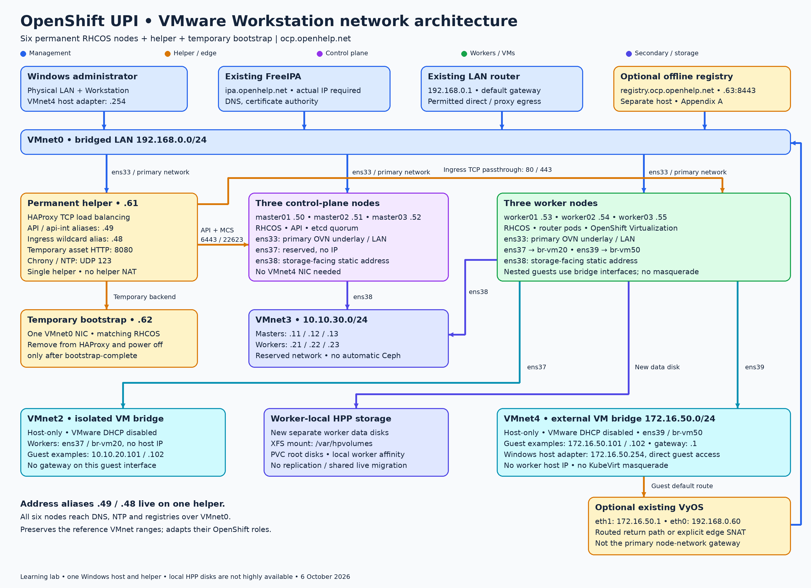
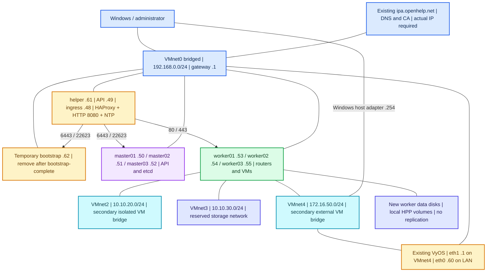
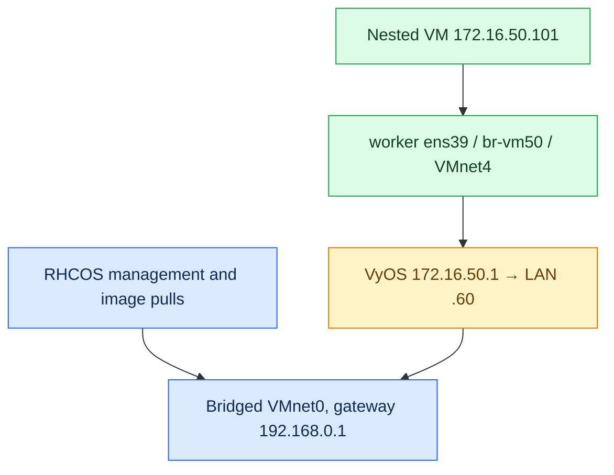
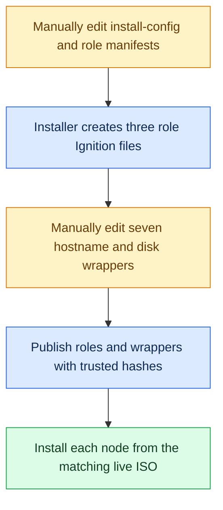
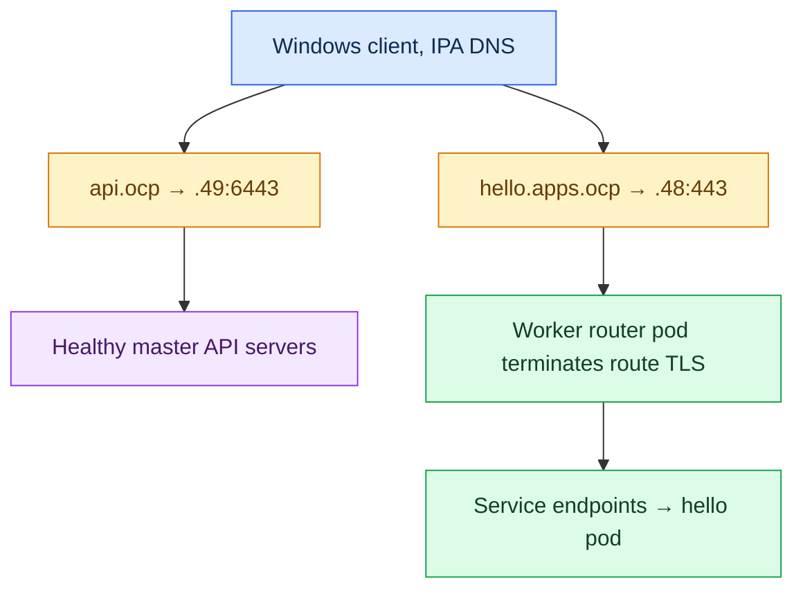
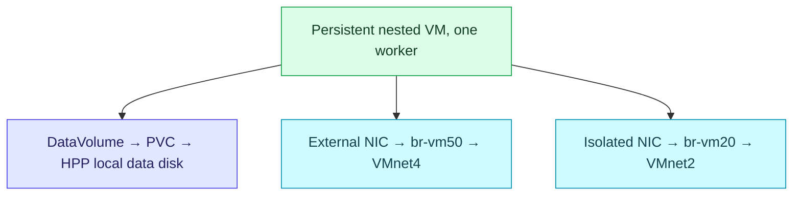
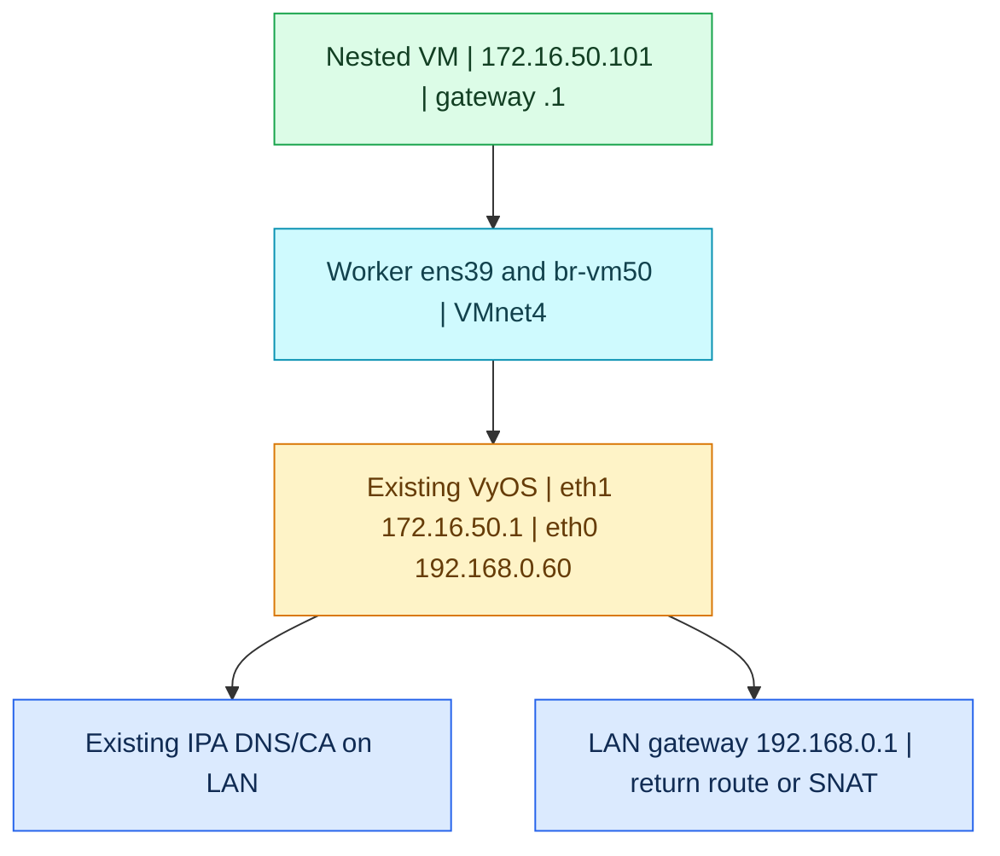

# OpenShift 4.22 on VMware Workstation — manual six-node UPI installation

**Manual revision:** 6 October 2026  
**Release example:** OpenShift Container Platform **4.22.16**; verify/select the exact GA patch before downloading  
**Cluster:** `ocp.openhelp.net`  
**Installation:** RHCOS live ISO, manual static networking and user-provisioned infrastructure (UPI)  
**Permanent cluster nodes:** three masters/control-plane nodes plus three workers  
**Other machines:** one permanent RHEL helper, one temporary bootstrap VM, your existing FreeIPA and your existing VyOS router  
**Includes:** individual per-host commands, manually edited configuration files, expected outputs, colored diagrams, DNS, load balancing, certificates, Virtualization, secondary VM networks, local VM disk storage, disconnected preparation, recovery and shutdown.

> [!IMPORTANT]
> VMware Workstation with nested OpenShift Virtualization is a learning lab. The single laptop/helper and local disks limit availability. This is not a certified production VMware vSphere deployment.

> [!CAUTION]
> RHCOS installation erases the verified OS target. Worker Ignition formats a separate **new empty data disk**. Use new empty VMs and positively identify both disks; preserve old OpenStack/Ceph data. Stop conflicting old lab VMs before reusing their LAN addresses.

## Read this first

Your requested demonstration is [this manual-install video, starting at 19:42](https://www.youtube.com/watch?v=GXpaHKI-QBc&t=1182s). YouTube throttled/blocked retrieval, so the exact transcript and on-screen commands could not be reviewed. This revision gives a manual UPI procedure checked against the current Red Hat installation requirements, with your existing lab's networking. It does not claim an exact video transcription.

**How to follow this document:** enter each native command yourself, one at a time, on the named host. Edit files in `nano` or the specified UI, paste the displayed configuration, and save. There are no custom shell/Python programs, functions, loops, executable environment files or custom configuration generators. OpenShift's own installer and Operators still perform the product's required provisioning/reconciliation after you manually invoke/apply their native interfaces.

**File-edit convention:** a `nano FILE` command opens the editor. The next YAML/JSON/INI/configuration block is **file content**, not something to execute in a terminal. In nano, press **Ctrl+O**, **Enter**, then **Ctrl+X**. Enter the subsequent command only after saving successfully. For `oc edit`, the command opens your configured editor; use that editor's save/exit keys. If desired, choose nano for the current session with the one native command `export KUBE_EDITOR=nano`; this optional editor setting is not a script or environment file.

**Use your existing DNS and CA:** keep `ipa.openhelp.net` and its current IP/CA. The exact existing IPv4 address was not supplied in the source document, so `IPA_SERVER_IP` is a clearly marked **text placeholder**. Replace it manually with the address shown by your existing IPA console/inventory or `getent hosts ipa.openhelp.net`. It is not a shell variable. `IPA_LINUX_USER` similarly means the Linux SSH account you already use on IPA. Do not reinstall IPA or assume a new IP.

**Keep VyOS:** your existing router remains at LAN `192.168.0.60` and VMnet4 `172.16.50.1`. The base cluster uses its directly connected bridged LAN gateway `.1`; VMnet4 nested guests use VyOS. See the explanation below and the complete manual routing/SNAT steps in **Appendix B5**. HAProxy load balancing does not replace VyOS routing.

**Six nodes means:** `master01–03` plus `worker01–03`. Masters and control-plane nodes are the same three machines. Helper/bootstrap/IPA/VyOS are infrastructure machines outside those six.

**Connectivity choice:** Steps 1–100 give the main connected/manual installation, including an approved proxy option. With no public registry access, complete Appendix A before generating installation assets. An ISO and CLI archives alone are insufficient for a disconnected cluster.

**Outputs and checks:** example outputs are illustrative acceptance targets. The document was checked locally; these commands have not been run against your laptop, IPA server or router. For a different selected patch, use matching installer/client/ISO metadata throughout.

**GitHub files:** keep this Markdown and `OPENSHIFT_4_22_OPENHELP_NETWORK_ARCHITECTURE.png` in the same directory. The network topology is retained, so the existing companion image remains applicable; the added Mermaid/router explanation provides more detail.

## Navigation

- [Architecture and IP plan](#architecture-and-ip-plan)
- [Phase 1 — VMware and capacity, Steps 1–13](#phase-1--vmware-and-capacity-steps-113)
- [Phase 2 — helper, FreeIPA and load balancing, Steps 14–29](#phase-2--helper-freeipa-and-load-balancing-steps-1429)
- [Phase 3 — current binaries and installation assets, Steps 30–45](#phase-3--current-binaries-and-installation-assets-steps-3045)
- [Phase 4 — per-host RHCOS installation, Steps 46–63](#phase-4--per-host-rhcos-installation-steps-4663)
- [Phase 5 — bootstrap and installation completion, Steps 64–78](#phase-5--bootstrap-and-installation-completion-steps-6478)
- [Phase 6 — virtualization, networks and storage, Steps 79–95](#phase-6--virtualization-networks-and-storage-steps-7995)
- [Phase 7 — FreeIPA TLS and handover, Steps 96–100](#phase-7--freeipa-tls-and-handover-steps-96100)
- [Appendix A — manual disconnected installation](#appendix-a--manual-disconnected-installation)
- [Appendix B — manual recovery, router checks and maintenance](#appendix-b--manual-recovery-router-checks-and-maintenance)
- [Appendix C — manual shutdown, restart and backup scope](#appendix-c--manual-shutdown-restart-and-backup-scope)
- [Appendix D — sources and document checks](#appendix-d--sources-and-document-checks)

## Architecture and IP plan

### Color architecture



The downloadable PNG is a companion to this Markdown; keep both files in the same GitHub folder. The diagram below provides a native Mermaid version too.



### How the OpenStack network becomes the OpenShift network

| VMware switch | Existing range | OpenStack reference role | OpenShift role in this guide |
|---|---|---|---|
| VMnet0 | `192.168.0.0/24` | Host management, APIs and default route | Node management, API, ingress, image pulls and **primary OVN-Kubernetes underlay** |
| VMnet2 | `10.10.20.0/24` | Dedicated OVN Geneve tunnel network | Secondary isolated network for nested VMs, using `br-vm20` on workers |
| VMnet3 | `10.10.30.0/24` | Ceph storage | Static, isolated storage-facing interfaces; reserved for a future external CSI/storage service |
| VMnet4 | `172.16.50.0/24` | Provider/floating-IP network, connected to controllers | Secondary external VM network, using `br-vm50` on **workers** |

**A necessary change:** in this UPI design, OVN-Kubernetes chooses its primary node underlay through the node network/default route on VMnet0. Adding an IP to `ens37` does not automatically move its tunnels to VMnet2. This guide does not modify OVS internals to imitate Neutron. OpenShift does not create Neutron routers, floating IPs, or Kolla `br-ex` objects.

**Storage distinction:** a network interface on VMnet3 does not create Ceph or persistent storage. The executable storage example uses new worker-local disks through the Hostpath Provisioner (HPP). It does not reuse the old OpenStack Ceph cluster, and it does not provide live migration or replicated disks. An external supported CSI driver or ODF/RWX storage is a separate design.

### Addresses and interfaces

The names `ens33/ens37/ens38/ens39` are targets. Verify them by MAC address on every VM before using them.

| Machine | VMnet0 `ens33` | VMnet2 `ens37` | VMnet3 `ens38` | VMnet4 `ens39` |
|---|---|---|---|---|
| `master01.ocp.openhelp.net` | `192.168.0.50/24` | Unused, no IP | `10.10.30.11/24` | Not needed |
| `master02.ocp.openhelp.net` | `192.168.0.51/24` | Unused, no IP | `10.10.30.12/24` | Not needed |
| `master03.ocp.openhelp.net` | `192.168.0.52/24` | Unused, no IP | `10.10.30.13/24` | Not needed |
| `worker01.ocp.openhelp.net` | `192.168.0.53/24` | Bridge port, no host IP | `10.10.30.21/24` | Bridge port, no host IP |
| `worker02.ocp.openhelp.net` | `192.168.0.54/24` | Bridge port, no host IP | `10.10.30.22/24` | Bridge port, no host IP |
| `worker03.ocp.openhelp.net` | `192.168.0.55/24` | Bridge port, no host IP | `10.10.30.23/24` | Bridge port, no host IP |
| `helper.ocp.openhelp.net` | `192.168.0.61/24` | Not needed | Not needed | Not needed |
| `bootstrap.ocp.openhelp.net` | `192.168.0.62/24` | Not needed | Not needed | Not needed |

| Shared object | Address/name | Owner |
|---|---|---|
| Default gateway | `192.168.0.1` | Existing LAN router |
| FreeIPA DNS/CA | `ipa.openhelp.net`, actual existing IPv4 | Existing IPA server |
| API endpoint | `api.ocp.openhelp.net → 192.168.0.49` | Secondary address on helper; HAProxy TCP 6443 |
| Internal API/MCS | `api-int.ocp.openhelp.net → 192.168.0.49` | Same helper; TCP 6443/22623 |
| Ingress wildcard | `*.apps.ocp.openhelp.net → 192.168.0.48` | Secondary address on helper; HAProxy TCP 80/443 |
| Asset HTTP server | `http://192.168.0.61:8080/` | Helper; temporarily serves Ignition |
| Lab NTP server | `192.168.0.61`, UDP 123 | Helper chronyd with a working upstream time source |
| Pod CIDR | `10.128.0.0/14`, host prefix `/23` | OVN-Kubernetes |
| Service CIDR | `172.30.0.0/16` | Kubernetes; not VMnet4 |
| Nested VM examples | `172.16.50.101`, `.102` | Guest OS on secondary bridged VMnet4 |
| Windows VMnet4 | `172.16.50.254/24` | Windows; no gateway/DNS on that adapter |
| VyOS | LAN `.60`, provider `172.16.50.1` | Existing router retained for VMnet4 |

The API/ingress addresses are ordinary secondary IPs on **one helper**, not Keepalived-managed HA VIPs. The address choices match the reference lab's ranges; you must resolve collisions before using them.

### Why VyOS remains in this architecture

VyOS was retained in the previous guide, but it was described as optional for **base-cluster installation** because all node/helper management addresses are already on the bridged `192.168.0.0/24` LAN. Their default gateway is `192.168.0.1`, and their API/ingress load balancer is the helper.

The companion image's “Optional existing VyOS” label refers to base API/bootstrap installation. Routed VMnet4 guests in this guide keep the existing router.

This revision keeps the router explicit. A nested VM with `172.16.50.101/24` uses **VyOS `172.16.50.1`** to reach the LAN, IPA DNS and external networks. Windows can reach that guest directly through its VMnet4 `.254` adapter. HAProxy distributes API/ingress connections; it does not route the guest subnet.

| Traffic | Device/path used |
|---|---|
| Node/helper Internet or proxy/mirror access from VMnet0 | Existing LAN gateway `192.168.0.1` |
| Windows-to-OpenShift API/console | Existing IPA DNS → helper HAProxy → master/worker |
| Windows `.254` to VMnet4 guest `.101` | Directly connected VMnet4 |
| Helper `.61` to VMnet4 guest | Static route via VyOS LAN `.60` |
| VMnet4 guest to existing IPA/LAN/egress | Guest gateway VyOS `172.16.50.1` → LAN `.60` |

Appendix B5 gives the manual inspection/configuration and both egress choices: routed traffic with an upstream return route, or explicit SNAT to `.60`. Explicit SNAT is still address translation even though it avoids a `masquerade` rule.

### Can we avoid masquerading?

Yes, for the **helper** and the demonstrated **nested VM attachment**:

- The six RHCOS nodes use bridged VMnet0 and the existing gateway directly. The helper is not their router. Do not enable `ip_forward`, VMware NAT, or a helper `iptables` masquerade rule.
- The nested VM attaches to VMnet4 with `bridge: {}`. It receives its own `172.16.50.x` IP and does not use KubeVirt `masquerade: {}`.
- OVN-Kubernetes still manages its own pod networking, including the NAT behavior it needs. Do not disable its internal rules.
- Internet access from a private LAN ordinarily uses NAT at your home/enterprise edge. Avoiding an **extra lab NAT** is different from eliminating every NAT between private IPs and the public Internet.
- For fully routed VMnet4 access without VyOS source NAT, upstream routers need a return route to `172.16.50.0/24` through `192.168.0.60`. Their Internet egress/firewall must also accept that source subnet. Appendix B explains both routed and explicit-SNAT choices.



### Where commands run

| Label in the guide | Location |
|---|---|
| **Windows** | PowerShell, VMware Workstation, browser or Windows network settings |
| **IPA** | Existing `ipa.openhelp.net` or an enrolled administrative Linux client, authenticated with `kinit admin` |
| **Helper** | RHEL 9 helper, normal `cloudadmin` account with sudo, unless marked root |
| **RHCOS live console** | VMware console of the specific node booted from the matching RHCOS ISO |
| **RHCOS installed node** | `ssh core@IP` from helper, after disk installation |
| **Cluster admin** | Dedicated helper account using this cluster's protected `.kube/config` after Step 69 |
| **VyOS** | Existing VyOS console; manual routing/SNAT instructions in Appendix B5 |

## Phase 1 — VMware and capacity, Steps 1–13

### Step 1 — protect the existing lab and confirm the six roles

**Windows.** Keep the old OpenStack VMs stopped if reusing their IPs. Create six **new empty** VMs named `master01`, `master02`, `master03`, `worker01`, `worker02`, `worker03`. Keep FreeIPA running. A separate helper and bootstrap are required for this manual UPI path.

Success: there are six intended cluster VMs, a helper, a bootstrap, and no duplicate running machines on the planned addresses. Never install RHCOS over a Ceph OSD or the Windows disk.

### Step 2 — choose a valid connectivity path

| Situation | Procedure |
|---|---|
| Nodes reach Red Hat/Quay over HTTPS | Main steps directly |
| Nodes only reach the Internet through an approved HTTP(S) proxy | Add `proxy` and its CA in Step 37; validate access through it |
| Nodes have no registry access, including no proxy | Complete Appendix A and apply the mirror configuration before creating Ignition |

RHCOS can be installed from local media, but bootstrap still needs its release images. Test this before starting the certificate clock. Operators and guest images also need registry access or mirroring.

### Step 3 — select one exact supported release

**Helper, later after OS setup.** This guide pins `4.22.16`, the existing guide's pinned example patch; check the [4.22 release notes](https://docs.redhat.com/en/documentation/openshift_container_platform/4.22/html/release_notes/ocp-4-22-release-notes) for current availability. Recheck the official release notes/download listing on the installation day. If a newer GA patch is present, record the new selected patch in your worksheet before generating assets and use that same version throughout.

Do not mix a video-era installer, a different client minor release, and an arbitrary RHCOS ISO. Do not choose nightly, release-candidate or OKD files for this OCP procedure.

### Step 4 — reserve enough CPU, RAM and disk

| VM | vCPU | RAM | OS disk | Extra storage |
|---|---:|---:|---:|---|
| Each of three control-plane nodes | 4 | 16 GB | 120 GB | None |
| Each of three workers, base OpenShift | 2 minimum; 4–6 preferred | 8 GB minimum; 12–16 GB for virtualization | 120 GB | New 120 GB data disk for the HPP example |
| Bootstrap, temporary | 4 | 16 GB | 120 GB | None |
| Helper | 2 | 4 GB | 60 GB | More space if hosting downloads |
| Existing FreeIPA | Its existing allocation | Its existing allocation | Existing disk | Keep independent |
| Existing VyOS, retained | Its existing allocation | Its existing allocation | Existing disk | Keep independent |

The documented base node minima total **88 GB including bootstrap**: 48 GB control plane + 24 GB workers + 16 GB bootstrap. Add helper, FreeIPA, Windows and any VyOS allocation. A 128 GB laptop is a practical starting point; a virtualization lab with 16 GB workers needs more headroom. With a 64 GB laptop, this exact seven-RHCOS-machine bootstrap cannot meet documented minimum RAM simultaneously. Do not silently reduce masters/bootstrap to 8 GB.

Use SSD/NVMe. Keep enough actual free disk for image extraction, VM writes and snapshots; thin provisioning does not create physical capacity. Avoid sustained Windows swapping or slow snapshot chains during etcd/bootstrap.

### Step 5 — enable hardware and nested virtualization

**Windows/firmware.** Enable Intel VT-x/VT-d or AMD-V/SVM in BIOS/UEFI. Restart Windows. With each worker powered off, open **VM Settings → Processors → Virtualization engine** and select **Virtualize Intel VT-x/EPT or AMD-V/RVI**. Expose the feature to every worker. Control-plane nodes do not need nested virtualization to run containers, but consistent CPU capabilities are useful.

If Workstation reports that nested virtualization is unavailable, resolve the host/Hyper-V/VBS conflict using the installed Workstation version's official guidance before continuing with virtualization. Disabling Windows security features is not a routine installation step. Validate the resulting `/dev/kvm` in Step 79.

Success: workers can start with the virtualization checkbox enabled. RHCOS 4.22 requires an x86-64-v2-capable CPU; confirm the exact laptop CPU rather than its marketing name.

### Step 6 — configure the VMware virtual switches

**Windows.** Open **Edit → Virtual Network Editor → Change Settings**.

| VMnet | Type | Subnet/mask | VMware DHCP | Host adapter |
|---|---|---|---|---|
| VMnet0 | Bridged to the active physical LAN NIC | Existing `192.168.0.0/24` LAN | LAN DHCP stays outside this procedure | Existing physical Windows NIC |
| VMnet2 | Host-only | `10.10.20.0 / 255.255.255.0` | Disabled | Optional; no gateway/DNS |
| VMnet3 | Host-only | `10.10.30.0 / 255.255.255.0` | Disabled | Optional; no gateway/DNS |
| VMnet4 | Host-only | `172.16.50.0 / 255.255.255.0` | Disabled | Enabled |

Select **Custom: Specific virtual network** in each VM's adapter settings. Generic “Host-only” can select VMnet1. Do not select VMware NAT for these networks. If bridged Wi-Fi rejects additional MACs or guest traffic, use a wired adapter or fix bridging before diagnosing OpenShift.

### Step 7 — configure the Windows VMnet4 adapter

**Windows UI.** Press **Win+R**, enter `ncpa.cpl`, then open **VMware Network Adapter VMnet4 → Properties → Internet Protocol Version 4**.

Enter IP `172.16.50.254`, subnet mask `255.255.255.0`. Leave its gateway and DNS blank. VyOS owns `172.16.50.1`; your physical LAN adapter keeps Windows' default gateway.

**Windows PowerShell, one command:**

```powershell
ipconfig /all
```

Confirm the VMnet4 adapter is `.254`, with no gateway. This adapter lets Windows reach nested VMs directly on VMnet4.

### Step 8 — create helper and temporary bootstrap VMs

**Windows.** Create `helper` with one adapter on VMnet0 and a supported RHEL 9 x86_64 installation ISO. The helper is mutable Linux, not RHCOS. A separately entitled RHEL helper or compatible lab Linux is distinct from the OpenShift evaluation entitlement.

Create `bootstrap` with one adapter on VMnet0, 4 vCPU, 16 GB RAM and an empty 120 GB OS disk. Leave its OS uninstalled until the RHCOS ISO is obtained. Use the same firmware mode throughout the lab; UEFI is suitable. Keep boot order consistent and disconnect installation media after installation.

### Step 9 — create the control-plane VMs

**Windows.** Each master gets its empty OS disk and these adapters:

1. Adapter 1 → VMnet0, expected `ens33`.
2. Adapter 2 → VMnet2, expected `ens37`, reserved without IP.
3. Adapter 3 → VMnet3, expected `ens38`.

No VMnet4 adapter is needed on masters for this design. Do not install CentOS, Kubernetes, Docker or Kolla packages on them. The installer uses RHCOS with CRI-O.

### Step 10 — create workers and their storage disks

**Windows.** Each worker gets four adapters, VMnet0/2/3/4 in that order, and two new disks: 120 GB OS plus 120 GB data. Make adapter MACs unique. Enable **Connected** and **Connect at power on**. Enable nested virtualization from Step 5.

The data disk is expected to appear as `/dev/sdb` only in this new, consistent disk layout. Record its controller/unit/size. Actual Linux device identification in Step 47 overrides the example. Your earlier OpenStack lab had a compute with reversed OS/OSD names, so do not reuse that assumption here.

### Step 11 — record every NIC's MAC-to-VMnet mapping

**Windows.** In each adapter's **Advanced** settings, record MAC address and VMnet. Later match with:

```bash
ip -br link
nmcli -f GENERAL.DEVICE,GENERAL.HWADDR,GENERAL.CONNECTION device show
```

Example mapping:

```text
ens33 → adapter MAC on VMnet0
ens37 → adapter MAC on VMnet2
ens38 → adapter MAC on VMnet3
ens39 → adapter MAC on VMnet4, workers only
```

Do not guess an interface's VMnet from the `ens` number alone. If names differ, substitute them consistently in the live network commands and NNCP manifests.

### Step 12 — record the OS disk and the separate VM-data disk

After downloading the matching ISO in Steps 34–36, boot each live console and inspect:

```bash
lsblk -e7 -o NAME,SIZE,TYPE,FSTYPE,MOUNTPOINTS,MODEL,SERIAL
sudo wipefs -n /dev/sdb
```

For the new VM layout, this guide uses `/dev/sda` for the **empty OS disk** and `/dev/sdb` for each worker's **separate empty data disk**. Verify those identities on each machine. Your previous OpenStack VMs had different disk orders; those old assumptions do not apply here.

Record the actual devices in your worksheet. Step 43's worker JSON formats the device written in its `storage.disks` entry at first boot. A different actual device requires a manual change to that worker's JSON before installation. `wipefs -n` only inspects signatures; it does not erase anything.

### Step 13 — reserve and check the LAN addresses

**LAN administration and helper console.** Exclude `.48–.55`, `.60–.62` from LAN DHCP. `.60` can remain the legitimate existing VyOS address. After helper networking works, check unused addresses before assigning them:

```bash
sudo arping -D -I ens33 -c 3 192.168.0.48
sudo arping -D -I ens33 -c 3 192.168.0.49
sudo arping -D -I ens33 -c 3 192.168.0.50
sudo arping -D -I ens33 -c 3 192.168.0.51
sudo arping -D -I ens33 -c 3 192.168.0.52
sudo arping -D -I ens33 -c 3 192.168.0.53
sudo arping -D -I ens33 -c 3 192.168.0.54
sudo arping -D -I ens33 -c 3 192.168.0.55
sudo arping -D -I ens33 -c 3 192.168.0.61
sudo arping -D -I ens33 -c 3 192.168.0.62
```

Unused addresses normally show zero responses and status 0. An ARP test cannot identify a powered-off device; also check the DHCP lease table and your inventory. Check `.50–.55` before starting the new nodes. Do not probe an address already assigned to the current helper as if it were unused.

## Phase 2 — helper, FreeIPA and load balancing, Steps 14–29

### Step 14 — install the helper OS

**Helper VMware console.** Install RHEL 9 with a `cloudadmin` account, sudo access, 60 GB OS disk and one LAN NIC. Set a strong local password. Use a supported package repository/subscription or a preconfigured authorized local mirror for the helper packages. This guide does not run `subscription-manager register` with credentials embedded in scripts.

Success: you can log in as `cloudadmin` and `sudo -v` succeeds. The helper survives the bootstrap VM's removal.

### Step 15 — manually set the helper's hostname and network

**Helper VMware console.** Use the existing FreeIPA server's actual IP; this document calls it `IPA_SERVER_IP`. This is a text placeholder, not an environment variable. Replace it with your real address before entering any command.

```bash
sudo hostnamectl set-hostname helper.ocp.openhelp.net
ip -br link
sudo nmtui
```

In **Edit a connection**, select the connection attached to VMnet0. Confirm its NIC/MAC against VMware. Set:

| Field | Value |
|---|---|
| Profile name | `ocp-helper` |
| Device | Verified management NIC, expected `ens33` |
| IPv4 method | Manual |
| Address | `192.168.0.61/24` |
| Gateway | `192.168.0.1` |
| DNS server | Your existing FreeIPA IP |
| Search domains | `ocp.openhelp.net`, `openhelp.net` |
| IPv6 | Disabled for this IPv4 lab |
| Automatically connect | Enabled |

Save, then use **Activate a connection** to reactivate `ocp-helper`. Perform this from the VMware console because the network change can disconnect SSH.

```bash
ip -4 -br address
ip -4 route
getent hosts ipa.openhelp.net
```

Expected: helper `.61/24`, one default route via `.1`, and the correct existing IPA address. Do not reinstall IPA or assign it a new IP.

### Step 16 — install helper utilities and keep a persistent terminal

**Helper, cloudadmin.** Use your authorized RHEL repository or existing local package mirror.

```bash
sudo dnf install -y haproxy nginx chrony bind-utils curl tar openssl nano tmux iputils policycoreutils-python-utils firewalld
sudo systemctl enable --now chronyd firewalld
mkdir -p /home/cloudadmin/ocp-lab/downloads
mkdir -p /home/cloudadmin/ocp-lab/cluster
mkdir -p /home/cloudadmin/ocp-lab/certs
mkdir -p /home/cloudadmin/ocp-lab/backups
mkdir -p /home/cloudadmin/ocp-lab/day2
mkdir -p /home/cloudadmin/ocp-lab/logs
chmod 700 /home/cloudadmin/ocp-lab /home/cloudadmin/ocp-lab/cluster /home/cloudadmin/ocp-lab/certs
tmux new -s ocp-install
```

`policycoreutils-python-utils` is the RHEL package providing the native `semanage` command. You do not write or run a Python program. `tmux` keeps a command running if SSH disconnects: **Ctrl+B, D** detaches; `tmux attach -t ocp-install` reconnects.

### Step 17 — write a manual installation worksheet

**Helper.**

```bash
nano /home/cloudadmin/ocp-lab/lab-notes.txt
```

Enter your actual values in a plain text file:

```text
Cluster: ocp.openhelp.net
Chosen OpenShift release: 4.22.16, or another deliberately selected GA 4.22 patch
Existing FreeIPA hostname: ipa.openhelp.net
Existing FreeIPA IP: WRITE_YOUR_REAL_IP_HERE
Existing IPA Linux SSH account: WRITE_YOUR_REAL_ACCOUNT_HERE
LAN gateway: 192.168.0.1
Helper: 192.168.0.61
API and API-int: 192.168.0.49
Ingress: 192.168.0.48
Bootstrap: 192.168.0.62
VyOS LAN: 192.168.0.60
VyOS VMnet4: 172.16.50.1
Actual management/storage/secondary NIC names: RECORD_PER_HOST
OS disk and worker data disk: RECORD_PER_HOST
Payload access: direct internet / approved proxy / disconnected mirror
```

Save with **Ctrl+O, Enter**, then exit with **Ctrl+X**. This is a worksheet, not an executable environment file. Keep passwords, private keys and the pull secret out of it.

### Step 18 — validate existing IPA DNS and configure helper NTP manually

**Helper.** Replace `IPA_SERVER_IP` with your actual existing IPA address.

```bash
dig @IPA_SERVER_IP ipa.openhelp.net A +short
timedatectl
chronyc sources -v
chronyc tracking
sudo nano /etc/chrony.conf
```

Retain working reachable upstream NTP servers/pools. Add this line if it is not already present:

```ini
allow 192.168.0.0/24
```

In a restricted network, replace unreachable public pools with your actual authorized NTP server. FreeIPA is not automatically an NTP server simply because it provides DNS and CA.

```bash
sudo systemctl restart chronyd
sudo firewall-cmd --permanent --add-service=ntp
sudo firewall-cmd --reload
chronyc sources -v
chronyc tracking
```

Expected: a selected synchronized source and `Leap status: Normal`. Nodes will use the helper `.61` for NTP. Do not begin installation with an unsynchronized helper clock.

### Step 19 — create or inspect the FreeIPA DNS zone

**IPA, authenticated administrative shell.**

```bash
kinit admin
ipa dnszone-show openhelp.net.
ipa dnszone-show ocp.openhelp.net.
```

If the child zone does not exist, create it:

```bash
ipa dnszone-add ocp.openhelp.net. \
  --name-server=ipa.openhelp.net. \
  --admin-email=hostmaster.openhelp.net.
```

If the parent zone is hosted in this IPA deployment and lacks a delegation, add:

```bash
ipa dnsrecord-add openhelp.net. ocp --ns-rec=ipa.openhelp.net.
```

Expected: the child zone is active and authoritative. If these records already exist, inspect them rather than adding duplicates. DNS setup does not require enrolling the RHCOS nodes into FreeIPA.

### Step 20 — create all forward records

**IPA.** These are new records in the cluster zone:

```bash
ipa dnsrecord-add ocp.openhelp.net. helper --a-rec=192.168.0.61
ipa dnsrecord-add ocp.openhelp.net. bootstrap --a-rec=192.168.0.62
ipa dnsrecord-add ocp.openhelp.net. master01 --a-rec=192.168.0.50
ipa dnsrecord-add ocp.openhelp.net. master02 --a-rec=192.168.0.51
ipa dnsrecord-add ocp.openhelp.net. master03 --a-rec=192.168.0.52
ipa dnsrecord-add ocp.openhelp.net. worker01 --a-rec=192.168.0.53
ipa dnsrecord-add ocp.openhelp.net. worker02 --a-rec=192.168.0.54
ipa dnsrecord-add ocp.openhelp.net. worker03 --a-rec=192.168.0.55
ipa dnsrecord-add ocp.openhelp.net. api --a-rec=192.168.0.49
ipa dnsrecord-add ocp.openhelp.net. api-int --a-rec=192.168.0.49
ipa dnsrecord-add ocp.openhelp.net. ingress --a-rec=192.168.0.48
ipa dnsrecord-add ocp.openhelp.net. '*.apps' --a-rec=192.168.0.48
```

If a record exists with an incorrect IP, use `ipa dnsrecord-show ZONE NAME`, then `ipa dnsrecord-mod ZONE NAME --a-rec=CORRECT_IP` to replace its A values. Do not leave an old IP beside the new IP. Wildcard DNS is essential: a Windows `hosts` entry cannot express `*.apps`.

### Step 21 — create or correct reverse DNS

**IPA.** Inspect the LAN reverse zone:

```bash
ipa dnszone-show 0.168.192.in-addr.arpa.
```

Create it only if it does not already exist and you administer that reverse space:

```bash
ipa dnszone-add 0.168.192.in-addr.arpa. \
  --name-server=ipa.openhelp.net. \
  --admin-email=hostmaster.openhelp.net.
```

For new reverse records:

```bash
ipa dnsrecord-add 0.168.192.in-addr.arpa. 48 --ptr-rec=ingress.ocp.openhelp.net.
ipa dnsrecord-add 0.168.192.in-addr.arpa. 49 --ptr-rec=api.ocp.openhelp.net.
ipa dnsrecord-add 0.168.192.in-addr.arpa. 50 --ptr-rec=master01.ocp.openhelp.net.
ipa dnsrecord-add 0.168.192.in-addr.arpa. 51 --ptr-rec=master02.ocp.openhelp.net.
ipa dnsrecord-add 0.168.192.in-addr.arpa. 52 --ptr-rec=master03.ocp.openhelp.net.
ipa dnsrecord-add 0.168.192.in-addr.arpa. 53 --ptr-rec=worker01.ocp.openhelp.net.
ipa dnsrecord-add 0.168.192.in-addr.arpa. 54 --ptr-rec=worker02.ocp.openhelp.net.
ipa dnsrecord-add 0.168.192.in-addr.arpa. 55 --ptr-rec=worker03.ocp.openhelp.net.
ipa dnsrecord-add 0.168.192.in-addr.arpa. 61 --ptr-rec=helper.ocp.openhelp.net.
ipa dnsrecord-add 0.168.192.in-addr.arpa. 62 --ptr-rec=bootstrap.ocp.openhelp.net.
```

For an address with an existing OpenStack PTR, replace that PTR only after retiring its previous owner. Example:

```bash
ipa dnsrecord-show 0.168.192.in-addr.arpa. 50
ipa dnsrecord-mod 0.168.192.in-addr.arpa. 50 --ptr-rec=master01.ocp.openhelp.net.
```

Do not change unrelated IPA, Kubernetes or OpenStack records. Old etcd SRV records from early OpenShift versions are not part of this procedure.

### Step 22 — manually verify each DNS result

**Helper.** Substitute the real existing IPA address for `IPA_SERVER_IP`.

```bash
dig @IPA_SERVER_IP api.ocp.openhelp.net A +short
dig @IPA_SERVER_IP api-int.ocp.openhelp.net A +short
dig @IPA_SERVER_IP console-openshift-console.apps.ocp.openhelp.net A +short
dig @IPA_SERVER_IP random-test.apps.ocp.openhelp.net A +short
dig @IPA_SERVER_IP -x 192.168.0.53 +short
getent hosts master01.ocp.openhelp.net
```

Expected respectively: `.49`, `.49`, `.48`, `.48`, `worker01.ocp.openhelp.net.`, and master01 at `.50`. Also check every other node's A/PTR pair. A public resolver does not replace IPA for this private zone.

### Step 23 — make Windows use the existing IPA DNS for this zone

**Windows administrator PowerShell.** Replace `IPA_SERVER_IP` with the actual address; enter one command at a time.

```powershell
Get-DnsClientNrptRule
Add-DnsClientNrptRule -Namespace '.ocp.openhelp.net' -NameServers 'IPA_SERVER_IP'
Clear-DnsClientCache
Resolve-DnsName api.ocp.openhelp.net
Resolve-DnsName console-openshift-console.apps.ocp.openhelp.net
```

Add the rule once, after checking whether an equivalent rule already exists. Expected answers are `.49` and `.48`. If NRPT is unavailable or managed by VPN policy, use **ncpa.cpl → physical LAN adapter → IPv4 Properties** and your authorized DNS settings/conditional forwarder. The VMnet4 adapter stays without DNS/default gateway.

### Step 24 — add the API and ingress addresses to the helper

**Helper VMware console.** The primary profile was named `ocp-helper` in Step 15.

```bash
nmcli connection show ocp-helper
sudo nmcli connection modify ocp-helper +ipv4.addresses 192.168.0.49/24
sudo nmcli connection modify ocp-helper +ipv4.addresses 192.168.0.48/24
sudo nmcli connection up ocp-helper
ip -4 -br address show ens33
ip -4 route
```

Add each address once. Expected: `.61`, `.49`, `.48` on the management NIC and one default route via `.1`. These two additional addresses belong to this helper; they are not automatically floating between helpers.

### Step 25 — manually edit HAProxy

**Helper.**

```bash
sudo cp -a /etc/haproxy/haproxy.cfg /etc/haproxy/haproxy.cfg.before-ocp
sudo nano /etc/haproxy/haproxy.cfg
```

Replace the file contents with the following configuration, then save. This is HAProxy configuration, not a shell program.

```text
global
    log /dev/log local0
    maxconn 4000
    user haproxy
    group haproxy
    daemon

defaults
    log global
    mode tcp
    option tcplog
    timeout connect 10s
    timeout client 1h
    timeout server 1h

frontend ocp_api
    bind 192.168.0.49:6443
    default_backend ocp_api_nodes

backend ocp_api_nodes
    balance roundrobin
    option httpchk
    http-check connect ssl
    http-check send meth GET uri /readyz ver HTTP/1.1 hdr Host api.ocp.openhelp.net
    http-check expect status 200
    default-server inter 5s fall 3 rise 2
    server bootstrap 192.168.0.62:6443 check check-ssl verify none
    server master01 192.168.0.50:6443 check check-ssl verify none
    server master02 192.168.0.51:6443 check check-ssl verify none
    server master03 192.168.0.52:6443 check check-ssl verify none

frontend ocp_machine_config
    bind 192.168.0.49:22623
    default_backend ocp_machine_config_nodes

backend ocp_machine_config_nodes
    balance roundrobin
    default-server inter 5s fall 3 rise 2
    server bootstrap 192.168.0.62:22623 check
    server master01 192.168.0.50:22623 check
    server master02 192.168.0.51:22623 check
    server master03 192.168.0.52:22623 check

frontend ocp_http
    bind 192.168.0.48:80
    default_backend ocp_http_routers

backend ocp_http_routers
    balance source
    default-server inter 5s fall 3 rise 2
    server worker01 192.168.0.53:80 check
    server worker02 192.168.0.54:80 check
    server worker03 192.168.0.55:80 check

frontend ocp_https
    bind 192.168.0.48:443
    default_backend ocp_https_routers

backend ocp_https_routers
    balance source
    default-server inter 5s fall 3 rise 2
    server worker01 192.168.0.53:443 check
    server worker02 192.168.0.54:443 check
    server worker03 192.168.0.55:443 check
```

```bash
sudo haproxy -c -f /etc/haproxy/haproxy.cfg
```

Expected: `Configuration file is valid`. HAProxy passes client TLS through to OpenShift. `verify none` above applies to the readiness probes' temporary backend trust, not to clients or normal API TLS. TCP 22623 remains internal and remains available after bootstrap.

### Step 26 — retain SELinux and open the helper firewall

**Helper.**

```bash
sudo setsebool -P haproxy_connect_any 1
sudo firewall-cmd --permanent --add-service=ssh
sudo firewall-cmd --permanent --add-port=6443/tcp
sudo firewall-cmd --permanent --add-port=80/tcp
sudo firewall-cmd --permanent --add-port=443/tcp
sudo firewall-cmd --permanent --add-rich-rule='rule family="ipv4" source address="192.168.0.0/24" port port="22623" protocol="tcp" accept'
sudo firewall-cmd --permanent --add-rich-rule='rule family="ipv4" source address="192.168.0.0/24" port port="8080" protocol="tcp" accept'
sudo firewall-cmd --reload
sudo systemctl enable --now haproxy
```

Ports 22623 and 8080 are internal installation services; do not expose them through an Internet router. Port 22623 remains necessary after bootstrap. SELinux stays enforcing. RHCOS node firewall/networking is managed by OpenShift; do not copy the OpenStack instructions that disable SELinux or install host Docker.

### Step 27 — manually check helper listeners

```bash
sudo ss -lntp
sudo systemctl --no-pager status haproxy
```

Look for HAProxy listening on `.49:6443`, `.49:22623`, `.48:80`, `.48:443`. Backends are initially down because the nodes are not installed yet. A listener does not yet prove API readiness.

### Step 28 — manually configure the installation-file web server

**Helper.** Nginx uses `.61:8080`, because HAProxy already owns ingress ports 80/443.

```bash
sudo cp -a /etc/nginx/nginx.conf /etc/nginx/nginx.conf.before-ocp
sudo mkdir -p /var/www/ocp
sudo nano /etc/nginx/nginx.conf
```

Paste this Nginx configuration:

```nginx
user nginx;
worker_processes auto;
error_log /var/log/nginx/error.log;
pid /run/nginx.pid;
events { worker_connections 1024; }
http {
    include /etc/nginx/mime.types;
    default_type application/octet-stream;
    access_log /var/log/nginx/access.log;
    server {
        listen 192.168.0.61:8080;
        root /var/www/ocp;
        autoindex off;
        location / { try_files $uri =404; }
    }
}
```

```bash
sudo nano /var/www/ocp/health.txt
```

Enter the single line `ocp asset server ready`, then save.

```bash
sudo restorecon -RF /var/www/ocp /etc/nginx
sudo semanage port -l
sudo nginx -t
sudo systemctl enable --now nginx
curl --fail http://192.168.0.61:8080/health.txt
```

Inspect the `http_port_t` line. If it lacks 8080 and 8080 is unassigned, add it manually:

```bash
sudo semanage port -a -t http_port_t -p tcp 8080
```

If another SELinux type already owns 8080, inspect the reason before altering it. On this dedicated helper, once you verify that no other service requires that assignment, relabel it with the single native command `sudo semanage port -m -t http_port_t -p tcp 8080`, then rerun the Nginx check/start. Expected: Nginx syntax succeeds and the health text is returned. Keep SELinux enforcing.

### Step 29 — save the infrastructure checkpoint manually

```bash
sudo install -o cloudadmin -g cloudadmin -m 0600 /etc/haproxy/haproxy.cfg /home/cloudadmin/ocp-lab/backups/haproxy.cfg
sudo install -o cloudadmin -g cloudadmin -m 0600 /etc/nginx/nginx.conf /home/cloudadmin/ocp-lab/backups/nginx.conf
cp /home/cloudadmin/ocp-lab/lab-notes.txt /home/cloudadmin/ocp-lab/backups/lab-notes.txt
date -Is
```

Write the checkpoint time into the worksheet. Before continuing, confirm working IPA A/PTR/wildcard answers, synchronized helper time, valid HAProxy and successful HTTP health. A long installer wait cannot repair these prerequisites.

## Phase 3 — current binaries and installation assets, Steps 30–45

### Step 30 — generate the node-access SSH key with a native command

**Helper, cloudadmin.**

```bash
ssh-keygen -t ed25519 -f /home/cloudadmin/.ssh/ocp_ed25519 -C ocp-openhelp-lab
cat /home/cloudadmin/.ssh/ocp_ed25519.pub
```

Copy the complete **public** key line into Step 37. Keep the private key private. Installed RHCOS uses the `core` account, not `cloudadmin` or a password chosen from an ISO installer wizard.

### Step 31 — manually obtain the trial and pull secret

Use your permitted Red Hat account and the [self-managed OpenShift evaluation](https://www.redhat.com/en/technologies/cloud-computing/openshift/try-it). Confirm the duration, entitlement and expiry actually offered to your account. RHCOS is the cluster OS; an ISO alone does not provide registry entitlement.

Download the pull secret from [OpenShift downloads](https://console.redhat.com/openshift/downloads) on your permitted personal/download computer. Save it as `pull-secret.json`. Transfer it to `/home/cloudadmin/ocp-lab/pull-secret.json` on the helper with a file-transfer client or this one command from Windows:

```powershell
scp C:\OCP-Lab\Downloads\pull-secret.json cloudadmin@192.168.0.61:/home/cloudadmin/ocp-lab/pull-secret.json
```

**Helper:**

```bash
chmod 600 /home/cloudadmin/ocp-lab/pull-secret.json
nano /home/cloudadmin/ocp-lab/pull-secret.json
```

Check that the downloaded file is a JSON object with `auths`. Use its complete one-line content inside the quoted `pullSecret` field in Step 37. Keep it out of Git, logs and screenshots. The installer's own configuration parser provides the validation when you create manifests.

### Step 32 — download the matching release manually

**Browser on the permitted download computer.** Select one exact GA **4.22 patch**, and download matching Linux x86_64 installer and client archives plus vendor checksum files. The existing guide's chosen example is **4.22.16**; this is a pinned example, not a promise that it remains the latest patch on a later date.

The version-specific directory is:

[OpenShift 4.22.16 client and installer downloads](https://mirror.openshift.com/pub/openshift-v4/x86_64/clients/ocp/4.22.16/)

Save these files in `C:\OCP-Lab\Downloads`:

```text
openshift-install-linux.tar.gz
openshift-client-linux.tar.gz
sha256sum.txt
release.txt
```

Also obtain the Windows client if you want Windows `oc`. If a different GA patch is chosen, download everything from that same patch's directory and record the choice in your worksheet.

**Windows PowerShell, manual transfers:**

```powershell
scp C:\OCP-Lab\Downloads\openshift-install-linux.tar.gz cloudadmin@192.168.0.61:/home/cloudadmin/ocp-lab/downloads/
scp C:\OCP-Lab\Downloads\openshift-client-linux.tar.gz cloudadmin@192.168.0.61:/home/cloudadmin/ocp-lab/downloads/
scp C:\OCP-Lab\Downloads\sha256sum.txt cloudadmin@192.168.0.61:/home/cloudadmin/ocp-lab/downloads/
scp C:\OCP-Lab\Downloads\release.txt cloudadmin@192.168.0.61:/home/cloudadmin/ocp-lab/downloads/
```

Complete downloads before creating time-sensitive Ignition files.

### Step 33 — compare hashes and install the binaries manually

**Helper:**

```bash
cd /home/cloudadmin/ocp-lab/downloads
sha256sum openshift-install-linux.tar.gz
sha256sum openshift-client-linux.tar.gz
less sha256sum.txt
```

Compare each full SHA256 value against its matching archive entry in the vendor file. Do not compare an installer archive against the client entry. Continue only when both values match.

```bash
mkdir -p /home/cloudadmin/ocp-lab/downloads/tools
tar -xzf openshift-install-linux.tar.gz -C /home/cloudadmin/ocp-lab/downloads/tools
tar -xzf openshift-client-linux.tar.gz -C /home/cloudadmin/ocp-lab/downloads/tools
sudo install -m 0755 /home/cloudadmin/ocp-lab/downloads/tools/openshift-install /usr/local/bin/openshift-install
sudo install -m 0755 /home/cloudadmin/ocp-lab/downloads/tools/oc /usr/local/bin/oc
sudo install -m 0755 /home/cloudadmin/ocp-lab/downloads/tools/kubectl /usr/local/bin/kubectl
openshift-install version
oc version --client
```

Expected: installer and client correspond to your selected 4.22 patch. The CLI may also display a Kubernetes client version. Record the results in the worksheet.

### Step 34 — manually locate the matching RHCOS ISO in installer metadata

**Helper:**

```bash
openshift-install coreos print-stream-json > /home/cloudadmin/ocp-lab/downloads/rhcos-stream.json
less /home/cloudadmin/ocp-lab/downloads/rhcos-stream.json
```

In `less`, search with `/"x86_64"`, then locate this object hierarchy within that architecture:

```text
architectures → x86_64 → artifacts → metal → formats → iso → disk
```

Copy the `location` URL and the accompanying `sha256` value into your worksheet. Keep the URL and digest from **the same ISO object**. The JSON can contain other architectures and disk-image formats; those are different downloads. RHCOS's build number need not equal the OpenShift patch number. Press `q` to exit.

### Step 35 — manually download and verify the ISO

Open the exact `location` URL recorded in Step 34 in your download computer's browser. Save the file as `C:\OCP-Lab\ISO\rhcos-live.x86_64.iso`.

**Windows PowerShell:**

```powershell
Get-FileHash C:\OCP-Lab\ISO\rhcos-live.x86_64.iso -Algorithm SHA256
```

Compare the **entire** result with Step 34's matching `sha256`. Expected: identical values. A web error page renamed to `.iso` fails this check. For a fully disconnected environment, take the verified ISO and metadata into the lab through the approved transfer route.

### Step 36 — attach the same verified ISO to all installation VMs

**VMware UI.** With a VM powered off, open **Settings → CD/DVD → Use ISO image file**, select the verified ISO, and enable **Connect at power on**. Repeat for bootstrap, master01–03 and worker01–03.

Boot the live console to inspect NICs and disks from Steps 11–12 before finalizing worker disk configuration. Return to the helper to prepare assets. The helper uses its ordinary RHEL installation; it is not overwritten with RHCOS.

### Step 37 — manually create install-config.yaml

**Helper:**

```bash
ls -la /home/cloudadmin/ocp-lab/cluster
nano /home/cloudadmin/ocp-lab/cluster/install-config.yaml
```

For a new attempt the directory must be unused. Paste this YAML, then manually replace the two quoted placeholders with your complete one-line pull-secret JSON and SSH public-key line. Keep the single quotes around each value.

```yaml
apiVersion: v1
baseDomain: openhelp.net
metadata:
  name: ocp
compute:
- name: worker
  hyperthreading: Enabled
  replicas: 0
controlPlane:
  name: master
  hyperthreading: Enabled
  replicas: 3
networking:
  networkType: OVNKubernetes
  machineNetwork:
  - cidr: 192.168.0.0/24
  clusterNetwork:
  - cidr: 10.128.0.0/14
    hostPrefix: 23
  serviceNetwork:
  - 172.30.0.0/16
platform:
  none: {}
pullSecret: 'PASTE_COMPLETE_ONE_LINE_PULL_SECRET_JSON_HERE'
sshKey: 'PASTE_COMPLETE_SSH_PUBLIC_KEY_LINE_HERE'
```

`platform.none` selects infrastructure you provide. UPI uses `compute.replicas: 0` because the installer does not create worker VMs; **you still install three workers**. Control-plane scheduling is disabled in Step 40.

**Only if a proxy is actually required**, append the following fields with your real values before creating manifests:

```yaml
proxy:
  httpProxy: http://ACTUAL_PROXY_HOST:3128
  httpsProxy: http://ACTUAL_PROXY_HOST:3128
  noProxy: localhost,127.0.0.1,.openhelp.net,192.168.0.0/24,10.10.20.0/24,10.10.30.0/24,172.16.50.0/24,10.128.0.0/14,172.30.0.0/16
additionalTrustBundle: |
  -----BEGIN CERTIFICATE-----
  PASTE_ACTUAL_PROXY_CA_PEM_BODY
  -----END CERTIFICATE-----
```

Use the real CA chain required by your proxy/mirror. Leave the proxy block out of a direct-connected installation. In a disconnected installation, complete Appendix A before this step and add its actual mirror auth/trust/mappings. Your existing IPA CA is later used for public-facing OpenShift API and ingress TLS; it does not replace OpenShift's internal cluster CA.

### Step 38 — manually review and back up install-config

**Helper:**

```bash
nano /home/cloudadmin/ocp-lab/cluster/install-config.yaml
chmod 600 /home/cloudadmin/ocp-lab/cluster/install-config.yaml
cp /home/cloudadmin/ocp-lab/cluster/install-config.yaml /home/cloudadmin/ocp-lab/backups/install-config.yaml
chmod 600 /home/cloudadmin/ocp-lab/backups/install-config.yaml
```

Check indentation uses spaces, all placeholders are replaced, the cluster name/domain are correct, the public key is one line, and the pull secret is valid complete JSON within its YAML quotes. Verify the pod/service/network CIDRs do not overlap the LAN, VMnet ranges, other clusters or an active VPN. The installer validates the configuration in the next step. It consumes the configuration file while generating assets, so keep this protected backup outside `cluster`.

### Step 39 — run the installer's native manifest command

**Helper, inside tmux:**

```bash
openshift-install create manifests --dir=/home/cloudadmin/ocp-lab/cluster --log-level=info
```

Expected: new `manifests` and `openshift` directories. If this command reports a YAML/secret/schema error, correct the cause before continuing. Preserve the attempt's directory once its assets are used by nodes.

### Step 40 — manually disable application scheduling on masters

```bash
nano /home/cloudadmin/ocp-lab/cluster/manifests/cluster-scheduler-02-config.yml
```

Find the existing Scheduler object's `spec` and make its field:

```yaml
spec:
  mastersSchedulable: false
```

Keep all other generated content. Save the file. If the exact filename differs, inspect the generated manifests and edit the existing `kind: Scheduler` object; create no duplicate. Workers will run ingress and applications.

### Step 41 — manually create master and worker NTP MachineConfigs

**Helper.** The following files configure nodes to use the synchronized helper `.61`. The data URL is a literal encoding of five chrony configuration lines; it is not a program.

```bash
nano /home/cloudadmin/ocp-lab/cluster/manifests/99-master-lab-chrony.yaml
```

```yaml
apiVersion: machineconfiguration.openshift.io/v1
kind: MachineConfig
metadata:
  name: 99-master-lab-chrony
  labels:
    machineconfiguration.openshift.io/role: master
spec:
  config:
    ignition:
      version: 3.4.0
    storage:
      files:
      - path: /etc/chrony.conf
        mode: 420
        overwrite: true
        contents:
          source: data:,server%20192.168.0.61%20iburst%0Adriftfile%20%2Fvar%2Flib%2Fchrony%2Fdrift%0Amakestep%201.0%203%0Artcsync%0Alogdir%20%2Fvar%2Flog%2Fchrony%0A
```

```bash
nano /home/cloudadmin/ocp-lab/cluster/manifests/99-worker-lab-chrony.yaml
```

```yaml
apiVersion: machineconfiguration.openshift.io/v1
kind: MachineConfig
metadata:
  name: 99-worker-lab-chrony
  labels:
    machineconfiguration.openshift.io/role: worker
spec:
  config:
    ignition:
      version: 3.4.0
    storage:
      files:
      - path: /etc/chrony.conf
        mode: 420
        overwrite: true
        contents:
          source: data:,server%20192.168.0.61%20iburst%0Adriftfile%20%2Fvar%2Flib%2Fchrony%2Fdrift%0Amakestep%201.0%203%0Artcsync%0Alogdir%20%2Fvar%2Flog%2Fchrony%0A
```

The decoded content is `server 192.168.0.61 iburst`, `driftfile /var/lib/chrony/drift`, `makestep 1.0 3`, `rtcsync`, `logdir /var/log/chrony`, one per line. The bootstrap wrapper in Step 43 includes the same NTP source because bootstrap does not belong to either MachineConfigPool.

### Step 42 — create the installer's required Ignition assets

```bash
openshift-install create ignition-configs --dir=/home/cloudadmin/ocp-lab/cluster --log-level=info
ls -lh /home/cloudadmin/ocp-lab/cluster
head -c 300 /home/cloudadmin/ocp-lab/cluster/master.ign
date -Is
```

Expected: `bootstrap.ign`, `master.ign`, `worker.ign`, plus `auth`. Record creation time. The generated Ignition files and credentials belong to **this installation attempt**. Start promptly, preferably within 12 hours, rather than leaving first boot for the next day.

Inspect the original `ignition.version`; these examples use `3.4.0`. If your selected installer's files use a different supported version, use that same supported version in the wrapper files below. Required assets are created by the OpenShift installer binary; you do not write an automation program.

### Step 43 — manually create seven hostname-specific Ignition files

**Helper.** The installer's three role files remain unchanged. Each small host file below merges the correct role file, verifies its SHA512, and sets a persistent hostname. This avoids editing the large generated bootstrap JSON.

First obtain the role-file hashes in the trusted helper terminal:

```bash
sha512sum /home/cloudadmin/ocp-lab/cluster/bootstrap.ign
sha512sum /home/cloudadmin/ocp-lab/cluster/master.ign
sha512sum /home/cloudadmin/ocp-lab/cluster/worker.ign
```

Record all 128 hexadecimal characters for each role. In the JSON below, replace `BOOTSTRAP_ROLE_SHA512`, `MASTER_ROLE_SHA512` or `WORKER_ROLE_SHA512` with its corresponding digest. Keep the `sha512-` prefix. The digest applies to the unchanged **role file**, not the wrapper you are now editing. Step 44 obtains wrapper hashes separately.

The child file uses `ignition.config.merge`. Its hash authenticates the parent role file downloaded on first boot; the install command also authenticates the outer host file. Both must be correct. A change to a role file requires new role hashes in all affected wrappers, followed by new wrapper hashes.

**Worker data warning:** each worker JSON below formats the new empty `/dev/sdb` data disk and mounts it at `/var/hpvolumes`. Verify that worker's real data-device name from Step 12. It must be different from the OS installation target. Manually replace `/dev/sdb` in the corresponding JSON if the observed layout differs. These are first-boot storage settings, not commands to run on an installed node.

**File for bootstrap only:**

```bash
nano /home/cloudadmin/ocp-lab/cluster/bootstrap-host.ign
```

```json
{
  "ignition": {
    "version": "3.4.0",
    "config": {
      "merge": [
        {
          "source": "http://192.168.0.61:8080/bootstrap.ign",
          "verification": {
            "hash": "sha512-BOOTSTRAP_ROLE_SHA512"
          }
        }
      ]
    }
  },
  "storage": {
    "files": [
      {
        "path": "/etc/hostname",
        "mode": 420,
        "overwrite": true,
        "contents": {
          "source": "data:,bootstrap.ocp.openhelp.net%0A"
        }
      },
      {
        "path": "/etc/chrony.conf",
        "mode": 420,
        "overwrite": true,
        "contents": {
          "source": "data:,server%20192.168.0.61%20iburst%0Adriftfile%20%2Fvar%2Flib%2Fchrony%2Fdrift%0Amakestep%201.0%203%0Artcsync%0Alogdir%20%2Fvar%2Flog%2Fchrony%0A"
        }
      }
    ]
  }
}
```

**File for master01 only:**

```bash
nano /home/cloudadmin/ocp-lab/cluster/master01.ign
```

```json
{
  "ignition": {
    "version": "3.4.0",
    "config": {
      "merge": [
        {
          "source": "http://192.168.0.61:8080/master.ign",
          "verification": {
            "hash": "sha512-MASTER_ROLE_SHA512"
          }
        }
      ]
    }
  },
  "storage": {
    "files": [
      {
        "path": "/etc/hostname",
        "mode": 420,
        "overwrite": true,
        "contents": {
          "source": "data:,master01.ocp.openhelp.net%0A"
        }
      }
    ]
  }
}
```

**File for master02 only:**

```bash
nano /home/cloudadmin/ocp-lab/cluster/master02.ign
```

```json
{
  "ignition": {
    "version": "3.4.0",
    "config": {
      "merge": [
        {
          "source": "http://192.168.0.61:8080/master.ign",
          "verification": {
            "hash": "sha512-MASTER_ROLE_SHA512"
          }
        }
      ]
    }
  },
  "storage": {
    "files": [
      {
        "path": "/etc/hostname",
        "mode": 420,
        "overwrite": true,
        "contents": {
          "source": "data:,master02.ocp.openhelp.net%0A"
        }
      }
    ]
  }
}
```

**File for master03 only:**

```bash
nano /home/cloudadmin/ocp-lab/cluster/master03.ign
```

```json
{
  "ignition": {
    "version": "3.4.0",
    "config": {
      "merge": [
        {
          "source": "http://192.168.0.61:8080/master.ign",
          "verification": {
            "hash": "sha512-MASTER_ROLE_SHA512"
          }
        }
      ]
    }
  },
  "storage": {
    "files": [
      {
        "path": "/etc/hostname",
        "mode": 420,
        "overwrite": true,
        "contents": {
          "source": "data:,master03.ocp.openhelp.net%0A"
        }
      }
    ]
  }
}
```

**File for worker01 only:**

```bash
nano /home/cloudadmin/ocp-lab/cluster/worker01.ign
```

```json
{
  "ignition": {
    "version": "3.4.0",
    "config": {
      "merge": [
        {
          "source": "http://192.168.0.61:8080/worker.ign",
          "verification": {
            "hash": "sha512-WORKER_ROLE_SHA512"
          }
        }
      ]
    }
  },
  "storage": {
    "files": [
      {
        "path": "/etc/hostname",
        "mode": 420,
        "overwrite": true,
        "contents": {
          "source": "data:,worker01.ocp.openhelp.net%0A"
        }
      }
    ],
    "disks": [
      {
        "device": "/dev/sdb",
        "wipeTable": true,
        "partitions": [
          {
            "number": 1,
            "label": "hpp-data",
            "sizeMiB": 0
          }
        ]
      }
    ],
    "filesystems": [
      {
        "device": "/dev/disk/by-partlabel/hpp-data",
        "path": "/var/hpvolumes",
        "format": "xfs",
        "wipeFilesystem": true
      }
    ]
  },
  "systemd": {
    "units": [
      {
        "name": "var-hpvolumes.mount",
        "enabled": true,
        "contents": "[Unit]\nDescription=Lab HPP data disk\nBefore=local-fs.target\n\n[Mount]\nWhat=/dev/disk/by-partlabel/hpp-data\nWhere=/var/hpvolumes\nType=xfs\nOptions=defaults\n\n[Install]\nWantedBy=local-fs.target\n"
      }
    ]
  }
}
```

**File for worker02 only:**

```bash
nano /home/cloudadmin/ocp-lab/cluster/worker02.ign
```

```json
{
  "ignition": {
    "version": "3.4.0",
    "config": {
      "merge": [
        {
          "source": "http://192.168.0.61:8080/worker.ign",
          "verification": {
            "hash": "sha512-WORKER_ROLE_SHA512"
          }
        }
      ]
    }
  },
  "storage": {
    "files": [
      {
        "path": "/etc/hostname",
        "mode": 420,
        "overwrite": true,
        "contents": {
          "source": "data:,worker02.ocp.openhelp.net%0A"
        }
      }
    ],
    "disks": [
      {
        "device": "/dev/sdb",
        "wipeTable": true,
        "partitions": [
          {
            "number": 1,
            "label": "hpp-data",
            "sizeMiB": 0
          }
        ]
      }
    ],
    "filesystems": [
      {
        "device": "/dev/disk/by-partlabel/hpp-data",
        "path": "/var/hpvolumes",
        "format": "xfs",
        "wipeFilesystem": true
      }
    ]
  },
  "systemd": {
    "units": [
      {
        "name": "var-hpvolumes.mount",
        "enabled": true,
        "contents": "[Unit]\nDescription=Lab HPP data disk\nBefore=local-fs.target\n\n[Mount]\nWhat=/dev/disk/by-partlabel/hpp-data\nWhere=/var/hpvolumes\nType=xfs\nOptions=defaults\n\n[Install]\nWantedBy=local-fs.target\n"
      }
    ]
  }
}
```

**File for worker03 only:**

```bash
nano /home/cloudadmin/ocp-lab/cluster/worker03.ign
```

```json
{
  "ignition": {
    "version": "3.4.0",
    "config": {
      "merge": [
        {
          "source": "http://192.168.0.61:8080/worker.ign",
          "verification": {
            "hash": "sha512-WORKER_ROLE_SHA512"
          }
        }
      ]
    }
  },
  "storage": {
    "files": [
      {
        "path": "/etc/hostname",
        "mode": 420,
        "overwrite": true,
        "contents": {
          "source": "data:,worker03.ocp.openhelp.net%0A"
        }
      }
    ],
    "disks": [
      {
        "device": "/dev/sdb",
        "wipeTable": true,
        "partitions": [
          {
            "number": 1,
            "label": "hpp-data",
            "sizeMiB": 0
          }
        ]
      }
    ],
    "filesystems": [
      {
        "device": "/dev/disk/by-partlabel/hpp-data",
        "path": "/var/hpvolumes",
        "format": "xfs",
        "wipeFilesystem": true
      }
    ]
  },
  "systemd": {
    "units": [
      {
        "name": "var-hpvolumes.mount",
        "enabled": true,
        "contents": "[Unit]\nDescription=Lab HPP data disk\nBefore=local-fs.target\n\n[Mount]\nWhat=/dev/disk/by-partlabel/hpp-data\nWhere=/var/hpvolumes\nType=xfs\nOptions=defaults\n\n[Install]\nWantedBy=local-fs.target\n"
      }
    ]
  }
}
```

Review each hostname and role URL, substitute the role hashes, and save each file. `mode: 420` is decimal for file permissions 0644. `%0A` in a data URL represents a newline; JSON's `\n` sequences in the mount-unit contents also represent newlines. These are file data, not executable code.

### Step 44 — publish role files and host files with individual commands

**Helper.** Review the JSON for balanced braces, commas, matching schema versions, real hashes, correct hostnames and verified worker disks. Then publish the three unchanged role files and all seven manually edited host files:

```bash
sudo install -m 0644 /home/cloudadmin/ocp-lab/cluster/bootstrap.ign /var/www/ocp/bootstrap.ign
sudo install -m 0644 /home/cloudadmin/ocp-lab/cluster/master.ign /var/www/ocp/master.ign
sudo install -m 0644 /home/cloudadmin/ocp-lab/cluster/worker.ign /var/www/ocp/worker.ign
sudo install -m 0644 /home/cloudadmin/ocp-lab/cluster/bootstrap-host.ign /var/www/ocp/bootstrap-host.ign
sudo install -m 0644 /home/cloudadmin/ocp-lab/cluster/master01.ign /var/www/ocp/master01.ign
sudo install -m 0644 /home/cloudadmin/ocp-lab/cluster/master02.ign /var/www/ocp/master02.ign
sudo install -m 0644 /home/cloudadmin/ocp-lab/cluster/master03.ign /var/www/ocp/master03.ign
sudo install -m 0644 /home/cloudadmin/ocp-lab/cluster/worker01.ign /var/www/ocp/worker01.ign
sudo install -m 0644 /home/cloudadmin/ocp-lab/cluster/worker02.ign /var/www/ocp/worker02.ign
sudo install -m 0644 /home/cloudadmin/ocp-lab/cluster/worker03.ign /var/www/ocp/worker03.ign
sudo restorecon -RF /var/www/ocp
sha512sum /home/cloudadmin/ocp-lab/cluster/bootstrap-host.ign
sha512sum /home/cloudadmin/ocp-lab/cluster/master01.ign
sha512sum /home/cloudadmin/ocp-lab/cluster/master02.ign
sha512sum /home/cloudadmin/ocp-lab/cluster/master03.ign
sha512sum /home/cloudadmin/ocp-lab/cluster/worker01.ign
sha512sum /home/cloudadmin/ocp-lab/cluster/worker02.ign
sha512sum /home/cloudadmin/ocp-lab/cluster/worker03.ign
curl --fail --output /dev/null http://192.168.0.61:8080/master01.ign
curl --fail --output /dev/null http://192.168.0.61:8080/master.ign
```

Record the seven **host-file** hashes by filename in your worksheet. Transfer them to the matching live console from this trusted helper session. A hash fetched over the same untrusted HTTP path as its file would not independently authenticate that file.

Keep `auth/kubeconfig`, `kubeadmin-password`, private keys, pull secrets and install-config backups outside the web root. Protect these files locally:

```bash
chmod 600 /home/cloudadmin/ocp-lab/cluster/bootstrap-host.ign
chmod 600 /home/cloudadmin/ocp-lab/cluster/master01.ign
chmod 600 /home/cloudadmin/ocp-lab/cluster/master02.ign
chmod 600 /home/cloudadmin/ocp-lab/cluster/master03.ign
chmod 600 /home/cloudadmin/ocp-lab/cluster/worker01.ign
chmod 600 /home/cloudadmin/ocp-lab/cluster/worker02.ign
chmod 600 /home/cloudadmin/ocp-lab/cluster/worker03.ign
```

### Step 45 — verify the pre-installation gate

```bash
sudo haproxy -c -f /etc/haproxy/haproxy.cfg
curl --fail http://192.168.0.61:8080/health.txt
dig @IPA_SERVER_IP api-int.ocp.openhelp.net A +short
dig @IPA_SERVER_IP console-openshift-console.apps.ocp.openhelp.net A +short
chronyc tracking
cp -a /home/cloudadmin/ocp-lab/cluster /home/cloudadmin/ocp-lab/backups/cluster-before-first-boot
chmod -R go-rwx /home/cloudadmin/ocp-lab/backups/cluster-before-first-boot
```

Substitute your existing IPA IP. Check matching media/tools, sufficient free RAM, verified empty OS/data disks, working image-registry access and correct host-file hashes. Protect this backup because it includes administrator credentials.



## Phase 4 — per-host RHCOS installation, Steps 46–63

### Step 46 — boot the matching live ISO

**Windows / each VM console.** Boot bootstrap and the six cluster VMs from `rhcos-live.x86_64.iso`. Wait for the `core` live shell. Do not clone an already-installed RHCOS node: node identity and first-boot assets must be unique. If capacity is tight, prepare/install workers sequentially, but the final running nodes must still receive their documented RAM.

### Step 47 — verify NICs, disks and installer flags on every live console

```bash
ip -br link
nmcli -f GENERAL.DEVICE,GENERAL.HWADDR device show
nmcli connection show
lsblk -e7 -o NAME,SIZE,TYPE,FSTYPE,MOUNTPOINTS,MODEL,SERIAL
coreos-installer install --help
```

Match MACs to VMware. Confirm the empty OS target, usually `/dev/sda`, and each worker's separate empty data device, usually `/dev/sdb`. The help must advertise `--offline`, `--copy-network` and `--ignition-hash`. Correct any mismatch before installation.

### Step 48 — prevent unwanted DHCP and use one management default route

**Each live console separately.** Inspect the connection names and devices:

```bash
nmcli connection show
nmcli device status
```

Before adding the static profiles, disable autoconnect on an existing automatic/DHCP profile for a NIC you will configure. Substitute the actual profile name printed above; enter this native command once for each such profile:

```bash
sudo nmcli connection modify 'ACTUAL_OLD_PROFILE_NAME' connection.autoconnect no
```

Do not enter the placeholder literally. Keep the current live connection until its replacement is ready. If an `ocp-mgmt`, `ocp-storage` or `ocp-reserved` profile already exists from an earlier console attempt, inspect it and modify it rather than creating duplicates.

Steps 49–55 provide the explicit settings per machine. Only management gets a gateway and DNS. Storage gets a static IP without a gateway. Reserved VMnet2/VMnet4 interfaces get no host IP/DHCP. `nmcli connection add` stores persistent keyfiles, which `--copy-network` copies to the installed system. Live `hostnamectl` is useful for checking the console; the host Ignition file separately makes that hostname persistent.

### Step 49 — manually configure bootstrap networking

**bootstrap live console only.** Replace `IPA_SERVER_IP` with your actual existing IPA address and any NIC name that differs from your MAC mapping.

```bash
sudo nmcli connection add type ethernet ifname ens33 con-name ocp-mgmt ipv4.method manual ipv4.addresses 192.168.0.62/24 ipv4.gateway 192.168.0.1 ipv4.dns IPA_SERVER_IP ipv4.dns-search "ocp.openhelp.net,openhelp.net" ipv6.method disabled connection.autoconnect yes
sudo nmcli connection up ocp-mgmt
sudo hostnamectl set-hostname bootstrap.ocp.openhelp.net
ip -4 -br address
ip -4 route
sudo ls -l /etc/NetworkManager/system-connections/
```

Expected: management `192.168.0.62/24`, hostname `bootstrap.ocp.openhelp.net`, and exactly one default route via `192.168.0.1`. The reserved secondary NICs have no host address.

### Step 50 — manually configure master01 networking

**master01 live console only.** Replace `IPA_SERVER_IP` with your actual existing IPA address and any NIC name that differs from your MAC mapping.

```bash
sudo nmcli connection add type ethernet ifname ens33 con-name ocp-mgmt ipv4.method manual ipv4.addresses 192.168.0.50/24 ipv4.gateway 192.168.0.1 ipv4.dns IPA_SERVER_IP ipv4.dns-search "ocp.openhelp.net,openhelp.net" ipv6.method disabled connection.autoconnect yes
sudo nmcli connection up ocp-mgmt
sudo hostnamectl set-hostname master01.ocp.openhelp.net
sudo nmcli connection add type ethernet ifname ens38 con-name ocp-storage ipv4.method manual ipv4.addresses 10.10.30.11/24 ipv4.never-default yes ipv4.ignore-auto-dns yes ipv6.method disabled connection.autoconnect yes
sudo nmcli connection up ocp-storage
sudo nmcli connection add type ethernet ifname ens37 con-name ocp-reserved-ens37 ipv4.method disabled ipv6.method disabled connection.autoconnect yes
sudo nmcli connection up ocp-reserved-ens37
ip -4 -br address
ip -4 route
sudo ls -l /etc/NetworkManager/system-connections/
```

Expected: management `192.168.0.50/24`, hostname `master01.ocp.openhelp.net`, and exactly one default route via `192.168.0.1`. Storage is `10.10.30.11/24` without a gateway. The reserved secondary NICs have no host address.

### Step 51 — manually configure master02 networking

**master02 live console only.** Replace `IPA_SERVER_IP` with your actual existing IPA address and any NIC name that differs from your MAC mapping.

```bash
sudo nmcli connection add type ethernet ifname ens33 con-name ocp-mgmt ipv4.method manual ipv4.addresses 192.168.0.51/24 ipv4.gateway 192.168.0.1 ipv4.dns IPA_SERVER_IP ipv4.dns-search "ocp.openhelp.net,openhelp.net" ipv6.method disabled connection.autoconnect yes
sudo nmcli connection up ocp-mgmt
sudo hostnamectl set-hostname master02.ocp.openhelp.net
sudo nmcli connection add type ethernet ifname ens38 con-name ocp-storage ipv4.method manual ipv4.addresses 10.10.30.12/24 ipv4.never-default yes ipv4.ignore-auto-dns yes ipv6.method disabled connection.autoconnect yes
sudo nmcli connection up ocp-storage
sudo nmcli connection add type ethernet ifname ens37 con-name ocp-reserved-ens37 ipv4.method disabled ipv6.method disabled connection.autoconnect yes
sudo nmcli connection up ocp-reserved-ens37
ip -4 -br address
ip -4 route
sudo ls -l /etc/NetworkManager/system-connections/
```

Expected: management `192.168.0.51/24`, hostname `master02.ocp.openhelp.net`, and exactly one default route via `192.168.0.1`. Storage is `10.10.30.12/24` without a gateway. The reserved secondary NICs have no host address.

### Step 52 — manually configure master03 networking

**master03 live console only.** Replace `IPA_SERVER_IP` with your actual existing IPA address and any NIC name that differs from your MAC mapping.

```bash
sudo nmcli connection add type ethernet ifname ens33 con-name ocp-mgmt ipv4.method manual ipv4.addresses 192.168.0.52/24 ipv4.gateway 192.168.0.1 ipv4.dns IPA_SERVER_IP ipv4.dns-search "ocp.openhelp.net,openhelp.net" ipv6.method disabled connection.autoconnect yes
sudo nmcli connection up ocp-mgmt
sudo hostnamectl set-hostname master03.ocp.openhelp.net
sudo nmcli connection add type ethernet ifname ens38 con-name ocp-storage ipv4.method manual ipv4.addresses 10.10.30.13/24 ipv4.never-default yes ipv4.ignore-auto-dns yes ipv6.method disabled connection.autoconnect yes
sudo nmcli connection up ocp-storage
sudo nmcli connection add type ethernet ifname ens37 con-name ocp-reserved-ens37 ipv4.method disabled ipv6.method disabled connection.autoconnect yes
sudo nmcli connection up ocp-reserved-ens37
ip -4 -br address
ip -4 route
sudo ls -l /etc/NetworkManager/system-connections/
```

Expected: management `192.168.0.52/24`, hostname `master03.ocp.openhelp.net`, and exactly one default route via `192.168.0.1`. Storage is `10.10.30.13/24` without a gateway. The reserved secondary NICs have no host address.

### Step 53 — manually configure worker01 networking

**worker01 live console only.** Replace `IPA_SERVER_IP` with your actual existing IPA address and any NIC name that differs from your MAC mapping.

```bash
sudo nmcli connection add type ethernet ifname ens33 con-name ocp-mgmt ipv4.method manual ipv4.addresses 192.168.0.53/24 ipv4.gateway 192.168.0.1 ipv4.dns IPA_SERVER_IP ipv4.dns-search "ocp.openhelp.net,openhelp.net" ipv6.method disabled connection.autoconnect yes
sudo nmcli connection up ocp-mgmt
sudo hostnamectl set-hostname worker01.ocp.openhelp.net
sudo nmcli connection add type ethernet ifname ens38 con-name ocp-storage ipv4.method manual ipv4.addresses 10.10.30.21/24 ipv4.never-default yes ipv4.ignore-auto-dns yes ipv6.method disabled connection.autoconnect yes
sudo nmcli connection up ocp-storage
sudo nmcli connection add type ethernet ifname ens37 con-name ocp-reserved-ens37 ipv4.method disabled ipv6.method disabled connection.autoconnect yes
sudo nmcli connection up ocp-reserved-ens37
sudo nmcli connection add type ethernet ifname ens39 con-name ocp-reserved-ens39 ipv4.method disabled ipv6.method disabled connection.autoconnect yes
sudo nmcli connection up ocp-reserved-ens39
ip -4 -br address
ip -4 route
sudo ls -l /etc/NetworkManager/system-connections/
```

Expected: management `192.168.0.53/24`, hostname `worker01.ocp.openhelp.net`, and exactly one default route via `192.168.0.1`. Storage is `10.10.30.21/24` without a gateway. The reserved secondary NICs have no host address.

### Step 54 — manually configure worker02 networking

**worker02 live console only.** Replace `IPA_SERVER_IP` with your actual existing IPA address and any NIC name that differs from your MAC mapping.

```bash
sudo nmcli connection add type ethernet ifname ens33 con-name ocp-mgmt ipv4.method manual ipv4.addresses 192.168.0.54/24 ipv4.gateway 192.168.0.1 ipv4.dns IPA_SERVER_IP ipv4.dns-search "ocp.openhelp.net,openhelp.net" ipv6.method disabled connection.autoconnect yes
sudo nmcli connection up ocp-mgmt
sudo hostnamectl set-hostname worker02.ocp.openhelp.net
sudo nmcli connection add type ethernet ifname ens38 con-name ocp-storage ipv4.method manual ipv4.addresses 10.10.30.22/24 ipv4.never-default yes ipv4.ignore-auto-dns yes ipv6.method disabled connection.autoconnect yes
sudo nmcli connection up ocp-storage
sudo nmcli connection add type ethernet ifname ens37 con-name ocp-reserved-ens37 ipv4.method disabled ipv6.method disabled connection.autoconnect yes
sudo nmcli connection up ocp-reserved-ens37
sudo nmcli connection add type ethernet ifname ens39 con-name ocp-reserved-ens39 ipv4.method disabled ipv6.method disabled connection.autoconnect yes
sudo nmcli connection up ocp-reserved-ens39
ip -4 -br address
ip -4 route
sudo ls -l /etc/NetworkManager/system-connections/
```

Expected: management `192.168.0.54/24`, hostname `worker02.ocp.openhelp.net`, and exactly one default route via `192.168.0.1`. Storage is `10.10.30.22/24` without a gateway. The reserved secondary NICs have no host address.

### Step 55 — manually configure worker03 networking

**worker03 live console only.** Replace `IPA_SERVER_IP` with your actual existing IPA address and any NIC name that differs from your MAC mapping.

```bash
sudo nmcli connection add type ethernet ifname ens33 con-name ocp-mgmt ipv4.method manual ipv4.addresses 192.168.0.55/24 ipv4.gateway 192.168.0.1 ipv4.dns IPA_SERVER_IP ipv4.dns-search "ocp.openhelp.net,openhelp.net" ipv6.method disabled connection.autoconnect yes
sudo nmcli connection up ocp-mgmt
sudo hostnamectl set-hostname worker03.ocp.openhelp.net
sudo nmcli connection add type ethernet ifname ens38 con-name ocp-storage ipv4.method manual ipv4.addresses 10.10.30.23/24 ipv4.never-default yes ipv4.ignore-auto-dns yes ipv6.method disabled connection.autoconnect yes
sudo nmcli connection up ocp-storage
sudo nmcli connection add type ethernet ifname ens37 con-name ocp-reserved-ens37 ipv4.method disabled ipv6.method disabled connection.autoconnect yes
sudo nmcli connection up ocp-reserved-ens37
sudo nmcli connection add type ethernet ifname ens39 con-name ocp-reserved-ens39 ipv4.method disabled ipv6.method disabled connection.autoconnect yes
sudo nmcli connection up ocp-reserved-ens39
ip -4 -br address
ip -4 route
sudo ls -l /etc/NetworkManager/system-connections/
```

Expected: management `192.168.0.55/24`, hostname `worker03.ocp.openhelp.net`, and exactly one default route via `192.168.0.1`. Storage is `10.10.30.23/24` without a gateway. The reserved secondary NICs have no host address.

### Step 56 — manually verify each live node before disk installation

**Every live console:**

```bash
hostname
ip -4 -br address
ip -4 route
ping -c 2 192.168.0.61
getent hosts api-int.ocp.openhelp.net
getent hosts console-openshift-console.apps.ocp.openhelp.net
curl --fail http://192.168.0.61:8080/health.txt
lsblk -e7 -o NAME,SIZE,TYPE,FSTYPE,MOUNTPOINTS,MODEL,SERIAL
```

Expected: that console's correct node identity/IP, helper reachability, API-int `.49`, ingress `.48`, and a single management default route. Test direct/proxy/mirror payload access too. A registry HTTP `401` can confirm reachable DNS/TLS, but does not prove your credentials authorize image pulls.

For the next seven steps, replace `HOST_FILE_SHA512` with **that node's host-file hash from Step 44**. Keep `sha512-` in front. `/dev/sda` is an example of your already-verified empty OS target, and is erased. On workers it must differ from the data disk encoded in their host file.

`--offline` installs OS data embedded in the live ISO. OpenShift payload images still require direct internet, an approved proxy or your prepared local mirror. `--copy-network` copies the persistent keyfiles; the host wrapper sets the hostname.

### Step 57 — manually install bootstrap

**bootstrap live console only.** Recheck disks, substitute the actual OS target if it differs, and replace `HOST_FILE_SHA512` with `bootstrap-host.ign`'s digest.

```bash
lsblk -e7 -o NAME,SIZE,TYPE,FSTYPE,MOUNTPOINTS,SERIAL
sudo coreos-installer install /dev/sda --offline --copy-network --ignition-url=http://192.168.0.61:8080/bootstrap-host.ign --ignition-hash=sha512-HOST_FILE_SHA512
```

Only after the command succeeds, disconnect the ISO in **VMware → Settings → CD/DVD**, then reboot:

```bash
sudo reboot
```

Expected disk-boot hostname: `bootstrap.ocp.openhelp.net`. Keep bootstrap running until Step 68 reports its completion. If installation fails, inspect its error; do not reboot as though it completed.

### Step 58 — manually install master01

**master01 live console only.** Recheck disks, substitute the actual OS target if it differs, and replace `HOST_FILE_SHA512` with `master01.ign`'s digest.

```bash
lsblk -e7 -o NAME,SIZE,TYPE,FSTYPE,MOUNTPOINTS,SERIAL
sudo coreos-installer install /dev/sda --offline --copy-network --ignition-url=http://192.168.0.61:8080/master01.ign --ignition-hash=sha512-HOST_FILE_SHA512
```

Only after the command succeeds, disconnect the ISO in **VMware → Settings → CD/DVD**, then reboot:

```bash
sudo reboot
```

Expected disk-boot hostname: `master01.ocp.openhelp.net`. If installation fails, inspect its error; do not reboot as though it completed.

### Step 59 — manually install master02

**master02 live console only.** Recheck disks, substitute the actual OS target if it differs, and replace `HOST_FILE_SHA512` with `master02.ign`'s digest.

```bash
lsblk -e7 -o NAME,SIZE,TYPE,FSTYPE,MOUNTPOINTS,SERIAL
sudo coreos-installer install /dev/sda --offline --copy-network --ignition-url=http://192.168.0.61:8080/master02.ign --ignition-hash=sha512-HOST_FILE_SHA512
```

Only after the command succeeds, disconnect the ISO in **VMware → Settings → CD/DVD**, then reboot:

```bash
sudo reboot
```

Expected disk-boot hostname: `master02.ocp.openhelp.net`. If installation fails, inspect its error; do not reboot as though it completed.

### Step 60 — manually install master03

**master03 live console only.** Recheck disks, substitute the actual OS target if it differs, and replace `HOST_FILE_SHA512` with `master03.ign`'s digest.

```bash
lsblk -e7 -o NAME,SIZE,TYPE,FSTYPE,MOUNTPOINTS,SERIAL
sudo coreos-installer install /dev/sda --offline --copy-network --ignition-url=http://192.168.0.61:8080/master03.ign --ignition-hash=sha512-HOST_FILE_SHA512
```

Only after the command succeeds, disconnect the ISO in **VMware → Settings → CD/DVD**, then reboot:

```bash
sudo reboot
```

Expected disk-boot hostname: `master03.ocp.openhelp.net`. If installation fails, inspect its error; do not reboot as though it completed.

### Step 61 — manually install worker01

**worker01 live console only.** Recheck disks, substitute the actual OS target if it differs, and replace `HOST_FILE_SHA512` with `worker01.ign`'s digest.

```bash
lsblk -e7 -o NAME,SIZE,TYPE,FSTYPE,MOUNTPOINTS,SERIAL
sudo wipefs -n /dev/sdb
sudo coreos-installer install /dev/sda --offline --copy-network --ignition-url=http://192.168.0.61:8080/worker01.ign --ignition-hash=sha512-HOST_FILE_SHA512
```

Only after the command succeeds, disconnect the ISO in **VMware → Settings → CD/DVD**, then reboot:

```bash
sudo reboot
```

Expected disk-boot hostname: `worker01.ocp.openhelp.net`. Worker Ignition also formats/mounts the verified separate data disk. If installation fails, inspect its error; do not reboot as though it completed.

### Step 62 — manually install worker02

**worker02 live console only.** Recheck disks, substitute the actual OS target if it differs, and replace `HOST_FILE_SHA512` with `worker02.ign`'s digest.

```bash
lsblk -e7 -o NAME,SIZE,TYPE,FSTYPE,MOUNTPOINTS,SERIAL
sudo wipefs -n /dev/sdb
sudo coreos-installer install /dev/sda --offline --copy-network --ignition-url=http://192.168.0.61:8080/worker02.ign --ignition-hash=sha512-HOST_FILE_SHA512
```

Only after the command succeeds, disconnect the ISO in **VMware → Settings → CD/DVD**, then reboot:

```bash
sudo reboot
```

Expected disk-boot hostname: `worker02.ocp.openhelp.net`. Worker Ignition also formats/mounts the verified separate data disk. If installation fails, inspect its error; do not reboot as though it completed.

### Step 63 — manually install worker03

**worker03 live console only.** Recheck disks, substitute the actual OS target if it differs, and replace `HOST_FILE_SHA512` with `worker03.ign`'s digest.

```bash
lsblk -e7 -o NAME,SIZE,TYPE,FSTYPE,MOUNTPOINTS,SERIAL
sudo wipefs -n /dev/sdb
sudo coreos-installer install /dev/sda --offline --copy-network --ignition-url=http://192.168.0.61:8080/worker03.ign --ignition-hash=sha512-HOST_FILE_SHA512
```

Only after the command succeeds, disconnect the ISO in **VMware → Settings → CD/DVD**, then reboot:

```bash
sudo reboot
```

Expected disk-boot hostname: `worker03.ocp.openhelp.net`. Worker Ignition also formats/mounts the verified separate data disk. If installation fails, inspect its error; do not reboot as though it completed.

## Phase 5 — bootstrap and installation completion, Steps 64–78

### Step 64 — verify first boot through SSH and logs

**Helper.** First verify the host key shown by SSH against the VMware console when appropriate, then connect using your installation key:

```bash
ssh -i ~/.ssh/ocp_ed25519 core@192.168.0.62 hostname
ssh -i ~/.ssh/ocp_ed25519 core@192.168.0.50 hostname
ssh -i ~/.ssh/ocp_ed25519 core@192.168.0.53 hostname
ssh -i ~/.ssh/ocp_ed25519 core@192.168.0.62 \
  'sudo journalctl -b -u bootkube.service --no-pager -n 60'
```

Expected hostnames: bootstrap, master01 and worker01 under `ocp.openhelp.net`. During early startup, API/etcd/image-pull retries can be normal. Repeated DNS errors, TLS time errors, `unauthorized`, disk failures or absent network profiles require investigation. A hostname of `localhost` means the correct per-host file did not apply.

### Step 65 — manually wait for bootstrap completion

**Helper, inside tmux:**

```bash
openshift-install wait-for bootstrap-complete --dir=/home/cloudadmin/ocp-lab/cluster --log-level=info
```

Typical progress:

```text
Waiting for the Kubernetes API ...
Waiting for bootstrapping to complete ...
```

Keep the command running. Use another helper terminal for CSRs. The installer also retains `.openshift_install.log` inside the attempt directory. A timeout can be resumed against that same directory after inspecting the cause; Appendix B explains the checks.

### Step 66 — manually list pending node certificate requests

**Helper, second terminal.** The API may take time to become available.

```bash
oc --kubeconfig=/home/cloudadmin/ocp-lab/cluster/auth/kubeconfig get nodes -o wide
oc --kubeconfig=/home/cloudadmin/ocp-lab/cluster/auth/kubeconfig get csr
```

Workers normally need an initial kubelet client CSR and then a serving CSR. Some master requests are automatically approved by cluster components. Inspect the request's signer, identity and node before approving it.

### Step 67 — inspect and approve one exact CSR manually

**Helper.** Replace `EXACT_CSR_NAME` with one real pending name from Step 66. Enter the commands one at a time.

```bash
oc --kubeconfig=/home/cloudadmin/ocp-lab/cluster/auth/kubeconfig describe csr EXACT_CSR_NAME
oc --kubeconfig=/home/cloudadmin/ocp-lab/cluster/auth/kubeconfig get csr EXACT_CSR_NAME -o jsonpath='{.spec.request}' > /home/cloudadmin/ocp-lab/csr-request.base64
base64 --decode /home/cloudadmin/ocp-lab/csr-request.base64 > /home/cloudadmin/ocp-lab/csr-request.pem
openssl req -in /home/cloudadmin/ocp-lab/csr-request.pem -noout -subject -text
```

| CSR type | Expected signer | What to verify |
|---|---|---|
| Initial kubelet client | `kubernetes.io/kube-apiserver-client-kubelet` | Bootstrapper account for this cluster; subject CN `system:node:worker0N.ocp.openhelp.net`, organization `system:nodes`, client-auth usage |
| Kubelet serving | `kubernetes.io/kubelet-serving` | Requestor/subject for the same known node; server-auth usage; DNS/IP SANs match that actual node |

The known workers are `.53`, `.54`, `.55`. Check any master request against its own inventory too. Renewals may come from the already-authenticated node identity. An unknown node, wrong signer or mismatched SAN requires investigation.

After verifying this specific request:

```bash
oc --kubeconfig=/home/cloudadmin/ocp-lab/cluster/auth/kubeconfig adm certificate approve EXACT_CSR_NAME
```

Expected: that named request is approved. Repeat the inspection and approval manually for each legitimate pending request; never approve an unexplained request merely because it is pending.

### Step 68 — manually remove bootstrap from HAProxy after completion

Wait until Step 65 explicitly reports bootstrap complete and safe removal. Then:

```bash
sudo install -o cloudadmin -g cloudadmin -m 0600 /etc/haproxy/haproxy.cfg /home/cloudadmin/ocp-lab/backups/haproxy-with-bootstrap.cfg
sudo nano /etc/haproxy/haproxy.cfg
```

Delete **only these two bootstrap server lines** from their respective backends:

```text
server bootstrap 192.168.0.62:6443 check check-ssl verify none
server bootstrap 192.168.0.62:22623 check
```

Leave master entries and all frontends, including internal TCP 22623.

```bash
sudo haproxy -c -f /etc/haproxy/haproxy.cfg
sudo systemctl reload haproxy
ssh -i /home/cloudadmin/.ssh/ocp_ed25519 core@192.168.0.62
```

**Inside the bootstrap SSH session:**

```bash
sudo systemctl poweroff
```

The disconnect is expected. Keep its disk until final validation if you need logs. Leave the helper, FreeIPA and VyOS running. Bootstrap never becomes a worker by reusing its installed disk.

### Step 69 — manually establish the helper's normal oc context

**Helper, cloudadmin.** This helper account should be dedicated to this lab. If `/home/cloudadmin/.kube/config` already belongs to another cluster, back it up before copying this lab's configuration.

```bash
mkdir -p /home/cloudadmin/.kube
cp /home/cloudadmin/ocp-lab/cluster/auth/kubeconfig /home/cloudadmin/.kube/config
chmod 600 /home/cloudadmin/.kube/config
oc whoami
oc cluster-info
oc get nodes -o wide
```

Expected: a privileged installation administrator, commonly `system:admin`. This kubeconfig differs from the console's `kubeadmin` password. Subsequent `oc` commands use this configuration without requiring a shell environment file.

### Step 70 — finish the workers' kubelet client CSRs

**Cluster admin.**

```bash
oc get csr
oc get nodes -o wide
```

For each pending initial client request from worker01–03, repeat Step 67's signer/requestor/subject inspection and approve only the verified CSR. The node should then appear in `oc get nodes`, initially possibly `NotReady`. The bootstrapper requestor is normally `system:serviceaccount:openshift-machine-config-operator:node-bootstrapper`.

If a worker does not create a CSR, inspect its kubelet log and connectivity to `api-int`/22623; approving another worker's CSR cannot fix its missing network or wrong Ignition.

### Step 71 — finish the workers' serving CSRs

**Cluster admin.** Recheck after the initial client approvals:

```bash
oc get csr
oc get nodes -o wide
```

Verify and approve each serving request as in Step 67. Kubelet serving certificates are needed for operations such as node/pod logs, exec and metrics. A node listed as Ready does not by itself prove all serving requests are approved.

Expected stable node list:

```text
NAME                         STATUS   ROLES
master01.ocp.openhelp.net     Ready    control-plane,master
master02.ocp.openhelp.net     Ready    control-plane,master
master03.ocp.openhelp.net     Ready    control-plane,master
worker01.ocp.openhelp.net     Ready    worker
worker02.ocp.openhelp.net     Ready    worker
worker03.ocp.openhelp.net     Ready    worker
```

Additional columns, role labels and version strings can differ. Bootstrap should not be in this list.

### Step 72 — explicitly select the lab image-registry behavior

**Cluster admin.** Platform `none` supplies no automatic persistent backend. This guide enables a **single-replica ephemeral registry** for lab demonstrations:

```bash
oc patch configs.imageregistry.operator.openshift.io cluster --type=merge \
  -p '{"spec":{"managementState":"Managed","replicas":1,"rolloutStrategy":"Recreate","storage":{"emptyDir":{}}}}'
oc get pods -n openshift-image-registry
```

The emptyDir data is lost when its registry pod/storage is replaced. This is unsuitable for important built images or production. If you do not need the internal registry yet, keep it intentionally `Removed` instead:

```bash
oc patch configs.imageregistry.operator.openshift.io cluster --type=merge \
  -p '{"spec":{"managementState":"Removed"}}'
```

Choose one, not both. A permanent registry needs a supported persistent backend, appropriate access mode and rollout strategy. Do not interpret `Managed` with a missing PVC as a completed registry setup.

### Step 73 — verify ingress is on the worker pool

**Cluster admin.**

```bash
oc get scheduler cluster -o jsonpath='{.spec.mastersSchedulable}{"\n"}'
oc get ingresscontroller default -n openshift-ingress-operator -o yaml
oc patch ingresscontroller default -n openshift-ingress-operator --type=merge \
  -p '{"spec":{"replicas":2,"nodePlacement":{"nodeSelector":{"matchLabels":{"node-role.kubernetes.io/worker":""}}}}}'
oc get pods -n openshift-ingress -o wide
oc get mcp
```

Expected: `mastersSchedulable` is false; two router pods are spread onto eligible workers; platform-none ingress uses a host-network publishing strategy consistent with HAProxy targeting worker ports 80/443. Confirm `status.endpointPublishingStrategy.type` is `HostNetwork` in the observed ingress object. If a newer/custom install selects NodePort, reconcile the backend ports with that actual strategy rather than pointing HAProxy at nonexistent ports.

All three workers can remain in the load-balancer pool: only healthy router targets receive traffic. The MachineConfigPools should eventually show updated and not degraded.

### Step 74 — manually wait for the full installation

**Helper, inside tmux:**

```bash
openshift-install wait-for install-complete --dir=/home/cloudadmin/ocp-lab/cluster --log-level=info
```

Expected: console URL and administrator instructions. Keep credentials private. If Operators are progressing and this waiter times out, inspect their status and rerun this exact command against the same attempt. A wait timeout alone is not a reason to recreate Ignition.

### Step 75 — validate the cluster before installing extra Operators

**Cluster admin.**

```bash
oc get clusterversion
oc get co
oc get nodes -o wide
oc get mcp
oc get pods -A --field-selector=status.phase=Pending
oc get events -A --sort-by=.lastTimestamp | tail -n 30
oc get --raw=/readyz
```

Success criteria:

- Installed release is the selected `4.22.16` (or the intentionally selected newer GA patch).
- Exactly six intended permanent nodes are Ready.
- Cluster Operators show Available=True, Progressing=False, Degraded=False, with any intentionally disabled capability understood.
- Master and worker MachineConfigPools are updated and not degraded.
- `/readyz` returns `ok`; no unexplained ongoing Pending/OOM/image-pull failures remain.

Completed pods and occasional harmless historical events are not installation failures. Investigate current repeated failures. Do not install virtualization over an unresolved base networking or storage problem.

### Step 76 — open the OpenShift console

**Cluster admin, then Windows browser.**

```bash
oc get route console -n openshift-console -o jsonpath='{.spec.host}{"\n"}'
cat "/home/cloudadmin/ocp-lab/cluster/auth/kubeadmin-password"
```

Open `https://console-openshift-console.apps.ocp.openhelp.net` and log in as `kubeadmin` with that initial password. The default ingress certificate is initially issued by the cluster's private CA; Steps 96–99 replace it with an IPA-issued certificate and install IPA CA trust. Do not confuse initial certificate trust with DNS or TCP reachability.

### Step 77 — deploy and validate a simple application route

**Cluster admin.**

```bash
oc new-project lab-apps
oc create deployment hello --image=registry.access.redhat.com/ubi9/httpd-24:latest
oc create configmap hello-page --from-literal=index.html='OpenShift installation verified.'
oc set volume deployment/hello --add --name=hello-content \
  --type=configmap --configmap-name=hello-page \
  --mount-path=/var/www/html --read-only
oc set resources deployment/hello \
  --requests=cpu=100m,memory=128Mi --limits=cpu=500m,memory=512Mi
oc expose deployment hello --port=8080 --target-port=8080
oc create route edge hello --service=hello \
  --hostname=hello.apps.ocp.openhelp.net
oc rollout status deployment/hello --timeout=300s
oc get pods,svc,route -n lab-apps
curl -k --fail --head https://hello.apps.ocp.openhelp.net
```

Expected: deployment available, a ClusterIP service, an admitted route, and a successful HTTP response. The ConfigMap provides an actual index page instead of depending on the image's default web content. `-k` is used here only to diagnose the initial cluster-issued certificate before the custom trust setup; after Step 99 validate with the CA and no `-k`. The public test image is a moving tag; pin its digest for repeatable applications. In a disconnected lab use its mirrored image/reference from Appendix A.

### Step 78 — understand the working packet paths



The helper selects a healthy backend. The API server handles `oc` requests; the ingress router handles application routes. A ClusterIP/pod address is not a Windows LAN address. VMnet4 bridge traffic in the next phase is a separate path from Kubernetes ingress.

Checkpoint: preserve the install directory, bootstrap/install logs, six-node status and working route test. You now have a base OpenShift installation; virtualization is the next layer.

## Phase 6 — virtualization, networks and storage, Steps 79–95

### Step 79 — manually check nested KVM on each worker

**Helper → worker01:**

```bash
ssh -i /home/cloudadmin/.ssh/ocp_ed25519 core@192.168.0.53
```

**Inside worker01:**

```bash
hostname
lscpu
ls -l /dev/kvm
exit
```

Repeat explicitly for worker02:

```bash
ssh -i /home/cloudadmin/.ssh/ocp_ed25519 core@192.168.0.54
```

```bash
hostname
lscpu
ls -l /dev/kvm
exit
```

Then worker03:

```bash
ssh -i /home/cloudadmin/.ssh/ocp_ed25519 core@192.168.0.55
```

```bash
hostname
lscpu
ls -l /dev/kvm
exit
```

Expected: CPU virtualization is exposed and `/dev/kvm` exists as a character device on all three. If missing, correct the powered-off worker's Workstation nested-virtualization setting and the host's virtualization availability, then recheck. The Operator cannot add absent CPU extensions.

### Step 80 — validate Operator catalog access and worker capacity

**Cluster admin.**

```bash
oc get co
oc get catalogsource -n openshift-marketplace
oc get packagemanifest kubevirt-hyperconverged -n openshift-marketplace
oc adm top nodes
```

`redhat-operators` must be reachable and healthy in the connected lab. On a disconnected cluster, use the mirrored CatalogSource from Appendix A and its name in the subscriptions below. Leave enough worker RAM for router/monitoring/virtualization infrastructure and the nested guests. The three base 8 GB worker allocations are not generous VM-host sizing.

### Step 81 — install the OpenShift Virtualization Operator

**Cluster admin.** Use the stable channel from the OCP 4.22 catalog; let OLM select the corresponding available 4.22 virtualization patch. Its patch number need not be `4.22.16`.

```bash
mkdir -p "/home/cloudadmin/ocp-lab/day2"
nano /home/cloudadmin/ocp-lab/day2/virtualization-subscription.yaml
```

Paste the following **file contents**, then save with Ctrl+O, Enter, Ctrl+X:

```yaml
apiVersion: v1
kind: Namespace
metadata:
  name: openshift-cnv
  labels:
    openshift.io/cluster-monitoring: "true"
---
apiVersion: operators.coreos.com/v1
kind: OperatorGroup
metadata:
  name: kubevirt-hyperconverged-group
  namespace: openshift-cnv
spec:
  targetNamespaces:
  - openshift-cnv
---
apiVersion: operators.coreos.com/v1alpha1
kind: Subscription
metadata:
  name: hco-operatorhub
  namespace: openshift-cnv
spec:
  source: redhat-operators
  sourceNamespace: openshift-marketplace
  name: kubevirt-hyperconverged
  channel: stable
  installPlanApproval: Manual
```

Enter these native commands after saving:

```bash
oc apply -f "/home/cloudadmin/ocp-lab/day2/virtualization-subscription.yaml"
oc get subscription,installplan,csv -n openshift-cnv
```

List and review the generated InstallPlan, then manually approve the **exact** plan you have inspected:

```bash
oc get installplan -n openshift-cnv
oc describe installplan ACTUAL_INSTALLPLAN_NAME -n openshift-cnv
oc patch installplan ACTUAL_INSTALLPLAN_NAME -n openshift-cnv --type=merge -p '{"spec":{"approved":true}}'
oc get csv -n openshift-cnv
```

Replace `ACTUAL_INSTALLPLAN_NAME` with the name you observed. Wait for the Operator CSV to show `Succeeded`. Inspect the package's available channels first; the example uses `stable`. In a disconnected lab, replace `redhat-operators` with the actual mirrored CatalogSource name. The console equivalent is OperatorHub, the named namespace and **manual** update approval. Operator controllers continue normal reconciliation after you manually install their resources.

### Step 82 — create HyperConverged and verify the deployment

**Cluster admin.** After the CSV succeeds:

```bash
nano /home/cloudadmin/ocp-lab/day2/hyperconverged.yaml
```

Paste the following **file contents**, then save with Ctrl+O, Enter, Ctrl+X:

```yaml
apiVersion: hco.kubevirt.io/v1beta1
kind: HyperConverged
metadata:
  name: kubevirt-hyperconverged
  namespace: openshift-cnv
spec:
  enableCommonBootImageImport: false
```

Enter these native commands after saving:

```bash
oc apply -f "/home/cloudadmin/ocp-lab/day2/hyperconverged.yaml"
oc wait -n openshift-cnv hyperconverged/kubevirt-hyperconverged \
  --for=condition=Available --timeout=1800s
oc get hyperconverged kubevirt-hyperconverged -n openshift-cnv -o yaml
oc get pods -n openshift-cnv -o wide
```

Expected: Available=True, ReconcileComplete=True, Degraded=False and Progressing=False after convergence; virt-handler runs on eligible workers. Automatic common boot-image imports are disabled for this small lab; both explicit VM examples still work. Enable them later only after configuring a suitable default storage class and available/mirrored sources. This is a separate success gate from base installation.

### Step 83 — install Kubernetes NMState

**Cluster admin.**

```bash
nano /home/cloudadmin/ocp-lab/day2/nmstate-subscription.yaml
```

Paste the following **file contents**, then save with Ctrl+O, Enter, Ctrl+X:

```yaml
apiVersion: v1
kind: Namespace
metadata:
  name: openshift-nmstate
---
apiVersion: operators.coreos.com/v1
kind: OperatorGroup
metadata:
  name: nmstate-operators
  namespace: openshift-nmstate
spec:
  targetNamespaces:
  - openshift-nmstate
---
apiVersion: operators.coreos.com/v1alpha1
kind: Subscription
metadata:
  name: kubernetes-nmstate-operator
  namespace: openshift-nmstate
spec:
  name: kubernetes-nmstate-operator
  channel: stable
  source: redhat-operators
  sourceNamespace: openshift-marketplace
  installPlanApproval: Manual
```

Enter these native commands after saving:

```bash
oc apply -f "/home/cloudadmin/ocp-lab/day2/nmstate-subscription.yaml"
oc get csv -n openshift-nmstate
```

List and review the generated InstallPlan, then manually approve the **exact** plan you have inspected:

```bash
oc get installplan -n openshift-nmstate
oc describe installplan ACTUAL_INSTALLPLAN_NAME -n openshift-nmstate
oc patch installplan ACTUAL_INSTALLPLAN_NAME -n openshift-nmstate --type=merge -p '{"spec":{"approved":true}}'
oc get csv -n openshift-nmstate
```

Replace `ACTUAL_INSTALLPLAN_NAME` with the name you observed. Wait for the Operator CSV to show `Succeeded`. Inspect the package's available channels first; the example uses `stable`. In a disconnected lab, replace `redhat-operators` with the actual mirrored CatalogSource name. The console equivalent is OperatorHub, the named namespace and **manual** update approval. Operator controllers continue normal reconciliation after you manually install their resources.

### Step 84 — enable NMState and recheck the secondary NICs

**Cluster admin.**

```bash
nano /home/cloudadmin/ocp-lab/day2/nmstate.yaml
```

Paste the following **file contents**, then save with Ctrl+O, Enter, Ctrl+X:

```yaml
apiVersion: nmstate.io/v1
kind: NMState
metadata:
  name: nmstate
spec: {}
```

Enter these native commands after saving:

```bash
oc apply -f "/home/cloudadmin/ocp-lab/day2/nmstate.yaml"
oc get pods -n openshift-nmstate
oc get nns
oc get nodes -o wide
```

Verify NMState handlers are running and the workers still map `ens37` to VMnet2 and `ens39` to VMnet4. Never bridge `ens33` or OpenShift's managed `br-ex` in this secondary-network example. Use the actual secondary NIC names if they differ.

### Step 85 — apply both secondary bridges to one canary worker

**Cluster admin.** Test one worker first, with one existing NNCP object:

```bash
nano /home/cloudadmin/ocp-lab/day2/vm-bridges.yaml
```

Paste the following **file contents**, then save with Ctrl+O, Enter, Ctrl+X:

```yaml
apiVersion: nmstate.io/v1
kind: NodeNetworkConfigurationPolicy
metadata:
  name: lab-vm-bridges
spec:
  nodeSelector:
    kubernetes.io/hostname: worker01.ocp.openhelp.net
  maxUnavailable: 1
  desiredState:
    interfaces:
    - name: ens37
      type: ethernet
      state: up
      ipv4:
        enabled: false
      ipv6:
        enabled: false
    - name: br-vm20
      type: linux-bridge
      state: up
      ipv4:
        enabled: false
      ipv6:
        enabled: false
      bridge:
        options:
          stp:
            enabled: false
        port:
        - name: ens37
    - name: ens39
      type: ethernet
      state: up
      ipv4:
        enabled: false
      ipv6:
        enabled: false
    - name: br-vm50
      type: linux-bridge
      state: up
      ipv4:
        enabled: false
      ipv6:
        enabled: false
      bridge:
        options:
          stp:
            enabled: false
        port:
        - name: ens39
```

Enter these native commands after saving:

```bash
oc apply -f "/home/cloudadmin/ocp-lab/day2/vm-bridges.yaml"
oc get nncp lab-vm-bridges
oc get nnce
ssh -i /home/cloudadmin/.ssh/ocp_ed25519 core@192.168.0.53
```

Expected: policy Available and canary enactment successful; both bridges are up; the management/default route still works. These bridges deliberately have no host IP/default route. Wait for success before selecting all workers. NMState rollback/error status is a reason to inspect the enactment, not to repeat unrelated changes.

**Inside worker01's SSH session, inspect each item separately:**

```bash
ip -br link show br-vm20
ip -br link show br-vm50
ip -4 route
exit
```

### Step 86 — manually extend the tested bridge policy to all workers

**Helper:**

```bash
nano /home/cloudadmin/ocp-lab/day2/vm-bridges.yaml
```

Replace the whole canary `nodeSelector` with:

```yaml
  nodeSelector:
    node-role.kubernetes.io/worker: ""
```

Keep `maxUnavailable: 1` and both bridges unchanged. The old `kubernetes.io/hostname` selector must be removed, otherwise the policy still targets only worker01.

```bash
oc apply -f /home/cloudadmin/ocp-lab/day2/vm-bridges.yaml
oc get nncp lab-vm-bridges
oc get nnce
oc get nodes
```

Expected: successful enactments on all three workers. Deleting an NNCP alone does not reliably undo a bridge; rollback requires a deliberate desired-state change.

### Step 87 — define two secondary VM network attachments

**Cluster admin.**

```bash
oc new-project lab-vms
nano /home/cloudadmin/ocp-lab/day2/vm-networks.yaml
```

Paste the following **file contents**, then save with Ctrl+O, Enter, Ctrl+X:

```yaml
apiVersion: k8s.cni.cncf.io/v1
kind: NetworkAttachmentDefinition
metadata:
  name: vmnet4-external
  namespace: lab-vms
  annotations:
    k8s.v1.cni.cncf.io/resourceName: bridge.network.kubevirt.io/br-vm50
spec:
  config: |
    {"cniVersion":"0.3.1","name":"vmnet4-external","type":"bridge","bridge":"br-vm50","macspoofchk":true,"ipam":{}}
---
apiVersion: k8s.cni.cncf.io/v1
kind: NetworkAttachmentDefinition
metadata:
  name: vmnet2-isolated
  namespace: lab-vms
  annotations:
    k8s.v1.cni.cncf.io/resourceName: bridge.network.kubevirt.io/br-vm20
spec:
  config: |
    {"cniVersion":"0.3.1","name":"vmnet2-isolated","type":"bridge","bridge":"br-vm20","macspoofchk":true,"ipam":{}}
```

Enter these native commands after saving:

```bash
oc apply -f "/home/cloudadmin/ocp-lab/day2/vm-networks.yaml"
oc get network-attachment-definitions -n lab-vms
```

Current bridge CNI examples use `type: bridge`. Do not substitute an old video's `cnv-bridge` name without checking the installed CNI. The empty `ipam` object does not allocate guest IPs; the guest cloud-init/static configuration does. Red Hat does not support configuring CNI IPAM to allocate VM addresses in this Linux-bridge use case. NAD and VM are in the same namespace.

### Step 88 — manually download virtctl and record the guest image digest

Download **Linux x86_64 virtctl** from your installed OpenShift console's **Help → Command Line Tools** or virtualization download link. Transfer/extract the executable to `/home/cloudadmin/virtctl` on the helper. Use the version supplied by the installed OpenShift Virtualization release.

```bash
sudo install -m 0755 /home/cloudadmin/virtctl /usr/local/bin/virtctl
virtctl version
sudo dnf install -y skopeo
skopeo inspect --format '{{.Digest}}' docker://quay.io/containerdisks/fedora:latest
nano /home/cloudadmin/ocp-lab/day2/vm-image-reference.txt
```

The inspection prints `sha256:` followed by 64 hexadecimal characters. Manually write `quay.io/containerdisks/fedora@sha256:THE_ACTUAL_DIGEST` into the text file. Replace `GUEST_IMAGE_DIGEST` in both VM YAML examples with those 64 characters, retaining their `sha256:` prefix.

This pins the example image you inspected. Fedora is a learning guest image; use the guest OS entitlement/support appropriate to your real work. In a disconnected lab inspect it on the connected download machine and mirror that exact digest through Appendix A.

### Step 89 — manually create a bridged VM without a masquerade interface

**Helper.** The VM uses two secondary bridges and no guest pod/masquerade interface. Its container-disk root is ephemeral. Reserve the addresses/MACs shown below. Before routed guest tests, prepare the existing VyOS router using Appendix B5.

```bash
nano /home/cloudadmin/ocp-lab/day2/vm-bridge-demo.yaml
```

Paste the complete YAML below. Manually replace `GUEST_IMAGE_DIGEST`, `IPA_SERVER_IP` and the public-key placeholder. `userData` and `networkData` are guest configuration data, not shell commands.

```yaml
apiVersion: kubevirt.io/v1
kind: VirtualMachine
metadata:
  name: vm-bridge-demo
  namespace: lab-vms
spec:
  runStrategy: Manual
  template:
    metadata:
      labels:
        app: vm-bridge-demo
    spec:
      domain:
        cpu:
          cores: 1
        resources:
          requests:
            memory: 2Gi
        devices:
          autoattachPodInterface: false
          disks:
          - name: rootdisk
            disk:
              bus: virtio
          - name: cloudinit
            disk:
              bus: virtio
          interfaces:
          - name: external
            bridge: {}
            macAddress: 02:00:00:50:00:01
          - name: isolated
            bridge: {}
            macAddress: 02:00:00:20:00:01
      networks:
      - name: external
        multus:
          networkName: vmnet4-external
      - name: isolated
        multus:
          networkName: vmnet2-isolated
      volumes:
      - name: rootdisk
        containerDisk:
          image: quay.io/containerdisks/fedora@sha256:GUEST_IMAGE_DIGEST
      - name: cloudinit
        cloudInitNoCloud:
          userData: |
            #cloud-config
            users:
            - name: fedora
              groups: [wheel]
              sudo: ALL=(ALL) NOPASSWD:ALL
              ssh_authorized_keys:
              - PASTE_COMPLETE_SSH_PUBLIC_KEY_LINE
            ssh_pwauth: false
          networkData: |
            version: 2
            ethernets:
              external:
                match:
                  macaddress: 02:00:00:50:00:01
                set-name: ext0
                dhcp4: false
                addresses:
                - 172.16.50.101/24
                routes:
                - to: 0.0.0.0/0
                  via: 172.16.50.1
                nameservers:
                  addresses:
                  - IPA_SERVER_IP
              isolated:
                match:
                  macaddress: 02:00:00:20:00:01
                set-name: int0
                dhcp4: false
                addresses:
                - 10.10.20.101/24
```

```bash
oc apply --dry-run=server -f /home/cloudadmin/ocp-lab/day2/vm-bridge-demo.yaml
oc apply -f /home/cloudadmin/ocp-lab/day2/vm-bridge-demo.yaml
virtctl start vm-bridge-demo -n lab-vms
oc get vm,vmi,dv,pvc -n lab-vms
```

Expected: VMI Running with guest addresses `172.16.50.101/24` and `10.10.20.101/24`, and default gateway `172.16.50.1`. Only the external NIC gets a default route/DNS. Ensure Workstation forwards nested guest MACs on the selected VMnets. Container-disk writes disappear when the VMI is recreated; Step 94 demonstrates persistence separately.

### Step 90 — manually check guest connectivity and VyOS routing

Before testing routed access, inspect/prepare the existing VyOS router using **Appendix B5**. Its VMnet4 interface is `172.16.50.1`; no VyOS reinstall is required.

**Windows PowerShell:**

```powershell
Test-NetConnection 172.16.50.101 -Port 22
```

Windows uses its directly connected VMnet4 `.254` adapter for this test, so the packet does not need to cross VyOS. The helper needs a route because it has only a LAN interface:

**Helper:**

```bash
ip route show 172.16.50.0/24
sudo nmcli connection modify ocp-helper +ipv4.routes "172.16.50.0/24 192.168.0.60"
sudo nmcli device reapply ens33
ip route get 172.16.50.101
ssh -i /home/cloudadmin/.ssh/ocp_ed25519 fedora@172.16.50.101
```

Add the route once. If `device reapply` reports that the profile change requires reconnecting, reactivate `ocp-helper` from the VMware console. Confirm `.60` is the next hop. VyOS must permit both directions of the forwarding flow.

**Inside the guest:**

```bash
ip -br address
ip route
ping -c 3 172.16.50.1
getent hosts ipa.openhelp.net
exit
```

Expected: `172.16.50.101/24`, isolated `10.10.20.101/24`, one default route via `172.16.50.1`, and the actual IPA answer. The console is also available at **Virtualization → VirtualMachines → vm-bridge-demo → Console**, or through `virtctl console vm-bridge-demo -n lab-vms`.

Internet access additionally needs either upstream routed egress for VMnet4 or the explicit VyOS SNAT choice in B5. A Linux bridge by itself supplies no router, DHCP or Internet connection.

### Step 91 — manually inspect the separate HPP mount on each worker

**Helper:** connect to worker01, then run the commands inside its session.

```bash
ssh -i /home/cloudadmin/.ssh/ocp_ed25519 core@192.168.0.53
```

```bash
hostname
findmnt /var/hpvolumes
df -h /var/hpvolumes
sudo systemctl is-active var-hpvolumes.mount
exit
```

**Worker02:**

```bash
ssh -i /home/cloudadmin/.ssh/ocp_ed25519 core@192.168.0.54
```

```bash
hostname
findmnt /var/hpvolumes
df -h /var/hpvolumes
sudo systemctl is-active var-hpvolumes.mount
exit
```

**Worker03:**

```bash
ssh -i /home/cloudadmin/.ssh/ocp_ed25519 core@192.168.0.55
```

```bash
hostname
findmnt /var/hpvolumes
df -h /var/hpvolumes
sudo systemctl is-active var-hpvolumes.mount
exit
```

All three must show an active XFS mount on the separate data partition, not an ordinary directory on the OS root filesystem. Correct a failed disk/mount gate before creating the provisioner.

### Step 92 — enable HPP and its storage class

**Cluster admin.** Only after all selected workers pass Step 91:

```bash
nano /home/cloudadmin/ocp-lab/day2/hpp-storage.yaml
```

Paste the following **file contents**, then save with Ctrl+O, Enter, Ctrl+X:

```yaml
apiVersion: hostpathprovisioner.kubevirt.io/v1beta1
kind: HostPathProvisioner
metadata:
  name: hostpath-provisioner
spec:
  imagePullPolicy: IfNotPresent
  storagePools:
  - name: lab-vm-disks
    path: /var/hpvolumes
  workload:
    nodeSelector:
      node-role.kubernetes.io/worker: ""
---
apiVersion: storage.k8s.io/v1
kind: StorageClass
metadata:
  name: lab-hostpath
provisioner: kubevirt.io.hostpath-provisioner
reclaimPolicy: Delete
volumeBindingMode: WaitForFirstConsumer
parameters:
  storagePool: lab-vm-disks
```

Enter these native commands after saving:

```bash
oc apply -f "/home/cloudadmin/ocp-lab/day2/hpp-storage.yaml"
oc get hostpathprovisioner
oc get pods -n openshift-cnv
oc get storageclass lab-hostpath
```

HPP's Operator is included with OpenShift Virtualization. The pool name matches the StorageClass parameter exactly. `WaitForFirstConsumer` places the volume on the consumer's node. `Delete` means deleting a claim can delete its disk data. This class is explicit in examples; it is not silently made the cluster-wide default.

For a virtualization-only lab, if there is no other default StorageClass and you deliberately want automatic boot-source imports, you can mark it default:

```bash
oc get storageclass
oc annotate storageclass lab-hostpath storageclass.kubernetes.io/is-default-class=true
```

First account for existing defaults and disk capacity; automatic image imports can consume considerable space. A local HPP claim stays tied to its worker; it is not Ceph/RWX storage.

### Step 93 — define CDI's storage profile for the local class

**Cluster admin.** After CDI creates the corresponding StorageProfile:

```bash
oc get storageprofile lab-hostpath
oc patch storageprofile lab-hostpath --type=merge \
  -p '{"spec":{"claimPropertySets":[{"accessModes":["ReadWriteOnce"],"volumeMode":"Filesystem"}]}}'
oc get storageprofile lab-hostpath -o yaml
```

This tells CDI which access/volume mode the local class supports. It does not add replication, snapshots or migration capabilities. Pending `WaitForFirstConsumer` PVCs before a VM/pod consumes them are expected; the absence of a consumer is different from a broken provisioner.

### Step 94 — manually create a persistent-root VM

**Helper.** The persistent root is imported into a 30 GiB claim on the separate worker data disk. Use this example after HPP and its StorageProfile are ready. Reserve the addresses/MACs shown below. Before routed guest tests, prepare the existing VyOS router using Appendix B5.

```bash
nano /home/cloudadmin/ocp-lab/day2/vm-persistent-demo.yaml
```

Paste the complete YAML below. Manually replace `GUEST_IMAGE_DIGEST`, `IPA_SERVER_IP` and the public-key placeholder. `userData` and `networkData` are guest configuration data, not shell commands.

```yaml
apiVersion: kubevirt.io/v1
kind: VirtualMachine
metadata:
  name: vm-persistent-demo
  namespace: lab-vms
spec:
  runStrategy: Manual
  dataVolumeTemplates:
  - metadata:
      name: vm-persistent-root
    spec:
      source:
        registry:
          url: docker://quay.io/containerdisks/fedora@sha256:GUEST_IMAGE_DIGEST
      storage:
        storageClassName: lab-hostpath
        accessModes:
        - ReadWriteOnce
        volumeMode: Filesystem
        resources:
          requests:
            storage: 30Gi
  template:
    metadata:
      labels:
        app: vm-persistent-demo
    spec:
      domain:
        cpu:
          cores: 1
        resources:
          requests:
            memory: 2Gi
        devices:
          autoattachPodInterface: false
          disks:
          - name: rootdisk
            disk:
              bus: virtio
          - name: cloudinit
            disk:
              bus: virtio
          interfaces:
          - name: external
            bridge: {}
            macAddress: 02:00:00:50:00:02
          - name: isolated
            bridge: {}
            macAddress: 02:00:00:20:00:02
      networks:
      - name: external
        multus:
          networkName: vmnet4-external
      - name: isolated
        multus:
          networkName: vmnet2-isolated
      volumes:
      - name: rootdisk
        dataVolume:
          name: vm-persistent-root
      - name: cloudinit
        cloudInitNoCloud:
          userData: |
            #cloud-config
            users:
            - name: fedora
              groups: [wheel]
              sudo: ALL=(ALL) NOPASSWD:ALL
              ssh_authorized_keys:
              - PASTE_COMPLETE_SSH_PUBLIC_KEY_LINE
            ssh_pwauth: false
          networkData: |
            version: 2
            ethernets:
              external:
                match:
                  macaddress: 02:00:00:50:00:02
                set-name: ext0
                dhcp4: false
                addresses:
                - 172.16.50.102/24
                routes:
                - to: 0.0.0.0/0
                  via: 172.16.50.1
                nameservers:
                  addresses:
                  - IPA_SERVER_IP
              isolated:
                match:
                  macaddress: 02:00:00:20:00:02
                set-name: int0
                dhcp4: false
                addresses:
                - 10.10.20.102/24
```

```bash
oc apply --dry-run=server -f /home/cloudadmin/ocp-lab/day2/vm-persistent-demo.yaml
oc apply -f /home/cloudadmin/ocp-lab/day2/vm-persistent-demo.yaml
virtctl start vm-persistent-demo -n lab-vms
oc get vm,vmi,dv,pvc -n lab-vms
```

Wait for the DataVolume to finish importing and the VM to reach Running. With WaitForFirstConsumer, a claim can remain pending until scheduling creates a consumer. The disk is tied to its worker; size the claim to fit the inspected source image. Guest address is `172.16.50.102` with isolated `10.10.20.102`.

Connect with the same SSH key and create a harmless test file with one manual command:

```bash
ssh -i /home/cloudadmin/.ssh/ocp_ed25519 fedora@172.16.50.102
echo "OpenHelp persistent VM check" > /home/fedora/persistent-test.txt
exit
virtctl stop vm-persistent-demo -n lab-vms
virtctl start vm-persistent-demo -n lab-vms
```

After the guest returns, SSH in again and run `cat /home/fedora/persistent-test.txt`; its contents should remain. Preserve the PVC. A worker failure still removes access to its local disk until that worker/storage is recovered.

### Step 95 — validate virtualization and document its limits

**Cluster admin.**

```bash
oc get hyperconverged kubevirt-hyperconverged -n openshift-cnv \
  -o jsonpath='{range .status.conditions[*]}{.type}{"="}{.status}{"\n"}{end}'
oc get nncp,nnce
oc get vm,vmi,dv,pvc -n lab-vms
oc get co
oc get nodes
```

| Capability | Result in this lab |
|---|---|
| Containers and ingress routes | Verified by the hello application |
| Nested KVM guest execution | Verified only after `/dev/kvm` and a running VMI |
| Direct secondary VMnet4 guest address | `172.16.50.101/102`, Linux bridge, no KubeVirt masquerade interface |
| Secondary isolated VM network | `10.10.20.101/102`, separate Linux bridge |
| Persistent VM root disk | HPP/PVC, local to one worker |
| Shared disk live migration / storage HA | **Not provided** by local HPP; requires suitable shared storage and a validated migration design |
| Automatic recovery after a laptop failure | **Not provided** |
| Production support for nested Workstation virtualization | **Not claimed** |



## Phase 7 — FreeIPA TLS and handover, Steps 96–100

### Step 96 — manually request the API certificate from existing IPA

**Helper.** Keep separate API/ingress private keys on the helper. The CSRs go to your existing IPA administration account.

```bash
cd /home/cloudadmin/ocp-lab/certs
umask 077
openssl req -new -newkey rsa:3072 -nodes -keyout api.key -out api.csr -subj '/CN=api.ocp.openhelp.net' -addext 'subjectAltName=DNS:api.ocp.openhelp.net'
openssl req -new -newkey rsa:3072 -nodes -keyout apps.key -out apps.csr -subj '/CN=apps.ocp.openhelp.net'
openssl req -in api.csr -noout -subject -text
openssl req -in apps.csr -noout -subject
scp api.csr apps.csr IPA_LINUX_USER@ipa.openhelp.net:~/
```

Replace `IPA_LINUX_USER` with the Linux SSH account you already use on IPA; IPA's Kerberos `admin` identity is not automatically a Linux SSH login. Transfer only CSRs, keeping the private keys on the helper.

**Existing IPA administrative shell:**

```bash
kinit admin
ipa dnsrecord-show ocp.openhelp.net. apps
ipa host-show api.ocp.openhelp.net
ipa host-show apps.ocp.openhelp.net
```

Add missing objects only:

```bash
ipa dnsrecord-add ocp.openhelp.net. apps --a-rec=192.168.0.48
ipa host-add api.ocp.openhelp.net --force
ipa host-add apps.ocp.openhelp.net --force
ipa cert-request ~/api.csr --principal=host/api.ocp.openhelp.net --profile-id=caIPAserviceCert --certificate-out=~/api-leaf.crt
openssl x509 -in ~/api-leaf.crt -noout -subject -issuer -dates -ext subjectAltName
```

Expected API SAN: `DNS:api.ocp.openhelp.net`, signed by your existing IPA CA. These host identities authorize issuance; they do not enroll RHCOS into FreeIPA or change cluster authentication. The apps request has a non-wildcard subject because the next step's restricted profile creates the wildcard certificate.

### Step 97 — manually prepare an IPA wildcard profile with a real DNS SAN

**Existing IPA administrative shell.** FreeIPA's standard profile is not a generic wildcard issuer. Use a separate profile limited to this cluster's apps domain. Modern TLS clients need the wildcard in Subject Alternative Name as well as an appropriate certificate subject.

```bash
mkdir -p ~/ocp-ca-profile
chmod 700 ~/ocp-ca-profile
cd ~/ocp-ca-profile
ipa certprofile-show caIPAserviceCert --out=caIPAserviceCert-original.cfg
cp caIPAserviceCert-original.cfg ocpAppsWildcard.cfg
nano ocpAppsWildcard.cfg
```

Make these edits **by hand** in the copied profile:

1. Change `profileId=caIPAserviceCert` to `profileId=ocpAppsWildcard`.
2. Set the profile's `name` and `desc` to descriptive OpenHelp apps values.
3. Find `policyset.serverCertSet.1.default.params.name`. Change **only its CN expression** to `CN=*.apps.ocp.openhelp.net`. Keep the existing organization/suffix from your exported profile; the realm/CA organization is not guessed here.
4. Inspect `policyset.serverCertSet.list` and the listed policy blocks. Identify existing SAN-generation/copy policies (classes containing `subjectAltName` or `commonNameToSAN`, or an extension policy for OID `2.5.29.17`). Remove those identified policy numbers **from the active list** so you do not issue duplicate SAN extensions. Preserve all unrelated key-usage, validity and certificate policies.
5. Choose an unused policy number. The example uses **99**. If 99 is already used, choose another unused number and change every `.99.` reference below to match it.
6. Append that number to the active `policyset.serverCertSet.list` and add the following block. There must be one active SAN policy.

Example subject line **only when your original suffix is `O=OPENHELP.NET`**:

```ini
policyset.serverCertSet.1.default.params.name=CN=*.apps.ocp.openhelp.net, O=OPENHELP.NET
```

The organization in the actual file must match the suffix exported from **your** CA. Add these fixed-domain SAN properties:

```ini
policyset.serverCertSet.99.constraint.class_id=noConstraintImpl
policyset.serverCertSet.99.constraint.name=Fixed OpenHelp apps SAN
policyset.serverCertSet.99.default.class_id=subjectAltNameExtDefaultImpl
policyset.serverCertSet.99.default.name=OpenHelp apps DNS SAN
policyset.serverCertSet.99.default.params.subjAltNameExtCritical=false
policyset.serverCertSet.99.default.params.subjAltNameNumGNs=1
policyset.serverCertSet.99.default.params.subjAltExtGNEnable_0=true
policyset.serverCertSet.99.default.params.subjAltExtType_0=DNSName
policyset.serverCertSet.99.default.params.subjAltExtPattern_0=*.apps.ocp.openhelp.net
```

The final active-list line consists of your retained original policy numbers plus 99. For example, **if** you retained `1,2,3,4,5,6,7,8`, the line would be:

```ini
policyset.serverCertSet.list=1,2,3,4,5,6,7,8,99
```

Use your inspected list, not that illustrative list blindly. Save, then import the new profile and restrict issuance to the apps host identity:

```bash
ipa certprofile-import ocpAppsWildcard --file=ocpAppsWildcard.cfg --desc='OpenHelp apps wildcard only' --store=1
ipa caacl-add ocp-apps-only
ipa caacl-add-ca ocp-apps-only --cas=ipa
ipa caacl-add-profile ocp-apps-only --certprofiles=ocpAppsWildcard
ipa caacl-add-host ocp-apps-only --hosts=apps.ocp.openhelp.net
ipa cert-request ~/apps.csr --principal=host/apps.ocp.openhelp.net --profile-id=ocpAppsWildcard --certificate-out=~/apps-leaf.crt
openssl x509 -in ~/apps-leaf.crt -noout -subject -issuer -dates -ext subjectAltName
```

Expected SAN: `DNS:*.apps.ocp.openhelp.net`. A CN-only wildcard does not pass this gate. The fixed SAN and host-specific CA ACL scope this profile to this cluster. Leave the existing standard service profile unchanged. On a retry, inspect existing profile/ACL objects before adding them again. If your Dogtag version rejects a profile component, use its supported component names and verify the issued SAN before installing the certificate.

### Step 98 — manually trust the existing IPA CA and preserve other CA trust

**Helper.** Substitute the real IPA Linux account.

```bash
cd /home/cloudadmin/ocp-lab/certs
scp IPA_LINUX_USER@ipa.openhelp.net:~/api-leaf.crt .
scp IPA_LINUX_USER@ipa.openhelp.net:~/apps-leaf.crt .
scp IPA_LINUX_USER@ipa.openhelp.net:/etc/ipa/ca.crt ipa-ca.crt
openssl x509 -in ipa-ca.crt -noout -subject -issuer -fingerprint -sha256
openssl verify -CAfile ipa-ca.crt api-leaf.crt apps-leaf.crt
openssl x509 -in api-leaf.crt -noout -ext subjectAltName
openssl x509 -in apps-leaf.crt -noout -ext subjectAltName
cat api-leaf.crt ipa-ca.crt > api-chain.crt
cat apps-leaf.crt ipa-ca.crt > apps-chain.crt
chmod 600 api.key apps.key
```

Compare the CA fingerprint against the existing IPA server through your trusted administration session. For an intermediate/sub-CA deployment, assemble the real chain: leaf first, then intermediates, then root. The example concatenation applies to direct issuance by the CA in `ipa-ca.crt`.

Check that each private key matches its leaf certificate:

```bash
openssl pkey -in api.key -pubout -out api-key.pub
openssl x509 -in api-leaf.crt -pubkey -noout -out api-cert.pub
diff api-key.pub api-cert.pub
openssl pkey -in apps.key -pubout -out apps-key.pub
openssl x509 -in apps-leaf.crt -pubkey -noout -out apps-cert.pub
diff apps-key.pub apps-cert.pub
```

Expected: both `diff` commands print nothing. Stop the two example VMs before making node-service/trust changes, keeping their PVCs:

```bash
virtctl stop vm-bridge-demo -n lab-vms
virtctl stop vm-persistent-demo -n lab-vms
oc get vmi -n lab-vms
oc get proxy cluster -o yaml > /home/cloudadmin/ocp-lab/backups/proxy-before-ipa.yaml
oc get proxy cluster -o jsonpath='{.spec.trustedCA.name}'
```

If no trusted-CA ConfigMap name is returned, use:

```bash
cp /home/cloudadmin/ocp-lab/certs/ipa-ca.crt /home/cloudadmin/ocp-lab/certs/combined-user-ca.crt
```

If a name **is** returned, replace `EXISTING_CA_CONFIGMAP` below with that exact name, then retain its CA bundle:

```bash
oc get configmap EXISTING_CA_CONFIGMAP -n openshift-config -o jsonpath='{.data.ca-bundle\.crt}' > /home/cloudadmin/ocp-lab/certs/existing-user-ca.crt
cat /home/cloudadmin/ocp-lab/certs/existing-user-ca.crt /home/cloudadmin/ocp-lab/certs/ipa-ca.crt > /home/cloudadmin/ocp-lab/certs/combined-user-ca.crt
```

Perform **only the branch matching your observed configuration**. Open the combined bundle with nano and ensure each `-----END CERTIFICATE-----` and following `-----BEGIN CERTIFICATE-----` are on separate lines. Then:

```bash
oc create configmap openhelp-user-ca -n openshift-config --from-file=ca-bundle.crt=/home/cloudadmin/ocp-lab/certs/combined-user-ca.crt
oc patch proxy cluster --type=merge -p '{"spec":{"trustedCA":{"name":"openhelp-user-ca"}}}'
oc get mcp
oc get nodes
sudo cp /home/cloudadmin/ocp-lab/certs/ipa-ca.crt /etc/pki/ca-trust/source/anchors/openhelp-ipa-ca.crt
sudo update-ca-trust
```

Wait for healthy nodes/pools and completed reconciliation. A CA-only update can restart node services; it does not require configuring a web proxy. If `openhelp-user-ca` already exists, update its existing `ca-bundle.crt` through `oc edit configmap openhelp-user-ca -n openshift-config` with the newly combined PEM bundle rather than creating a duplicate.

**Windows:** copy the public CA and import it using an administrator PowerShell command or Certificate Manager UI.

```powershell
scp cloudadmin@192.168.0.61:/home/cloudadmin/ocp-lab/certs/ipa-ca.crt C:\OCP-Lab\Certificates\ipa-ca.crt
certutil -addstore -f Root C:\OCP-Lab\Certificates\ipa-ca.crt
```

Create the `Certificates` folder first with File Explorer. Trust the CA, not an unrelated web-server leaf certificate.

### Step 99 — manually install ingress/API TLS and retain CLI trust

**Helper.** Before changing the external API certificate, retain both the original cluster CA and IPA CA in the working CLI trust bundle:

```bash
cp /home/cloudadmin/.kube/config /home/cloudadmin/ocp-lab/backups/kubeconfig-before-ipa
oc config view --minify --raw -o jsonpath='{.clusters[0].cluster.certificate-authority-data}' > /home/cloudadmin/ocp-lab/certs/original-cluster-ca.base64
base64 --decode /home/cloudadmin/ocp-lab/certs/original-cluster-ca.base64 > /home/cloudadmin/ocp-lab/certs/original-cluster-ca.crt
cat /home/cloudadmin/ocp-lab/certs/original-cluster-ca.crt /home/cloudadmin/ocp-lab/certs/ipa-ca.crt > /home/cloudadmin/ocp-lab/certs/combined-api-trust.crt
oc config view --minify -o jsonpath='{.clusters[0].name}'
```

Copy the cluster name printed by the last command and replace `ACTUAL_KUBECONFIG_CLUSTER_NAME` in this single command:

```bash
oc config set-cluster ACTUAL_KUBECONFIG_CLUSTER_NAME --certificate-authority=/home/cloudadmin/ocp-lab/certs/combined-api-trust.crt --embed-certs=true
oc get nodes
oc create secret tls openhelp-apps-tls -n openshift-ingress --cert=/home/cloudadmin/ocp-lab/certs/apps-chain.crt --key=/home/cloudadmin/ocp-lab/certs/apps.key
oc patch ingresscontroller default -n openshift-ingress-operator --type=merge -p '{"spec":{"defaultCertificate":{"name":"openhelp-apps-tls"}}}'
oc create secret tls openhelp-api-tls -n openshift-config --cert=/home/cloudadmin/ocp-lab/certs/api-chain.crt --key=/home/cloudadmin/ocp-lab/certs/api.key
oc edit apiserver cluster
```

In the existing API server object, add this under `spec`, preserving other existing fields and named certificates:

```yaml
  servingCerts:
    namedCertificates:
    - names:
      - api.ocp.openhelp.net
      servingCertificate:
        name: openhelp-api-tls
```

If `servingCerts` or `namedCertificates` already exists, append/update this entry in that existing structure. Save and exit the editor. **Use only `api.ocp.openhelp.net` here.** `api-int` and the internal cluster CA remain under OpenShift's management.

```bash
oc get co kube-apiserver ingress authentication console
oc get nodes
curl --cacert /home/cloudadmin/ocp-lab/certs/ipa-ca.crt --fail https://api.ocp.openhelp.net:6443/readyz
curl --cacert /home/cloudadmin/ocp-lab/certs/ipa-ca.crt --head https://console-openshift-console.apps.ocp.openhelp.net
curl --cacert /home/cloudadmin/ocp-lab/certs/ipa-ca.crt --head https://oauth-openshift.apps.ocp.openhelp.net
curl --cacert /home/cloudadmin/ocp-lab/certs/ipa-ca.crt --fail --head https://hello.apps.ocp.openhelp.net
```

Wait for each Operator to return to Available, not Degraded/Progressing. `/readyz` should return `ok`. Web endpoints may redirect or require authentication; they must verify the IPA TLS chain/hostname successfully. If an OAuth route uses its own explicit certificate, inspect and align that route's certificate rather than assuming every custom route inherits the ingress default.

The IPA CA signs the external API and apps certificates. OpenShift continues managing its internal API, etcd, kubelet and service CAs. Installing a named certificate does not replace that internal PKI.

### Step 100 — validate the completed lab and manually close asset access

**Helper:**

```bash
oc get clusterversion
oc get nodes -o wide
oc get co
oc get mcp
oc get hyperconverged -n openshift-cnv
oc get nncp
oc get nnce
oc get storageclass lab-hostpath
oc get --raw=/readyz
virtctl start vm-bridge-demo -n lab-vms
virtctl start vm-persistent-demo -n lab-vms
oc get vm,vmi,dv,pvc -n lab-vms
```

Verify the persistent VM returns to the worker holding its volume and keeps its test file. Windows should reach the console with the trusted IPA-issued certificate. Check guest networking through VyOS as explained in B5.

After all first boots and installation completion are confirmed:

```bash
sudo rm /var/www/ocp/bootstrap.ign /var/www/ocp/master.ign /var/www/ocp/worker.ign
sudo rm /var/www/ocp/bootstrap-host.ign /var/www/ocp/master01.ign /var/www/ocp/master02.ign /var/www/ocp/master03.ign
sudo rm /var/www/ocp/worker01.ign /var/www/ocp/worker02.ign /var/www/ocp/worker03.ign
sudo systemctl disable --now nginx
sudo firewall-cmd --permanent --remove-rich-rule='rule family="ipv4" source address="192.168.0.0/24" port port="8080" protocol="tcp" accept'
sudo firewall-cmd --reload
```

Keep helper/HAProxy, internal 22623, existing IPA, NTP and VyOS running. Keep any mirror registry/storage online. A later new node needs current appropriate installation assets; deliberately republish those when required.

| Final check | Acceptance target |
|---|---|
| Cluster nodes | Three masters, three workers, all Ready |
| Operators and pools | Healthy and converged |
| DNS | Existing IPA resolves API, wildcard apps and all node A/PTR pairs |
| TLS | IPA issuer with API/apps DNS SANs; no client verification bypass |
| Virtualization | KVM on all workers, HyperConverged Available |
| VM secondary networks | VMnet2/VMnet4 bridges successful on workers |
| VMnet4 routing | Existing VyOS `.1` gateway and deliberate routed/SNAT egress |
| Persistent VM disk | Separate worker data disk, PVC bound, data survives guest stop/start |
| Temporary bootstrap/HTTP | Retired after successful completion |
| Attempt recovery | Original installer directory and protected backups retained |

## Appendix A — manual disconnected installation

If nodes cannot reach the public Red Hat/Quay registries, complete **A1–A8 before Step 37**, add A9's real mirror settings while manually editing install-config, then use A10 after installation. The ISO contains OS installation data; release, Operator and guest images are separate content.

Every action here is an individual vendor-tool command or manual file edit. Use an approved connected download machine and approved transfer route. Native `oc-mirror`/registry tools manage their own operations; there is no custom wrapper program.

### A1 — manually inventory the offline content

| Content | Needed for |
|---|---|
| Matching installer/CLI archives, vendor checksums and release information | Exact version and native commands |
| Installer-derived x86_64 metal live ISO plus its metadata/hash | RHCOS installation |
| Current supported oc-mirror v2 binary | Release/Operator/image preparation |
| Existing trusted mirror registry or mirror-registry distribution | Registry available before bootstrap |
| Full selected release and component images | Base cluster and all its Operators |
| Virtualization/NMState packages, bundles and related images | Virtualization and bridges |
| Fedora image at the recorded digest and the hello-app image | Guest/application examples |
| Mirror credentials and public CA certificate | Authenticated trusted pulls |
| Authorized helper/registry RPM repositories or package media | Ordinary Linux utilities |
| Working existing IPA DNS and reachable NTP | Resolution, identity and TLS time |

Include separately required Operator dependencies shown by catalog/dry-run output. Add any further guest OS images or other features you plan to use; mirroring two selected Operators does not mirror every OpenShift add-on or console boot source.

### A2 — manually prepare an external mirror registry

Reuse a suitable trusted registry if you have one. Otherwise create an additional RHEL registry VM on VMnet0, for example `registry.ocp.openhelp.net`, `192.168.0.63`. Reserve/check `.63` first. Start with approximately 4 vCPU, 8 GB RAM and 500 GB storage for a selected-image lab, then size it from the actual mirrored content/cache requirement.

**Existing IPA, only if these records are missing:**

```bash
kinit admin
ipa dnsrecord-add ocp.openhelp.net. registry --a-rec=192.168.0.63
ipa dnsrecord-add 0.168.192.in-addr.arpa. 63 --ptr-rec=registry.ocp.openhelp.net.
```

Use `nmtui` on the registry VM to set `.63/24`, gateway `.1`, existing IPA DNS and a synchronized authorized time source. This registry must work **before** the cluster that will pull from it.

Download the supported Linux mirror-registry archive and its vendor checksum from [Red Hat downloads](https://console.redhat.com/openshift/downloads). Verify the archive manually, transfer it to `/home/cloudadmin/mirror-registry.tar.gz`, then:

**Registry VM:**

```bash
sudo dnf install -y podman openssl tar firewalld
sudo systemctl enable --now firewalld
mkdir -p /home/cloudadmin/mirror-registry-tool
tar -xzf /home/cloudadmin/mirror-registry.tar.gz -C /home/cloudadmin/mirror-registry-tool
cd /home/cloudadmin/mirror-registry-tool
./mirror-registry install --quayHostname registry.ocp.openhelp.net --quayRoot /home/cloudadmin/quay-install
sudo firewall-cmd --permanent --add-port=8443/tcp
sudo firewall-cmd --reload
podman ps
```

Record the actual endpoint, generated initial credentials and CA location reported by this tool. The guide's mirror example uses HTTPS 8443; change every reference consistently if yours differs. Keep the generated password private. Inspect the reported installation directory with `ls`/your file manager and copy its **public root CA**, not its CA private key, to `/home/cloudadmin/ocp-lab/certs/mirror-registry-ca.crt` on the helper and download machine.

The mirror-registry distribution can use its own bundled CA. IPA remains your cluster's DNS/API/apps CA. If your existing mirror already uses an IPA-issued registry certificate, use the actual IPA root/intermediate bundle instead.

### A3 — manually install oc-mirror, trust the registry and merge authentication

Download the supported Linux oc-mirror v2 archive from the Red Hat download page. Compare its SHA256 with the vendor file. Extract it with `tar`, identify the `oc-mirror` executable and install it on the connected preparation machine and the offline publishing helper:

```bash
sudo install -m 0755 /home/cloudadmin/oc-mirror /usr/local/bin/oc-mirror
oc mirror version
oc mirror --help
sudo dnf install -y podman skopeo openssl
sudo cp /home/cloudadmin/ocp-lab/certs/mirror-registry-ca.crt /etc/pki/ca-trust/source/anchors/ocp-mirror-ca.crt
sudo update-ca-trust
cp /home/cloudadmin/ocp-lab/pull-secret.json /home/cloudadmin/ocp-lab/mirror-pull-secret.json
chmod 600 /home/cloudadmin/ocp-lab/mirror-pull-secret.json
podman login --authfile=/home/cloudadmin/ocp-lab/mirror-pull-secret.json --username ACTUAL_MIRROR_USER registry.ocp.openhelp.net:8443
curl --cacert /home/cloudadmin/ocp-lab/certs/mirror-registry-ca.crt --head https://registry.ocp.openhelp.net:8443/v2/
```

Replace the mirror username and enter its password only at the native login prompt. Podman adds mirror auth to the copied pull secret. Retain public-source credentials for the connected mirroring stage. A `401` from unauthenticated `/v2/` is expected when TLS/reachability works; authenticated login must succeed.

If the connected preparation machine cannot reach the internal registry, do source mirroring there with its original pull secret, then perform this destination login on the offline helper after transfer. Do not disable TLS verification.

### A4 — manually record the release and guest digest

**Connected preparation machine:**

```bash
mkdir -p /home/cloudadmin/ocp-offline
mkdir -p /home/cloudadmin/ocp-offline/archive
oc adm release info --registry-config=/home/cloudadmin/ocp-lab/pull-secret.json quay.io/openshift-release-dev/ocp-release:4.22.16-x86_64
skopeo inspect --format '{{.Digest}}' docker://quay.io/containerdisks/fedora:latest
nano /home/cloudadmin/ocp-offline/release-and-guest.txt
```

Record the release's exact `Pull From` digest reference and the complete pinned Fedora reference. Use your deliberately selected patch if different from 4.22.16. Transfer these notes with the matching client, ISO and metadata. Actual source/destination repository paths come from the tools' output.

### A5 — manually create the selected-image configuration

**Connected preparation machine:**

```bash
nano /home/cloudadmin/ocp-offline/imageset.yaml
```

Paste the YAML and replace the guest digest with the one recorded in A4:

```yaml
apiVersion: mirror.openshift.io/v2alpha1
kind: ImageSetConfiguration
archiveSize: 8
mirror:
  platform:
    architectures:
    - amd64
    channels:
    - name: stable-4.22
      type: ocp
      minVersion: 4.22.16
      maxVersion: 4.22.16
  operators:
  - catalog: registry.redhat.io/redhat/redhat-operator-index:v4.22
    packages:
    - name: kubevirt-hyperconverged
      channels:
      - name: stable
    - name: kubernetes-nmstate-operator
      channels:
      - name: stable
  additionalImages:
  - name: quay.io/containerdisks/fedora@sha256:GUEST_IMAGE_DIGEST
  - name: registry.access.redhat.com/ubi9/httpd-24:latest
```

```bash
oc mirror -c /home/cloudadmin/ocp-offline/imageset.yaml file:///home/cloudadmin/ocp-offline/archive --v2 --dry-run --authfile=/home/cloudadmin/ocp-lab/pull-secret.json
```

Review the tool's mapping/missing-image files and errors with `less`. On a first dry run, uncached images are expected to be listed as missing. Verify the selected version exists in that channel and the Operator package/channel names are available. If the official release is only in a verified `fast-4.22` channel, manually adjust the channel while retaining the exact selected min/max patch. Add any separate Operator dependencies required by the selected bundles before real mirroring.

### A6 — run mirroring and transfer the complete result manually

**Connected machine, inside tmux:**

```bash
oc mirror -c /home/cloudadmin/ocp-offline/imageset.yaml file:///home/cloudadmin/ocp-offline/archive --v2 --authfile=/home/cloudadmin/ocp-lab/pull-secret.json
ls -lh /home/cloudadmin/ocp-offline/archive
```

Inspect the completion report **and** the actual `working-dir/logs` error reports named by the tool. A command that continued past an Operator-related image failure can leave an incomplete Operator. Fix all required-content failures before transfer.

Compute archive hashes from their directory so the check file uses relative filenames:

```bash
cd /home/cloudadmin/ocp-offline/archive
sha256sum *.tar > SHA256SUMS-archives
```

If this version names archives with a different extension, list them and include the actual archive filenames. Transfer the **complete** `ocp-offline` tree, including `imageset.yaml`, archives, metadata, generated working files and recorded references. Use an approved file-transfer client/removable medium or a single native transfer command:

```bash
scp -r /home/cloudadmin/ocp-offline cloudadmin@192.168.0.61:/home/cloudadmin/
```

The resulting helper directory is `/home/cloudadmin/ocp-offline`, not `ocp-offline/ocp-offline`. Keep enough disk for both archives and imported registry data; these can be large.

### A7 — manually publish the archives into the offline registry

**Offline helper:**

```bash
cd /home/cloudadmin/ocp-offline/archive
sha256sum --check SHA256SUMS-archives
oc mirror -c /home/cloudadmin/ocp-offline/imageset.yaml --from file:///home/cloudadmin/ocp-offline/archive docker://registry.ocp.openhelp.net:8443 --v2 --authfile=/home/cloudadmin/ocp-lab/mirror-pull-secret.json
```

Expected: all required archive checks pass and destination publishing completes. Inspect every required-content error report. Record the exact **cluster-resources directory** printed by this oc-mirror invocation.

```bash
ls -l ACTUAL_CLUSTER_RESOURCES_DIRECTORY
```

Substitute that printed path. Review its generated ImageDigestMirrorSets, ImageTagMirrorSets, CatalogSources and release-signature resources. Source/destination repository names come from these actual files, not from this example's guesses.

### A8 — manually verify the mirrored release and extract its installer

**Helper.** Open the generated IDMS YAML with `less`. Locate the `source` matching the release reference recorded in A4 and copy its actual mirror repository. Form the mirror release reference from **that mirror repository plus the original release digest**.

For example, if the source is `quay.io/openshift-release-dev/ocp-release`, the digest is `sha256:ABC...`, and the returned mirror is `registry.ocp.openhelp.net:8443/ACTUAL_RELEASE_REPOSITORY`, the mirrored image is:

```text
registry.ocp.openhelp.net:8443/ACTUAL_RELEASE_REPOSITORY@sha256:ABC...
```

Replace all example repository/digest tokens with the values you observed. Keep all required release/component mappings in the IDMS file. If several generated IDMS files split those entries, manually copy their complete `spec.imageDigestMirrors` entries into one IDMS file, retaining valid YAML and each source/mirror pair.

```yaml
apiVersion: config.openshift.io/v1
kind: ImageDigestMirrorSet
metadata:
  name: manual-release-mirrors
spec:
  imageDigestMirrors:
  - source: ACTUAL_SOURCE_REPOSITORY
    mirrors:
    - ACTUAL_MIRROR_REPOSITORY
```

The above is the shape of **one entry**; add all actual required mappings. Then:

```bash
mkdir -p /home/cloudadmin/ocp-lab/mirror-tools
oc adm release info --registry-config=/home/cloudadmin/ocp-lab/mirror-pull-secret.json ACTUAL_MIRRORED_RELEASE_REFERENCE
oc adm release extract --command=openshift-install --registry-config=/home/cloudadmin/ocp-lab/mirror-pull-secret.json --idms-file=ACTUAL_IDMS_FILE --to=/home/cloudadmin/ocp-lab/mirror-tools ACTUAL_MIRRORED_RELEASE_REFERENCE
sudo install -m 0755 /home/cloudadmin/ocp-lab/mirror-tools/openshift-install /usr/local/bin/openshift-install
openshift-install version
```

Substitute the real reference/path. Confirm the matching CLI advertises `--idms-file` before using it. Expected: the exact selected release is reported and its installer is extracted from trusted mirrored content. Use this installer for the disconnected attempt. Its matching RHCOS ISO was already downloaded and verified before crossing the network boundary.

### A9 — manually add mirror trust, auth and mappings to install-config

Do this **during Step 37, before Step 38/manifest generation**. Use the complete merged mirror pull-secret JSON as the quoted `pullSecret`. Manually add the real mirror CA bundle and source/mirror mappings:

```yaml
additionalTrustBundle: |
  -----BEGIN CERTIFICATE-----
  PASTE_THE_ACTUAL_MIRROR_CA_PEM_BODY
  -----END CERTIFICATE-----
imageDigestSources:
- source: ACTUAL_SOURCE_REPOSITORY
  mirrors:
  - ACTUAL_MIRROR_REPOSITORY
```

Retain every actual release/component and Operator-related digest mapping needed for bootstrap. Map each generated IDMS entry's `source`/`mirrors` into this install-config structure; `imageDigestSources` and IDMS `imageDigestMirrors` are different field names. Append additional real entries at the same list level. If you also need a corporate proxy CA, keep both complete CA certificates in the PEM block.

After Step 39, copy the actual generated **IDMS and ITMS** manifests into the installer `manifests` directory using individual `cp` commands with their observed filenames. Add no CatalogSources there; create those after the cluster marketplace is available.

Test DNS/TLS access to the mirror from every live node before installing. A live ISO has not yet consumed install-config trust, so supply the public mirror CA for a live `curl --cacert` test. Confirm the installed node will receive both mirror credentials and CA through its generated assets. Keep the registry online throughout installation.

### A10 — manually apply post-install mirror resources and Operators

**Helper, after base installation:**

```bash
oc patch operatorhub cluster --type=merge -p '{"spec":{"disableAllDefaultSources":true}}'
oc apply -f ACTUAL_CLUSTER_RESOURCES_DIRECTORY
oc get imagedigestmirrorset
oc get imagetagmirrorset
oc get catalogsource -n openshift-marketplace
oc get mcp
```

Review that directory's resources before applying. Preserve generated release-signature ConfigMaps and trust the actual mirrored CatalogSource. In Steps 81/83, manually set `spec.source` to **the generated mirrored CatalogSource name**, rather than assuming `redhat-operators` is available offline.

Keep `enableCommonBootImageImport: false` for this lab until the complete desired boot-source images and storage capacity are prepared. For the VM examples, use the recorded Fedora digest and its actual digest mirror mapping, or explicitly write the verified mirror image reference into their YAML. An image's `docker://` prefix belongs to CDI's registry source URL; `containerDisk.image` is an ordinary registry reference without that prefix.

If cluster sample imports request unmirrored images, inspect the Samples Operator and choose its intentional disconnected configuration. The documented small lab can keep it removed:

```bash
oc patch configs.samples.operator.openshift.io cluster --type=merge -p '{"spec":{"managementState":"Removed"}}'
```

## Appendix B — manual recovery, router checks and maintenance

### B1 — reconnect and resume the same installer wait

```bash
tmux attach -t ocp-install
oc get nodes
oc get co
oc get mcp
oc get csr
less /home/cloudadmin/ocp-lab/cluster/.openshift_install.log
```

For unfinished bootstrap:

```bash
openshift-install wait-for bootstrap-complete --dir=/home/cloudadmin/ocp-lab/cluster --log-level=info
```

After bootstrap is complete:

```bash
openshift-install wait-for install-complete --dir=/home/cloudadmin/ocp-lab/cluster --log-level=info
```

A lost terminal or elapsed waiter does not invalidate a progressing cluster. Preserve its original installer directory, UUID, credentials and assets.

### B2 — use the symptom to choose a manual check

| Symptom | Check next |
|---|---|
| API DNS name has wrong/no answer | IPA A record, helper DNS and Windows NRPT |
| Console hostname fails | IPA wildcard, ingress `.48`, worker router pods |
| API connection refused | Helper listener, readiness backend checks, node services |
| Node remains `localhost` | Its specific host Ignition file and role/wrapper hashes |
| Live network works, disk boot fails | Persistent keyfiles under `/etc/NetworkManager/system-connections` and `--copy-network` |
| Bootstrap cannot pull images | Actual pull credentials, time, direct/proxy/mirror routing and CA |
| Worker is missing | Correct worker Ignition, kubelet logs, API-int/MCS 22623 |
| Known CSR remains pending | Individual signer/subject/SAN verification and approval |
| `/dev/kvm` missing | Workstation/firmware nested virtualization settings |
| Bridge policy fails | Actual secondary NIC names, NNCE conditions, no default route on secondary NIC |
| Guest IP unreachable from Windows | VMnet4 host adapter, bridge forwarding, guest IP/key and nested MAC forwarding |
| Guest DNS/LAN egress fails | VyOS gateway/forwarding and either upstream return route or explicit SNAT |
| HPP path is on root filesystem | Wrong worker storage asset/disk; fix the storage gate before provisioning |
| DataVolume import fails | Registry auth/CA/image availability and storage events |
| Browser/CLI rejects new certificate | Correct DNS SAN, complete IPA chain, client trust and key matching |

### B3 — collect targeted diagnostics with native commands

**Helper:**

```bash
dig @IPA_SERVER_IP api.ocp.openhelp.net A +short
dig @IPA_SERVER_IP api-int.ocp.openhelp.net A +short
dig @IPA_SERVER_IP console-openshift-console.apps.ocp.openhelp.net A +short
sudo haproxy -c -f /etc/haproxy/haproxy.cfg
sudo journalctl -u haproxy --no-pager -n 80
chronyc tracking
oc get events -A --sort-by=.lastTimestamp
```

**Bootstrap SSH, if still running:**

```bash
ssh -i /home/cloudadmin/.ssh/ocp_ed25519 core@192.168.0.62
sudo journalctl -b -u bootkube.service --no-pager -n 100
sudo journalctl -b -u kubelet.service --no-pager -n 100
exit
```

**Affected worker, shown for worker01:**

```bash
ssh -i /home/cloudadmin/.ssh/ocp_ed25519 core@192.168.0.53
sudo journalctl -b -u kubelet.service --no-pager -n 100
ip -4 route
getent hosts api-int.ocp.openhelp.net
findmnt /var/hpvolumes
exit
```

Keep downloaded diagnostics private. Use the installed binary's `openshift-install gather bootstrap --help` for version-specific collection flags, or the native `oc adm must-gather` for a running cluster with available diagnostic images.

### B4 — distinguish recovery from a genuinely new attempt

Use the same attempt when infrastructure can be corrected and existing nodes/assets can continue. Correct DNS, time, load balancing, authentication or a known pending CSR before deciding to reinstall.

If a fresh attempt is required, power off all old bootstrap/cluster nodes first; preserve the old attempt and logs; use a **new empty directory** and newly generated assets. Reinstall each affected node's verified OS target deliberately. Worker data-disk settings in this guide are destructive on first boot, so preserve any data you want before reinstalling with those settings.

Generate initial assets shortly before node installation; the initial certificate lifetime is short. Do not use old assets from days earlier for a fresh lab. Never regenerate or overwrite the current attempt while its nodes are still running.

### B5 — keep and manually configure the existing VyOS router

**VyOS was not removed.** The earlier guide retained it but described it as optional for installing the base cluster. This manual revision makes it an explicit part of the secondary VM network.

| Component | Network job |
|---|---|
| LAN gateway `192.168.0.1` | Default gateway for cluster/helper addresses directly on VMnet0 |
| Helper `.61`, extra API `.49` and ingress `.48` | TCP load balancing and temporary installation files |
| Existing FreeIPA | Private DNS and issuance of API/apps certificates |
| Existing VyOS `eth0 = 192.168.0.60/24` | Router's LAN/uplink side on VMnet0 |
| Existing VyOS `eth1 = 172.16.50.1/24` | Router's guest-side gateway on VMnet4 |
| Worker `ens39 → br-vm50` | Layer-2 attachment of nested VM NICs to VMnet4 |
| Windows VMnet4 `.254/24` | Direct local Windows-to-guest access on VMnet4 |

Nodes on the bridged `192.168.0.0/24` LAN already have a gateway and do not require an extra hop through VyOS to reach the helper/API. HAProxy and VyOS do different jobs: HAProxy balances services; VyOS routes between subnets. The router becomes necessary when VMnet4 guests need to leave their own subnet, unless another real router supplies that gateway.



**Existing VyOS operational console:**

```text
show version
show interfaces
show ip route
show configuration commands
```

Confirm the NIC-to-VMnet mapping in VMware. Back up its current configuration before any change:

```text
configure
save /config/config.boot.before-ocp
exit
```

If its existing addresses/default route are already correct, keep them. For missing/wrong lab settings, enter these individual configuration commands after reviewing existing values:

```text
configure
set interfaces ethernet eth0 address '192.168.0.60/24'
set interfaces ethernet eth1 address '172.16.50.1/24'
set protocols static route 0.0.0.0/0 next-hop '192.168.0.1'
commit-confirm 10
```

This adds specified settings; it does not remove an old conflicting address/route. Remove only the verified obsolete value if one exists. Test router and guest connectivity during the rollback window, then:

```text
confirm
save
exit
```

The router must forward required VMnet4-to-LAN/egress flows and their replies. Inspect its existing firewall/zone rules; use the syntax appropriate to the installed VyOS version. An interface address alone does not override a restrictive forwarding policy.

**Option 1 — routed VMnet4, with no source NAT on VyOS:**

On the actual LAN gateway `192.168.0.1`, use its administration UI to add:

| Route field | Value |
|---|---|
| Destination | `172.16.50.0` |
| Mask/prefix | `255.255.255.0` / `24` |
| Next hop | `192.168.0.60` |
| Interface | LAN |

The upstream gateway/firewall must permit the subnet and include it in its Internet egress policy if Internet access is desired. IPA and other LAN machines then return traffic through that route. The helper's direct route from Step 90 is also sufficient for helper-to-guest traffic itself. Verify the return path before disabling any matching existing VyOS NAT rule. This preserves guest source IPs across VyOS.

**Option 2 — explicit source NAT when the upstream return route is unavailable:**

Inspect the existing NAT rules in `show configuration commands`. If the router already has a working source rule for `172.16.50.0/24` translating to `.60`, keep it. If adding a rule, first verify that number 120 is unused and no lower-numbered matching rule will take precedence:

```text
configure
set nat source rule 120 description 'OpenHelp VMnet4 explicit SNAT'
set nat source rule 120 outbound-interface name 'eth0'
set nat source rule 120 source address '172.16.50.0/24'
set nat source rule 120 translation address '192.168.0.60'
commit-confirm 10
```

Test the guest's DNS/LAN/egress, then `confirm`, `save`, `exit`. Older VyOS versions can use `outbound-interface 'eth0'`; use your installed version's completion/help. NAT rules are evaluated by number. If a lower-numbered matching `masquerade` rule exists, adding 120 does not replace it. Manually change **that verified existing matching rule's** translation address to `.60`, or deliberately adjust its ordering; do not delete an unrelated rule by number.

Explicit SNAT avoids the `masquerade` keyword but is **still NAT**. It is useful because `.60` is a fixed uplink address. Neither option adds NAT/forwarding to the Linux helper, and the VM examples use Linux-bridge binding without KubeVirt masquerade.

**Guest's final manual checks:**

```bash
ip route
ping -c 3 172.16.50.1
getent hosts ipa.openhelp.net
```

Test an authorized LAN service and, if enabled, an authorized external service. Successful local Windows `.254` access proves local bridging; it does not independently prove VyOS routing or Internet access.

### B6 — manually maintain certificates and protected records

```bash
openssl x509 -in /home/cloudadmin/ocp-lab/certs/api-leaf.crt -noout -dates
openssl x509 -in /home/cloudadmin/ocp-lab/certs/apps-leaf.crt -noout -dates
oc get co kube-apiserver ingress authentication console
```

Schedule certificate renewal before expiry. Reuse the restricted IPA profile and identity, verify SAN/chain/private-key match, then update the **existing** TLS secrets with the renewed certificate/key. Preserve the original cluster CA in CLI trust and all required mirror/proxy CAs in user trust. IPA issuance alone does not automatically renew these manually installed OpenShift secrets.

Store private keys, kubeconfigs, pull secrets, installer state and backups in protected storage. Keep the clean documentation and public architecture image in Git separately from credentials.

## Appendix C — manual shutdown, restart and backup scope

### C1 — keep protected configuration backups and plan supported etcd recovery

**Helper:**

```bash
oc get nodes -o wide
oc get co
oc get mcp
cp -a /home/cloudadmin/ocp-lab/cluster /home/cloudadmin/ocp-lab/backups/cluster-current
cp /home/cloudadmin/.kube/config /home/cloudadmin/ocp-lab/backups/kubeconfig-current
oc get vm -n lab-vms -o yaml > /home/cloudadmin/ocp-lab/backups/lab-vms.yaml
oc get network-attachment-definitions -n lab-vms -o yaml > /home/cloudadmin/ocp-lab/backups/lab-networks.yaml
sudo install -o cloudadmin -g cloudadmin -m 0600 /etc/haproxy/haproxy.cfg /home/cloudadmin/ocp-lab/backups/haproxy-current.cfg
chmod -R go-rwx /home/cloudadmin/ocp-lab/backups
```

Use a different backup directory name for each checkpoint rather than nesting copies into an existing `cluster-current` directory. These copies preserve configuration; they are **not an etcd snapshot or a VM-disk backup**.

For cluster disaster-recovery backup, use Red Hat's [supported control-plane backup and restore procedure](https://docs.redhat.com/en/documentation/openshift_container_platform/4.22/html/backup_and_restore/control-plane-backup-and-restore). That vendor procedure includes its packaged maintenance mechanism and is kept as a separate reference under your requirement for a script-free installation document. Do not replace it with a copy of a live etcd database directory or independent master snapshots. Keep version-compatible backups and an independent backup of guest disk data you need to preserve.

### C2 — manually stop guests, drain workers and power off nodes

**Helper:**

```bash
virtctl stop vm-bridge-demo -n lab-vms
virtctl stop vm-persistent-demo -n lab-vms
oc get vmi -n lab-vms
oc adm cordon master01.ocp.openhelp.net master02.ocp.openhelp.net master03.ocp.openhelp.net worker01.ocp.openhelp.net worker02.ocp.openhelp.net worker03.ocp.openhelp.net
oc adm drain worker01.ocp.openhelp.net --ignore-daemonsets --delete-emptydir-data --timeout=20m
oc adm drain worker02.ocp.openhelp.net --ignore-daemonsets --delete-emptydir-data --timeout=20m
oc adm drain worker03.ocp.openhelp.net --ignore-daemonsets --delete-emptydir-data --timeout=20m
```

Stop only running guests. Wait for VMI removal before draining local-disk VM workers. Draining deletes the permitted emptyDir data; persistent PVCs are retained. Resolve a real PDB/workload blockage before powering off; inspect drain output rather than adding blanket bypass flags.

Power off workers one at a time with native SSH commands:

```bash
ssh -i /home/cloudadmin/.ssh/ocp_ed25519 core@192.168.0.53 sudo systemctl poweroff
ssh -i /home/cloudadmin/.ssh/ocp_ed25519 core@192.168.0.54 sudo systemctl poweroff
ssh -i /home/cloudadmin/.ssh/ocp_ed25519 core@192.168.0.55 sudo systemctl poweroff
```

Then power off masters:

```bash
ssh -i /home/cloudadmin/.ssh/ocp_ed25519 core@192.168.0.50 sudo systemctl poweroff
ssh -i /home/cloudadmin/.ssh/ocp_ed25519 core@192.168.0.51 sudo systemctl poweroff
ssh -i /home/cloudadmin/.ssh/ocp_ed25519 core@192.168.0.52 sudo systemctl poweroff
```

SSH disconnects during poweroff are expected. API availability ends as the control plane stops. Confirm all six VMs are powered off in Workstation before stopping their dependencies. Keep existing IPA/VyOS running if they also serve other labs. Bootstrap stays retired.

### C3 — manually restart dependencies, masters and workers

1. Start the required VMware switches/LAN, existing IPA/DNS, real time source, helper/HAProxy, existing VyOS and any registry/storage dependencies. Check correct addresses/time.
2. Start all three masters from their installed OS disks, with the live ISO disconnected. Wait for API readiness.
3. Start all three workers, inspect legitimate recovery CSRs and approve them individually if needed.
4. Once nodes are Ready, uncordon them and wait for Operators/pools to converge.

**Helper:**

```bash
oc get --raw=/readyz
oc get nodes -o wide
oc get csr
oc adm uncordon master01.ocp.openhelp.net master02.ocp.openhelp.net master03.ocp.openhelp.net worker01.ocp.openhelp.net worker02.ocp.openhelp.net worker03.ocp.openhelp.net
oc get co
oc get mcp
virtctl start vm-bridge-demo -n lab-vms
virtctl start vm-persistent-demo -n lab-vms
oc get vm,vmi,dv,pvc -n lab-vms
```

Only restart guests after base services are healthy. The persistent guest retains its node-affine disk. For long downtime, inspect time/certificate recovery and legitimate pending kubelet CSRs. If etcd recovery is needed, use the supported same-version procedure linked in C1 rather than reverting an individual live master snapshot.

## Appendix D — sources and document checks

### D1 — source references

| Subject | Primary/reference source |
|---|---|
| User's requested manual demonstration | [YouTube link, starting at 19:42](https://www.youtube.com/watch?v=GXpaHKI-QBc&t=1182s) |
| Manual UPI installation and requirements | [OpenShift 4.22: installing on any platform](https://docs.redhat.com/en/documentation/openshift_container_platform/4.22/html/installing_on_any_platform/installing-platform-agnostic) |
| Release selection | [OpenShift 4.22 release notes](https://docs.redhat.com/en/documentation/openshift_container_platform/4.22/html/release_notes/ocp-4-22-release-notes) |
| Matching download binaries and pull secret | [Red Hat downloads](https://console.redhat.com/openshift/downloads) |
| Evaluation and entitlement | [Self-managed OpenShift trial](https://www.redhat.com/en/technologies/cloud-computing/openshift/try-it) |
| Copy-network, offline installation and Ignition hash | [CoreOS installer install command](https://coreos.github.io/coreos-installer/cmd/install/) |
| Ignition merge, files, disk and mount data | [Ignition configuration 3.4](https://coreos.github.io/ignition/configuration-v3_4/) |
| OpenShift Virtualization | [Virtualization installation](https://docs.redhat.com/en/documentation/openshift_container_platform/4.22/html/virtualization/installing) |
| Secondary VM bridges | [Virtualization networking](https://docs.redhat.com/en/documentation/openshift_container_platform/4.22/html/virtualization/networking) |
| HPP and CSI storage class | [Virtualization postinstallation configuration](https://docs.redhat.com/en/documentation/openshift_container_platform/4.22/html/virtualization/postinstallation-configuration) |
| API/ingress custom certificates | [OpenShift certificate configuration](https://docs.redhat.com/en/documentation/openshift_container_platform/4.22/html/security_and_compliance/configuring-certificates) |
| Custom FreeIPA wildcard profile and CA ACL | [FreeIPA wildcard procedure](https://www.freeipa.org/page/Howto/Wildcard_certificates) |
| Explicit SAN extension properties | [Red Hat Certificate System: defaults, constraints and extensions](https://docs.redhat.com/en/documentation/red_hat_certificate_system/10/html/administration_guide_common_criteria_edition/certificate_and_crl_extensions) |
| VyOS explicit SNAT and rule order | [VyOS NAT44 documentation](https://docs.vyos.io/en/rolling/configuration/nat/nat44.html) |
| Mirror-registry preparation | [Creating a mirror registry](https://docs.redhat.com/en/documentation/openshift_container_platform/4.22/html/disconnected_environments/installing-mirroring-creating-registry) |
| Native oc-mirror v2 workflow | [oc-mirror v2](https://docs.redhat.com/en/documentation/openshift_container_platform/4.22/html/disconnected_environments/about-installing-oc-mirror-v2) |
| Disconnected installation | [Disconnected installation](https://docs.redhat.com/en/documentation/openshift_container_platform/4.22/html/disconnected_environments/installing-disconnected-environments) |
| Planned shutdown | [Graceful shutdown](https://docs.redhat.com/en/documentation/openshift_container_platform/4.22/html/backup_and_restore/graceful-shutdown-cluster) |
| Planned restart | [Graceful restart](https://docs.redhat.com/en/documentation/openshift_container_platform/4.22/html/backup_and_restore/graceful-restart-cluster) |
| Etcd disaster recovery | [Control-plane backup and restore](https://docs.redhat.com/en/documentation/openshift_container_platform/4.22/html/backup_and_restore/control-plane-backup-and-restore) |

### D2 — what this manual revision checked

The document retains the six permanent node roles, original network ranges, FreeIPA DNS/CA use, colored Mermaid diagrams, installation validations, virtualization, secondary bridges, local persistent VM disk example and disconnected workflow. Custom shell/Python programs, functions, approval loops, environment files and configuration-generation programs have been replaced with explicit commands and editor/file-content steps. Operator installation plans are approved manually.

The requested video could not be fully retrieved: YouTube returned throttling/access errors, so its exact transcript and on-screen commands were unavailable. This guide therefore supplies a researched manual UPI procedure in the requested style; it does not claim a line-by-line video transcription or reuse an older video's release assumptions.

Numbering, Markdown fences, manually shown YAML/JSON, host/role mapping, encoded hostname/NTP data, storage paths and the absence of custom automation blocks were checked locally. Commands have not been executed against your VMware VMs or existing FreeIPA/VyOS systems. Outputs describe expected acceptance results, not a completed deployment on your laptop.

`IPA_SERVER_IP`, account names, genuine file hashes, guest digest, pending CSR/InstallPlan names and generated mirror paths are deliberately supplied by your observed environment. Replace those plainly marked values manually. No private address for the existing IPA server was invented.

### D3 — compact manual command reference

| Purpose | Native command | Expected healthy result |
|---|---|---|
| Release | `oc get clusterversion` | Selected patch Available |
| Nodes | `oc get nodes -o wide` | Three masters/three workers Ready |
| Operators | `oc get co` | Available, not Progressing/Degraded |
| Node configuration | `oc get mcp` | Updated, not Updating/Degraded |
| Node CSRs | `oc get csr` | No unexplained pending requests |
| API | `oc get --raw=/readyz` | `ok` |
| Ingress placement | `oc get pods -n openshift-ingress -o wide` | Router pods on workers |
| Virtualization | `oc get hyperconverged -n openshift-cnv` | Available |
| Bridge status | `oc get nncp` and `oc get nnce` | Successful worker enactments |
| VM state | `oc get vm,vmi -n lab-vms` | Intended guests Running |
| Imported disk | `oc get dv,pvc -n lab-vms` | Import Succeeded, claim Bound |
| Helper time | `chronyc tracking` | Synchronized, Normal leap state |
| VyOS route | `show ip route` | LAN/provider connected routes and intended default |

Keep the Markdown and `OPENSHIFT_4_22_OPENHELP_NETWORK_ARCHITECTURE.png` beside each other in the same GitHub directory. Mermaid diagrams render independently of the companion image.
