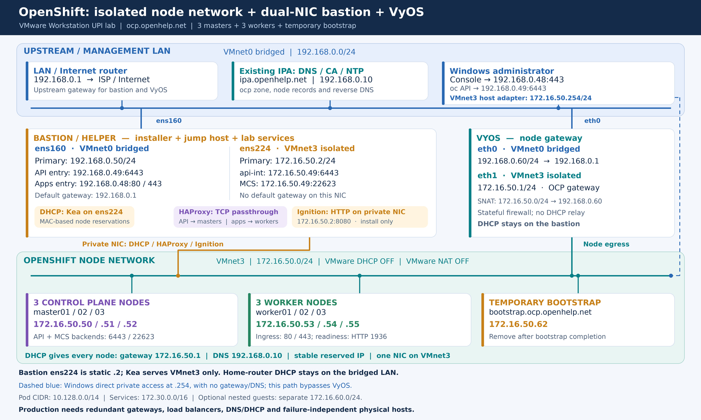
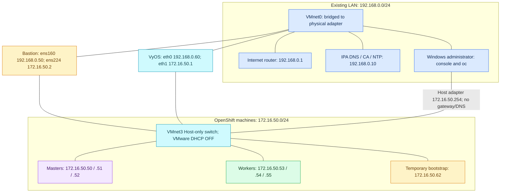
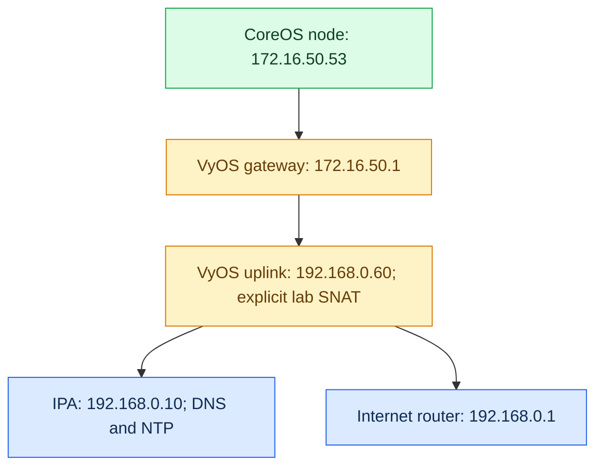
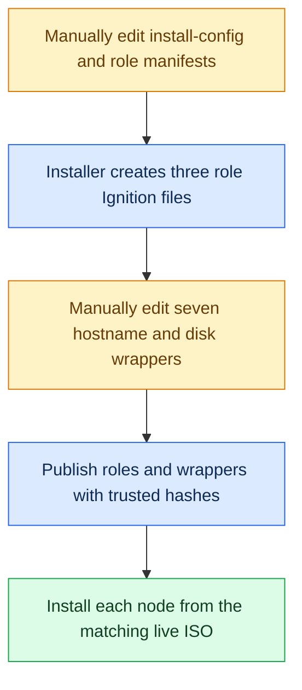
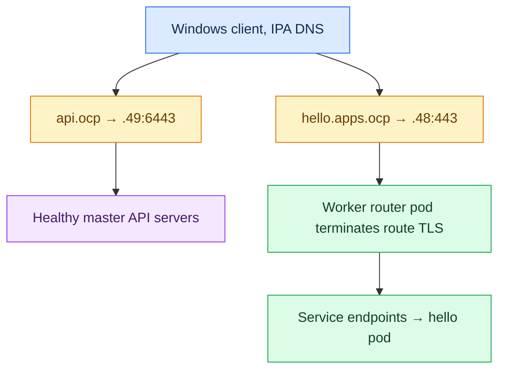
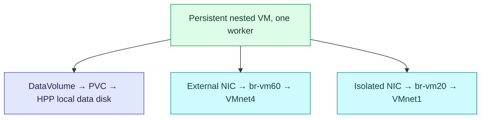

# OpenShift 4.22 on VMware Workstation — complete manual UPI guide with isolated DHCP

**Network revision:** 9 October 2026  
**Cluster:** `ocp.openhelp.net`  
**Machine network:** `172.16.50.0/24` on **VMnet3**, matching your screenshot  
**Bastion:** `ens160` on the existing LAN; **`ens224` on VMnet3**  
**Installation:** matching RHCOS live ISO, persistent DHCP reservations, manual native commands and UPI  
**Permanent cluster:** three masters/control-plane nodes plus three workers  
**Infrastructure:** one bastion/helper, one temporary bootstrap, VyOS, and existing IPA DNS/CA/NTP at `192.168.0.10`  
**Retained:** all 100 main steps, per-host installation, virtualization, separate guest networks, local VM storage, IPA certificates, disconnected installation, recovery and shutdown.

> [!IMPORTANT]
> Use this revision for a **fresh installation with the new machine subnet**. It replaces the old bridged-node design. Existing Ignition/install assets made for `192.168.0.0/24` are not the assets for this new attempt. Preserve the old attempt and any data, then generate fresh files in an unused installation directory.

> [!IMPORTANT]
> **Worker03's MAC is missing from the supplied configuration.** Read the MAC of its VMnet3 NIC in VMware, then replace `REPLACE_WITH_WORKER03_VMNET3_MAC` in Step 18A before validating/starting the completed DHCP configuration. Every supplied bootstrap/master/worker reservation is preserved.

> [!CAUTION]
> RHCOS installation erases the verified OS target. The retained optional HPP example also formats a separate **new empty worker data disk** at first boot. Verify disks and preserve old OpenStack/Ceph data. These are manual instructions, not actions already performed on your VMs.

## Read this first

The laptop is the **Windows VMware host**. The DHCP server runs **inside your Linux bastion VM on that laptop**, listening on `ens224`. Your supplied JSON is **Kea**, with service `kea-dhcp4` and file `/etc/kea/kea-dhcp4.conf`. It is not ISC `dhcpd.conf`. Do not run Windows VMware DHCP, ISC dhcpd, dnsmasq DHCP, or VyOS DHCP on this same segment alongside Kea.

**Roles:** masters, control-plane nodes and the “three compute” machines in your request mean the same **three masters** here. There are three additional worker nodes. The basic lab has eight installation VMs: bastion + temporary bootstrap + three masters + three workers. **VyOS is a separate routing VM**; IPA already exists.

**Bastion primary choice:** use `192.168.0.50/24` on `ens160`, gateway `192.168.0.1`, as in the proposed architecture. Your old helper used `192.168.0.61`. Change it from the VMware console after stopping the old master that owned LAN `.50`. If you deliberately keep the helper at `.61`, substitute `.61` for the **bastion primary/SSH transfer address only**; keep all private node, API, ingress and routing addresses as shown.

**Manual workflow:** enter one native command at a time on the named host. A `nano FILE` command is followed by the file content to paste; save with **Ctrl+O, Enter, Ctrl+X**. There are no custom installation shell/Python programs, functions, command loops or generated environment scripts. This guide retains OpenShift's own installer and Operators.

**Existing services:** IPA DNS/CA/NTP is `192.168.0.10` as supplied. Verify that chrony actually serves time there; the DNS service alone is not proof of NTP. `IPA_LINUX_USER` means your existing Linux SSH account on IPA, not a new user and not necessarily Kerberos `admin`.

**Internet:** the bastion and VyOS use upstream gateway `192.168.0.1`. Nodes use gateway **`172.16.50.1`**, supplied by VyOS. The main lab configuration uses explicit VyOS SNAT to `192.168.0.60`; routed egress without this extra NAT is retained in Appendix B5. ISO installation can be offline while the cluster still requires release images from registries, a proxy or a prepared mirror.

**Release selection:** retain OCP 4.22 from the attached guide, but select an **actually available GA patch** from Red Hat downloads. The previous specific patch pin was not independently verified, so `SELECTED_OCP_VERSION` is a manual placeholder for the patch you select. Use matching client, installer and installer-derived RHCOS metadata. Do not enter placeholder version strings literally.

**What was checked:** the attached guide and VMware screenshot were inspected. The diagram, address mappings, configuration blocks and installation sequence were checked locally against the cited official requirements. Commands have not been executed on your laptop, router, IPA or cluster.

**GitHub:** keep this Markdown and `OPENSHIFT_172_16_50_NETWORK_ARCHITECTURE.jpg` together. The colored Mermaid diagrams also render independently. The attached screenshot remains a reference; it has not been edited.

## Navigation

- [Architecture and IP plan](#architecture-and-ip-plan)
- [Phase 1 — VMware and capacity, Steps 1–13](#phase-1--vmware-and-capacity-steps-113)
- [Phase 2 — helper, FreeIPA and load balancing, Steps 14–29](#phase-2--helper-freeipa-and-load-balancing-steps-1429)
- [Phase 3 — current binaries and installation assets, Steps 30–45](#phase-3--current-binaries-and-installation-assets-steps-3045)
- [Phase 4 — per-host RHCOS installation, Steps 46–63](#phase-4--per-host-rhcos-installation-steps-4663)
- [Phase 5 — bootstrap and installation completion, Steps 64–78](#phase-5--bootstrap-and-installation-completion-steps-6478)
- [Phase 6 — virtualization, networks and storage, Steps 79–95](#phase-6--virtualization-networks-and-storage-steps-7995)
- [Phase 7 — FreeIPA TLS and handover, Steps 96–100](#phase-7--freeipa-tls-and-handover-steps-96100)
- [Appendix A — manual disconnected installation](#appendix-a--manual-disconnected-installation)
- [Appendix B — manual recovery, router checks and maintenance](#appendix-b--manual-recovery-router-checks-and-maintenance)
- [Appendix C — manual shutdown, restart and backup scope](#appendix-c--manual-shutdown-restart-and-backup-scope)
- [Appendix D — sources and document checks](#appendix-d--sources-and-document-checks)
- [Appendix E — optional secondary storage and guest networks](#appendix-e--optional-secondary-storage-and-guest-networks)

## Architecture and IP plan

### Color architecture





### VMware screenshot validation

| Screenshot field | Observed value | Decision for this guide |
|---|---|---|
| VMnet0 | Bridged to Intel Dual Band Wireless adapter | Keep bridged to the actual LAN adapter; confirm that LAN is `192.168.0.0/24` with `ipconfig /all` |
| VMnet1 | Custom; subnet `10.10.20.0`; no host connection/DHCP shown | Retain for an **optional isolated nested-VM network**, not the node DHCP network |
| VMnet2 | Custom; subnet `10.10.30.0`; no host connection/DHCP shown | Retain as optional storage segment; a NIC alone creates no storage |
| VMnet3 | **Host-only; subnet `172.16.50.0`** | Correct private node switch |
| VMnet3 mask | **`255.255.255.0`** | Correct `/24` |
| Connect host virtual adapter | Checked | Keep; manually set Windows VMnet3 to **`172.16.50.254/24`**, gateway/DNS blank |
| Use local DHCP service | **Unchecked** | Correct: Kea is the only DHCP server on VMnet3 |
| VMware NAT | Host-only is selected, not NAT | Correct: VyOS performs routing/egress |

The screenshot does **not** show the Windows VMnet3 adapter's IPv4 address. Verify/change it before starting VyOS: an automatic host address of `172.16.50.1` would conflict with the gateway. The subnet field is a **network ID**, not the IP to assign to a VM. Never assign `172.16.50.0` or `172.16.50.255` to a host in this /24.

### Addresses, reservations and default routes

| Machine | Interface / VMware switch | IP | Default gateway | DHCP or static |
|---|---|---|---|---|
| Bastion primary | `ens160` / VMnet0 | `192.168.0.50/24` | `192.168.0.1` | Static |
| Bastion private | **`ens224` / VMnet3** | **`172.16.50.2/24`** | **None** | Static |
| VyOS upstream | `eth0` / VMnet0 | `192.168.0.60/24` | `192.168.0.1` | Static |
| VyOS inside | `eth1` / VMnet3 | `172.16.50.1/24` | None on this interface | Static |
| Bootstrap | Verified node NIC / VMnet3 | `172.16.50.62/24` | `172.16.50.1` | Reserved by MAC |
| Master01 | Verified node NIC / VMnet3 | `172.16.50.50/24` | `172.16.50.1` | `00:50:56:38:15:01` |
| Master02 | Verified node NIC / VMnet3 | `172.16.50.51/24` | `172.16.50.1` | `00:50:56:35:f8:e7` |
| Master03 | Verified node NIC / VMnet3 | `172.16.50.52/24` | `172.16.50.1` | `00:50:56:2e:3f:53` |
| Worker01 | Verified node NIC / VMnet3 | `172.16.50.53/24` | `172.16.50.1` | `00:50:56:36:09:EC` |
| Worker02 | Verified node NIC / VMnet3 | `172.16.50.54/24` | `172.16.50.1` | `00:50:56:20:25:48` |
| Worker03 | Verified node NIC / VMnet3 | `172.16.50.55/24` | `172.16.50.1` | **Actual MAC required** |
| Windows VMnet3 | Windows host adapter | `172.16.50.254/24` | None | Static |

Bootstrap's supplied MAC is `00:0c:29:33:60:60`. Keep the existing node MAC when changing its adapter's VMnet. If VMware generated a new MAC, update that node's reservation to its **observed** value before installation.

Every node receives DNS **`192.168.0.10`** through DHCP. Gateway and DNS are different settings. Do not advertise either `192.168.0.1` or `172.16.50.1` as the DNS server.

| Endpoint / logical network | Address | Owner / purpose |
|---|---|---|
| `api.ocp.openhelp.net` | `192.168.0.49:6443` | Bastion additional address on `ens160`, external API |
| `api-int.ocp.openhelp.net` | **`172.16.50.49:6443/22623`** | Bastion additional address on **`ens224`**, internal API/MCS |
| `*.apps.ocp.openhelp.net` | `192.168.0.48:80/443` | Bastion additional address on `ens160`, ingress |
| Ignition HTTP | **`http://172.16.50.2:8080/`** | Private bastion interface |
| DNS / NTP | `192.168.0.10` | Existing IPA services |
| Machine network | **`172.16.50.0/24`** | CoreOS addresses and OVN underlay |
| Pod network | `10.128.0.0/14`, host prefix `23` | OVN-Kubernetes |
| Service network | `172.30.0.0/16` | Kubernetes |
| Optional isolated VM guests | `10.10.20.0/24` on VMnet1 | Secondary Linux bridge |
| Optional storage | `10.10.30.0/24` on VMnet2 | Reserved external storage access |
| Optional external VM guests | **`172.16.60.0/24` on a new VMnet4** | Separate guest bridge; optional VyOS `eth2 = 172.16.60.1` |

The API/ingress IPs are additional addresses owned by the single helper, not HA floating VIPs. The private machine network is no longer also used as the secondary guest network. The old VMnet numbering has been corrected to your actual screenshot.

### Why this stops the earlier DHCP competition

The home router's DHCP serves the physical/bridged LAN. Nodes are attached **only to VMnet3**, a different Ethernet broadcast segment. VyOS **routes** between the networks; its NICs are not joined in a Linux bridge, and no DHCP relay is enabled. Kea listens only on `ens224`. VMware DHCP and VyOS DHCP remain disabled on VMnet3.

These settings isolate the node DHCP exchange. Kea will supply the private reservation and IPA DNS. If a node still receives router DNS, inspect its actual VMnet attachment, old static/keyfile settings, any extra bridged NIC, and other DHCP services on VMnet3. An old lease or connection profile is not repaired by moving the bastion alone.

### Routed egress and load balancing have separate jobs



Node DNS/NTP/image-pull traffic leaves through VyOS. LAN destinations see source `192.168.0.60` under the lab SNAT rule and can return it without a new private-subnet route. The Internet edge still performs its own normal egress translation.

A LAN browser reaches `192.168.0.48` directly; HAProxy opens a new backend connection from the private bastion NIC to an active worker ingress router. `oc` uses external API `192.168.0.49`. Internal node bootstrap uses `172.16.50.49`. The bastion is **not** the nodes' IP router. Do not add a private default gateway to `ens224` or helper IP forwarding/masquerade.

Windows also has a direct local VMnet3 path through its host adapter `.254`. That connection bypasses VyOS and is useful for node SSH, not proof of routed Internet access. In production, use a dedicated node VLAN, redundant gateways, dedicated HA load balancers, redundant DNS/DHCP and separate physical failure domains. Central DHCP can serve that VLAN through a relay; DHCP need not physically run inside the VLAN.

### Where commands run

| Label | Location |
|---|---|
| **Windows** | VMware Workstation, PowerShell, Windows adapter settings or browser |
| **Helper / bastion** | Existing RHEL with Kea; examples use `cloudadmin` with sudo |
| **IPA** | Existing `ipa.openhelp.net` at `192.168.0.10`, authorized `kinit admin` session |
| **VyOS** | Router console; current examples use VyOS 1.4/1.5-style syntax |
| **RHCOS live console** | Specific VM booted from the verified matching ISO |
| **Installed node** | `core` account, using installation SSH key |
| **Cluster admin** | Helper with this cluster's protected kubeconfig after Step 69 |

### Required connectivity for this topology

| Source → destination | Ports/protocol | Path |
|---|---|---|
| RHCOS DHCP client ↔ bastion `ens224` | UDP `68↔67` | VMnet3 broadcasts; never routed or relayed |
| Nodes → IPA `192.168.0.10` | DNS TCP/UDP `53`; NTP UDP `123` | VyOS `eth1→eth0`; source translated to `192.168.0.60` |
| Live/first-boot nodes → bastion `172.16.50.2` | HTTP TCP `8080` | Direct VMnet3, temporary |
| Nodes → `api-int` private listener | TCP `6443` / `22623` | Direct to `172.16.50.49`; HAProxy → bootstrap/masters |
| LAN administrators → external API | TCP `6443` | `192.168.0.49` → private masters |
| Clients → application ingress | TCP `80` / `443` | `192.168.0.48` → worker router backends |
| Bastion → ingress-ready workers | HTTP TCP `1936`, path `/healthz/ready` | Direct VMnet3 health check |
| Masters ↔ masters | TCP `2379–2380` | Private control-plane/etcd traffic |
| Nodes ↔ nodes | OVN Geneve UDP `6081`; kubelet TCP `10250` and release-required component ports | Direct VMnet3; no VyOS hop |
| Nodes → required registries/services | HTTPS TCP `443`; other explicitly required mirror/proxy ports | VyOS egress or configured mirror |
| Administrator → nodes | TCP `22` | Bastion or Windows VMnet3 adapter |

This is the topology's key-flow summary, **not a complete restrictive node firewall allowlist**. In this lab keep the private switch free of added node-to-node ACLs and keep OpenShift's supported host networking. If hardening a production VLAN, use the full [4.22 network flow matrix and registry allowlists](https://docs.redhat.com/en/documentation/openshift_container_platform/4.22/html/installation_configuration/configuring-firewall); additional core/Operator flows are required. Do not treat these few installation ports as the complete inter-node requirements or expose internal ports to the LAN.

## Phase 1 — VMware and capacity, Steps 1–13

### Step 1 — protect the existing lab and confirm the six roles

**Windows.** Keep the old OpenStack VMs stopped if reusing their IPs. Create six **new empty** VMs named `master01`, `master02`, `master03`, `worker01`, `worker02`, `worker03`. Keep FreeIPA running. A separate helper and bootstrap are required for this manual UPI path.

Success: there are six intended cluster VMs, a helper, a bootstrap, and no duplicate running machines on the planned addresses. Never install RHCOS over a Ceph OSD or the Windows disk.

### Step 2 — choose a valid connectivity path

| Situation | Procedure |
|---|---|
| Nodes reach Red Hat/Quay over HTTPS | Main steps directly |
| Nodes only reach the Internet through an approved HTTP(S) proxy | Add `proxy` and its CA in Step 37; validate access through it |
| Nodes have no registry access, including no proxy | Complete Appendix A and apply the mirror configuration before creating Ignition |

RHCOS can be installed from local media, but bootstrap still needs its release images. Test this before starting the certificate clock. Operators and guest images also need registry access or mirroring.

### Step 3 — select one real GA patch and use matching tools

Use [Red Hat OpenShift downloads](https://console.redhat.com/openshift/downloads) and [OCP 4.22 release notes](https://docs.redhat.com/en/documentation/openshift_container_platform/4.22/html/release_notes/ocp-4-22-release-notes) to choose an available GA **4.22 patch**. Record its exact number in the worksheet. `SELECTED_OCP_VERSION` in this guide means that actual number; it is a text placeholder, not a shell variable.

The old guide's specific patch was not independently verified. Do not copy an unverified patch URL or choose nightly/release-candidate/OKD assets for this OCP procedure. Match the installer and client to the selected release; derive the RHCOS ISO from that installer's metadata.

### Step 4 — reserve enough CPU, RAM and disk

| VM | vCPU | RAM | OS disk | Extra storage |
|---|---:|---:|---:|---|
| Each of three control-plane nodes | 4 | 16 GB | 120 GB | None |
| Each of three workers, base OpenShift | 2 minimum; 4–6 preferred | 8 GB minimum; 12–16 GB for virtualization | 120 GB | New 120 GB data disk for the HPP example |
| Bootstrap, temporary | 4 | 16 GB | 120 GB | None |
| Helper | 2 | 4 GB | 60 GB | More space if hosting downloads |
| Existing FreeIPA | Its existing allocation | Its existing allocation | Existing disk | Keep independent |
| Existing VyOS, retained | Its existing allocation | Its existing allocation | Existing disk | Keep independent |

The documented base node minima total **88 GB including bootstrap**: 48 GB control plane + 24 GB workers + 16 GB bootstrap. Add helper, FreeIPA, Windows and any VyOS allocation. A 128 GB laptop is a practical starting point; a virtualization lab with 16 GB workers needs more headroom. With a 64 GB laptop, this exact seven-RHCOS-machine bootstrap cannot meet documented minimum RAM simultaneously. Do not silently reduce masters/bootstrap to 8 GB.

Use SSD/NVMe. Keep enough actual free disk for image extraction, VM writes and snapshots; thin provisioning does not create physical capacity. Avoid sustained Windows swapping or slow snapshot chains during etcd/bootstrap.

### Step 5 — enable hardware and nested virtualization

**Windows/firmware.** Enable Intel VT-x/VT-d or AMD-V/SVM in BIOS/UEFI. Restart Windows. With each worker powered off, open **VM Settings → Processors → Virtualization engine** and select **Virtualize Intel VT-x/EPT or AMD-V/RVI**. Expose the feature to every worker. Control-plane nodes do not need nested virtualization to run containers, but consistent CPU capabilities are useful.

If Workstation reports that nested virtualization is unavailable, resolve the host/Hyper-V/VBS conflict using the installed Workstation version's official guidance before continuing with virtualization. Disabling Windows security features is not a routine installation step. Validate the resulting `/dev/kvm` in Step 79.

Success: workers can start with the virtualization checkbox enabled. RHCOS 4.22 requires an x86-64-v2-capable CPU; confirm the exact laptop CPU rather than its marketing name.

### Step 6 — use the VMnet settings shown in your screenshot

**Windows → Edit → Virtual Network Editor → Change Settings.**

| VMnet | Mode | Subnet and mask | VMware DHCP | Host adapter |
|---|---|---|---|---|
| VMnet0 | Bridged to actual physical LAN NIC | Existing `192.168.0.0/24` LAN | Home LAN DHCP stays on the LAN | Physical Windows NIC |
| VMnet1 | Private/custom, no external bridge | `10.10.20.0 / 255.255.255.0` | Off | Optional; no gateway/DNS |
| VMnet2 | Private/custom, no external bridge | `10.10.30.0 / 255.255.255.0` | Off | Optional; no gateway/DNS |
| **VMnet3** | **Host-only** | **`172.16.50.0 / 255.255.255.0`** | **Off** | **On; configure `.254` in Step 7** |
| VMnet4, optional later | Host-only/private | `172.16.60.0 / 255.255.255.0` | Off | Optional `.254`, no gateway/DNS |

VMnet3's visible subnet, mask and unchecked DHCP box are correct. Keep **Host-only**, not VMware NAT. Set each node adapter to **Custom: Specific virtual network → VMnet3**; the generic “Host-only” choice can select VMnet1.

The screenshot's VMnet1 and VMnet2 entries show Custom and no external connection. They are optional secondary segments; verify they are private before using them for guests/storage. The base install needs only VMnet0 and VMnet3.

The bridge currently targets Intel Wi-Fi. If Wi-Fi rejects the extra VM MACs on the upstream side, use a working wired bridge or correct Workstation bridging. Do not troubleshoot node DHCP by adding a bridged node NIC.

### Step 7 — explicitly configure Windows VMnet3 without an IP conflict

**Windows UI.** Open `ncpa.cpl` → **VMware Network Adapter VMnet3 → Properties → IPv4**.

| Field | Value |
|---|---|
| IP address | **`172.16.50.254`** |
| Subnet mask | **`255.255.255.0`** |
| Default gateway | **Blank** |
| Preferred/alternate DNS | **Blank** |

VyOS owns `172.16.50.1`. Do not leave the host adapter on `.1`. The bastion uses `.2`. The physical Windows adapter keeps its existing gateway `192.168.0.1` and its intended DNS/NRPT policy.

```powershell
ipconfig /all
Get-NetIPConfiguration
Get-NetRoute -AddressFamily IPv4
```

Expected: VMnet3 has `172.16.50.254/24` and no default route/DNS. The screenshot confirms “Connected”, but does not prove this host adapter IP. Verify it manually.

### Step 8 — configure the bastion and temporary bootstrap VMs

**Windows.** Reuse your existing helper with Kea if suitable. Give it **two adapters**:

1. Primary → **Custom: VMnet0**, observed `ens160`, static `192.168.0.50/24`.
2. Secondary → **Custom: VMnet3**, observed **`ens224`**, static `172.16.50.2/24`.

A new helper can use RHEL 10 with its entitled repositories; your existing working Kea helper does not need reinstalling. RHEL entitlement for the helper is separate from the OpenShift evaluation. It is mutable Linux, not RHCOS.

Bootstrap has **one NIC on VMnet3**, its supplied MAC `00:0c:29:33:60:60`, 4 vCPU, 16 GB RAM and an empty 120 GB OS disk. Keep it uninstalled until the RHCOS ISO is ready.

Use consistent firmware, for example UEFI, and disconnect the live ISO after disk installation. Create/reuse a **separate VyOS VM**, with its first NIC on VMnet0 and second on VMnet3. IPA remains on the existing LAN.

### Step 9 — attach all three control-plane VMs to VMnet3

**Windows.** Each master receives one node NIC on **Custom: VMnet3** and its empty OS disk.

| VM | Node NIC MAC | DHCP reservation |
|---|---|---|
| master01 | `00:50:56:38:15:01` | `172.16.50.50` |
| master02 | `00:50:56:35:f8:e7` | `172.16.50.51` |
| master03 | `00:50:56:2e:3f:53` | `172.16.50.52` |

For existing empty VMs, change the node adapter's VMnet rather than adding an extra bridged adapter. Preserve and verify its MAC. Remove/disconnect unintended node NICs attached to VMnet0/NAT networks for the base install.

Masters use RHCOS and CRI-O. Do not install CentOS, kubeadm, Docker or Kolla on them. Optional isolated storage NICs from the old guide are retained in Appendix E; they are not prerequisites for this installation.

### Step 10 — attach the three worker VMs and identify their disks

**Windows.** Each worker gets its **node NIC on VMnet3**. Keep the supplied MACs:

| Worker | MAC | Reserved IP |
|---|---|---|
| worker01 | `00:50:56:36:09:EC` | `172.16.50.53` |
| worker02 | `00:50:56:20:25:48` | `172.16.50.54` |
| worker03 | Read actual VMnet3 NIC MAC | `172.16.50.55` |

Set **Connected** and **Connect at power on**. Enable nested virtualization if doing Phase 6.

For the retained HPP VM-storage example, add two **new empty** disks per worker: 120 GB OS plus 120 GB data. The JSON in Step 43 formats the data disk. If installing only containers, use the hostname-only worker variant explained in Step 43 and skip the HPP/VM examples.

Base cluster networking needs one worker NIC. Optional extra guest/storage NICs are mapped in Appendix E and are configured only for those features; they must not introduce another node DHCP/default route.

### Step 11 — verify actual MACs and NIC names before configuring DHCP

**Windows.** In each VM's **Settings → Network Adapter → Advanced**, record the node NIC MAC and confirm **Custom: VMnet3**. Do not generate a new MAC merely to move subnets.

On the matching RHCOS live console later:

```bash
ip -br link
nmcli -f GENERAL.DEVICE,GENERAL.HWADDR,GENERAL.CONNECTION device show
```

The node NIC name is not supplied by the screenshot and can be `ens160`, `ens33` or another name. **`NODE_NIC` in Steps 49–55 means the actual VMnet3 node NIC you observe**; replace it before entering the command. The bastion's names **`ens160` and `ens224` are fixed by your request** and do not establish node names.

Record worker03's actual MAC now, and fill its marked DHCP entry in Step 18A. With `pools: []`, an unreserved worker receives no address. Optional secondary interfaces in Phase 6 must be identified independently by MAC.

### Step 12 — record the OS disk and the separate VM-data disk

After downloading the matching ISO in Steps 34–36, boot each live console and inspect:

```bash
lsblk -e7 -o NAME,SIZE,TYPE,FSTYPE,MOUNTPOINTS,MODEL,SERIAL
sudo wipefs -n /dev/sdb
```

For the new VM layout, this guide uses `/dev/sda` for the **empty OS disk** and `/dev/sdb` for each worker's **separate empty data disk**. Verify those identities on each machine. Your previous OpenStack VMs had different disk orders; those old assumptions do not apply here.

Record the actual devices in your worksheet. Step 43's worker JSON formats the device written in its `storage.disks` entry at first boot. A different actual device requires a manual change to that worker's JSON before installation. `wipefs -n` only inspects signatures; it does not erase anything.

### Step 13 — reserve the upstream addresses and check private addresses

On your LAN router, exclude **`192.168.0.48`, `.49`, `.50` and `.60`** from dynamic allocation. `.60` remains VyOS. The old LAN masters/workers/bootstrap will no longer own `192.168.0.50–55/62`.

Check unused LAN endpoints from the bastion **before assigning them**, and consult the inventory/lease table:

```bash
sudo arping -D -I ens160 -c 3 192.168.0.48
sudo arping -D -I ens160 -c 3 192.168.0.49
sudo arping -D -I ens160 -c 3 192.168.0.50
```

Do not probe the bastion's already-active address as if it were unused. Retire its previous owner before taking `.50`. A powered-off device may not answer ARP.

On VMnet3, reserve infrastructure **`172.16.50.1` (VyOS), `.2` (bastion), `.49` (api-int), `.254` (Windows)**. The only DHCP assignments are the listed node reservations; no dynamic pool is configured. Keep all addresses unique.

## Phase 2 — helper, FreeIPA and load balancing, Steps 14–29

### Step 14 — reuse the existing Kea helper or install the helper OS

**Bastion VMware console.** If your existing helper is installed and already runs Kea, retain it. Check:

```bash
cat /etc/os-release
rpm -q kea
systemctl status kea-dhcp4 --no-pager
sudo -v
```

For a new helper, install RHEL 10 x86_64, create `cloudadmin` with sudo, and enable your authorized repositories/subscription or local package mirror. Allocate 2 vCPU, 4 GB RAM and at least 60 GB disk, with the two NICs from Step 8.

Use **Kea `kea-dhcp4`** for the supplied JSON. RHEL 10's documented package is `kea`. Do not put that JSON into ISC `dhcpd.conf` or attempt to start an unrelated `dhcpd` service.

### Step 15 — configure ens160 and ens224, with one default route

**Bastion VMware console** — network changes can disconnect SSH.

```bash
sudo hostnamectl set-hostname helper.ocp.openhelp.net
ip -br link
nmcli connection show
sudo nmtui
```

In **Edit a connection**, edit the actual existing profiles instead of duplicating them:

| Setting | Primary profile `ocp-helper` | Private profile `ocp-private` |
|---|---|---|
| Device | **`ens160`** / VMnet0 | **`ens224`** / VMnet3 |
| IPv4 method | Manual | Manual |
| Primary address | **`192.168.0.50/24`** | **`172.16.50.2/24`** |
| Default gateway | **`192.168.0.1`** | **Blank** |
| DNS | **`192.168.0.10`** | **Blank** |
| Search domains | `ocp.openhelp.net, openhelp.net` | Blank |
| IPv6 | Disabled for this IPv4 lab | Disabled |
| Automatically connect | Enabled | Enabled |

Save, activate both profiles, exit nmtui, and explicitly prevent a private default route:

```bash
sudo nmcli connection modify ocp-helper ipv4.ignore-auto-dns yes
sudo nmcli connection modify ocp-private ipv4.never-default yes ipv4.ignore-auto-dns yes
sudo nmcli connection up ocp-helper
sudo nmcli connection up ocp-private
ip -4 -br address
ip -4 route
getent hosts ipa.openhelp.net
sysctl net.ipv4.ip_forward
```

Expected:

```text
ens160  192.168.0.50/24
ens224  172.16.50.2/24
default via 192.168.0.1 dev ens160
192.168.0.0/24 dev ens160
172.16.50.0/24 dev ens224
net.ipv4.ip_forward = 0
```

The bastion is not the node gateway. Keep forwarding off for this dedicated helper; VyOS does the routing. If retaining the old primary `.61`, substitute that primary address consistently without changing `ens224` or node DHCP.

### Step 16 — install utilities and keep a persistent terminal

**Helper, cloudadmin.** Use authorized repositories or your local mirror. On a new RHEL 10 helper, install Kea if absent:

```bash
sudo dnf install -y kea
sudo dnf install -y haproxy nginx chrony bind-utils curl tar openssl nano tmux iputils tcpdump policycoreutils-python-utils firewalld
sudo systemctl enable --now chronyd firewalld
mkdir -p /home/cloudadmin/ocp-lab/downloads
mkdir -p /home/cloudadmin/ocp-lab/cluster
mkdir -p /home/cloudadmin/ocp-lab/certs
mkdir -p /home/cloudadmin/ocp-lab/backups
mkdir -p /home/cloudadmin/ocp-lab/day2
mkdir -p /home/cloudadmin/ocp-lab/logs
chmod 700 /home/cloudadmin/ocp-lab /home/cloudadmin/ocp-lab/cluster /home/cloudadmin/ocp-lab/certs
tmux new -s ocp-install
```

For an existing non-RHEL-10 helper with working Kea, retain its installed package; use repositories appropriate to its actual OS instead of changing its distribution. Kea must be configured before it serves the new segment.

`policycoreutils-python-utils` supplies the native `semanage` command; it does not require writing Python code. **Ctrl+B, D** detaches tmux; `tmux attach -t ocp-install` reconnects.

### Step 17 — record the complete installation worksheet

```bash
nano /home/cloudadmin/ocp-lab/lab-notes.txt
```

```text
Cluster: ocp.openhelp.net
Selected real GA OCP patch: RECORD_EXACT_VERSION
IPA DNS / CA / verified NTP: 192.168.0.10
Bastion primary: ens160, 192.168.0.50/24, gateway 192.168.0.1
Bastion private: ens224, 172.16.50.2/24, no default gateway
External API: 192.168.0.49:6443
Internal API/MCS: 172.16.50.49:6443/22623
Ingress: 192.168.0.48:80/443
Ignition HTTP: 172.16.50.2:8080
VyOS: eth0 192.168.0.60; eth1 172.16.50.1; default via 192.168.0.1
Private VMware switch: VMnet3, 172.16.50.0/24, VMware DHCP OFF
Windows VMnet3: 172.16.50.254/24, no gateway/DNS
Bootstrap: 172.16.50.62
Masters: 172.16.50.50 / .51 / .52
Workers: 172.16.50.53 / .54 / .55
Worker03 actual VMnet3 MAC: RECORD_BEFORE_STARTING_KEA
Node NIC names / OS and data disks: RECORD_PER_HOST
Payload path: direct via VyOS / approved proxy / prepared mirror
Optional guest subnet: VMnet4, 172.16.60.0/24
```

Keep secrets and private keys out of the worksheet. It is a text reference, not an executable environment file.

### Step 18 — verify IPA DNS and use the existing IPA time service

**Helper.**

```bash
dig @192.168.0.10 ipa.openhelp.net A +short
timedatectl
chronyc sources -v
chronyc tracking
sudo cp -a /etc/chrony.conf /etc/chrony.conf.before-ocp
sudo nano /etc/chrony.conf
```

Configure the helper as an NTP client of your **verified** IPA time service. Retain the installed drift/makestep/rtcsync/log settings; remove/comment unreachable pool/server lines and use:

```ini
server 192.168.0.10 iburst
```

```bash
sudo systemctl restart chronyd
chronyc sources -v
chronyc tracking
```

Expected: a selected source at `192.168.0.10` and `Leap status: Normal`. The helper need not run an additional NTP server for the nodes. The master/worker MachineConfigs and bootstrap wrapper in Steps 41/43 use IPA directly.

**On IPA, verify time serving and firewall**:

```bash
chronyc tracking
sudo systemctl status chronyd --no-pager
sudo ss -lunp
sudo firewall-cmd --list-all
```

If IPA chrony is not serving clients, add `allow 192.168.0.0/24` to its chrony configuration **only if appropriate for this existing lab service**, ensure it is synchronized, and permit NTP in its active LAN firewall zone. Under lab SNAT, node requests arrive from `192.168.0.60`. In the fully routed alternative, authorize `172.16.50.0/24` too.

Do not generate installation assets until both DNS and a real reachable time source are ready.

### Step 18A — migrate the complete supplied Kea configuration to ens224

**Helper console.** Back up the configuration and old leases before changing subnets. Do not edit a live lease CSV:

```bash
sudo systemctl stop kea-dhcp4
sudo cp -a /etc/kea/kea-dhcp4.conf /home/cloudadmin/ocp-lab/backups/kea-dhcp4-before-172.conf
sudo cp -a /var/lib/kea /home/cloudadmin/ocp-lab/backups/kea-leases-before-172
sudo nano /etc/kea/kea-dhcp4.conf
```

Paste this complete configuration. **Replace worker03's marked MAC before saving the final configuration.** All six supplied reservation entries are retained; worker03 is added.

```json
{
  "Dhcp4": {
    "interfaces-config": {
      "interfaces": [
        "ens224"
      ]
    },
    "authoritative": true,
    "valid-lifetime": 14400,
    "min-valid-lifetime": 14400,
    "max-valid-lifetime": 14400,
    "host-reservation-identifiers": [
      "hw-address"
    ],
    "match-client-id": false,
    "ddns-send-updates": false,
    "lease-database": {
      "type": "memfile",
      "persist": true,
      "name": "/var/lib/kea/kea-leases4-ocp172.csv"
    },
    "subnet4": [
      {
        "id": 1,
        "subnet": "172.16.50.0/24",
        "interface": "ens224",
        "pools": [],
        "reservations-in-subnet": true,
        "reservations-out-of-pool": true,
        "option-data": [
          {
            "name": "routers",
            "data": "172.16.50.1"
          },
          {
            "name": "subnet-mask",
            "data": "255.255.255.0"
          },
          {
            "name": "domain-name",
            "data": "ocp.openhelp.net"
          },
          {
            "name": "domain-search",
            "data": "ocp.openhelp.net, openhelp.net"
          },
          {
            "name": "domain-name-servers",
            "data": "192.168.0.10",
            "always-send": true
          },
          {
            "name": "ntp-servers",
            "data": "192.168.0.10"
          }
        ],
        "reservations": [
          {
            "hostname": "bootstrap.ocp.openhelp.net",
            "hw-address": "00:0c:29:33:60:60",
            "ip-address": "172.16.50.62"
          },
          {
            "hostname": "master01.ocp.openhelp.net",
            "hw-address": "00:50:56:38:15:01",
            "ip-address": "172.16.50.50"
          },
          {
            "hostname": "master02.ocp.openhelp.net",
            "hw-address": "00:50:56:35:f8:e7",
            "ip-address": "172.16.50.51"
          },
          {
            "hostname": "master03.ocp.openhelp.net",
            "hw-address": "00:50:56:2e:3f:53",
            "ip-address": "172.16.50.52"
          },
          {
            "hostname": "worker01.ocp.openhelp.net",
            "hw-address": "00:50:56:36:09:EC",
            "ip-address": "172.16.50.53"
          },
          {
            "hostname": "worker02.ocp.openhelp.net",
            "hw-address": "00:50:56:20:25:48",
            "ip-address": "172.16.50.54"
          },
          {
            "hostname": "worker03.ocp.openhelp.net",
            "hw-address": "REPLACE_WITH_WORKER03_VMNET3_MAC",
            "ip-address": "172.16.50.55"
          }
        ]
      }
    ]
  }
}
```

Changes from your supplied configuration:

| Field | Old | Updated |
|---|---|---|
| Listen/subnet interface | `ens160` | **`ens224` only** |
| Subnet | `192.168.0.0/24` | **`172.16.50.0/24`** |
| Router option | `192.168.0.1` | **`172.16.50.1`**, VyOS |
| Node addresses | `192.168.0.x` | **`172.16.50.x`**, same last octets |
| Authoritative | `false` | **`true`**, dedicated private segment with one intended DHCP server |
| Lease filename | `kea-leases4.csv` | `kea-leases4-ocp172.csv`; separate new-subnet state, old files retained |
| DNS and NTP | `192.168.0.10` | Preserved |
| Lifetime, MAC matching, domain/search, reservations and empty pools | Your settings | Preserved |

The JSON has one subnet and no dynamic pools. Kea allocates only its known reservations. `always-send` ensures the DNS option is sent by this server; it does not make a competing DHCP server harmless. Ethernet separation and single-server ownership solve that competition.

Check the MAC entries against VMware. **A MAC placeholder is not a valid operational Kea MAC**. Fill it before running the following validation; the guide does not claim this template can start unchanged.

Configure a dedicated private firewall zone before starting DHCP. Create the zone only if absent:

```bash
sudo firewall-cmd --permanent --get-zones
sudo firewall-cmd --permanent --new-zone=ocp-private
sudo firewall-cmd --reload
sudo nmcli connection modify ocp-private connection.zone ocp-private
sudo nmcli connection up ocp-private
sudo firewall-cmd --permanent --zone=ocp-private --add-service=dhcp
sudo firewall-cmd --permanent --zone=ocp-private --add-service=ssh
sudo firewall-cmd --reload
sudo firewall-cmd --get-active-zones
sudo restorecon -RF /etc/kea /var/lib/kea
sudo kea-dhcp4 -t /etc/kea/kea-dhcp4.conf
```

If the zone already exists, skip the `--new-zone` command and inspect/reuse it. Expected: `ens224` in `ocp-private` and Kea's configuration check succeeds **after** every real MAC is present.

Then:

```bash
sudo systemctl enable --now kea-dhcp4
sudo systemctl status kea-dhcp4 --no-pager
sudo journalctl -u kea-dhcp4 --no-pager -n 60
```

Expected: active/running with the private interface and new subnet. Keep this service running across node restarts; DHCP lease renewal remains necessary after installation. Do not start a second `dhcpd` service.

### Step 18B — configure VyOS as the private node gateway

**VMware:** VyOS `eth0` → VMnet0; `eth1` → VMnet3. These are Ethernet interfaces used for **routing**, not a bridge. Do not configure a DHCP server or relay on VyOS for VMnet3.

**If VyOS is not installed yet:** download the release ISO available under your VyOS entitlement from the [official downloads](https://vyos.io/get) and use its matching documentation. The commands below are verified against 1.4; later releases need their corresponding CLI checks. For a small Workstation lab, allocate a dedicated VM with 2 vCPU, 2 GB RAM and a new 16 GB disk, two Ethernet adapters mapped as above, and the ISO connected. These are lab allocations; size actual routing throughput separately.

Boot the live ISO, log in at the console with its documented live credentials (`vyos` / `vyos`), then:

```text
install image
```

Follow the native installer prompts, verify/select only the new VyOS disk, set a real administrator password, install the bootloader and complete the image installation. Disconnect the ISO in VMware and reboot from the installed disk. Verify `show version` reports an installed image before configuring persistent routing. Do not reinstall an existing working VyOS just to change its private interface. [VyOS installation procedure](https://docs.vyos.io/en/1.4/installation/install.html).

**VyOS console:**

```text
show version
show interfaces
show configuration commands
show ip route
configure
save /config/config.boot.before-ocp172
exit
```

On the dedicated lab router, use the following addresses/default route. Inspect and remove only an explicitly verified obsolete address/route if one conflicts; setting a new address does not delete an old one.

```text
configure
set interfaces ethernet eth0 description 'UPSTREAM-LAN'
set interfaces ethernet eth0 address '192.168.0.60/24'
set interfaces ethernet eth1 description 'OPENSHIFT-VMNET3'
set interfaces ethernet eth1 address '172.16.50.1/24'
set protocols static route 0.0.0.0/0 next-hop '192.168.0.1'
set system name-server '192.168.0.10'
commit-confirm 10
```

Test the addresses/default route from a second console during the rollback window, then:

```text
confirm
save
exit
```

For this home lab, provide **explicit SNAT** from the private subnet to the fixed VyOS LAN address. Inspect existing rules first. Reuse an already-correct rule; add number **120 only if it is free** and no earlier matching rule takes precedence.

```text
configure
set nat source rule 120 description 'OpenShift VMnet3 egress'
set nat source rule 120 outbound-interface name 'eth0'
set nat source rule 120 source address '172.16.50.0/24'
set nat source rule 120 translation address '192.168.0.60'
commit-confirm 10
```

Test from a VMnet3 live node as soon as available. Confirm/save after success; if no node is ready, verify the router now and perform the node egress acceptance in Step 56 before installation.

```text
confirm
save
exit
```

This is still NAT even though the translation is explicit and does not use the `masquerade` keyword. It avoids requiring a home-router route for return traffic from IPA/registries. Appendix B5 retains the fully routed alternative.

**Firewall, fresh dedicated VyOS 1.4 lab example.** If this VyOS also serves other labs, reconcile these with its existing policy rather than replacing that shared router's defaults blindly. Stateful replies are allowed; new outbound lab-node traffic is allowed, new unapproved inbound forwarding is blocked.

```text
configure
set firewall global-options state-policy established action 'accept'
set firewall global-options state-policy related action 'accept'
set firewall global-options state-policy invalid action 'drop'
set firewall ipv4 forward filter default-action 'drop'
set firewall ipv4 forward filter rule 100 action 'accept'
set firewall ipv4 forward filter rule 100 inbound-interface name 'eth1'
set firewall ipv4 forward filter rule 100 outbound-interface name 'eth0'
set firewall ipv4 forward filter rule 100 source address '172.16.50.0/24'
set firewall ipv4 input filter default-action 'drop'
set firewall ipv4 input filter rule 20 action 'accept'
set firewall ipv4 input filter rule 20 source address '192.168.0.0/24'
set firewall ipv4 input filter rule 20 protocol 'tcp'
set firewall ipv4 input filter rule 20 destination port '22'
set firewall ipv4 input filter rule 30 action 'accept'
set firewall ipv4 input filter rule 30 protocol 'icmp'
set firewall ipv4 input filter rule 30 icmp type-name 'echo-request'
set service ssh listen-address '192.168.0.60'
commit-confirm 10
```

Verify router management and permitted node egress, then `confirm`, `save`, `exit`. This lab rule allows node-originated egress broadly. A production policy should restrict destinations/ports according to its registry/proxy/application requirements.

`set system name-server` controls VyOS's own resolver. It does **not** supply node DNS: Kea's `domain-name-servers` option does that.

### Step 18C — prove that only the intended private DHCP server answers

Before installing any node, boot one matching RHCOS live ISO with its NIC on **VMnet3**. On the helper:

```bash
sudo tcpdump -nn -e -vvv -i ens224 'udp port 67 or udp port 68'
```

Reboot/renew the live node's DHCP connection. The expected exchange offers that node's reserved `172.16.50.x` address with:

```text
DHCP server: 172.16.50.2
Router option: 172.16.50.1
Domain name server option: 192.168.0.10
Subnet mask: 255.255.255.0
```

If no offer appears, check the actual MAC reservation, service log, firewall and VMnet3 attachment. If a home-router offer appears, check for an unintended bridged node NIC or bridge/relay between VMnet3 and VMnet0. If VMware answers, its VMnet3 DHCP box is not actually off or another VMware network is selected.

The node can reach the private gateway now. Complete HAProxy/HTTP/DNS setup below before expecting API or Ignition health to succeed.

### Step 19 — create or inspect the FreeIPA DNS zone

**IPA, authenticated administrative shell.**

```bash
kinit admin
ipa dnszone-show openhelp.net.
ipa dnszone-show ocp.openhelp.net.
```

If the child zone does not exist, create it:

```bash
ipa dnszone-add ocp.openhelp.net. \
  --name-server=ipa.openhelp.net. \
  --admin-email=hostmaster.openhelp.net.
```

If the parent zone is hosted in this IPA deployment and lacks a delegation, add:

```bash
ipa dnsrecord-add openhelp.net. ocp --ns-rec=ipa.openhelp.net.
```

Expected: the child zone is active and authoritative. If these records already exist, inspect them rather than adding duplicates. DNS setup does not require enrolling the RHCOS nodes into FreeIPA.

### Step 20 — create or update all forward DNS records on IPA

**IPA, `kinit admin`.** Inspect existing records first. Use `dnsrecord-add` for absent records; use `dnsrecord-mod` for existing A records with obsolete addresses. A fresh-zone command set is:

```bash
ipa dnsrecord-add ocp.openhelp.net. helper --a-rec=192.168.0.50
ipa dnsrecord-add ocp.openhelp.net. helper-int --a-rec=172.16.50.2
ipa dnsrecord-add ocp.openhelp.net. bootstrap --a-rec=172.16.50.62
ipa dnsrecord-add ocp.openhelp.net. master01 --a-rec=172.16.50.50
ipa dnsrecord-add ocp.openhelp.net. master02 --a-rec=172.16.50.51
ipa dnsrecord-add ocp.openhelp.net. master03 --a-rec=172.16.50.52
ipa dnsrecord-add ocp.openhelp.net. worker01 --a-rec=172.16.50.53
ipa dnsrecord-add ocp.openhelp.net. worker02 --a-rec=172.16.50.54
ipa dnsrecord-add ocp.openhelp.net. worker03 --a-rec=172.16.50.55
ipa dnsrecord-add ocp.openhelp.net. api --a-rec=192.168.0.49
ipa dnsrecord-add ocp.openhelp.net. api-int --a-rec=172.16.50.49
ipa dnsrecord-add ocp.openhelp.net. ingress --a-rec=192.168.0.48
ipa dnsrecord-add ocp.openhelp.net. '*.apps' --a-rec=192.168.0.48
```

For existing records, update **each node** using its table value, for example:

```bash
ipa dnsrecord-show ocp.openhelp.net. master01
ipa dnsrecord-mod ocp.openhelp.net. master01 --a-rec=172.16.50.50
ipa dnsrecord-mod ocp.openhelp.net. api-int --a-rec=172.16.50.49
```

Repeat `dnsrecord-mod` for bootstrap, the remaining masters/workers and helper if those already exist. Keep a single intended A value, not old and new subnet addresses together. Wildcard DNS remains necessary for console, OAuth and applications.

Allow IPA DNS queries from the appropriate clients; under lab SNAT private-node queries arrive from `192.168.0.60`. A record pointing at a private subnet does not require the DNS server itself to be in that subnet.

### Step 21 — configure the private reverse zone and correct API PTRs

**IPA.** The node reverse zone is now **`50.16.172.in-addr.arpa.`**, not the LAN zone.

```bash
ipa dnszone-show 50.16.172.in-addr.arpa.
```

Create it only if absent:

```bash
ipa dnszone-add 50.16.172.in-addr.arpa. --name-server=ipa.openhelp.net. --admin-email=hostmaster.openhelp.net.
```

Add absent private PTR records:

```bash
ipa dnsrecord-add 50.16.172.in-addr.arpa. 2 --ptr-rec=helper-int.ocp.openhelp.net.
ipa dnsrecord-add 50.16.172.in-addr.arpa. 49 --ptr-rec=api-int.ocp.openhelp.net.
ipa dnsrecord-add 50.16.172.in-addr.arpa. 50 --ptr-rec=master01.ocp.openhelp.net.
ipa dnsrecord-add 50.16.172.in-addr.arpa. 51 --ptr-rec=master02.ocp.openhelp.net.
ipa dnsrecord-add 50.16.172.in-addr.arpa. 52 --ptr-rec=master03.ocp.openhelp.net.
ipa dnsrecord-add 50.16.172.in-addr.arpa. 53 --ptr-rec=worker01.ocp.openhelp.net.
ipa dnsrecord-add 50.16.172.in-addr.arpa. 54 --ptr-rec=worker02.ocp.openhelp.net.
ipa dnsrecord-add 50.16.172.in-addr.arpa. 55 --ptr-rec=worker03.ocp.openhelp.net.
ipa dnsrecord-add 50.16.172.in-addr.arpa. 62 --ptr-rec=bootstrap.ocp.openhelp.net.
```

Inspect/reuse the existing LAN reverse zone `0.168.192.in-addr.arpa.`. Create it only if absent and under your administration. Its relevant entries are:

```bash
ipa dnsrecord-add 0.168.192.in-addr.arpa. 48 --ptr-rec=ingress.ocp.openhelp.net.
ipa dnsrecord-add 0.168.192.in-addr.arpa. 49 --ptr-rec=api.ocp.openhelp.net.
ipa dnsrecord-add 0.168.192.in-addr.arpa. 50 --ptr-rec=helper.ocp.openhelp.net.
```

If LAN `.50` still has the old master PTR, replace it after retiring that owner:

```bash
ipa dnsrecord-mod 0.168.192.in-addr.arpa. 50 --ptr-rec=helper.ocp.openhelp.net.
```

Use `dnsrecord-mod` instead of `add` for an existing incorrect PTR. Review/delete only obsolete records belonging to the moved cluster; leave unrelated OpenStack/IPA records intact. Old etcd SRV records from early OpenShift releases are not required here.

### Step 22 — validate forward, reverse and wildcard DNS

**Helper.**

```bash
dig @192.168.0.10 api.ocp.openhelp.net A +short
dig @192.168.0.10 api-int.ocp.openhelp.net A +short
dig @192.168.0.10 console-openshift-console.apps.ocp.openhelp.net A +short
dig @192.168.0.10 random-test.apps.ocp.openhelp.net A +short
dig @192.168.0.10 -x 172.16.50.53 +short
dig @192.168.0.10 -x 172.16.50.49 +short
getent hosts master01.ocp.openhelp.net
```

Expected, in order:

```text
192.168.0.49
172.16.50.49
192.168.0.48
192.168.0.48
worker01.ocp.openhelp.net.
api-int.ocp.openhelp.net.
172.16.50.50 ... master01.ocp.openhelp.net
```

Validate all seven node A/PTR pairs. A public resolver is not a fallback for this private zone.

### Step 23 — keep Windows DNS for the cluster directed to IPA

**Administrator PowerShell.**

```powershell
Get-DnsClientNrptRule
Add-DnsClientNrptRule -Namespace '.ocp.openhelp.net' -NameServers '192.168.0.10'
Clear-DnsClientCache
Resolve-DnsName api.ocp.openhelp.net
Resolve-DnsName api-int.ocp.openhelp.net
Resolve-DnsName console-openshift-console.apps.ocp.openhelp.net
```

Add the rule only if an equivalent intended rule is absent. Correct an existing wrong rule instead of stacking conflicting ones. Expected answers: external API `192.168.0.49`, internal API `172.16.50.49`, console `192.168.0.48`.

If NRPT is unavailable or controlled by VPN policy, use your authorized DNS/conditional-forwarder setup. **The VMnet3 host adapter has no DNS/default gateway.** The LAN-facing API/console do not require a Windows route through VyOS; Windows' VMnet3 adapter already gives direct private node access.

### Step 24 — add the external and internal HAProxy endpoint addresses

**Helper console**, profiles from Step 15:

```bash
nmcli connection show ocp-helper
nmcli connection show ocp-private
sudo nmcli connection modify ocp-helper +ipv4.addresses 192.168.0.49/24
sudo nmcli connection modify ocp-helper +ipv4.addresses 192.168.0.48/24
sudo nmcli connection modify ocp-private +ipv4.addresses 172.16.50.49/24
sudo nmcli connection up ocp-helper
sudo nmcli connection up ocp-private
ip -4 -br address show ens160
ip -4 -br address show ens224
ip -4 route
```

Add each address once; inspect existing profile addresses before repeating. Expected:

```text
ens160: 192.168.0.50/24, 192.168.0.49/24, 192.168.0.48/24
ens224: 172.16.50.2/24, 172.16.50.49/24
default: via 192.168.0.1 dev ens160
```

The internal API/MCS VIP is on `ens224`. The external API and ingress remain on `ens160`. No Keepalived failover is provided by these aliases.

### Step 25 — manually edit HAProxy

**Helper.**

```bash
sudo cp -a /etc/haproxy/haproxy.cfg /etc/haproxy/haproxy.cfg.before-ocp
sudo nano /etc/haproxy/haproxy.cfg
```

Replace the file contents with the following configuration, then save. This is HAProxy configuration, not a shell program.

```text
global
    log /dev/log local0
    maxconn 4000
    user haproxy
    group haproxy
    daemon

defaults
    log global
    mode tcp
    option tcplog
    timeout connect 10s
    timeout client 1h
    timeout server 1h

frontend ocp_api
    bind 192.168.0.49:6443
    bind 172.16.50.49:6443
    default_backend ocp_api_nodes

backend ocp_api_nodes
    balance roundrobin
    option httpchk
    http-check connect ssl
    http-check send meth GET uri /readyz ver HTTP/1.1 hdr Host api.ocp.openhelp.net
    http-check expect status 200
    default-server inter 5s fall 3 rise 2
    server bootstrap 172.16.50.62:6443 check check-ssl verify none backup
    server master01 172.16.50.50:6443 check check-ssl verify none
    server master02 172.16.50.51:6443 check check-ssl verify none
    server master03 172.16.50.52:6443 check check-ssl verify none

frontend ocp_machine_config
    bind 172.16.50.49:22623
    default_backend ocp_machine_config_nodes

backend ocp_machine_config_nodes
    balance roundrobin
    default-server inter 5s fall 3 rise 2
    server bootstrap 172.16.50.62:22623 check backup
    server master01 172.16.50.50:22623 check
    server master02 172.16.50.51:22623 check
    server master03 172.16.50.52:22623 check

frontend ocp_http
    bind 192.168.0.48:80
    default_backend ocp_http_routers

backend ocp_http_routers
    balance source
    option httpchk
    http-check connect port 1936
    http-check send meth GET uri /healthz/ready ver HTTP/1.1 hdr Host localhost
    http-check expect status 200
    default-server inter 5s fall 3 rise 2
    server worker01 172.16.50.53:80 check port 1936
    server worker02 172.16.50.54:80 check port 1936
    server worker03 172.16.50.55:80 check port 1936

frontend ocp_https
    bind 192.168.0.48:443
    default_backend ocp_https_routers

backend ocp_https_routers
    balance source
    option httpchk
    http-check connect port 1936
    http-check send meth GET uri /healthz/ready ver HTTP/1.1 hdr Host localhost
    http-check expect status 200
    default-server inter 5s fall 3 rise 2
    server worker01 172.16.50.53:443 check port 1936
    server worker02 172.16.50.54:443 check port 1936
    server worker03 172.16.50.55:443 check port 1936
```

```bash
sudo haproxy -c -f /etc/haproxy/haproxy.cfg
```

Expected: `Configuration file is valid`. HAProxy passes client TLS through to OpenShift. `verify none` above applies to the readiness probes' temporary backend trust, not to clients or normal API TLS. TCP 22623 remains internal and remains available after bootstrap. Ingress backends are selected by the router readiness endpoint on HTTP 1936, not only an open application TCP socket. Permit bastion 172.16.50.2 to worker port 1936 on the private segment.

### Step 26 — bind helper firewall rules to the correct interfaces

**Helper.** Keep SELinux enforcing. Step 18A already created `ocp-private`. Create a dedicated management zone only if absent:

```bash
sudo setsebool -P haproxy_connect_any 1
sudo firewall-cmd --permanent --get-zones
sudo firewall-cmd --permanent --new-zone=ocp-mgmt
sudo firewall-cmd --reload
sudo nmcli connection modify ocp-helper connection.zone ocp-mgmt
sudo nmcli connection modify ocp-private connection.zone ocp-private
sudo nmcli connection up ocp-helper
sudo nmcli connection up ocp-private
sudo firewall-cmd --permanent --zone=ocp-mgmt --add-service=ssh
sudo firewall-cmd --permanent --zone=ocp-mgmt --add-port=6443/tcp
sudo firewall-cmd --permanent --zone=ocp-mgmt --add-service=http
sudo firewall-cmd --permanent --zone=ocp-mgmt --add-service=https
sudo firewall-cmd --permanent --zone=ocp-private --add-service=dhcp
sudo firewall-cmd --permanent --zone=ocp-private --add-service=ssh
sudo firewall-cmd --permanent --zone=ocp-private --add-port=6443/tcp
sudo firewall-cmd --permanent --zone=ocp-private --add-port=22623/tcp
sudo firewall-cmd --permanent --zone=ocp-private --add-port=8080/tcp
sudo firewall-cmd --reload
sudo firewall-cmd --get-active-zones
sudo firewall-cmd --zone=ocp-mgmt --list-all
sudo firewall-cmd --zone=ocp-private --list-all
sudo systemctl enable --now haproxy
```

Skip `--new-zone` for an existing intended zone; inspect and correct that zone instead. Management owns `ens160`; private owns `ens224`. Neither custom zone needs forwarding/masquerade. Do not add ports `22623`, `8080` or DHCP to the management zone. Existing old public-zone rules no longer match these explicitly assigned interfaces; review them separately without deleting unrelated rules.

LAN-side API/ingress must accept permitted clients. Private nodes reach these entries through VyOS SNAT. TCP `22623` and the Ignition file server bind **private addresses only**. Required inter-node ports are separate from this helper firewall; see the official release networking table. Do not disable SELinux or manually install Docker on RHCOS.

### Step 27 — verify listeners on both bastion interfaces

```bash
sudo ss -lntp
sudo systemctl status haproxy --no-pager
sudo systemctl status kea-dhcp4 --no-pager
```

Expected HAProxy listeners:

| Address | Listener |
|---|---|
| `192.168.0.49` | TCP `6443` |
| `172.16.50.49` | TCP `6443` and **`22623`** |
| `192.168.0.48` | TCP `80` and `443` |

There should be **no `192.168.0.x:22623` or unrestricted `*:22623`** listener. Nodes/ingress backends are initially down before installation. A listener proves the service bound its address, not that a cluster is ready.

### Step 28 — manually configure the installation-file web server

**Helper.** Nginx uses `172.16.50.2:8080`, because HAProxy already owns ingress ports 80/443.

```bash
sudo cp -a /etc/nginx/nginx.conf /etc/nginx/nginx.conf.before-ocp
sudo mkdir -p /var/www/ocp
sudo nano /etc/nginx/nginx.conf
```

Paste this Nginx configuration:

```nginx
user nginx;
worker_processes auto;
error_log /var/log/nginx/error.log;
pid /run/nginx.pid;
events { worker_connections 1024; }
http {
    include /etc/nginx/mime.types;
    default_type application/octet-stream;
    access_log /var/log/nginx/access.log;
    server {
        listen 172.16.50.2:8080;
        root /var/www/ocp;
        autoindex off;
        location / { try_files $uri =404; }
    }
}
```

```bash
sudo nano /var/www/ocp/health.txt
```

Enter the single line `ocp asset server ready`, then save.

```bash
sudo restorecon -RF /var/www/ocp /etc/nginx
sudo semanage port -l
sudo nginx -t
sudo systemctl enable --now nginx
curl --fail http://172.16.50.2:8080/health.txt
```

Inspect the `http_port_t` line. If it lacks 8080 and 8080 is unassigned, add it manually:

```bash
sudo semanage port -a -t http_port_t -p tcp 8080
```

If another SELinux type already owns 8080, inspect the reason before altering it. On this dedicated helper, once you verify that no other service requires that assignment, relabel it with the single native command `sudo semanage port -m -t http_port_t -p tcp 8080`, then rerun the Nginx check/start. Expected: Nginx syntax succeeds and the health text is returned. Keep SELinux enforcing.

### Step 29 — save the infrastructure checkpoint manually

```bash
sudo install -o cloudadmin -g cloudadmin -m 0600 /etc/haproxy/haproxy.cfg /home/cloudadmin/ocp-lab/backups/haproxy.cfg
sudo install -o cloudadmin -g cloudadmin -m 0600 /etc/nginx/nginx.conf /home/cloudadmin/ocp-lab/backups/nginx.conf
sudo install -o cloudadmin -g cloudadmin -m 0600 /etc/kea/kea-dhcp4.conf /home/cloudadmin/ocp-lab/backups/kea-dhcp4.conf
cp /home/cloudadmin/ocp-lab/lab-notes.txt /home/cloudadmin/ocp-lab/backups/lab-notes.txt
date -Is
```

Write the checkpoint time into the worksheet. Before continuing, confirm working IPA A/PTR/wildcard answers, synchronized helper time, valid Kea reservations, VyOS routing/SNAT, valid HAProxy and successful private HTTP health. A long installer wait cannot repair these prerequisites.

## Phase 3 — current binaries and installation assets, Steps 30–45

### Step 30 — generate the node-access SSH key with a native command

**Helper, cloudadmin.**

```bash
ssh-keygen -t ed25519 -f /home/cloudadmin/.ssh/ocp_ed25519 -C ocp-openhelp-lab
cat /home/cloudadmin/.ssh/ocp_ed25519.pub
```

Copy the complete **public** key line into Step 37. Keep the private key private. Installed RHCOS uses the `core` account, not `cloudadmin` or a password chosen from an ISO installer wizard.

### Step 31 — manually obtain the trial and pull secret

Use your permitted Red Hat account and the [self-managed OpenShift evaluation](https://www.redhat.com/en/technologies/cloud-computing/openshift/try-it). Confirm the duration, entitlement and expiry actually offered to your account. RHCOS is the cluster OS; an ISO alone does not provide registry entitlement.

Download the pull secret from [OpenShift downloads](https://console.redhat.com/openshift/downloads) on your permitted personal/download computer. Save it as `pull-secret.json`. Transfer it to `/home/cloudadmin/ocp-lab/pull-secret.json` on the helper with a file-transfer client or this one command from Windows:

```powershell
scp C:\OCP-Lab\Downloads\pull-secret.json cloudadmin@192.168.0.50:/home/cloudadmin/ocp-lab/pull-secret.json
```

**Helper:**

```bash
chmod 600 /home/cloudadmin/ocp-lab/pull-secret.json
nano /home/cloudadmin/ocp-lab/pull-secret.json
```

Check that the downloaded file is a JSON object with `auths`. Use its complete one-line content inside the quoted `pullSecret` field in Step 37. Keep it out of Git, logs and screenshots. The installer's own configuration parser provides the validation when you create manifests.

### Step 32 — download one verified matching release manually

**Download computer.** Open [Red Hat OpenShift downloads](https://console.redhat.com/openshift/downloads) and choose an actually available GA **4.22 patch**. Record its complete version as `SELECTED_OCP_VERSION` in the worksheet. Use the same release for the Linux client, installer, release metadata and disconnected mirror selection. If 4.22 is unavailable to your account, resolve the entitled release before generating assets; do not download a guessed patch URL.

The public [OpenShift client directory](https://mirror.openshift.com/pub/openshift-v4/x86_64/clients/ocp/) can be used to verify that the chosen version directory exists. Check the version's release metadata. No `SELECTED_OCP_VERSION` string is a real download version.

Save these actual files in `C:\OCP-Lab\Downloads`:

```text
openshift-install-linux.tar.gz
openshift-client-linux.tar.gz
sha256sum.txt
release.txt
```

Also obtain the matching Windows client if using Windows `oc`. Download the RHCOS ISO later from the **selected installer's stream metadata**, rather than an independently selected Fedora CoreOS ISO.

**Windows PowerShell — manual transfers to the bastion primary:**

```powershell
scp C:\OCP-Lab\Downloads\openshift-install-linux.tar.gz cloudadmin@192.168.0.50:/home/cloudadmin/ocp-lab/downloads/
scp C:\OCP-Lab\Downloads\openshift-client-linux.tar.gz cloudadmin@192.168.0.50:/home/cloudadmin/ocp-lab/downloads/
scp C:\OCP-Lab\Downloads\sha256sum.txt cloudadmin@192.168.0.50:/home/cloudadmin/ocp-lab/downloads/
scp C:\OCP-Lab\Downloads\release.txt cloudadmin@192.168.0.50:/home/cloudadmin/ocp-lab/downloads/
```

Finish downloads before creating time-sensitive Ignition assets.

### Step 33 — compare hashes and install the binaries manually

**Helper:**

```bash
cd /home/cloudadmin/ocp-lab/downloads
sha256sum openshift-install-linux.tar.gz
sha256sum openshift-client-linux.tar.gz
less sha256sum.txt
```

Compare each full SHA256 value against its matching archive entry in the vendor file. Do not compare an installer archive against the client entry. Continue only when both values match.

```bash
mkdir -p /home/cloudadmin/ocp-lab/downloads/tools
tar -xzf openshift-install-linux.tar.gz -C /home/cloudadmin/ocp-lab/downloads/tools
tar -xzf openshift-client-linux.tar.gz -C /home/cloudadmin/ocp-lab/downloads/tools
sudo install -m 0755 /home/cloudadmin/ocp-lab/downloads/tools/openshift-install /usr/local/bin/openshift-install
sudo install -m 0755 /home/cloudadmin/ocp-lab/downloads/tools/oc /usr/local/bin/oc
sudo install -m 0755 /home/cloudadmin/ocp-lab/downloads/tools/kubectl /usr/local/bin/kubectl
openshift-install version
oc version --client
```

Expected: installer and client correspond to your selected 4.22 patch. The CLI may also display a Kubernetes client version. Record the results in the worksheet.

### Step 34 — manually locate the matching RHCOS ISO in installer metadata

**Helper:**

```bash
openshift-install coreos print-stream-json > /home/cloudadmin/ocp-lab/downloads/rhcos-stream.json
less /home/cloudadmin/ocp-lab/downloads/rhcos-stream.json
```

In `less`, search with `/"x86_64"`, then locate this object hierarchy within that architecture:

```text
architectures → x86_64 → artifacts → metal → formats → iso → disk
```

Copy the `location` URL and the accompanying `sha256` value into your worksheet. Keep the URL and digest from **the same ISO object**. The JSON can contain other architectures and disk-image formats; those are different downloads. RHCOS's build number need not equal the OpenShift patch number. Press `q` to exit.

### Step 35 — manually download and verify the ISO

Open the exact `location` URL recorded in Step 34 in your download computer's browser. Save the file as `C:\OCP-Lab\ISO\rhcos-live.x86_64.iso`.

**Windows PowerShell:**

```powershell
Get-FileHash C:\OCP-Lab\ISO\rhcos-live.x86_64.iso -Algorithm SHA256
```

Compare the **entire** result with Step 34's matching `sha256`. Expected: identical values. A web error page renamed to `.iso` fails this check. For a fully disconnected environment, take the verified ISO and metadata into the lab through the approved transfer route.

### Step 36 — attach the same verified ISO to all installation VMs

**VMware UI.** With a VM powered off, open **Settings → CD/DVD → Use ISO image file**, select the verified ISO, and enable **Connect at power on**. Repeat for bootstrap, master01–03 and worker01–03.

Boot the live console to inspect NICs and disks from Steps 11–12 before finalizing worker disk configuration. Return to the helper to prepare assets. The helper uses its ordinary RHEL installation; it is not overwritten with RHCOS.

### Step 37 — manually create install-config.yaml

**Helper:**

```bash
ls -la /home/cloudadmin/ocp-lab/cluster
nano /home/cloudadmin/ocp-lab/cluster/install-config.yaml
```

For a new attempt the directory must be unused. Paste this YAML, then manually replace the two quoted placeholders with your complete one-line pull-secret JSON and SSH public-key line. Keep the single quotes around each value.

```yaml
apiVersion: v1
baseDomain: openhelp.net
metadata:
  name: ocp
compute:
- name: worker
  hyperthreading: Enabled
  replicas: 0
controlPlane:
  name: master
  hyperthreading: Enabled
  replicas: 3
networking:
  networkType: OVNKubernetes
  machineNetwork:
  - cidr: 172.16.50.0/24
  clusterNetwork:
  - cidr: 10.128.0.0/14
    hostPrefix: 23
  serviceNetwork:
  - 172.30.0.0/16
platform:
  none: {}
pullSecret: 'PASTE_COMPLETE_ONE_LINE_PULL_SECRET_JSON_HERE'
sshKey: 'PASTE_COMPLETE_SSH_PUBLIC_KEY_LINE_HERE'
```

`platform.none` selects infrastructure you provide. UPI uses `compute.replicas: 0` because the installer does not create worker VMs; **you still install three workers**. Control-plane scheduling is disabled in Step 40.

**Only if a proxy is actually required**, append the following fields with your real values before creating manifests:

```yaml
proxy:
  httpProxy: http://ACTUAL_PROXY_HOST:3128
  httpsProxy: http://ACTUAL_PROXY_HOST:3128
  noProxy: localhost,127.0.0.1,.openhelp.net,192.168.0.0/24,10.10.20.0/24,10.10.30.0/24,172.16.50.0/24,172.16.60.0/24,10.128.0.0/14,172.30.0.0/16
additionalTrustBundle: |
  -----BEGIN CERTIFICATE-----
  PASTE_ACTUAL_PROXY_CA_PEM_BODY
  -----END CERTIFICATE-----
```

Use the real CA chain required by your proxy/mirror. Leave the proxy block out of a direct-connected installation. In a disconnected installation, complete Appendix A before this step and add its actual mirror auth/trust/mappings. Your existing IPA CA is later used for public-facing OpenShift API and ingress TLS; it does not replace OpenShift's internal cluster CA.

### Step 38 — manually review and back up install-config

**Helper:**

```bash
nano /home/cloudadmin/ocp-lab/cluster/install-config.yaml
chmod 600 /home/cloudadmin/ocp-lab/cluster/install-config.yaml
cp /home/cloudadmin/ocp-lab/cluster/install-config.yaml /home/cloudadmin/ocp-lab/backups/install-config.yaml
chmod 600 /home/cloudadmin/ocp-lab/backups/install-config.yaml
```

Check indentation uses spaces, all placeholders are replaced, the cluster name/domain are correct, the public key is one line, and the pull secret is valid complete JSON within its YAML quotes. Verify the pod/service/network CIDRs do not overlap the LAN, VMnet ranges, other clusters or an active VPN. The installer validates the configuration in the next step. It consumes the configuration file while generating assets, so keep this protected backup outside `cluster`.

### Step 39 — run the installer's native manifest command

**Helper, inside tmux:**

```bash
openshift-install create manifests --dir=/home/cloudadmin/ocp-lab/cluster --log-level=info
```

Expected: new `manifests` and `openshift` directories. If this command reports a YAML/secret/schema error, correct the cause before continuing. Preserve the attempt's directory once its assets are used by nodes.

### Step 40 — manually disable application scheduling on masters

```bash
nano /home/cloudadmin/ocp-lab/cluster/manifests/cluster-scheduler-02-config.yml
```

Find the existing Scheduler object's `spec` and make its field:

```yaml
spec:
  mastersSchedulable: false
```

Keep all other generated content. Save the file. If the exact filename differs, inspect the generated manifests and edit the existing `kind: Scheduler` object; create no duplicate. Workers will run ingress and applications.

### Step 41 — manually create master and worker NTP MachineConfigs

**Helper.** The following files configure nodes to use the verified IPA NTP server `192.168.0.10`. DHCP option 42 advertises it too; these MachineConfigs explicitly configure installed chrony. The data URL is a literal encoding of five chrony configuration lines; it is not a program.

```bash
nano /home/cloudadmin/ocp-lab/cluster/manifests/99-master-lab-chrony.yaml
```

```yaml
apiVersion: machineconfiguration.openshift.io/v1
kind: MachineConfig
metadata:
  name: 99-master-lab-chrony
  labels:
    machineconfiguration.openshift.io/role: master
spec:
  config:
    ignition:
      version: 3.4.0
    storage:
      files:
      - path: /etc/chrony.conf
        mode: 420
        overwrite: true
        contents:
          source: data:,server%20192.168.0.10%20iburst%0Adriftfile%20%2Fvar%2Flib%2Fchrony%2Fdrift%0Amakestep%201.0%203%0Artcsync%0Alogdir%20%2Fvar%2Flog%2Fchrony%0A
```

```bash
nano /home/cloudadmin/ocp-lab/cluster/manifests/99-worker-lab-chrony.yaml
```

```yaml
apiVersion: machineconfiguration.openshift.io/v1
kind: MachineConfig
metadata:
  name: 99-worker-lab-chrony
  labels:
    machineconfiguration.openshift.io/role: worker
spec:
  config:
    ignition:
      version: 3.4.0
    storage:
      files:
      - path: /etc/chrony.conf
        mode: 420
        overwrite: true
        contents:
          source: data:,server%20192.168.0.10%20iburst%0Adriftfile%20%2Fvar%2Flib%2Fchrony%2Fdrift%0Amakestep%201.0%203%0Artcsync%0Alogdir%20%2Fvar%2Flog%2Fchrony%0A
```

The decoded content is `server 192.168.0.10 iburst`, `driftfile /var/lib/chrony/drift`, `makestep 1.0 3`, `rtcsync`, `logdir /var/log/chrony`, one per line. Verify IPA serves NTP to the VyOS uplink address. The bootstrap wrapper in Step 43 includes the same NTP source because bootstrap does not belong to either MachineConfigPool.

### Step 42 — create the installer's required Ignition assets

```bash
openshift-install create ignition-configs --dir=/home/cloudadmin/ocp-lab/cluster --log-level=info
ls -lh /home/cloudadmin/ocp-lab/cluster
head -c 300 /home/cloudadmin/ocp-lab/cluster/master.ign
date -Is
```

Expected: `bootstrap.ign`, `master.ign`, `worker.ign`, plus `auth`. Record creation time. The generated Ignition files and credentials belong to **this installation attempt**. Start promptly, preferably within 12 hours, rather than leaving first boot for the next day.

Inspect the original `ignition.version`; these examples use `3.4.0`. If your selected installer's files use a different supported version, use that same supported version in the wrapper files below. Required assets are created by the OpenShift installer binary; you do not write an automation program.

### Step 43 — manually create seven hostname-specific Ignition files

**Helper.** The installer's three role files remain unchanged. Each small host file below merges the correct role file, verifies its SHA512, and sets a persistent hostname. This avoids editing the large generated bootstrap JSON.

First obtain the role-file hashes in the trusted helper terminal:

```bash
sha512sum /home/cloudadmin/ocp-lab/cluster/bootstrap.ign
sha512sum /home/cloudadmin/ocp-lab/cluster/master.ign
sha512sum /home/cloudadmin/ocp-lab/cluster/worker.ign
```

Record all 128 hexadecimal characters for each role. In the JSON below, replace `BOOTSTRAP_ROLE_SHA512`, `MASTER_ROLE_SHA512` or `WORKER_ROLE_SHA512` with its corresponding digest. Keep the `sha512-` prefix. The digest applies to the unchanged **role file**, not the wrapper you are now editing. Step 44 obtains wrapper hashes separately.

The child file uses `ignition.config.merge`. Its hash authenticates the parent role file downloaded on first boot; the install command also authenticates the outer host file. Both must be correct. A change to a role file requires new role hashes in all affected wrappers, followed by new wrapper hashes.

**Container-only worker alternative:** the storage-enabled worker files below retain the attached guide's optional Virtualization/HPP setup. If you want only the base OpenShift cluster and did not attach a **new empty** worker data disk, use this smaller hostname-only file for each worker instead. This is a full JSON file, not a fragment. Change the filename to `worker02.ign` or `worker03.ign` and the encoded hostname to that worker FQDN for those two hosts; the worker role hash is shared.

```bash
nano /home/cloudadmin/ocp-lab/cluster/worker01.ign
```

```json
{
  "ignition": {
    "version": "3.4.0",
    "config": {
      "merge": [
        {
          "source": "http://172.16.50.2:8080/worker.ign",
          "verification": {"hash": "sha512-WORKER_ROLE_SHA512"}
        }
      ]
    }
  },
  "storage": {
    "files": [
      {
        "path": "/etc/hostname",
        "mode": 420,
        "overwrite": true,
        "contents": {"source": "data:,worker01.ocp.openhelp.net%0A"}
      }
    ]
  }
}
```

Choose **one** worker variant per host before computing wrapper hashes. The hostname-only variant does not prepare `/var/hpvolumes`; skip HPP-dependent Steps 92–95 unless you separately provision supported storage. The full storage-enabled files below remain available for the guide's optional VM lab.

**Worker data warning:** each worker JSON below formats the new empty `/dev/sdb` data disk and mounts it at `/var/hpvolumes`. Verify that worker's real data-device name from Step 12. It must be different from the OS installation target. Manually replace `/dev/sdb` in the corresponding JSON if the observed layout differs. These are first-boot storage settings, not commands to run on an installed node.

**File for bootstrap only:**

```bash
nano /home/cloudadmin/ocp-lab/cluster/bootstrap-host.ign
```

```json
{
  "ignition": {
    "version": "3.4.0",
    "config": {
      "merge": [
        {
          "source": "http://172.16.50.2:8080/bootstrap.ign",
          "verification": {
            "hash": "sha512-BOOTSTRAP_ROLE_SHA512"
          }
        }
      ]
    }
  },
  "storage": {
    "files": [
      {
        "path": "/etc/hostname",
        "mode": 420,
        "overwrite": true,
        "contents": {
          "source": "data:,bootstrap.ocp.openhelp.net%0A"
        }
      },
      {
        "path": "/etc/chrony.conf",
        "mode": 420,
        "overwrite": true,
        "contents": {
          "source": "data:,server%20192.168.0.10%20iburst%0Adriftfile%20%2Fvar%2Flib%2Fchrony%2Fdrift%0Amakestep%201.0%203%0Artcsync%0Alogdir%20%2Fvar%2Flog%2Fchrony%0A"
        }
      }
    ]
  }
}
```

**File for master01 only:**

```bash
nano /home/cloudadmin/ocp-lab/cluster/master01.ign
```

```json
{
  "ignition": {
    "version": "3.4.0",
    "config": {
      "merge": [
        {
          "source": "http://172.16.50.2:8080/master.ign",
          "verification": {
            "hash": "sha512-MASTER_ROLE_SHA512"
          }
        }
      ]
    }
  },
  "storage": {
    "files": [
      {
        "path": "/etc/hostname",
        "mode": 420,
        "overwrite": true,
        "contents": {
          "source": "data:,master01.ocp.openhelp.net%0A"
        }
      }
    ]
  }
}
```

**File for master02 only:**

```bash
nano /home/cloudadmin/ocp-lab/cluster/master02.ign
```

```json
{
  "ignition": {
    "version": "3.4.0",
    "config": {
      "merge": [
        {
          "source": "http://172.16.50.2:8080/master.ign",
          "verification": {
            "hash": "sha512-MASTER_ROLE_SHA512"
          }
        }
      ]
    }
  },
  "storage": {
    "files": [
      {
        "path": "/etc/hostname",
        "mode": 420,
        "overwrite": true,
        "contents": {
          "source": "data:,master02.ocp.openhelp.net%0A"
        }
      }
    ]
  }
}
```

**File for master03 only:**

```bash
nano /home/cloudadmin/ocp-lab/cluster/master03.ign
```

```json
{
  "ignition": {
    "version": "3.4.0",
    "config": {
      "merge": [
        {
          "source": "http://172.16.50.2:8080/master.ign",
          "verification": {
            "hash": "sha512-MASTER_ROLE_SHA512"
          }
        }
      ]
    }
  },
  "storage": {
    "files": [
      {
        "path": "/etc/hostname",
        "mode": 420,
        "overwrite": true,
        "contents": {
          "source": "data:,master03.ocp.openhelp.net%0A"
        }
      }
    ]
  }
}
```

**File for worker01 only:**

```bash
nano /home/cloudadmin/ocp-lab/cluster/worker01.ign
```

```json
{
  "ignition": {
    "version": "3.4.0",
    "config": {
      "merge": [
        {
          "source": "http://172.16.50.2:8080/worker.ign",
          "verification": {
            "hash": "sha512-WORKER_ROLE_SHA512"
          }
        }
      ]
    }
  },
  "storage": {
    "files": [
      {
        "path": "/etc/hostname",
        "mode": 420,
        "overwrite": true,
        "contents": {
          "source": "data:,worker01.ocp.openhelp.net%0A"
        }
      }
    ],
    "disks": [
      {
        "device": "/dev/sdb",
        "wipeTable": true,
        "partitions": [
          {
            "number": 1,
            "label": "hpp-data",
            "sizeMiB": 0
          }
        ]
      }
    ],
    "filesystems": [
      {
        "device": "/dev/disk/by-partlabel/hpp-data",
        "path": "/var/hpvolumes",
        "format": "xfs",
        "wipeFilesystem": true
      }
    ]
  },
  "systemd": {
    "units": [
      {
        "name": "var-hpvolumes.mount",
        "enabled": true,
        "contents": "[Unit]\nDescription=Lab HPP data disk\nBefore=local-fs.target\n\n[Mount]\nWhat=/dev/disk/by-partlabel/hpp-data\nWhere=/var/hpvolumes\nType=xfs\nOptions=defaults\n\n[Install]\nWantedBy=local-fs.target\n"
      }
    ]
  }
}
```

**File for worker02 only:**

```bash
nano /home/cloudadmin/ocp-lab/cluster/worker02.ign
```

```json
{
  "ignition": {
    "version": "3.4.0",
    "config": {
      "merge": [
        {
          "source": "http://172.16.50.2:8080/worker.ign",
          "verification": {
            "hash": "sha512-WORKER_ROLE_SHA512"
          }
        }
      ]
    }
  },
  "storage": {
    "files": [
      {
        "path": "/etc/hostname",
        "mode": 420,
        "overwrite": true,
        "contents": {
          "source": "data:,worker02.ocp.openhelp.net%0A"
        }
      }
    ],
    "disks": [
      {
        "device": "/dev/sdb",
        "wipeTable": true,
        "partitions": [
          {
            "number": 1,
            "label": "hpp-data",
            "sizeMiB": 0
          }
        ]
      }
    ],
    "filesystems": [
      {
        "device": "/dev/disk/by-partlabel/hpp-data",
        "path": "/var/hpvolumes",
        "format": "xfs",
        "wipeFilesystem": true
      }
    ]
  },
  "systemd": {
    "units": [
      {
        "name": "var-hpvolumes.mount",
        "enabled": true,
        "contents": "[Unit]\nDescription=Lab HPP data disk\nBefore=local-fs.target\n\n[Mount]\nWhat=/dev/disk/by-partlabel/hpp-data\nWhere=/var/hpvolumes\nType=xfs\nOptions=defaults\n\n[Install]\nWantedBy=local-fs.target\n"
      }
    ]
  }
}
```

**File for worker03 only:**

```bash
nano /home/cloudadmin/ocp-lab/cluster/worker03.ign
```

```json
{
  "ignition": {
    "version": "3.4.0",
    "config": {
      "merge": [
        {
          "source": "http://172.16.50.2:8080/worker.ign",
          "verification": {
            "hash": "sha512-WORKER_ROLE_SHA512"
          }
        }
      ]
    }
  },
  "storage": {
    "files": [
      {
        "path": "/etc/hostname",
        "mode": 420,
        "overwrite": true,
        "contents": {
          "source": "data:,worker03.ocp.openhelp.net%0A"
        }
      }
    ],
    "disks": [
      {
        "device": "/dev/sdb",
        "wipeTable": true,
        "partitions": [
          {
            "number": 1,
            "label": "hpp-data",
            "sizeMiB": 0
          }
        ]
      }
    ],
    "filesystems": [
      {
        "device": "/dev/disk/by-partlabel/hpp-data",
        "path": "/var/hpvolumes",
        "format": "xfs",
        "wipeFilesystem": true
      }
    ]
  },
  "systemd": {
    "units": [
      {
        "name": "var-hpvolumes.mount",
        "enabled": true,
        "contents": "[Unit]\nDescription=Lab HPP data disk\nBefore=local-fs.target\n\n[Mount]\nWhat=/dev/disk/by-partlabel/hpp-data\nWhere=/var/hpvolumes\nType=xfs\nOptions=defaults\n\n[Install]\nWantedBy=local-fs.target\n"
      }
    ]
  }
}
```

Review each hostname and role URL, substitute the role hashes, and save each file. `mode: 420` is decimal for file permissions 0644. `%0A` in a data URL represents a newline; JSON's `\n` sequences in the mount-unit contents also represent newlines. These are file data, not executable code.

### Step 44 — publish role files and host files with individual commands

**Helper.** Review the JSON for balanced braces, commas, matching schema versions, real hashes, correct hostnames and verified worker disks. Then publish the three unchanged role files and all seven manually edited host files:

```bash
sudo install -m 0644 /home/cloudadmin/ocp-lab/cluster/bootstrap.ign /var/www/ocp/bootstrap.ign
sudo install -m 0644 /home/cloudadmin/ocp-lab/cluster/master.ign /var/www/ocp/master.ign
sudo install -m 0644 /home/cloudadmin/ocp-lab/cluster/worker.ign /var/www/ocp/worker.ign
sudo install -m 0644 /home/cloudadmin/ocp-lab/cluster/bootstrap-host.ign /var/www/ocp/bootstrap-host.ign
sudo install -m 0644 /home/cloudadmin/ocp-lab/cluster/master01.ign /var/www/ocp/master01.ign
sudo install -m 0644 /home/cloudadmin/ocp-lab/cluster/master02.ign /var/www/ocp/master02.ign
sudo install -m 0644 /home/cloudadmin/ocp-lab/cluster/master03.ign /var/www/ocp/master03.ign
sudo install -m 0644 /home/cloudadmin/ocp-lab/cluster/worker01.ign /var/www/ocp/worker01.ign
sudo install -m 0644 /home/cloudadmin/ocp-lab/cluster/worker02.ign /var/www/ocp/worker02.ign
sudo install -m 0644 /home/cloudadmin/ocp-lab/cluster/worker03.ign /var/www/ocp/worker03.ign
sudo restorecon -RF /var/www/ocp
sha512sum /home/cloudadmin/ocp-lab/cluster/bootstrap-host.ign
sha512sum /home/cloudadmin/ocp-lab/cluster/master01.ign
sha512sum /home/cloudadmin/ocp-lab/cluster/master02.ign
sha512sum /home/cloudadmin/ocp-lab/cluster/master03.ign
sha512sum /home/cloudadmin/ocp-lab/cluster/worker01.ign
sha512sum /home/cloudadmin/ocp-lab/cluster/worker02.ign
sha512sum /home/cloudadmin/ocp-lab/cluster/worker03.ign
curl --fail --output /dev/null http://172.16.50.2:8080/master01.ign
curl --fail --output /dev/null http://172.16.50.2:8080/master.ign
```

Record the seven **host-file** hashes by filename in your worksheet. Transfer them to the matching live console from this trusted helper session. A hash fetched over the same untrusted HTTP path as its file would not independently authenticate that file.

Keep `auth/kubeconfig`, `kubeadmin-password`, private keys, pull secrets and install-config backups outside the web root. Protect these files locally:

```bash
chmod 600 /home/cloudadmin/ocp-lab/cluster/bootstrap-host.ign
chmod 600 /home/cloudadmin/ocp-lab/cluster/master01.ign
chmod 600 /home/cloudadmin/ocp-lab/cluster/master02.ign
chmod 600 /home/cloudadmin/ocp-lab/cluster/master03.ign
chmod 600 /home/cloudadmin/ocp-lab/cluster/worker01.ign
chmod 600 /home/cloudadmin/ocp-lab/cluster/worker02.ign
chmod 600 /home/cloudadmin/ocp-lab/cluster/worker03.ign
```

### Step 45 — verify the pre-installation gate

```bash
sudo haproxy -c -f /etc/haproxy/haproxy.cfg
curl --fail http://172.16.50.2:8080/health.txt
dig @192.168.0.10 api-int.ocp.openhelp.net A +short
dig @192.168.0.10 console-openshift-console.apps.ocp.openhelp.net A +short
chronyc tracking
cp -a /home/cloudadmin/ocp-lab/cluster /home/cloudadmin/ocp-lab/backups/cluster-before-first-boot
chmod -R go-rwx /home/cloudadmin/ocp-lab/backups/cluster-before-first-boot
```

IPA is the supplied 192.168.0.10. Check matching media/tools, sufficient free RAM, verified empty OS/data disks, working image-registry access and correct host-file hashes. Protect this backup because it includes administrator credentials.



## Phase 4 — per-host RHCOS installation, Steps 46–63

### Step 46 — boot the matching live ISO

**Windows / each VM console.** Boot bootstrap and the six cluster VMs from `rhcos-live.x86_64.iso`. Wait for the `core` live shell. Do not clone an already-installed RHCOS node: node identity and first-boot assets must be unique. If capacity is tight, prepare/install workers sequentially, but the final running nodes must still receive their documented RAM.

### Step 47 — verify NICs, disks and installer flags on every live console

```bash
ip -br link
nmcli -f GENERAL.DEVICE,GENERAL.HWADDR device show
nmcli connection show
lsblk -e7 -o NAME,SIZE,TYPE,FSTYPE,MOUNTPOINTS,MODEL,SERIAL
coreos-installer install --help
```

Match MACs to VMware. Confirm the empty OS target, usually `/dev/sda`, and each worker's separate empty data device, usually `/dev/sdb`. The help must advertise `--offline`, `--copy-network` and `--ignition-hash`. Correct any mismatch before installation.

### Step 48 — use persistent DHCP on the verified VMnet3 node NIC

**Each RHCOS live console.** Work locally before disk installation. Confirm this is the intended node and its only base-cluster NIC is attached to **Custom: VMnet3**.

```bash
ip -br link
ip -4 -br address
nmcli device status
nmcli connection show
```

Replace `NODE_NIC` in the next seven host steps with that node's observed interface, identified by its MAC. It might be `ens160` or `ens33`; the bastion's fixed `ens224` name does not define node NIC names.

The live ISO may already have an automatically created connection. After inspecting `nmcli connection show`, disable autoconnect and bring down **that observed old connection**, using its real quoted name in place of the example placeholder:

```bash
sudo nmcli connection modify "ACTUAL_OLD_LIVE_CONNECTION" connection.autoconnect no
sudo nmcli connection down "ACTUAL_OLD_LIVE_CONNECTION"
```

Do not type that placeholder literally or disable an unrelated interface. If the desired `ocp-node` profile already exists, inspect and modify that profile rather than creating a duplicate.

Steps 49–55 create **persistent DHCP keyfiles**. Kea supplies the reserved IP, private gateway and IPA DNS. There are no manually assigned node addresses and no LAN `192.168.0.1` gateway on these node profiles. Do not copy an old bridged/static network profile into the new installation.

`--copy-network` preserves the profile on the installed OS, which renews DHCP from Kea. A lease cached by the live ISO is not a substitute for maintaining the DHCP service. Kea, VyOS and IPA remain required after bootstrap.

### Step 49 — manually configure bootstrap with its DHCP reservation

**bootstrap live console.** Replace `NODE_NIC` with the verified interface from Step 48. After disabling the old live profile, enter:

```bash
sudo nmcli connection add type ethernet ifname NODE_NIC con-name ocp-node ipv4.method auto ipv4.ignore-auto-dns no ipv4.dhcp-client-id mac ipv4.dhcp-hostname bootstrap.ocp.openhelp.net ipv4.dhcp-send-hostname yes ipv6.method disabled connection.autoconnect yes
sudo nmcli connection up ocp-node
sudo hostnamectl set-hostname bootstrap.ocp.openhelp.net
ip -4 -br address
ip -4 route
nmcli device show NODE_NIC
cat /etc/resolv.conf
sudo ls -l /etc/NetworkManager/system-connections/
```

Expected **`172.16.50.62/24`**, default route **`via 172.16.50.1`**, DNS **`192.168.0.10`**, and a persistent `ocp-node` keyfile. `ipv4.dhcp-client-id mac` is compatible with the supplied `match-client-id: false` / hardware-address reservations. Do not accept a `192.168.0.x` node lease, another server identifier, or another gateway.

### Step 50 — manually configure master01 with its DHCP reservation

**master01 live console.** Replace `NODE_NIC` with the verified interface from Step 48. After disabling the old live profile, enter:

```bash
sudo nmcli connection add type ethernet ifname NODE_NIC con-name ocp-node ipv4.method auto ipv4.ignore-auto-dns no ipv4.dhcp-client-id mac ipv4.dhcp-hostname master01.ocp.openhelp.net ipv4.dhcp-send-hostname yes ipv6.method disabled connection.autoconnect yes
sudo nmcli connection up ocp-node
sudo hostnamectl set-hostname master01.ocp.openhelp.net
ip -4 -br address
ip -4 route
nmcli device show NODE_NIC
cat /etc/resolv.conf
sudo ls -l /etc/NetworkManager/system-connections/
```

Expected **`172.16.50.50/24`**, default route **`via 172.16.50.1`**, DNS **`192.168.0.10`**, and a persistent `ocp-node` keyfile. `ipv4.dhcp-client-id mac` is compatible with the supplied `match-client-id: false` / hardware-address reservations. Do not accept a `192.168.0.x` node lease, another server identifier, or another gateway.

### Step 51 — manually configure master02 with its DHCP reservation

**master02 live console.** Replace `NODE_NIC` with the verified interface from Step 48. After disabling the old live profile, enter:

```bash
sudo nmcli connection add type ethernet ifname NODE_NIC con-name ocp-node ipv4.method auto ipv4.ignore-auto-dns no ipv4.dhcp-client-id mac ipv4.dhcp-hostname master02.ocp.openhelp.net ipv4.dhcp-send-hostname yes ipv6.method disabled connection.autoconnect yes
sudo nmcli connection up ocp-node
sudo hostnamectl set-hostname master02.ocp.openhelp.net
ip -4 -br address
ip -4 route
nmcli device show NODE_NIC
cat /etc/resolv.conf
sudo ls -l /etc/NetworkManager/system-connections/
```

Expected **`172.16.50.51/24`**, default route **`via 172.16.50.1`**, DNS **`192.168.0.10`**, and a persistent `ocp-node` keyfile. `ipv4.dhcp-client-id mac` is compatible with the supplied `match-client-id: false` / hardware-address reservations. Do not accept a `192.168.0.x` node lease, another server identifier, or another gateway.

### Step 52 — manually configure master03 with its DHCP reservation

**master03 live console.** Replace `NODE_NIC` with the verified interface from Step 48. After disabling the old live profile, enter:

```bash
sudo nmcli connection add type ethernet ifname NODE_NIC con-name ocp-node ipv4.method auto ipv4.ignore-auto-dns no ipv4.dhcp-client-id mac ipv4.dhcp-hostname master03.ocp.openhelp.net ipv4.dhcp-send-hostname yes ipv6.method disabled connection.autoconnect yes
sudo nmcli connection up ocp-node
sudo hostnamectl set-hostname master03.ocp.openhelp.net
ip -4 -br address
ip -4 route
nmcli device show NODE_NIC
cat /etc/resolv.conf
sudo ls -l /etc/NetworkManager/system-connections/
```

Expected **`172.16.50.52/24`**, default route **`via 172.16.50.1`**, DNS **`192.168.0.10`**, and a persistent `ocp-node` keyfile. `ipv4.dhcp-client-id mac` is compatible with the supplied `match-client-id: false` / hardware-address reservations. Do not accept a `192.168.0.x` node lease, another server identifier, or another gateway.

### Step 53 — manually configure worker01 with its DHCP reservation

**worker01 live console.** Replace `NODE_NIC` with the verified interface from Step 48. After disabling the old live profile, enter:

```bash
sudo nmcli connection add type ethernet ifname NODE_NIC con-name ocp-node ipv4.method auto ipv4.ignore-auto-dns no ipv4.dhcp-client-id mac ipv4.dhcp-hostname worker01.ocp.openhelp.net ipv4.dhcp-send-hostname yes ipv6.method disabled connection.autoconnect yes
sudo nmcli connection up ocp-node
sudo hostnamectl set-hostname worker01.ocp.openhelp.net
ip -4 -br address
ip -4 route
nmcli device show NODE_NIC
cat /etc/resolv.conf
sudo ls -l /etc/NetworkManager/system-connections/
```

Expected **`172.16.50.53/24`**, default route **`via 172.16.50.1`**, DNS **`192.168.0.10`**, and a persistent `ocp-node` keyfile. `ipv4.dhcp-client-id mac` is compatible with the supplied `match-client-id: false` / hardware-address reservations. Do not accept a `192.168.0.x` node lease, another server identifier, or another gateway.

### Step 54 — manually configure worker02 with its DHCP reservation

**worker02 live console.** Replace `NODE_NIC` with the verified interface from Step 48. After disabling the old live profile, enter:

```bash
sudo nmcli connection add type ethernet ifname NODE_NIC con-name ocp-node ipv4.method auto ipv4.ignore-auto-dns no ipv4.dhcp-client-id mac ipv4.dhcp-hostname worker02.ocp.openhelp.net ipv4.dhcp-send-hostname yes ipv6.method disabled connection.autoconnect yes
sudo nmcli connection up ocp-node
sudo hostnamectl set-hostname worker02.ocp.openhelp.net
ip -4 -br address
ip -4 route
nmcli device show NODE_NIC
cat /etc/resolv.conf
sudo ls -l /etc/NetworkManager/system-connections/
```

Expected **`172.16.50.54/24`**, default route **`via 172.16.50.1`**, DNS **`192.168.0.10`**, and a persistent `ocp-node` keyfile. `ipv4.dhcp-client-id mac` is compatible with the supplied `match-client-id: false` / hardware-address reservations. Do not accept a `192.168.0.x` node lease, another server identifier, or another gateway.

### Step 55 — manually configure worker03 with its DHCP reservation

**worker03 live console.** **Worker03 gate:** its observed VMnet3 MAC must already replace the missing reservation placeholder in Step 18A and Kea must pass validation. No matching reservation means no address because the configuration has no dynamic pool.

Replace `NODE_NIC` with the verified interface from Step 48. After disabling the old live profile, enter:

```bash
sudo nmcli connection add type ethernet ifname NODE_NIC con-name ocp-node ipv4.method auto ipv4.ignore-auto-dns no ipv4.dhcp-client-id mac ipv4.dhcp-hostname worker03.ocp.openhelp.net ipv4.dhcp-send-hostname yes ipv6.method disabled connection.autoconnect yes
sudo nmcli connection up ocp-node
sudo hostnamectl set-hostname worker03.ocp.openhelp.net
ip -4 -br address
ip -4 route
nmcli device show NODE_NIC
cat /etc/resolv.conf
sudo ls -l /etc/NetworkManager/system-connections/
```

Expected **`172.16.50.55/24`**, default route **`via 172.16.50.1`**, DNS **`192.168.0.10`**, and a persistent `ocp-node` keyfile. `ipv4.dhcp-client-id mac` is compatible with the supplied `match-client-id: false` / hardware-address reservations. Do not accept a `192.168.0.x` node lease, another server identifier, or another gateway.

### Step 56 — verify every DHCP-configured live node before erasing its OS disk

**Each of the seven live consoles**, after the correct per-host step:

```bash
ip -br link
ip -4 -br address
ip -4 route
nmcli device show NODE_NIC
hostnamectl
ping -c 3 172.16.50.1
ping -c 3 172.16.50.2
getent ahostsv4 api.ocp.openhelp.net
getent ahostsv4 api-int.ocp.openhelp.net
getent ahostsv4 console-openshift-console.apps.ocp.openhelp.net
curl --fail http://172.16.50.2:8080/health.txt
chronyc sources -v
chronyc tracking
lsblk -o NAME,SIZE,TYPE,FSTYPE,MOUNTPOINTS,MODEL,SERIAL
```

Replace `NODE_NIC` first. Compare that node's MAC/IP with Step 18A. API resolves to `192.168.0.49`; **api-int resolves to `172.16.50.49`**; apps resolve to `192.168.0.48`. The private file server must work without Internet.

Verify IPA NTP reachability and a synchronized live clock. If the live ISO is not configured for the advertised NTP option, edit its existing `/etc/chrony.conf` from the console, use `server 192.168.0.10 iburst` as the selected source, and restart `chronyd`. The installed bootstrap and node chrony configurations are supplied separately in Steps 41/43.

For a connected installation, test registry transport:

```bash
curl -I https://quay.io/v2/
```

A registry's expected `401` authentication challenge demonstrates HTTP/TLS transport only. Cluster image pulls still require the actual pull secret. For disconnected installation, test the configured mirror instead.

**Do not install until all seven hosts have the expected leases and routes.** Unknown MACs cannot obtain a lease from this reservations-only config. Resolve wrong DHCP by capturing packets on bastion `ens224`, identifying the server MAC, and correcting adapter/profile settings.

Choose the actual OS disk from `lsblk`. Steps 57–63 show `/dev/sda` only as an example; replace it if necessary. Each command erases that target, uses the hostname wrapper's SHA512, and copies the persistent DHCP network profile. `--offline` means the live ISO supplies the OS payload; it does not make OpenShift registry pulls unnecessary.

### Step 57 — manually install bootstrap

**bootstrap live console only.** Recheck disks, substitute the actual OS target if it differs, and replace `HOST_FILE_SHA512` with `bootstrap-host.ign`'s digest.

```bash
lsblk -e7 -o NAME,SIZE,TYPE,FSTYPE,MOUNTPOINTS,SERIAL
sudo coreos-installer install /dev/sda --offline --copy-network --ignition-url=http://172.16.50.2:8080/bootstrap-host.ign --ignition-hash=sha512-HOST_FILE_SHA512
```

Only after the command succeeds, disconnect the ISO in **VMware → Settings → CD/DVD**, then reboot:

```bash
sudo reboot
```

Expected disk-boot hostname: `bootstrap.ocp.openhelp.net`. Keep bootstrap running until Step 68 reports its completion. If installation fails, inspect its error; do not reboot as though it completed.

### Step 58 — manually install master01

**master01 live console only.** Recheck disks, substitute the actual OS target if it differs, and replace `HOST_FILE_SHA512` with `master01.ign`'s digest.

```bash
lsblk -e7 -o NAME,SIZE,TYPE,FSTYPE,MOUNTPOINTS,SERIAL
sudo coreos-installer install /dev/sda --offline --copy-network --ignition-url=http://172.16.50.2:8080/master01.ign --ignition-hash=sha512-HOST_FILE_SHA512
```

Only after the command succeeds, disconnect the ISO in **VMware → Settings → CD/DVD**, then reboot:

```bash
sudo reboot
```

Expected disk-boot hostname: `master01.ocp.openhelp.net`. If installation fails, inspect its error; do not reboot as though it completed.

### Step 59 — manually install master02

**master02 live console only.** Recheck disks, substitute the actual OS target if it differs, and replace `HOST_FILE_SHA512` with `master02.ign`'s digest.

```bash
lsblk -e7 -o NAME,SIZE,TYPE,FSTYPE,MOUNTPOINTS,SERIAL
sudo coreos-installer install /dev/sda --offline --copy-network --ignition-url=http://172.16.50.2:8080/master02.ign --ignition-hash=sha512-HOST_FILE_SHA512
```

Only after the command succeeds, disconnect the ISO in **VMware → Settings → CD/DVD**, then reboot:

```bash
sudo reboot
```

Expected disk-boot hostname: `master02.ocp.openhelp.net`. If installation fails, inspect its error; do not reboot as though it completed.

### Step 60 — manually install master03

**master03 live console only.** Recheck disks, substitute the actual OS target if it differs, and replace `HOST_FILE_SHA512` with `master03.ign`'s digest.

```bash
lsblk -e7 -o NAME,SIZE,TYPE,FSTYPE,MOUNTPOINTS,SERIAL
sudo coreos-installer install /dev/sda --offline --copy-network --ignition-url=http://172.16.50.2:8080/master03.ign --ignition-hash=sha512-HOST_FILE_SHA512
```

Only after the command succeeds, disconnect the ISO in **VMware → Settings → CD/DVD**, then reboot:

```bash
sudo reboot
```

Expected disk-boot hostname: `master03.ocp.openhelp.net`. If installation fails, inspect its error; do not reboot as though it completed.

### Step 61 — manually install worker01

**worker01 live console only.** Recheck disks, substitute the actual OS target if it differs, and replace `HOST_FILE_SHA512` with `worker01.ign`'s digest.

```bash
lsblk -e7 -o NAME,SIZE,TYPE,FSTYPE,MOUNTPOINTS,SERIAL
sudo wipefs -n /dev/sdb
sudo coreos-installer install /dev/sda --offline --copy-network --ignition-url=http://172.16.50.2:8080/worker01.ign --ignition-hash=sha512-HOST_FILE_SHA512
```

Only after the command succeeds, disconnect the ISO in **VMware → Settings → CD/DVD**, then reboot:

```bash
sudo reboot
```

Expected disk-boot hostname: `worker01.ocp.openhelp.net`. Worker Ignition also formats/mounts the verified separate data disk. If installation fails, inspect its error; do not reboot as though it completed.

### Step 62 — manually install worker02

**worker02 live console only.** Recheck disks, substitute the actual OS target if it differs, and replace `HOST_FILE_SHA512` with `worker02.ign`'s digest.

```bash
lsblk -e7 -o NAME,SIZE,TYPE,FSTYPE,MOUNTPOINTS,SERIAL
sudo wipefs -n /dev/sdb
sudo coreos-installer install /dev/sda --offline --copy-network --ignition-url=http://172.16.50.2:8080/worker02.ign --ignition-hash=sha512-HOST_FILE_SHA512
```

Only after the command succeeds, disconnect the ISO in **VMware → Settings → CD/DVD**, then reboot:

```bash
sudo reboot
```

Expected disk-boot hostname: `worker02.ocp.openhelp.net`. Worker Ignition also formats/mounts the verified separate data disk. If installation fails, inspect its error; do not reboot as though it completed.

### Step 63 — manually install worker03

**worker03 live console only.** Recheck disks, substitute the actual OS target if it differs, and replace `HOST_FILE_SHA512` with `worker03.ign`'s digest.

```bash
lsblk -e7 -o NAME,SIZE,TYPE,FSTYPE,MOUNTPOINTS,SERIAL
sudo wipefs -n /dev/sdb
sudo coreos-installer install /dev/sda --offline --copy-network --ignition-url=http://172.16.50.2:8080/worker03.ign --ignition-hash=sha512-HOST_FILE_SHA512
```

Only after the command succeeds, disconnect the ISO in **VMware → Settings → CD/DVD**, then reboot:

```bash
sudo reboot
```

Expected disk-boot hostname: `worker03.ocp.openhelp.net`. Worker Ignition also formats/mounts the verified separate data disk. If installation fails, inspect its error; do not reboot as though it completed.

## Phase 5 — bootstrap and installation completion, Steps 64–78

### Step 64 — verify first boot through SSH and logs

**Helper.** First verify the host key shown by SSH against the VMware console when appropriate, then connect using your installation key:

```bash
ssh -i ~/.ssh/ocp_ed25519 core@172.16.50.62 hostname
ssh -i ~/.ssh/ocp_ed25519 core@172.16.50.50 hostname
ssh -i ~/.ssh/ocp_ed25519 core@172.16.50.53 hostname
ssh -i ~/.ssh/ocp_ed25519 core@172.16.50.62 \
  'sudo journalctl -b -u bootkube.service --no-pager -n 60'
```

Expected hostnames: bootstrap, master01 and worker01 under `ocp.openhelp.net`. During early startup, API/etcd/image-pull retries can be normal. Repeated DNS errors, TLS time errors, `unauthorized`, disk failures or absent network profiles require investigation. A hostname of `localhost` means the correct per-host file did not apply.

### Step 65 — manually wait for bootstrap completion

**Helper, inside tmux:**

```bash
openshift-install wait-for bootstrap-complete --dir=/home/cloudadmin/ocp-lab/cluster --log-level=info
```

Typical progress:

```text
Waiting for the Kubernetes API ...
Waiting for bootstrapping to complete ...
```

Keep the command running. Use another helper terminal for CSRs. The installer also retains `.openshift_install.log` inside the attempt directory. A timeout can be resumed against that same directory after inspecting the cause; Appendix B explains the checks.

### Step 66 — manually list pending node certificate requests

**Helper, second terminal.** The API may take time to become available.

```bash
oc --kubeconfig=/home/cloudadmin/ocp-lab/cluster/auth/kubeconfig get nodes -o wide
oc --kubeconfig=/home/cloudadmin/ocp-lab/cluster/auth/kubeconfig get csr
```

Workers normally need an initial kubelet client CSR and then a serving CSR. Some master requests are automatically approved by cluster components. Inspect the request's signer, identity and node before approving it.

### Step 67 — inspect and approve one exact CSR manually

**Helper.** Replace `EXACT_CSR_NAME` with one real pending name from Step 66. Enter the commands one at a time.

```bash
oc --kubeconfig=/home/cloudadmin/ocp-lab/cluster/auth/kubeconfig describe csr EXACT_CSR_NAME
oc --kubeconfig=/home/cloudadmin/ocp-lab/cluster/auth/kubeconfig get csr EXACT_CSR_NAME -o jsonpath='{.spec.request}' > /home/cloudadmin/ocp-lab/csr-request.base64
base64 --decode /home/cloudadmin/ocp-lab/csr-request.base64 > /home/cloudadmin/ocp-lab/csr-request.pem
openssl req -in /home/cloudadmin/ocp-lab/csr-request.pem -noout -subject -text
```

| CSR type | Expected signer | What to verify |
|---|---|---|
| Initial kubelet client | `kubernetes.io/kube-apiserver-client-kubelet` | Bootstrapper account for this cluster; subject CN `system:node:worker0N.ocp.openhelp.net`, organization `system:nodes`, client-auth usage |
| Kubelet serving | `kubernetes.io/kubelet-serving` | Requestor/subject for the same known node; server-auth usage; DNS/IP SANs match that actual node |

The known workers are `.53`, `.54`, `.55`. Check any master request against its own inventory too. Renewals may come from the already-authenticated node identity. An unknown node, wrong signer or mismatched SAN requires investigation.

After verifying this specific request:

```bash
oc --kubeconfig=/home/cloudadmin/ocp-lab/cluster/auth/kubeconfig adm certificate approve EXACT_CSR_NAME
```

Expected: that named request is approved. Repeat the inspection and approval manually for each legitimate pending request; never approve an unexplained request merely because it is pending.

### Step 68 — manually remove bootstrap from HAProxy after completion

Wait until Step 65 explicitly reports bootstrap complete and safe removal. Then:

```bash
sudo install -o cloudadmin -g cloudadmin -m 0600 /etc/haproxy/haproxy.cfg /home/cloudadmin/ocp-lab/backups/haproxy-with-bootstrap.cfg
sudo nano /etc/haproxy/haproxy.cfg
```

Delete **only these two bootstrap server lines** from their respective backends:

```text
server bootstrap 172.16.50.62:6443 check check-ssl verify none backup
server bootstrap 172.16.50.62:22623 check backup
```

Leave master entries and all frontends, including internal TCP 22623.

```bash
sudo haproxy -c -f /etc/haproxy/haproxy.cfg
sudo systemctl reload haproxy
ssh -i /home/cloudadmin/.ssh/ocp_ed25519 core@172.16.50.62
```

**Inside the bootstrap SSH session:**

```bash
sudo systemctl poweroff
```

The disconnect is expected. Keep its disk until final validation if you need logs. Leave the helper, FreeIPA and VyOS running. Bootstrap never becomes a worker by reusing its installed disk.

### Step 69 — manually establish the helper's normal oc context

**Helper, cloudadmin.** This helper account should be dedicated to this lab. If `/home/cloudadmin/.kube/config` already belongs to another cluster, back it up before copying this lab's configuration.

```bash
mkdir -p /home/cloudadmin/.kube
cp /home/cloudadmin/ocp-lab/cluster/auth/kubeconfig /home/cloudadmin/.kube/config
chmod 600 /home/cloudadmin/.kube/config
oc whoami
oc cluster-info
oc get nodes -o wide
```

Expected: a privileged installation administrator, commonly `system:admin`. This kubeconfig differs from the console's `kubeadmin` password. Subsequent `oc` commands use this configuration without requiring a shell environment file.

### Step 70 — finish the workers' kubelet client CSRs

**Cluster admin.**

```bash
oc get csr
oc get nodes -o wide
```

For each pending initial client request from worker01–03, repeat Step 67's signer/requestor/subject inspection and approve only the verified CSR. The node should then appear in `oc get nodes`, initially possibly `NotReady`. The bootstrapper requestor is normally `system:serviceaccount:openshift-machine-config-operator:node-bootstrapper`.

If a worker does not create a CSR, inspect its kubelet log and connectivity to `api-int`/22623; approving another worker's CSR cannot fix its missing network or wrong Ignition.

### Step 71 — finish the workers' serving CSRs

**Cluster admin.** Recheck after the initial client approvals:

```bash
oc get csr
oc get nodes -o wide
```

Verify and approve each serving request as in Step 67. Kubelet serving certificates are needed for operations such as node/pod logs, exec and metrics. A node listed as Ready does not by itself prove all serving requests are approved.

Expected stable node list:

```text
NAME                         STATUS   ROLES
master01.ocp.openhelp.net     Ready    control-plane,master
master02.ocp.openhelp.net     Ready    control-plane,master
master03.ocp.openhelp.net     Ready    control-plane,master
worker01.ocp.openhelp.net     Ready    worker
worker02.ocp.openhelp.net     Ready    worker
worker03.ocp.openhelp.net     Ready    worker
```

Additional columns, role labels and version strings can differ. Bootstrap should not be in this list.

### Step 72 — explicitly select the lab image-registry behavior

**Cluster admin.** Platform `none` supplies no automatic persistent backend. This guide enables a **single-replica ephemeral registry** for lab demonstrations:

```bash
oc patch configs.imageregistry.operator.openshift.io cluster --type=merge \
  -p '{"spec":{"managementState":"Managed","replicas":1,"rolloutStrategy":"Recreate","storage":{"emptyDir":{}}}}'
oc get pods -n openshift-image-registry
```

The emptyDir data is lost when its registry pod/storage is replaced. This is unsuitable for important built images or production. If you do not need the internal registry yet, keep it intentionally `Removed` instead:

```bash
oc patch configs.imageregistry.operator.openshift.io cluster --type=merge \
  -p '{"spec":{"managementState":"Removed"}}'
```

Choose one, not both. A permanent registry needs a supported persistent backend, appropriate access mode and rollout strategy. Do not interpret `Managed` with a missing PVC as a completed registry setup.

### Step 73 — verify ingress is on the worker pool

**Cluster admin.**

```bash
oc get scheduler cluster -o jsonpath='{.spec.mastersSchedulable}{"\n"}'
oc get ingresscontroller default -n openshift-ingress-operator -o yaml
oc patch ingresscontroller default -n openshift-ingress-operator --type=merge \
  -p '{"spec":{"replicas":2,"nodePlacement":{"nodeSelector":{"matchLabels":{"node-role.kubernetes.io/worker":""}}}}}'
oc get pods -n openshift-ingress -o wide
oc get mcp
```

Expected: `mastersSchedulable` is false; two router pods are spread onto eligible workers; platform-none ingress uses a host-network publishing strategy consistent with HAProxy targeting worker ports 80/443. Confirm `status.endpointPublishingStrategy.type` is `HostNetwork` in the observed ingress object. If a newer/custom install selects NodePort, reconcile the backend ports with that actual strategy rather than pointing HAProxy at nonexistent ports.

All three workers can remain in the load-balancer pool: only healthy router targets receive traffic. The MachineConfigPools should eventually show updated and not degraded.

### Step 74 — manually wait for the full installation

**Helper, inside tmux:**

```bash
openshift-install wait-for install-complete --dir=/home/cloudadmin/ocp-lab/cluster --log-level=info
```

Expected: console URL and administrator instructions. Keep credentials private. If Operators are progressing and this waiter times out, inspect their status and rerun this exact command against the same attempt. A wait timeout alone is not a reason to recreate Ignition.

### Step 75 — validate the cluster before installing extra Operators

**Cluster admin.**

```bash
oc get clusterversion
oc get co
oc get nodes -o wide
oc get mcp
oc get pods -A --field-selector=status.phase=Pending
oc get events -A --sort-by=.lastTimestamp | tail -n 30
oc get --raw=/readyz
```

Success criteria:

- Installed release matches the actual selected GA patch recorded in the worksheet.
- Exactly six intended permanent nodes are Ready.
- Cluster Operators show Available=True, Progressing=False, Degraded=False, with any intentionally disabled capability understood.
- Master and worker MachineConfigPools are updated and not degraded.
- `/readyz` returns `ok`; no unexplained ongoing Pending/OOM/image-pull failures remain.

Completed pods and occasional harmless historical events are not installation failures. Investigate current repeated failures. Do not install virtualization over an unresolved base networking or storage problem.

### Step 76 — open the OpenShift console

**Cluster admin, then Windows browser.**

```bash
oc get route console -n openshift-console -o jsonpath='{.spec.host}{"\n"}'
cat "/home/cloudadmin/ocp-lab/cluster/auth/kubeadmin-password"
```

Open `https://console-openshift-console.apps.ocp.openhelp.net` and log in as `kubeadmin` with that initial password. The default ingress certificate is initially issued by the cluster's private CA; Steps 96–99 replace it with an IPA-issued certificate and install IPA CA trust. Do not confuse initial certificate trust with DNS or TCP reachability.

### Step 77 — deploy and validate a simple application route

**Cluster admin.**

```bash
oc new-project lab-apps
oc create deployment hello --image=registry.access.redhat.com/ubi9/httpd-24:latest
oc create configmap hello-page --from-literal=index.html='OpenShift installation verified.'
oc set volume deployment/hello --add --name=hello-content \
  --type=configmap --configmap-name=hello-page \
  --mount-path=/var/www/html --read-only
oc set resources deployment/hello \
  --requests=cpu=100m,memory=128Mi --limits=cpu=500m,memory=512Mi
oc expose deployment hello --port=8080 --target-port=8080
oc create route edge hello --service=hello \
  --hostname=hello.apps.ocp.openhelp.net
oc rollout status deployment/hello --timeout=300s
oc get pods,svc,route -n lab-apps
curl -k --fail --head https://hello.apps.ocp.openhelp.net
```

Expected: deployment available, a ClusterIP service, an admitted route, and a successful HTTP response. The ConfigMap provides an actual index page instead of depending on the image's default web content. `-k` is used here only to diagnose the initial cluster-issued certificate before the custom trust setup; after Step 99 validate with the CA and no `-k`. The public test image is a moving tag; pin its digest for repeatable applications. In a disconnected lab use its mirrored image/reference from Appendix A.

### Step 78 — understand the working packet paths



The helper selects a healthy backend. The API server handles `oc` requests; the ingress router handles application routes. A ClusterIP/pod address is not a Windows LAN address. Optional VMnet4 guest traffic in the next phase uses 172.16.60.0/24, separate from VMnet3 node addresses and Kubernetes ingress.

Checkpoint: preserve the install directory, bootstrap/install logs, six-node status and working route test. You now have a base OpenShift installation; virtualization is the next layer.

## Phase 6 — virtualization, networks and storage, Steps 79–95

**Optional extension.** Install the base cluster first. Appendix E maps the retained extra networks to the actual VMware switch IDs: VMnet1 for isolated guests, VMnet2 for optional storage, and a **new VMnet4 at `172.16.60.0/24`** for routed nested guests. VMnet3 remains the `172.16.50.0/24` node network.

VyOS `eth1` continues to route nodes at `172.16.50.1`. The optional third VyOS NIC, `eth2`, routes guests at `172.16.60.1`. The sample worker names `ens37` and `ens39` are illustrative secondary NIC names; verify them by MAC on each worker. Never attach a secondary bridge to the node NIC or OpenShift-managed `br-ex`.

### Step 79 — manually check nested KVM on each worker

**Helper → worker01:**

```bash
ssh -i /home/cloudadmin/.ssh/ocp_ed25519 core@172.16.50.53
```

**Inside worker01:**

```bash
hostname
lscpu
ls -l /dev/kvm
exit
```

Repeat explicitly for worker02:

```bash
ssh -i /home/cloudadmin/.ssh/ocp_ed25519 core@172.16.50.54
```

```bash
hostname
lscpu
ls -l /dev/kvm
exit
```

Then worker03:

```bash
ssh -i /home/cloudadmin/.ssh/ocp_ed25519 core@172.16.50.55
```

```bash
hostname
lscpu
ls -l /dev/kvm
exit
```

Expected: CPU virtualization is exposed and `/dev/kvm` exists as a character device on all three. If missing, correct the powered-off worker's Workstation nested-virtualization setting and the host's virtualization availability, then recheck. The Operator cannot add absent CPU extensions.

### Step 80 — validate Operator catalog access and worker capacity

**Cluster admin.**

```bash
oc get co
oc get catalogsource -n openshift-marketplace
oc get packagemanifest kubevirt-hyperconverged -n openshift-marketplace
oc adm top nodes
```

`redhat-operators` must be reachable and healthy in the connected lab. On a disconnected cluster, use the mirrored CatalogSource from Appendix A and its name in the subscriptions below. Leave enough worker RAM for router/monitoring/virtualization infrastructure and the nested guests. The three base 8 GB worker allocations are not generous VM-host sizing.

### Step 81 — install the OpenShift Virtualization Operator

**Cluster admin.** Use the stable channel from the OCP 4.22 catalog; let OLM select the corresponding available 4.22 virtualization patch. Use the Operator build selected by its supported channel; do not guess a patch number.

```bash
mkdir -p "/home/cloudadmin/ocp-lab/day2"
nano /home/cloudadmin/ocp-lab/day2/virtualization-subscription.yaml
```

Paste the following **file contents**, then save with Ctrl+O, Enter, Ctrl+X:

```yaml
apiVersion: v1
kind: Namespace
metadata:
  name: openshift-cnv
  labels:
    openshift.io/cluster-monitoring: "true"
---
apiVersion: operators.coreos.com/v1
kind: OperatorGroup
metadata:
  name: kubevirt-hyperconverged-group
  namespace: openshift-cnv
spec:
  targetNamespaces:
  - openshift-cnv
---
apiVersion: operators.coreos.com/v1alpha1
kind: Subscription
metadata:
  name: hco-operatorhub
  namespace: openshift-cnv
spec:
  source: redhat-operators
  sourceNamespace: openshift-marketplace
  name: kubevirt-hyperconverged
  channel: stable
  installPlanApproval: Manual
```

Enter these native commands after saving:

```bash
oc apply -f "/home/cloudadmin/ocp-lab/day2/virtualization-subscription.yaml"
oc get subscription,installplan,csv -n openshift-cnv
```

List and review the generated InstallPlan, then manually approve the **exact** plan you have inspected:

```bash
oc get installplan -n openshift-cnv
oc describe installplan ACTUAL_INSTALLPLAN_NAME -n openshift-cnv
oc patch installplan ACTUAL_INSTALLPLAN_NAME -n openshift-cnv --type=merge -p '{"spec":{"approved":true}}'
oc get csv -n openshift-cnv
```

Replace `ACTUAL_INSTALLPLAN_NAME` with the name you observed. Wait for the Operator CSV to show `Succeeded`. Inspect the package's available channels first; the example uses `stable`. In a disconnected lab, replace `redhat-operators` with the actual mirrored CatalogSource name. The console equivalent is OperatorHub, the named namespace and **manual** update approval. Operator controllers continue normal reconciliation after you manually install their resources.

### Step 82 — create HyperConverged and verify the deployment

**Cluster admin.** After the CSV succeeds:

```bash
nano /home/cloudadmin/ocp-lab/day2/hyperconverged.yaml
```

Paste the following **file contents**, then save with Ctrl+O, Enter, Ctrl+X:

```yaml
apiVersion: hco.kubevirt.io/v1beta1
kind: HyperConverged
metadata:
  name: kubevirt-hyperconverged
  namespace: openshift-cnv
spec:
  enableCommonBootImageImport: false
```

Enter these native commands after saving:

```bash
oc apply -f "/home/cloudadmin/ocp-lab/day2/hyperconverged.yaml"
oc wait -n openshift-cnv hyperconverged/kubevirt-hyperconverged \
  --for=condition=Available --timeout=1800s
oc get hyperconverged kubevirt-hyperconverged -n openshift-cnv -o yaml
oc get pods -n openshift-cnv -o wide
```

Expected: Available=True, ReconcileComplete=True, Degraded=False and Progressing=False after convergence; virt-handler runs on eligible workers. Automatic common boot-image imports are disabled for this small lab; both explicit VM examples still work. Enable them later only after configuring a suitable default storage class and available/mirrored sources. This is a separate success gate from base installation.

### Step 83 — install Kubernetes NMState

**Cluster admin.**

```bash
nano /home/cloudadmin/ocp-lab/day2/nmstate-subscription.yaml
```

Paste the following **file contents**, then save with Ctrl+O, Enter, Ctrl+X:

```yaml
apiVersion: v1
kind: Namespace
metadata:
  name: openshift-nmstate
---
apiVersion: operators.coreos.com/v1
kind: OperatorGroup
metadata:
  name: nmstate-operators
  namespace: openshift-nmstate
spec:
  targetNamespaces:
  - openshift-nmstate
---
apiVersion: operators.coreos.com/v1alpha1
kind: Subscription
metadata:
  name: kubernetes-nmstate-operator
  namespace: openshift-nmstate
spec:
  name: kubernetes-nmstate-operator
  channel: stable
  source: redhat-operators
  sourceNamespace: openshift-marketplace
  installPlanApproval: Manual
```

Enter these native commands after saving:

```bash
oc apply -f "/home/cloudadmin/ocp-lab/day2/nmstate-subscription.yaml"
oc get csv -n openshift-nmstate
```

List and review the generated InstallPlan, then manually approve the **exact** plan you have inspected:

```bash
oc get installplan -n openshift-nmstate
oc describe installplan ACTUAL_INSTALLPLAN_NAME -n openshift-nmstate
oc patch installplan ACTUAL_INSTALLPLAN_NAME -n openshift-nmstate --type=merge -p '{"spec":{"approved":true}}'
oc get csv -n openshift-nmstate
```

Replace `ACTUAL_INSTALLPLAN_NAME` with the name you observed. Wait for the Operator CSV to show `Succeeded`. Inspect the package's available channels first; the example uses `stable`. In a disconnected lab, replace `redhat-operators` with the actual mirrored CatalogSource name. The console equivalent is OperatorHub, the named namespace and **manual** update approval. Operator controllers continue normal reconciliation after you manually install their resources.

### Step 84 — enable NMState and recheck the secondary NICs

**Cluster admin.**

```bash
nano /home/cloudadmin/ocp-lab/day2/nmstate.yaml
```

Paste the following **file contents**, then save with Ctrl+O, Enter, Ctrl+X:

```yaml
apiVersion: nmstate.io/v1
kind: NMState
metadata:
  name: nmstate
spec: {}
```

Enter these native commands after saving:

```bash
oc apply -f "/home/cloudadmin/ocp-lab/day2/nmstate.yaml"
oc get pods -n openshift-nmstate
oc get nns
oc get nodes -o wide
```

Verify NMState handlers are running and the workers still map `ens37` to VMnet1 and `ens39` to VMnet4. Never bridge the primary VMnet3 node NIC or OpenShift's managed `br-ex` in this secondary-network example. Use the actual secondary NIC names if they differ.

### Step 85 — apply both secondary bridges to one canary worker

**Cluster admin.** Test one worker first, with one existing NNCP object:

```bash
nano /home/cloudadmin/ocp-lab/day2/vm-bridges.yaml
```

Paste the following **file contents**, then save with Ctrl+O, Enter, Ctrl+X:

```yaml
apiVersion: nmstate.io/v1
kind: NodeNetworkConfigurationPolicy
metadata:
  name: lab-vm-bridges
spec:
  nodeSelector:
    kubernetes.io/hostname: worker01.ocp.openhelp.net
  maxUnavailable: 1
  desiredState:
    interfaces:
    - name: ens37
      type: ethernet
      state: up
      ipv4:
        enabled: false
      ipv6:
        enabled: false
    - name: br-vm20
      type: linux-bridge
      state: up
      ipv4:
        enabled: false
      ipv6:
        enabled: false
      bridge:
        options:
          stp:
            enabled: false
        port:
        - name: ens37
    - name: ens39
      type: ethernet
      state: up
      ipv4:
        enabled: false
      ipv6:
        enabled: false
    - name: br-vm60
      type: linux-bridge
      state: up
      ipv4:
        enabled: false
      ipv6:
        enabled: false
      bridge:
        options:
          stp:
            enabled: false
        port:
        - name: ens39
```

Enter these native commands after saving:

```bash
oc apply -f "/home/cloudadmin/ocp-lab/day2/vm-bridges.yaml"
oc get nncp lab-vm-bridges
oc get nnce
ssh -i /home/cloudadmin/.ssh/ocp_ed25519 core@172.16.50.53
```

Expected: policy Available and canary enactment successful; both bridges are up; the management/default route still works. These bridges deliberately have no host IP/default route. Wait for success before selecting all workers. NMState rollback/error status is a reason to inspect the enactment, not to repeat unrelated changes.

**Inside worker01's SSH session, inspect each item separately:**

```bash
ip -br link show br-vm20
ip -br link show br-vm60
ip -4 route
exit
```

### Step 86 — manually extend the tested bridge policy to all workers

**Helper:**

```bash
nano /home/cloudadmin/ocp-lab/day2/vm-bridges.yaml
```

Replace the whole canary `nodeSelector` with:

```yaml
  nodeSelector:
    node-role.kubernetes.io/worker: ""
```

Keep `maxUnavailable: 1` and both bridges unchanged. The old `kubernetes.io/hostname` selector must be removed, otherwise the policy still targets only worker01.

```bash
oc apply -f /home/cloudadmin/ocp-lab/day2/vm-bridges.yaml
oc get nncp lab-vm-bridges
oc get nnce
oc get nodes
```

Expected: successful enactments on all three workers. Deleting an NNCP alone does not reliably undo a bridge; rollback requires a deliberate desired-state change.

### Step 87 — define two secondary VM network attachments

**Cluster admin.**

```bash
oc new-project lab-vms
nano /home/cloudadmin/ocp-lab/day2/vm-networks.yaml
```

Paste the following **file contents**, then save with Ctrl+O, Enter, Ctrl+X:

```yaml
apiVersion: k8s.cni.cncf.io/v1
kind: NetworkAttachmentDefinition
metadata:
  name: vmnet4-external
  namespace: lab-vms
  annotations:
    k8s.v1.cni.cncf.io/resourceName: bridge.network.kubevirt.io/br-vm60
spec:
  config: |
    {"cniVersion":"0.3.1","name":"vmnet4-external","type":"bridge","bridge":"br-vm60","macspoofchk":true,"ipam":{}}
---
apiVersion: k8s.cni.cncf.io/v1
kind: NetworkAttachmentDefinition
metadata:
  name: vmnet1-isolated
  namespace: lab-vms
  annotations:
    k8s.v1.cni.cncf.io/resourceName: bridge.network.kubevirt.io/br-vm20
spec:
  config: |
    {"cniVersion":"0.3.1","name":"vmnet1-isolated","type":"bridge","bridge":"br-vm20","macspoofchk":true,"ipam":{}}
```

Enter these native commands after saving:

```bash
oc apply -f "/home/cloudadmin/ocp-lab/day2/vm-networks.yaml"
oc get network-attachment-definitions -n lab-vms
```

Current bridge CNI examples use `type: bridge`. Do not substitute an old video's `cnv-bridge` name without checking the installed CNI. The empty `ipam` object does not allocate guest IPs; the guest cloud-init/static configuration does. Red Hat does not support configuring CNI IPAM to allocate VM addresses in this Linux-bridge use case. NAD and VM are in the same namespace.

### Step 88 — manually download virtctl and record the guest image digest

Download **Linux x86_64 virtctl** from your installed OpenShift console's **Help → Command Line Tools** or virtualization download link. Transfer/extract the executable to `/home/cloudadmin/virtctl` on the helper. Use the version supplied by the installed OpenShift Virtualization release.

```bash
sudo install -m 0755 /home/cloudadmin/virtctl /usr/local/bin/virtctl
virtctl version
sudo dnf install -y skopeo
skopeo inspect --format '{{.Digest}}' docker://quay.io/containerdisks/fedora:latest
nano /home/cloudadmin/ocp-lab/day2/vm-image-reference.txt
```

The inspection prints `sha256:` followed by 64 hexadecimal characters. Manually write `quay.io/containerdisks/fedora@sha256:THE_ACTUAL_DIGEST` into the text file. Replace `GUEST_IMAGE_DIGEST` in both VM YAML examples with those 64 characters, retaining their `sha256:` prefix.

This pins the example image you inspected. Fedora is a learning guest image; use the guest OS entitlement/support appropriate to your real work. In a disconnected lab inspect it on the connected download machine and mirror that exact digest through Appendix A.

### Step 89 — manually create a bridged VM without a masquerade interface

**Helper.** The VM uses two secondary bridges and no guest pod/masquerade interface. Its container-disk root is ephemeral. Reserve the addresses/MACs shown below. Before routed guest tests, prepare the existing VyOS router using Appendix E.

```bash
nano /home/cloudadmin/ocp-lab/day2/vm-bridge-demo.yaml
```

Paste the complete YAML below. Manually replace `GUEST_IMAGE_DIGEST` and the public-key placeholder. Use the bastion `/home/cloudadmin/.ssh/ocp_ed25519.pub` key for the SSH commands shown; the supplied DNS address remains `192.168.0.10`. `userData` and `networkData` are guest configuration data, not shell commands.

```yaml
apiVersion: kubevirt.io/v1
kind: VirtualMachine
metadata:
  name: vm-bridge-demo
  namespace: lab-vms
spec:
  runStrategy: Manual
  template:
    metadata:
      labels:
        app: vm-bridge-demo
    spec:
      domain:
        cpu:
          cores: 1
        resources:
          requests:
            memory: 2Gi
        devices:
          autoattachPodInterface: false
          disks:
          - name: rootdisk
            disk:
              bus: virtio
          - name: cloudinit
            disk:
              bus: virtio
          interfaces:
          - name: external
            bridge: {}
            macAddress: 02:00:00:60:00:01
          - name: isolated
            bridge: {}
            macAddress: 02:00:00:20:00:01
      networks:
      - name: external
        multus:
          networkName: vmnet4-external
      - name: isolated
        multus:
          networkName: vmnet1-isolated
      volumes:
      - name: rootdisk
        containerDisk:
          image: quay.io/containerdisks/fedora@sha256:GUEST_IMAGE_DIGEST
      - name: cloudinit
        cloudInitNoCloud:
          userData: |
            #cloud-config
            users:
            - name: fedora
              groups: [wheel]
              sudo: ALL=(ALL) NOPASSWD:ALL
              ssh_authorized_keys:
              - PASTE_COMPLETE_SSH_PUBLIC_KEY_LINE
            ssh_pwauth: false
          networkData: |
            version: 2
            ethernets:
              external:
                match:
                  macaddress: 02:00:00:60:00:01
                set-name: ext0
                dhcp4: false
                addresses:
                - 172.16.60.101/24
                routes:
                - to: 0.0.0.0/0
                  via: 172.16.60.1
                nameservers:
                  addresses:
                  - 192.168.0.10
              isolated:
                match:
                  macaddress: 02:00:00:20:00:01
                set-name: int0
                dhcp4: false
                addresses:
                - 10.10.20.101/24
```

```bash
oc apply --dry-run=server -f /home/cloudadmin/ocp-lab/day2/vm-bridge-demo.yaml
oc apply -f /home/cloudadmin/ocp-lab/day2/vm-bridge-demo.yaml
virtctl start vm-bridge-demo -n lab-vms
oc get vm,vmi,dv,pvc -n lab-vms
```

Expected: VMI Running with guest addresses `172.16.60.101/24` and `10.10.20.101/24`, and default gateway `172.16.60.1`. Only the external NIC gets a default route/DNS. Ensure Workstation forwards nested guest MACs on the selected VMnets. Container-disk writes disappear when the VMI is recreated; Step 94 demonstrates persistence separately.

### Step 90 — check optional guest connectivity and its separate VyOS interface

Complete **Appendix E** before testing routed guests. The guest subnet is `172.16.60.0/24` on **VMnet4**, with gateway `172.16.60.1` on VyOS `eth2`. It is different from the OpenShift node subnet on VMnet3.

**Windows:** if direct guest access is desired, enable a VMnet4 host adapter, set it to `172.16.60.254/24` with no gateway/DNS, then:

```powershell
ping 172.16.60.101
Test-NetConnection 172.16.60.101 -Port 22
```

This is direct VMnet4 traffic and does not test VyOS forwarding.

**Bastion:** add this guest route on its private connection, after checking that an equivalent route does not already exist:

```bash
nmcli connection show ocp-private
sudo nmcli connection modify ocp-private +ipv4.routes "172.16.60.0/24 172.16.50.1"
sudo nmcli device reapply ens224
ip route get 172.16.60.101
ssh -i /home/cloudadmin/.ssh/ocp_ed25519 fedora@172.16.60.101
```

Expected route `via 172.16.50.1 dev ens224 src 172.16.50.2`. Do not route this helper-to-guest path via its LAN address; the private route preserves a consistent return path through VyOS.

**Inside the guest:**

```bash
ip -4 -br address
ip route
ping -c 3 172.16.60.1
getent hosts ipa.openhelp.net
```

Expected guest default gateway `172.16.60.1` and DNS `192.168.0.10`. Verify an authorized LAN/Internet service after the guest SNAT/firewall rules from Appendix E are applied. A Linux bridge creates neither a DHCP service nor a router.

### Step 91 — manually inspect the separate HPP mount on each worker

**Helper:** connect to worker01, then run the commands inside its session.

```bash
ssh -i /home/cloudadmin/.ssh/ocp_ed25519 core@172.16.50.53
```

```bash
hostname
findmnt /var/hpvolumes
df -h /var/hpvolumes
sudo systemctl is-active var-hpvolumes.mount
exit
```

**Worker02:**

```bash
ssh -i /home/cloudadmin/.ssh/ocp_ed25519 core@172.16.50.54
```

```bash
hostname
findmnt /var/hpvolumes
df -h /var/hpvolumes
sudo systemctl is-active var-hpvolumes.mount
exit
```

**Worker03:**

```bash
ssh -i /home/cloudadmin/.ssh/ocp_ed25519 core@172.16.50.55
```

```bash
hostname
findmnt /var/hpvolumes
df -h /var/hpvolumes
sudo systemctl is-active var-hpvolumes.mount
exit
```

All three must show an active XFS mount on the separate data partition, not an ordinary directory on the OS root filesystem. Correct a failed disk/mount gate before creating the provisioner.

### Step 92 — enable HPP and its storage class

**Cluster admin.** Only after all selected workers pass Step 91:

```bash
nano /home/cloudadmin/ocp-lab/day2/hpp-storage.yaml
```

Paste the following **file contents**, then save with Ctrl+O, Enter, Ctrl+X:

```yaml
apiVersion: hostpathprovisioner.kubevirt.io/v1beta1
kind: HostPathProvisioner
metadata:
  name: hostpath-provisioner
spec:
  imagePullPolicy: IfNotPresent
  storagePools:
  - name: lab-vm-disks
    path: /var/hpvolumes
  workload:
    nodeSelector:
      node-role.kubernetes.io/worker: ""
---
apiVersion: storage.k8s.io/v1
kind: StorageClass
metadata:
  name: lab-hostpath
provisioner: kubevirt.io.hostpath-provisioner
reclaimPolicy: Delete
volumeBindingMode: WaitForFirstConsumer
parameters:
  storagePool: lab-vm-disks
```

Enter these native commands after saving:

```bash
oc apply -f "/home/cloudadmin/ocp-lab/day2/hpp-storage.yaml"
oc get hostpathprovisioner
oc get pods -n openshift-cnv
oc get storageclass lab-hostpath
```

HPP's Operator is included with OpenShift Virtualization. The pool name matches the StorageClass parameter exactly. `WaitForFirstConsumer` places the volume on the consumer's node. `Delete` means deleting a claim can delete its disk data. This class is explicit in examples; it is not silently made the cluster-wide default.

For a virtualization-only lab, if there is no other default StorageClass and you deliberately want automatic boot-source imports, you can mark it default:

```bash
oc get storageclass
oc annotate storageclass lab-hostpath storageclass.kubernetes.io/is-default-class=true
```

First account for existing defaults and disk capacity; automatic image imports can consume considerable space. A local HPP claim stays tied to its worker; it is not Ceph/RWX storage.

### Step 93 — define CDI's storage profile for the local class

**Cluster admin.** After CDI creates the corresponding StorageProfile:

```bash
oc get storageprofile lab-hostpath
oc patch storageprofile lab-hostpath --type=merge \
  -p '{"spec":{"claimPropertySets":[{"accessModes":["ReadWriteOnce"],"volumeMode":"Filesystem"}]}}'
oc get storageprofile lab-hostpath -o yaml
```

This tells CDI which access/volume mode the local class supports. It does not add replication, snapshots or migration capabilities. Pending `WaitForFirstConsumer` PVCs before a VM/pod consumes them are expected; the absence of a consumer is different from a broken provisioner.

### Step 94 — manually create a persistent-root VM

**Helper.** The persistent root is imported into a 30 GiB claim on the separate worker data disk. Use this example after HPP and its StorageProfile are ready. Reserve the addresses/MACs shown below. Before routed guest tests, prepare the existing VyOS router using Appendix E.

```bash
nano /home/cloudadmin/ocp-lab/day2/vm-persistent-demo.yaml
```

Paste the complete YAML below. Manually replace `GUEST_IMAGE_DIGEST` and the public-key placeholder. Use the bastion `/home/cloudadmin/.ssh/ocp_ed25519.pub` key for the SSH commands shown; the supplied DNS address remains `192.168.0.10`. `userData` and `networkData` are guest configuration data, not shell commands.

```yaml
apiVersion: kubevirt.io/v1
kind: VirtualMachine
metadata:
  name: vm-persistent-demo
  namespace: lab-vms
spec:
  runStrategy: Manual
  dataVolumeTemplates:
  - metadata:
      name: vm-persistent-root
    spec:
      source:
        registry:
          url: docker://quay.io/containerdisks/fedora@sha256:GUEST_IMAGE_DIGEST
      storage:
        storageClassName: lab-hostpath
        accessModes:
        - ReadWriteOnce
        volumeMode: Filesystem
        resources:
          requests:
            storage: 30Gi
  template:
    metadata:
      labels:
        app: vm-persistent-demo
    spec:
      domain:
        cpu:
          cores: 1
        resources:
          requests:
            memory: 2Gi
        devices:
          autoattachPodInterface: false
          disks:
          - name: rootdisk
            disk:
              bus: virtio
          - name: cloudinit
            disk:
              bus: virtio
          interfaces:
          - name: external
            bridge: {}
            macAddress: 02:00:00:60:00:02
          - name: isolated
            bridge: {}
            macAddress: 02:00:00:20:00:02
      networks:
      - name: external
        multus:
          networkName: vmnet4-external
      - name: isolated
        multus:
          networkName: vmnet1-isolated
      volumes:
      - name: rootdisk
        dataVolume:
          name: vm-persistent-root
      - name: cloudinit
        cloudInitNoCloud:
          userData: |
            #cloud-config
            users:
            - name: fedora
              groups: [wheel]
              sudo: ALL=(ALL) NOPASSWD:ALL
              ssh_authorized_keys:
              - PASTE_COMPLETE_SSH_PUBLIC_KEY_LINE
            ssh_pwauth: false
          networkData: |
            version: 2
            ethernets:
              external:
                match:
                  macaddress: 02:00:00:60:00:02
                set-name: ext0
                dhcp4: false
                addresses:
                - 172.16.60.102/24
                routes:
                - to: 0.0.0.0/0
                  via: 172.16.60.1
                nameservers:
                  addresses:
                  - 192.168.0.10
              isolated:
                match:
                  macaddress: 02:00:00:20:00:02
                set-name: int0
                dhcp4: false
                addresses:
                - 10.10.20.102/24
```

```bash
oc apply --dry-run=server -f /home/cloudadmin/ocp-lab/day2/vm-persistent-demo.yaml
oc apply -f /home/cloudadmin/ocp-lab/day2/vm-persistent-demo.yaml
virtctl start vm-persistent-demo -n lab-vms
oc get vm,vmi,dv,pvc -n lab-vms
```

Wait for the DataVolume to finish importing and the VM to reach Running. With WaitForFirstConsumer, a claim can remain pending until scheduling creates a consumer. The disk is tied to its worker; size the claim to fit the inspected source image. Guest address is `172.16.60.102` with isolated `10.10.20.102`.

Connect with the same SSH key and create a harmless test file with one manual command:

```bash
ssh -i /home/cloudadmin/.ssh/ocp_ed25519 fedora@172.16.60.102
echo "OpenHelp persistent VM check" > /home/fedora/persistent-test.txt
exit
virtctl stop vm-persistent-demo -n lab-vms
virtctl start vm-persistent-demo -n lab-vms
```

After the guest returns, SSH in again and run `cat /home/fedora/persistent-test.txt`; its contents should remain. Preserve the PVC. A worker failure still removes access to its local disk until that worker/storage is recovered.

### Step 95 — validate virtualization and document its limits

**Cluster admin.**

```bash
oc get hyperconverged kubevirt-hyperconverged -n openshift-cnv \
  -o jsonpath='{range .status.conditions[*]}{.type}{"="}{.status}{"\n"}{end}'
oc get nncp,nnce
oc get vm,vmi,dv,pvc -n lab-vms
oc get co
oc get nodes
```

| Capability | Result in this lab |
|---|---|
| Containers and ingress routes | Verified by the hello application |
| Nested KVM guest execution | Verified only after `/dev/kvm` and a running VMI |
| Direct secondary VMnet4 guest address | `172.16.60.101/102`, Linux bridge, no KubeVirt masquerade interface |
| Secondary isolated VM network | `10.10.20.101/102`, separate Linux bridge |
| Persistent VM root disk | HPP/PVC, local to one worker |
| Shared disk live migration / storage HA | **Not provided** by local HPP; requires suitable shared storage and a validated migration design |
| Automatic recovery after a laptop failure | **Not provided** |
| Production support for nested Workstation virtualization | **Not claimed** |



## Phase 7 — FreeIPA TLS and handover, Steps 96–100

### Step 96 — manually request the API certificate from existing IPA

**Helper.** Keep separate API/ingress private keys on the helper. The CSRs go to your existing IPA administration account.

```bash
cd /home/cloudadmin/ocp-lab/certs
umask 077
openssl req -new -newkey rsa:3072 -nodes -keyout api.key -out api.csr -subj '/CN=api.ocp.openhelp.net' -addext 'subjectAltName=DNS:api.ocp.openhelp.net'
openssl req -new -newkey rsa:3072 -nodes -keyout apps.key -out apps.csr -subj '/CN=apps.ocp.openhelp.net'
openssl req -in api.csr -noout -subject -text
openssl req -in apps.csr -noout -subject
scp api.csr apps.csr IPA_LINUX_USER@ipa.openhelp.net:~/
```

Replace `IPA_LINUX_USER` with the Linux SSH account you already use on IPA; IPA's Kerberos `admin` identity is not automatically a Linux SSH login. Transfer only CSRs, keeping the private keys on the helper.

**Existing IPA administrative shell:**

```bash
kinit admin
ipa dnsrecord-show ocp.openhelp.net. apps
ipa host-show api.ocp.openhelp.net
ipa host-show apps.ocp.openhelp.net
```

Add missing objects only:

```bash
ipa dnsrecord-add ocp.openhelp.net. apps --a-rec=192.168.0.48
ipa host-add api.ocp.openhelp.net --force
ipa host-add apps.ocp.openhelp.net --force
ipa cert-request ~/api.csr --principal=host/api.ocp.openhelp.net --profile-id=caIPAserviceCert --certificate-out=~/api-leaf.crt
openssl x509 -in ~/api-leaf.crt -noout -subject -issuer -dates -ext subjectAltName
```

Expected API SAN: `DNS:api.ocp.openhelp.net`, signed by your existing IPA CA. These host identities authorize issuance; they do not enroll RHCOS into FreeIPA or change cluster authentication. The apps request has a non-wildcard subject because the next step's restricted profile creates the wildcard certificate.

### Step 97 — manually prepare an IPA wildcard profile with a real DNS SAN

**Existing IPA administrative shell.** FreeIPA's standard profile is not a generic wildcard issuer. Use a separate profile limited to this cluster's apps domain. Modern TLS clients need the wildcard in Subject Alternative Name as well as an appropriate certificate subject.

```bash
mkdir -p ~/ocp-ca-profile
chmod 700 ~/ocp-ca-profile
cd ~/ocp-ca-profile
ipa certprofile-show caIPAserviceCert --out=caIPAserviceCert-original.cfg
cp caIPAserviceCert-original.cfg ocpAppsWildcard.cfg
nano ocpAppsWildcard.cfg
```

Make these edits **by hand** in the copied profile:

1. Change `profileId=caIPAserviceCert` to `profileId=ocpAppsWildcard`.
2. Set the profile's `name` and `desc` to descriptive OpenHelp apps values.
3. Find `policyset.serverCertSet.1.default.params.name`. Change **only its CN expression** to `CN=*.apps.ocp.openhelp.net`. Keep the existing organization/suffix from your exported profile; the realm/CA organization is not guessed here.
4. Inspect `policyset.serverCertSet.list` and the listed policy blocks. Identify existing SAN-generation/copy policies (classes containing `subjectAltName` or `commonNameToSAN`, or an extension policy for OID `2.5.29.17`). Remove those identified policy numbers **from the active list** so you do not issue duplicate SAN extensions. Preserve all unrelated key-usage, validity and certificate policies.
5. Choose an unused policy number. The example uses **99**. If 99 is already used, choose another unused number and change every `.99.` reference below to match it.
6. Append that number to the active `policyset.serverCertSet.list` and add the following block. There must be one active SAN policy.

Example subject line **only when your original suffix is `O=OPENHELP.NET`**:

```ini
policyset.serverCertSet.1.default.params.name=CN=*.apps.ocp.openhelp.net, O=OPENHELP.NET
```

The organization in the actual file must match the suffix exported from **your** CA. Add these fixed-domain SAN properties:

```ini
policyset.serverCertSet.99.constraint.class_id=noConstraintImpl
policyset.serverCertSet.99.constraint.name=Fixed OpenHelp apps SAN
policyset.serverCertSet.99.default.class_id=subjectAltNameExtDefaultImpl
policyset.serverCertSet.99.default.name=OpenHelp apps DNS SAN
policyset.serverCertSet.99.default.params.subjAltNameExtCritical=false
policyset.serverCertSet.99.default.params.subjAltNameNumGNs=1
policyset.serverCertSet.99.default.params.subjAltExtGNEnable_0=true
policyset.serverCertSet.99.default.params.subjAltExtType_0=DNSName
policyset.serverCertSet.99.default.params.subjAltExtPattern_0=*.apps.ocp.openhelp.net
```

The final active-list line consists of your retained original policy numbers plus 99. For example, **if** you retained `1,2,3,4,5,6,7,8`, the line would be:

```ini
policyset.serverCertSet.list=1,2,3,4,5,6,7,8,99
```

Use your inspected list, not that illustrative list blindly. Save, then import the new profile and restrict issuance to the apps host identity:

```bash
ipa certprofile-import ocpAppsWildcard --file=ocpAppsWildcard.cfg --desc='OpenHelp apps wildcard only' --store=1
ipa caacl-add ocp-apps-only
ipa caacl-add-ca ocp-apps-only --cas=ipa
ipa caacl-add-profile ocp-apps-only --certprofiles=ocpAppsWildcard
ipa caacl-add-host ocp-apps-only --hosts=apps.ocp.openhelp.net
ipa cert-request ~/apps.csr --principal=host/apps.ocp.openhelp.net --profile-id=ocpAppsWildcard --certificate-out=~/apps-leaf.crt
openssl x509 -in ~/apps-leaf.crt -noout -subject -issuer -dates -ext subjectAltName
```

Expected SAN: `DNS:*.apps.ocp.openhelp.net`. A CN-only wildcard does not pass this gate. The fixed SAN and host-specific CA ACL scope this profile to this cluster. Leave the existing standard service profile unchanged. On a retry, inspect existing profile/ACL objects before adding them again. If your Dogtag version rejects a profile component, use its supported component names and verify the issued SAN before installing the certificate.

### Step 98 — manually trust the existing IPA CA and preserve other CA trust

**Helper.** Substitute the real IPA Linux account.

```bash
cd /home/cloudadmin/ocp-lab/certs
scp IPA_LINUX_USER@ipa.openhelp.net:~/api-leaf.crt .
scp IPA_LINUX_USER@ipa.openhelp.net:~/apps-leaf.crt .
scp IPA_LINUX_USER@ipa.openhelp.net:/etc/ipa/ca.crt ipa-ca.crt
openssl x509 -in ipa-ca.crt -noout -subject -issuer -fingerprint -sha256
openssl verify -CAfile ipa-ca.crt api-leaf.crt apps-leaf.crt
openssl x509 -in api-leaf.crt -noout -ext subjectAltName
openssl x509 -in apps-leaf.crt -noout -ext subjectAltName
cat api-leaf.crt ipa-ca.crt > api-chain.crt
cat apps-leaf.crt ipa-ca.crt > apps-chain.crt
chmod 600 api.key apps.key
```

Compare the CA fingerprint against the existing IPA server through your trusted administration session. For an intermediate/sub-CA deployment, assemble the real chain: leaf first, then intermediates, then root. The example concatenation applies to direct issuance by the CA in `ipa-ca.crt`.

Check that each private key matches its leaf certificate:

```bash
openssl pkey -in api.key -pubout -out api-key.pub
openssl x509 -in api-leaf.crt -pubkey -noout -out api-cert.pub
diff api-key.pub api-cert.pub
openssl pkey -in apps.key -pubout -out apps-key.pub
openssl x509 -in apps-leaf.crt -pubkey -noout -out apps-cert.pub
diff apps-key.pub apps-cert.pub
```

Expected: both `diff` commands print nothing. Stop the two example VMs before making node-service/trust changes, keeping their PVCs:

```bash
virtctl stop vm-bridge-demo -n lab-vms
virtctl stop vm-persistent-demo -n lab-vms
oc get vmi -n lab-vms
oc get proxy cluster -o yaml > /home/cloudadmin/ocp-lab/backups/proxy-before-ipa.yaml
oc get proxy cluster -o jsonpath='{.spec.trustedCA.name}'
```

If no trusted-CA ConfigMap name is returned, use:

```bash
cp /home/cloudadmin/ocp-lab/certs/ipa-ca.crt /home/cloudadmin/ocp-lab/certs/combined-user-ca.crt
```

If a name **is** returned, replace `EXISTING_CA_CONFIGMAP` below with that exact name, then retain its CA bundle:

```bash
oc get configmap EXISTING_CA_CONFIGMAP -n openshift-config -o jsonpath='{.data.ca-bundle\.crt}' > /home/cloudadmin/ocp-lab/certs/existing-user-ca.crt
cat /home/cloudadmin/ocp-lab/certs/existing-user-ca.crt /home/cloudadmin/ocp-lab/certs/ipa-ca.crt > /home/cloudadmin/ocp-lab/certs/combined-user-ca.crt
```

Perform **only the branch matching your observed configuration**. Open the combined bundle with nano and ensure each `-----END CERTIFICATE-----` and following `-----BEGIN CERTIFICATE-----` are on separate lines. Then:

```bash
oc create configmap openhelp-user-ca -n openshift-config --from-file=ca-bundle.crt=/home/cloudadmin/ocp-lab/certs/combined-user-ca.crt
oc patch proxy cluster --type=merge -p '{"spec":{"trustedCA":{"name":"openhelp-user-ca"}}}'
oc get mcp
oc get nodes
sudo cp /home/cloudadmin/ocp-lab/certs/ipa-ca.crt /etc/pki/ca-trust/source/anchors/openhelp-ipa-ca.crt
sudo update-ca-trust
```

Wait for healthy nodes/pools and completed reconciliation. A CA-only update can restart node services; it does not require configuring a web proxy. If `openhelp-user-ca` already exists, update its existing `ca-bundle.crt` through `oc edit configmap openhelp-user-ca -n openshift-config` with the newly combined PEM bundle rather than creating a duplicate.

**Windows:** copy the public CA and import it using an administrator PowerShell command or Certificate Manager UI.

```powershell
scp cloudadmin@192.168.0.50:/home/cloudadmin/ocp-lab/certs/ipa-ca.crt C:\OCP-Lab\Certificates\ipa-ca.crt
certutil -addstore -f Root C:\OCP-Lab\Certificates\ipa-ca.crt
```

Create the `Certificates` folder first with File Explorer. Trust the CA, not an unrelated web-server leaf certificate.

### Step 99 — manually install ingress/API TLS and retain CLI trust

**Helper.** Before changing the external API certificate, retain both the original cluster CA and IPA CA in the working CLI trust bundle:

```bash
cp /home/cloudadmin/.kube/config /home/cloudadmin/ocp-lab/backups/kubeconfig-before-ipa
oc config view --minify --raw -o jsonpath='{.clusters[0].cluster.certificate-authority-data}' > /home/cloudadmin/ocp-lab/certs/original-cluster-ca.base64
base64 --decode /home/cloudadmin/ocp-lab/certs/original-cluster-ca.base64 > /home/cloudadmin/ocp-lab/certs/original-cluster-ca.crt
cat /home/cloudadmin/ocp-lab/certs/original-cluster-ca.crt /home/cloudadmin/ocp-lab/certs/ipa-ca.crt > /home/cloudadmin/ocp-lab/certs/combined-api-trust.crt
oc config view --minify -o jsonpath='{.clusters[0].name}'
```

Copy the cluster name printed by the last command and replace `ACTUAL_KUBECONFIG_CLUSTER_NAME` in this single command:

```bash
oc config set-cluster ACTUAL_KUBECONFIG_CLUSTER_NAME --certificate-authority=/home/cloudadmin/ocp-lab/certs/combined-api-trust.crt --embed-certs=true
oc get nodes
oc create secret tls openhelp-apps-tls -n openshift-ingress --cert=/home/cloudadmin/ocp-lab/certs/apps-chain.crt --key=/home/cloudadmin/ocp-lab/certs/apps.key
oc patch ingresscontroller default -n openshift-ingress-operator --type=merge -p '{"spec":{"defaultCertificate":{"name":"openhelp-apps-tls"}}}'
oc create secret tls openhelp-api-tls -n openshift-config --cert=/home/cloudadmin/ocp-lab/certs/api-chain.crt --key=/home/cloudadmin/ocp-lab/certs/api.key
oc edit apiserver cluster
```

In the existing API server object, add this under `spec`, preserving other existing fields and named certificates:

```yaml
  servingCerts:
    namedCertificates:
    - names:
      - api.ocp.openhelp.net
      servingCertificate:
        name: openhelp-api-tls
```

If `servingCerts` or `namedCertificates` already exists, append/update this entry in that existing structure. Save and exit the editor. **Use only `api.ocp.openhelp.net` here.** `api-int` and the internal cluster CA remain under OpenShift's management.

```bash
oc get co kube-apiserver ingress authentication console
oc get nodes
curl --cacert /home/cloudadmin/ocp-lab/certs/ipa-ca.crt --fail https://api.ocp.openhelp.net:6443/readyz
curl --cacert /home/cloudadmin/ocp-lab/certs/ipa-ca.crt --head https://console-openshift-console.apps.ocp.openhelp.net
curl --cacert /home/cloudadmin/ocp-lab/certs/ipa-ca.crt --head https://oauth-openshift.apps.ocp.openhelp.net
curl --cacert /home/cloudadmin/ocp-lab/certs/ipa-ca.crt --fail --head https://hello.apps.ocp.openhelp.net
```

Wait for each Operator to return to Available, not Degraded/Progressing. `/readyz` should return `ok`. Web endpoints may redirect or require authentication; they must verify the IPA TLS chain/hostname successfully. If an OAuth route uses its own explicit certificate, inspect and align that route's certificate rather than assuming every custom route inherits the ingress default.

The IPA CA signs the external API and apps certificates. OpenShift continues managing its internal API, etcd, kubelet and service CAs. Installing a named certificate does not replace that internal PKI.

### Step 100 — validate the completed lab and manually close asset access

**Helper:**

```bash
oc get clusterversion
oc get nodes -o wide
oc get co
oc get mcp
oc get hyperconverged -n openshift-cnv
oc get nncp
oc get nnce
oc get storageclass lab-hostpath
oc get --raw=/readyz
virtctl start vm-bridge-demo -n lab-vms
virtctl start vm-persistent-demo -n lab-vms
oc get vm,vmi,dv,pvc -n lab-vms
```

Verify the persistent VM returns to the worker holding its volume and keeps its test file. Windows should reach the console with the trusted IPA-issued certificate. For optional guests, check the separate VyOS interface and policies in Appendix E.

After all first boots and installation completion are confirmed:

```bash
sudo rm /var/www/ocp/bootstrap.ign /var/www/ocp/master.ign /var/www/ocp/worker.ign
sudo rm /var/www/ocp/bootstrap-host.ign /var/www/ocp/master01.ign /var/www/ocp/master02.ign /var/www/ocp/master03.ign
sudo rm /var/www/ocp/worker01.ign /var/www/ocp/worker02.ign /var/www/ocp/worker03.ign
sudo systemctl disable --now nginx
sudo firewall-cmd --permanent --zone=ocp-private --remove-port=8080/tcp
sudo firewall-cmd --reload
```

Keep helper/HAProxy, internal 22623, existing IPA, NTP and VyOS running. Keep any mirror registry/storage online. A later new node needs current appropriate installation assets; deliberately republish those when required.

| Final check | Acceptance target |
|---|---|
| Cluster nodes | Three masters, three workers, all Ready |
| Operators and pools | Healthy and converged |
| DNS | Existing IPA resolves API, wildcard apps and all node A/PTR pairs |
| TLS | IPA issuer with API/apps DNS SANs; no client verification bypass |
| Virtualization | KVM on all workers, HyperConverged Available |
| VM secondary networks, if enabled | VMnet1/VMnet4 bridges successful on workers; VMnet3 primary unchanged |
| VyOS routing | Nodes: VMnet3 172.16.50.1; optional guests: VMnet4 172.16.60.1 |
| Persistent VM disk | Separate worker data disk, PVC bound, data survives guest stop/start |
| Temporary bootstrap/HTTP | Retired after successful completion |
| Attempt recovery | Original installer directory and protected backups retained |

**Permanent infrastructure:** keep Kea running on `ens224` after installation so installed RHCOS can renew its fixed leases. Keep VyOS, IPA DNS/NTP and HAProxy available. TCP `22623` stays private and supports Machine Config operations; it is not the temporary Nginx listener. Retire only the bootstrap backend/VM and the unneeded temporary installation-file access.

## Appendix A — manual disconnected installation

If nodes cannot reach the public Red Hat/Quay registries, complete **A1–A8 before Step 37**, add A9's real mirror settings while manually editing install-config, then use A10 after installation. The ISO contains OS installation data; release, Operator and guest images are separate content.

Every action here is an individual vendor-tool command or manual file edit. Use an approved connected download machine and approved transfer route. Native `oc-mirror`/registry tools manage their own operations; there is no custom wrapper program.

### A1 — manually inventory the offline content

| Content | Needed for |
|---|---|
| Matching installer/CLI archives, vendor checksums and release information | Exact version and native commands |
| Installer-derived x86_64 metal live ISO plus its metadata/hash | RHCOS installation |
| Current supported oc-mirror v2 binary | Release/Operator/image preparation |
| Existing trusted mirror registry or mirror-registry distribution | Registry available before bootstrap |
| Full selected release and component images | Base cluster and all its Operators |
| Virtualization/NMState packages, bundles and related images | Virtualization and bridges |
| Fedora image at the recorded digest and the hello-app image | Guest/application examples |
| Mirror credentials and public CA certificate | Authenticated trusted pulls |
| Authorized helper/registry RPM repositories or package media | Ordinary Linux utilities |
| Working existing IPA DNS and reachable NTP | Resolution, identity and TLS time |

Include separately required Operator dependencies shown by catalog/dry-run output. Add any further guest OS images or other features you plan to use; mirroring two selected Operators does not mirror every OpenShift add-on or console boot source.

### A2 — manually prepare an external mirror registry

Reuse a suitable trusted registry if you have one. Otherwise create an additional RHEL registry VM on VMnet0, for example `registry.ocp.openhelp.net`, `192.168.0.63`. Reserve/check `.63` first. Start with approximately 4 vCPU, 8 GB RAM and 500 GB storage for a selected-image lab, then size it from the actual mirrored content/cache requirement.

**Existing IPA, only if these records are missing:**

```bash
kinit admin
ipa dnsrecord-add ocp.openhelp.net. registry --a-rec=192.168.0.63
ipa dnsrecord-add 0.168.192.in-addr.arpa. 63 --ptr-rec=registry.ocp.openhelp.net.
```

Use `nmtui` on the registry VM to set `.63/24`, gateway `.1`, existing IPA DNS and a synchronized authorized time source. This registry must work **before** the cluster that will pull from it.

Download the supported Linux mirror-registry archive and its vendor checksum from [Red Hat downloads](https://console.redhat.com/openshift/downloads). Verify the archive manually, transfer it to `/home/cloudadmin/mirror-registry.tar.gz`, then:

**Registry VM:**

```bash
sudo dnf install -y podman openssl tar firewalld
sudo systemctl enable --now firewalld
mkdir -p /home/cloudadmin/mirror-registry-tool
tar -xzf /home/cloudadmin/mirror-registry.tar.gz -C /home/cloudadmin/mirror-registry-tool
cd /home/cloudadmin/mirror-registry-tool
./mirror-registry install --quayHostname registry.ocp.openhelp.net --quayRoot /home/cloudadmin/quay-install
sudo firewall-cmd --permanent --add-port=8443/tcp
sudo firewall-cmd --reload
podman ps
```

Record the actual endpoint, generated initial credentials and CA location reported by this tool. The guide's mirror example uses HTTPS 8443; change every reference consistently if yours differs. Keep the generated password private. Inspect the reported installation directory with `ls`/your file manager and copy its **public root CA**, not its CA private key, to `/home/cloudadmin/ocp-lab/certs/mirror-registry-ca.crt` on the helper and download machine.

The mirror-registry distribution can use its own bundled CA. IPA remains your cluster's DNS/API/apps CA. If your existing mirror already uses an IPA-issued registry certificate, use the actual IPA root/intermediate bundle instead.

### A3 — manually install oc-mirror, trust the registry and merge authentication

Download the supported Linux oc-mirror v2 archive from the Red Hat download page. Compare its SHA256 with the vendor file. Extract it with `tar`, identify the `oc-mirror` executable and install it on the connected preparation machine and the offline publishing helper:

```bash
sudo install -m 0755 /home/cloudadmin/oc-mirror /usr/local/bin/oc-mirror
oc mirror version
oc mirror --help
sudo dnf install -y podman skopeo openssl
sudo cp /home/cloudadmin/ocp-lab/certs/mirror-registry-ca.crt /etc/pki/ca-trust/source/anchors/ocp-mirror-ca.crt
sudo update-ca-trust
cp /home/cloudadmin/ocp-lab/pull-secret.json /home/cloudadmin/ocp-lab/mirror-pull-secret.json
chmod 600 /home/cloudadmin/ocp-lab/mirror-pull-secret.json
podman login --authfile=/home/cloudadmin/ocp-lab/mirror-pull-secret.json --username ACTUAL_MIRROR_USER registry.ocp.openhelp.net:8443
curl --cacert /home/cloudadmin/ocp-lab/certs/mirror-registry-ca.crt --head https://registry.ocp.openhelp.net:8443/v2/
```

Replace the mirror username and enter its password only at the native login prompt. Podman adds mirror auth to the copied pull secret. Retain public-source credentials for the connected mirroring stage. A `401` from unauthenticated `/v2/` is expected when TLS/reachability works; authenticated login must succeed.

If the connected preparation machine cannot reach the internal registry, do source mirroring there with its original pull secret, then perform this destination login on the offline helper after transfer. Do not disable TLS verification.

### A4 — manually record the release and guest digest

**Connected preparation machine:**

```bash
mkdir -p /home/cloudadmin/ocp-offline
mkdir -p /home/cloudadmin/ocp-offline/archive
oc adm release info --registry-config=/home/cloudadmin/ocp-lab/pull-secret.json quay.io/openshift-release-dev/ocp-release:SELECTED_OCP_VERSION-x86_64
skopeo inspect --format '{{.Digest}}' docker://quay.io/containerdisks/fedora:latest
nano /home/cloudadmin/ocp-offline/release-and-guest.txt
```

Record the release's exact `Pull From` digest reference and the complete pinned Fedora reference. Use your deliberately selected patch if different from SELECTED_OCP_VERSION. Transfer these notes with the matching client, ISO and metadata. Actual source/destination repository paths come from the tools' output.

### A5 — manually create the selected-image configuration

**Connected preparation machine:**

```bash
nano /home/cloudadmin/ocp-offline/imageset.yaml
```

Paste the YAML and replace the guest digest with the one recorded in A4:

```yaml
apiVersion: mirror.openshift.io/v2alpha1
kind: ImageSetConfiguration
archiveSize: 8
mirror:
  platform:
    architectures:
    - amd64
    channels:
    - name: stable-4.22
      type: ocp
      minVersion: SELECTED_OCP_VERSION
      maxVersion: SELECTED_OCP_VERSION
  operators:
  - catalog: registry.redhat.io/redhat/redhat-operator-index:v4.22
    packages:
    - name: kubevirt-hyperconverged
      channels:
      - name: stable
    - name: kubernetes-nmstate-operator
      channels:
      - name: stable
  additionalImages:
  - name: quay.io/containerdisks/fedora@sha256:GUEST_IMAGE_DIGEST
  - name: registry.access.redhat.com/ubi9/httpd-24:latest
```

```bash
oc mirror -c /home/cloudadmin/ocp-offline/imageset.yaml file:///home/cloudadmin/ocp-offline/archive --v2 --dry-run --authfile=/home/cloudadmin/ocp-lab/pull-secret.json
```

Review the tool's mapping/missing-image files and errors with `less`. On a first dry run, uncached images are expected to be listed as missing. Verify the selected version exists in that channel and the Operator package/channel names are available. If the official release is only in a verified `fast-4.22` channel, manually adjust the channel while retaining the exact selected min/max patch. Add any separate Operator dependencies required by the selected bundles before real mirroring.

### A6 — run mirroring and transfer the complete result manually

**Connected machine, inside tmux:**

```bash
oc mirror -c /home/cloudadmin/ocp-offline/imageset.yaml file:///home/cloudadmin/ocp-offline/archive --v2 --authfile=/home/cloudadmin/ocp-lab/pull-secret.json
ls -lh /home/cloudadmin/ocp-offline/archive
```

Inspect the completion report **and** the actual `working-dir/logs` error reports named by the tool. A command that continued past an Operator-related image failure can leave an incomplete Operator. Fix all required-content failures before transfer.

Compute archive hashes from their directory so the check file uses relative filenames:

```bash
cd /home/cloudadmin/ocp-offline/archive
sha256sum *.tar > SHA256SUMS-archives
```

If this version names archives with a different extension, list them and include the actual archive filenames. Transfer the **complete** `ocp-offline` tree, including `imageset.yaml`, archives, metadata, generated working files and recorded references. Use an approved file-transfer client/removable medium or a single native transfer command:

```bash
scp -r /home/cloudadmin/ocp-offline cloudadmin@192.168.0.50:/home/cloudadmin/
```

The resulting helper directory is `/home/cloudadmin/ocp-offline`, not `ocp-offline/ocp-offline`. Keep enough disk for both archives and imported registry data; these can be large.

### A7 — manually publish the archives into the offline registry

**Offline helper:**

```bash
cd /home/cloudadmin/ocp-offline/archive
sha256sum --check SHA256SUMS-archives
oc mirror -c /home/cloudadmin/ocp-offline/imageset.yaml --from file:///home/cloudadmin/ocp-offline/archive docker://registry.ocp.openhelp.net:8443 --v2 --authfile=/home/cloudadmin/ocp-lab/mirror-pull-secret.json
```

Expected: all required archive checks pass and destination publishing completes. Inspect every required-content error report. Record the exact **cluster-resources directory** printed by this oc-mirror invocation.

```bash
ls -l ACTUAL_CLUSTER_RESOURCES_DIRECTORY
```

Substitute that printed path. Review its generated ImageDigestMirrorSets, ImageTagMirrorSets, CatalogSources and release-signature resources. Source/destination repository names come from these actual files, not from this example's guesses.

### A8 — manually verify the mirrored release and extract its installer

**Helper.** Open the generated IDMS YAML with `less`. Locate the `source` matching the release reference recorded in A4 and copy its actual mirror repository. Form the mirror release reference from **that mirror repository plus the original release digest**.

For example, if the source is `quay.io/openshift-release-dev/ocp-release`, the digest is `sha256:ABC...`, and the returned mirror is `registry.ocp.openhelp.net:8443/ACTUAL_RELEASE_REPOSITORY`, the mirrored image is:

```text
registry.ocp.openhelp.net:8443/ACTUAL_RELEASE_REPOSITORY@sha256:ABC...
```

Replace all example repository/digest tokens with the values you observed. Keep all required release/component mappings in the IDMS file. If several generated IDMS files split those entries, manually copy their complete `spec.imageDigestMirrors` entries into one IDMS file, retaining valid YAML and each source/mirror pair.

```yaml
apiVersion: config.openshift.io/v1
kind: ImageDigestMirrorSet
metadata:
  name: manual-release-mirrors
spec:
  imageDigestMirrors:
  - source: ACTUAL_SOURCE_REPOSITORY
    mirrors:
    - ACTUAL_MIRROR_REPOSITORY
```

The above is the shape of **one entry**; add all actual required mappings. Then:

```bash
mkdir -p /home/cloudadmin/ocp-lab/mirror-tools
oc adm release info --registry-config=/home/cloudadmin/ocp-lab/mirror-pull-secret.json ACTUAL_MIRRORED_RELEASE_REFERENCE
oc adm release extract --command=openshift-install --registry-config=/home/cloudadmin/ocp-lab/mirror-pull-secret.json --idms-file=ACTUAL_IDMS_FILE --to=/home/cloudadmin/ocp-lab/mirror-tools ACTUAL_MIRRORED_RELEASE_REFERENCE
sudo install -m 0755 /home/cloudadmin/ocp-lab/mirror-tools/openshift-install /usr/local/bin/openshift-install
openshift-install version
```

Substitute the real reference/path. Confirm the matching CLI advertises `--idms-file` before using it. Expected: the exact selected release is reported and its installer is extracted from trusted mirrored content. Use this installer for the disconnected attempt. Its matching RHCOS ISO was already downloaded and verified before crossing the network boundary.

### A9 — manually add mirror trust, auth and mappings to install-config

Do this **during Step 37, before Step 38/manifest generation**. Use the complete merged mirror pull-secret JSON as the quoted `pullSecret`. Manually add the real mirror CA bundle and source/mirror mappings:

```yaml
additionalTrustBundle: |
  -----BEGIN CERTIFICATE-----
  PASTE_THE_ACTUAL_MIRROR_CA_PEM_BODY
  -----END CERTIFICATE-----
imageDigestSources:
- source: ACTUAL_SOURCE_REPOSITORY
  mirrors:
  - ACTUAL_MIRROR_REPOSITORY
```

Retain every actual release/component and Operator-related digest mapping needed for bootstrap. Map each generated IDMS entry's `source`/`mirrors` into this install-config structure; `imageDigestSources` and IDMS `imageDigestMirrors` are different field names. Append additional real entries at the same list level. If you also need a corporate proxy CA, keep both complete CA certificates in the PEM block.

After Step 39, copy the actual generated **IDMS and ITMS** manifests into the installer `manifests` directory using individual `cp` commands with their observed filenames. Add no CatalogSources there; create those after the cluster marketplace is available.

Test DNS/TLS access to the mirror from every live node before installing. A live ISO has not yet consumed install-config trust, so supply the public mirror CA for a live `curl --cacert` test. Confirm the installed node will receive both mirror credentials and CA through its generated assets. Keep the registry online throughout installation.

### A10 — manually apply post-install mirror resources and Operators

**Helper, after base installation:**

```bash
oc patch operatorhub cluster --type=merge -p '{"spec":{"disableAllDefaultSources":true}}'
oc apply -f ACTUAL_CLUSTER_RESOURCES_DIRECTORY
oc get imagedigestmirrorset
oc get imagetagmirrorset
oc get catalogsource -n openshift-marketplace
oc get mcp
```

Review that directory's resources before applying. Preserve generated release-signature ConfigMaps and trust the actual mirrored CatalogSource. In Steps 81/83, manually set `spec.source` to **the generated mirrored CatalogSource name**, rather than assuming `redhat-operators` is available offline.

Keep `enableCommonBootImageImport: false` for this lab until the complete desired boot-source images and storage capacity are prepared. For the VM examples, use the recorded Fedora digest and its actual digest mirror mapping, or explicitly write the verified mirror image reference into their YAML. An image's `docker://` prefix belongs to CDI's registry source URL; `containerDisk.image` is an ordinary registry reference without that prefix.

If cluster sample imports request unmirrored images, inspect the Samples Operator and choose its intentional disconnected configuration. The documented small lab can keep it removed:

```bash
oc patch configs.samples.operator.openshift.io cluster --type=merge -p '{"spec":{"managementState":"Removed"}}'
```

## Appendix B — manual recovery, router checks and maintenance

### B1 — reconnect and resume the same installer wait

```bash
tmux attach -t ocp-install
oc get nodes
oc get co
oc get mcp
oc get csr
less /home/cloudadmin/ocp-lab/cluster/.openshift_install.log
```

For unfinished bootstrap:

```bash
openshift-install wait-for bootstrap-complete --dir=/home/cloudadmin/ocp-lab/cluster --log-level=info
```

After bootstrap is complete:

```bash
openshift-install wait-for install-complete --dir=/home/cloudadmin/ocp-lab/cluster --log-level=info
```

A lost terminal or elapsed waiter does not invalidate a progressing cluster. Preserve its original installer directory, UUID, credentials and assets.

### B2 — use the symptom to choose a manual check

| Symptom | Check next |
|---|---|
| API DNS name has wrong/no answer | IPA A record, helper DNS and Windows NRPT |
| Console hostname fails | IPA wildcard, ingress `.48`, worker router pods |
| API connection refused | Helper listener, readiness backend checks, node services |
| Node remains `localhost` | Its specific host Ignition file and role/wrapper hashes |
| Live network works, disk boot fails | Persistent keyfiles under `/etc/NetworkManager/system-connections` and `--copy-network` |
| Bootstrap cannot pull images | Actual pull credentials, time, direct/proxy/mirror routing and CA |
| Worker is missing | Correct worker Ignition, kubelet logs, API-int/MCS 22623 |
| Known CSR remains pending | Individual signer/subject/SAN verification and approval |
| `/dev/kvm` missing | Workstation/firmware nested virtualization settings |
| Bridge policy fails | Actual secondary NIC names, NNCE conditions, no default route on secondary NIC |
| Guest IP unreachable from Windows | Optional VMnet4 172.16.60 host adapter, bridge forwarding, guest IP/key and nested MAC forwarding |
| Guest DNS/LAN egress fails | VyOS gateway/forwarding and either upstream return route or explicit SNAT |
| HPP path is on root filesystem | Wrong worker storage asset/disk; fix the storage gate before provisioning |
| DataVolume import fails | Registry auth/CA/image availability and storage events |
| Browser/CLI rejects new certificate | Correct DNS SAN, complete IPA chain, client trust and key matching |

### B3 — collect targeted diagnostics with native commands

**Helper:**

```bash
dig @192.168.0.10 api.ocp.openhelp.net A +short
dig @192.168.0.10 api-int.ocp.openhelp.net A +short
dig @192.168.0.10 console-openshift-console.apps.ocp.openhelp.net A +short
sudo haproxy -c -f /etc/haproxy/haproxy.cfg
sudo journalctl -u haproxy --no-pager -n 80
chronyc tracking
oc get events -A --sort-by=.lastTimestamp
```

**Bootstrap SSH, if still running:**

```bash
ssh -i /home/cloudadmin/.ssh/ocp_ed25519 core@172.16.50.62
sudo journalctl -b -u bootkube.service --no-pager -n 100
sudo journalctl -b -u kubelet.service --no-pager -n 100
exit
```

**Affected worker, shown for worker01:**

```bash
ssh -i /home/cloudadmin/.ssh/ocp_ed25519 core@172.16.50.53
sudo journalctl -b -u kubelet.service --no-pager -n 100
ip -4 route
getent hosts api-int.ocp.openhelp.net
findmnt /var/hpvolumes
exit
```

Keep downloaded diagnostics private. Use the installed binary's `openshift-install gather bootstrap --help` for version-specific collection flags, or the native `oc adm must-gather` for a running cluster with available diagnostic images.

### B4 — distinguish recovery from a genuinely new attempt

Use the same attempt when infrastructure can be corrected and existing nodes/assets can continue. Correct DNS, time, load balancing, authentication or a known pending CSR before deciding to reinstall.

If a fresh attempt is required, power off all old bootstrap/cluster nodes first; preserve the old attempt and logs; use a **new empty directory** and newly generated assets. Reinstall each affected node's verified OS target deliberately. Worker data-disk settings in this guide are destructive on first boot, so preserve any data you want before reinstalling with those settings.

Generate initial assets shortly before node installation; the initial certificate lifetime is short. Do not use old assets from days earlier for a fresh lab. Never regenerate or overwrite the current attempt while its nodes are still running.

### B5 — troubleshoot the required VyOS node gateway and choose SNAT or routed egress

VyOS is now part of the **base machine network**, not only an optional guest router.

| Device | Job |
|---|---|
| LAN router `192.168.0.1` | Internet gateway for LAN clients/bastion/VyOS |
| Bastion `ens160 .0.50` and `ens224 172.16.50.2` | DHCP, TCP load balancing and private installation files; no forwarding/NAT |
| VyOS `eth0 192.168.0.60` | LAN/uplink |
| VyOS `eth1 172.16.50.1` | OpenShift node default gateway on VMnet3 |
| Kea on bastion `ens224` | Seven MAC reservations on VMnet3, no pool and no DHCP relay |
| Optional VyOS `eth2 172.16.60.1` | Separate VMnet4 guest gateway, Appendix E |

**VyOS operational console:**

```text
show version
show interfaces
show ip route
show configuration commands
show nat source rules
show nat source translations
show firewall ipv4 forward filter
ping 192.168.0.1
ping 192.168.0.10
ping 172.16.50.2
```

Read the installed version before using commands: Step 18B uses **VyOS 1.4 syntax**. Inspect command completion for another version; do not paste an old firewall syntax into a newer release. Inspect previous broad NAT rules, old addresses and any conflicting `eth1` assignment. Apply missing settings using Step 18B from the console with `commit-confirm` rollback protection.

**From a node console**, observe its installed DHCP profile, IP, route, DNS and time:

```bash
ip -4 -br address
ip route
nmcli connection show
getent ahostsv4 api-int.ocp.openhelp.net
curl -I https://quay.io/v2/
chronyc tracking
```

OpenShift may hold the primary IP on its managed `br-ex` after installation. Verify the address/route rather than assuming the physical device still directly owns the IP. Never manually rebuild the cluster's managed bridge.

**Main guide choice — explicit SNAT:** source `172.16.50.0/24` exiting `eth0` translates to VyOS `192.168.0.60`. This gives ordinary LAN services a directly connected return address, avoids requiring a home-router static route and gives the dual-interface bastion symmetric replies when nodes use its LAN API/ingress listeners. It is still NAT even though it uses a fixed address rather than the `masquerade` keyword. Node-to-node and node-to-private-bastion traffic remain directly on VMnet3.

If needed, inspect a live DHCP exchange separately from routing:

```bash
sudo tcpdump -ni ens224 -e -vvv 'udp port 67 or udp port 68'
sudo journalctl -u kea-dhcp4 --no-pager -n 100
sudo kea-dhcp4 -t /etc/kea/kea-dhcp4.conf
```

A VyOS or DNS failure cannot create a conflicting DHCP OFFER. A second OFFER comes from another DHCP-capable service or an incorrectly attached segment; inspect its server identifier/MAC. Do not fix a DHCP conflict by running another server.

**Alternative — fully routed private subnet, without VyOS source NAT:**

On the actual LAN router `192.168.0.1` add:

| Route field | Value |
|---|---|
| Destination | `172.16.50.0` |
| Mask/prefix | `255.255.255.0` / `24` |
| Next hop | `192.168.0.60` |
| Interface | LAN |

The router must support the route, allow this source network in its firewall, and include it in its Internet NAT/egress policy. IPA and every necessary LAN endpoint must have a valid return path, and VyOS must permit the required LAN-to-private forward traffic as well as established replies. Test those paths **before** removing the matching node SNAT rule.

With the dual-interface bastion, a node reaching LAN `192.168.0.49` / `.48` may get a reply directly from bastion `ens224`, bypassing VyOS connection tracking. A complete routed alternative must address this asymmetry, for example through reviewed policy routing or appropriately placed load balancers/listeners. The main SNAT design avoids this additional routing requirement.

From LAN administrators use external API `192.168.0.49` and ingress `192.168.0.48`. From Windows's private host adapter use direct VMnet3 access where needed. Neither requires exposing TCP `22623` to the LAN or forwarding home-router DHCP.

### B6 — manually maintain certificates and protected records

```bash
openssl x509 -in /home/cloudadmin/ocp-lab/certs/api-leaf.crt -noout -dates
openssl x509 -in /home/cloudadmin/ocp-lab/certs/apps-leaf.crt -noout -dates
oc get co kube-apiserver ingress authentication console
```

Schedule certificate renewal before expiry. Reuse the restricted IPA profile and identity, verify SAN/chain/private-key match, then update the **existing** TLS secrets with the renewed certificate/key. Preserve the original cluster CA in CLI trust and all required mirror/proxy CAs in user trust. IPA issuance alone does not automatically renew these manually installed OpenShift secrets.

Store private keys, kubeconfigs, pull secrets, installer state and backups in protected storage. Keep the clean documentation and public architecture image in Git separately from credentials.

## Appendix C — manual shutdown, restart and backup scope

### C1 — keep protected configuration backups and plan supported etcd recovery

**Helper:**

```bash
oc get nodes -o wide
oc get co
oc get mcp
cp -a /home/cloudadmin/ocp-lab/cluster /home/cloudadmin/ocp-lab/backups/cluster-current
cp /home/cloudadmin/.kube/config /home/cloudadmin/ocp-lab/backups/kubeconfig-current
oc get vm -n lab-vms -o yaml > /home/cloudadmin/ocp-lab/backups/lab-vms.yaml
oc get network-attachment-definitions -n lab-vms -o yaml > /home/cloudadmin/ocp-lab/backups/lab-networks.yaml
sudo install -o cloudadmin -g cloudadmin -m 0600 /etc/haproxy/haproxy.cfg /home/cloudadmin/ocp-lab/backups/haproxy-current.cfg
sudo install -o cloudadmin -g cloudadmin -m 0600 /etc/kea/kea-dhcp4.conf /home/cloudadmin/ocp-lab/backups/kea-current.conf
chmod -R go-rwx /home/cloudadmin/ocp-lab/backups
```

Use a different backup directory name for each checkpoint rather than nesting copies into an existing `cluster-current` directory. These copies preserve configuration; they are **not an etcd snapshot or a VM-disk backup**.

For cluster disaster-recovery backup, use Red Hat's [supported control-plane backup and restore procedure](https://docs.redhat.com/en/documentation/openshift_container_platform/4.22/html/backup_and_restore/control-plane-backup-and-restore). That vendor procedure includes its packaged maintenance mechanism and is kept as a separate reference under your requirement for a script-free installation document. Do not replace it with a copy of a live etcd database directory or independent master snapshots. Keep version-compatible backups and an independent backup of guest disk data you need to preserve.

### C2 — manually stop guests, drain workers and power off nodes

**Helper:**

```bash
virtctl stop vm-bridge-demo -n lab-vms
virtctl stop vm-persistent-demo -n lab-vms
oc get vmi -n lab-vms
oc adm cordon master01.ocp.openhelp.net master02.ocp.openhelp.net master03.ocp.openhelp.net worker01.ocp.openhelp.net worker02.ocp.openhelp.net worker03.ocp.openhelp.net
oc adm drain worker01.ocp.openhelp.net --ignore-daemonsets --delete-emptydir-data --timeout=20m
oc adm drain worker02.ocp.openhelp.net --ignore-daemonsets --delete-emptydir-data --timeout=20m
oc adm drain worker03.ocp.openhelp.net --ignore-daemonsets --delete-emptydir-data --timeout=20m
```

Stop only running guests. Wait for VMI removal before draining local-disk VM workers. Draining deletes the permitted emptyDir data; persistent PVCs are retained. Resolve a real PDB/workload blockage before powering off; inspect drain output rather than adding blanket bypass flags.

Power off workers one at a time with native SSH commands:

```bash
ssh -i /home/cloudadmin/.ssh/ocp_ed25519 core@172.16.50.53 sudo systemctl poweroff
ssh -i /home/cloudadmin/.ssh/ocp_ed25519 core@172.16.50.54 sudo systemctl poweroff
ssh -i /home/cloudadmin/.ssh/ocp_ed25519 core@172.16.50.55 sudo systemctl poweroff
```

Then power off masters:

```bash
ssh -i /home/cloudadmin/.ssh/ocp_ed25519 core@172.16.50.50 sudo systemctl poweroff
ssh -i /home/cloudadmin/.ssh/ocp_ed25519 core@172.16.50.51 sudo systemctl poweroff
ssh -i /home/cloudadmin/.ssh/ocp_ed25519 core@172.16.50.52 sudo systemctl poweroff
```

SSH disconnects during poweroff are expected. API availability ends as the control plane stops. Confirm all six VMs are powered off in Workstation before stopping their dependencies. Keep existing IPA/VyOS running if they also serve other labs. Bootstrap stays retired.

### C3 — manually restart dependencies, masters and workers

1. Start the required VMware switches/LAN, existing IPA DNS/NTP, bastion/Kea/HAProxy, and VyOS and any registry/storage dependencies. Check correct addresses/time.
2. Start all three masters from their installed OS disks, with the live ISO disconnected. Wait for API readiness.
3. Start all three workers, inspect legitimate recovery CSRs and approve them individually if needed.
4. Once nodes are Ready, uncordon them and wait for Operators/pools to converge.

**Helper:**

```bash
oc get --raw=/readyz
oc get nodes -o wide
oc get csr
oc adm uncordon master01.ocp.openhelp.net master02.ocp.openhelp.net master03.ocp.openhelp.net worker01.ocp.openhelp.net worker02.ocp.openhelp.net worker03.ocp.openhelp.net
oc get co
oc get mcp
virtctl start vm-bridge-demo -n lab-vms
virtctl start vm-persistent-demo -n lab-vms
oc get vm,vmi,dv,pvc -n lab-vms
```

Only restart guests after base services are healthy. The persistent guest retains its node-affine disk. For long downtime, inspect time/certificate recovery and legitimate pending kubelet CSRs. If etcd recovery is needed, use the supported same-version procedure linked in C1 rather than reverting an individual live master snapshot.

## Appendix D — sources and document checks

### D1 — source references

| Subject | Primary/reference source |
|---|---|
| User's requested manual demonstration | [YouTube link, starting at 19:42](https://www.youtube.com/watch?v=GXpaHKI-QBc&t=1182s) |
| Manual UPI installation and requirements | [OpenShift 4.22: installing on any platform](https://docs.redhat.com/en/documentation/openshift_container_platform/4.22/html/installing_on_any_platform/installing-platform-agnostic) |
| Release selection | [OpenShift 4.22 release notes](https://docs.redhat.com/en/documentation/openshift_container_platform/4.22/html/release_notes/ocp-4-22-release-notes) |
| Matching download binaries and pull secret | [Red Hat downloads](https://console.redhat.com/openshift/downloads) |
| Evaluation and entitlement | [Self-managed OpenShift trial](https://www.redhat.com/en/technologies/cloud-computing/openshift/try-it) |
| Copy-network, offline installation and Ignition hash | [CoreOS installer install command](https://coreos.github.io/coreos-installer/cmd/install/) |
| Ignition merge, files, disk and mount data | [Ignition configuration 3.4](https://coreos.github.io/ignition/configuration-v3_4/) |
| OpenShift Virtualization | [Virtualization installation](https://docs.redhat.com/en/documentation/openshift_container_platform/4.22/html/virtualization/installing) |
| Secondary VM bridges | [Virtualization networking](https://docs.redhat.com/en/documentation/openshift_container_platform/4.22/html/virtualization/networking) |
| HPP and CSI storage class | [Virtualization postinstallation configuration](https://docs.redhat.com/en/documentation/openshift_container_platform/4.22/html/virtualization/postinstallation-configuration) |
| API/ingress custom certificates | [OpenShift certificate configuration](https://docs.redhat.com/en/documentation/openshift_container_platform/4.22/html/security_and_compliance/configuring-certificates) |
| Custom FreeIPA wildcard profile and CA ACL | [FreeIPA wildcard procedure](https://www.freeipa.org/page/Howto/Wildcard_certificates) |
| Explicit SAN extension properties | [Red Hat Certificate System: defaults, constraints and extensions](https://docs.redhat.com/en/documentation/red_hat_certificate_system/10/html/administration_guide_common_criteria_edition/certificate_and_crl_extensions) |
| VyOS explicit SNAT and rule order | [VyOS NAT44 documentation](https://docs.vyos.io/en/1.4/configuration/nat/nat44.html) |
| Mirror-registry preparation | [Creating a mirror registry](https://docs.redhat.com/en/documentation/openshift_container_platform/4.22/html/disconnected_environments/installing-mirroring-creating-registry) |
| Native oc-mirror v2 workflow | [oc-mirror v2](https://docs.redhat.com/en/documentation/openshift_container_platform/4.22/html/disconnected_environments/about-installing-oc-mirror-v2) |
| Disconnected installation | [Disconnected installation](https://docs.redhat.com/en/documentation/openshift_container_platform/4.22/html/disconnected_environments/installing-disconnected-environments) |
| Planned shutdown | [Graceful shutdown](https://docs.redhat.com/en/documentation/openshift_container_platform/4.22/html/backup_and_restore/graceful-shutdown-cluster) |
| Planned restart | [Graceful restart](https://docs.redhat.com/en/documentation/openshift_container_platform/4.22/html/backup_and_restore/graceful-restart-cluster) |
| Etcd disaster recovery | [Control-plane backup and restore](https://docs.redhat.com/en/documentation/openshift_container_platform/4.22/html/backup_and_restore/control-plane-backup-and-restore) |
| Stable reservations and required DNS/LB ports | [OpenShift 4.22 bare-metal UPI requirements](https://docs.redhat.com/en/documentation/openshift_container_platform/4.22/html/installing_on_bare_metal/user-provisioned-infrastructure) |
| Supported vSphere deployment requirements | [OpenShift 4.22 vSphere UPI](https://docs.redhat.com/en/documentation/openshift_container_platform/4.22/html/installing_on_vmware_vsphere/user-provisioned-infrastructure) |
| Kea package, service and configuration | [RHEL 10: providing DHCP services](https://docs.redhat.com/en/documentation/red_hat_enterprise_linux/10/html/managing_networking_infrastructure_services/providing-dhcp-services) |
| Kea reservations and reservation-only subnets | [ISC Kea DHCPv4 ARM](https://kea.readthedocs.io/en/kea-2.6.2/arm/dhcp4-srv.html) |
| VMware network editor and DHCP/host adapters | [Broadcom: using the Virtual Network Editor](https://knowledge.broadcom.com/external/article/339371/using-the-virtual-network-editor-in-vmwa.html) |
| VyOS 1.4 stateful IPv4 firewall | [VyOS firewall configuration](https://docs.vyos.io/en/1.4/configuration/firewall/ipv4.html) and [quick start](https://docs.vyos.io/en/1.4/quick-start.html) |

### D2 — what this network revision checked

The attached VMware screenshot was inspected. VMnet3 is already Host-only at `172.16.50.0/24` with VMware DHCP disabled; the Windows host adapter's IP was not visible. It must be verified as `.254` so it does not compete with VyOS `.1`.

The entire manual guide was revised for bastion **`ens224`**, private reserved addresses, VyOS as the node gateway, Kea on only the private NIC, split external/internal API listeners, private Ignition URLs and `machineNetwork`. Supplied MACs and lease policy were retained; `authoritative` is changed to true only on this isolated segment, and the lease filename is changed to preserve the old lease database. Worker03's missing MAC remains an explicit required input.

All 100 main steps are retained. The optional guest network moves to `172.16.60.0/24` on new VMnet4 so it does not reuse VMnet3's machine subnet. Isolated VM examples use actual VMnet1; optional storage uses VMnet2. Virtualization, disk provisioning, certificates, disconnected installation, recovery and shutdown remain in the guide.

Main numbering, Markdown fences, JSON/YAML blocks, address/role mapping, encoded hostname/NTP data, shell syntax and CoreOS/DHCP handoff were checked locally. The architecture JPG was rendered and visually inspected. These checks do not execute Kea, HAProxy, VyOS, VMware or OpenShift on your machines; the configuration test commands and acceptance results in each step are the deployment gates.

The unavailable video transcript from the attached guide was not used as technical evidence. Version selection remains manual from official downloads; the old unverified patch pin is removed. Replace the actual worker03 MAC, downloaded version, genuine file hashes, keys/pull secret, guest image digest, observed interface/disk names and pending CSR/InstallPlan names before their respective steps. The provided IPA address `192.168.0.10` is used consistently.

This remains a **Workstation lab that models production network separation**. The single laptop, bastion, VyOS and local guest disks are failure points. A production design uses a supported platform and redundant network/services/storage; separation alone does not supply that availability.

### D3 — compact manual command reference

| Purpose | Native command | Expected healthy result |
|---|---|---|
| Release | `oc get clusterversion` | Selected patch Available |
| Nodes | `oc get nodes -o wide` | Three masters/three workers Ready |
| Operators | `oc get co` | Available, not Progressing/Degraded |
| Node configuration | `oc get mcp` | Updated, not Updating/Degraded |
| Node CSRs | `oc get csr` | No unexplained pending requests |
| API | `oc get --raw=/readyz` | `ok` |
| Ingress placement | `oc get pods -n openshift-ingress -o wide` | Router pods on workers |
| Virtualization | `oc get hyperconverged -n openshift-cnv` | Available |
| Bridge status | `oc get nncp` and `oc get nnce` | Successful worker enactments |
| VM state | `oc get vm,vmi -n lab-vms` | Intended guests Running |
| Imported disk | `oc get dv,pvc -n lab-vms` | Import Succeeded, claim Bound |
| Helper time | `chronyc tracking` | Synchronized, Normal leap state |
| VyOS route | `show ip route` | LAN + private machine routes; intended upstream default |

Keep the Markdown and `OPENSHIFT_172_16_50_NETWORK_ARCHITECTURE.jpg` beside each other in the same GitHub directory. Mermaid diagrams render independently of the companion image.

## Appendix E — optional secondary storage and guest networks

### E1 — keep VMnet3 exclusively as the primary machine network

The base cluster needs only each node's VMnet3 NIC. Add extra NICs for a deliberate secondary workload after the base cluster is healthy; verify names by MAC, not adapter-order assumptions.

| VMware segment | Purpose | Example worker NIC | Host network setting | Optional VyOS attachment |
|---|---|---|---|---|
| VMnet3 `172.16.50.0/24` | Primary node underlay and Kea DHCP | Verified `NODE_NIC`; becomes OpenShift-managed primary path | DHCP reservation; gateway `172.16.50.1` | `eth1` / `172.16.50.1` |
| VMnet1 `10.10.20.0/24` | Isolated nested guest network | Verified `ens37` → `br-vm20` | No worker bridge IP/DHCP/default route | None |
| VMnet2 `10.10.30.0/24` | Reserved external storage-facing network | Verified `ens38` | Optional static `10.10.30.53/.54/.55`; no default route/DNS | None in this guide |
| New VMnet4 `172.16.60.0/24` | Routed secondary guest network | Verified `ens39` → `br-vm60` | No worker bridge IP/DHCP/default route | New `eth2` / `172.16.60.1` |

In VMware's **Virtual Network Editor**, create VMnet4 as Host-only, subnet `172.16.60.0`, mask `255.255.255.0`, **DHCP disabled**. If enabling its Windows host adapter, configure **`172.16.60.254/24` with blank gateway/DNS**. Do not change VMnet3 to `172.16.60.0`.

For each worker add VMnet1/VMnet4 adapters and record their actual MAC/name. If an automatically generated connection would request DHCP on either secondary interface, disable that **observed profile's** autoconnect from a canary worker's console before applying NMState. Do not modify the primary connection. The bridge policies in Steps 85–86 explicitly disable IPv4/IPv6 on the worker's two secondary bridges.

The optional storage NIC does not create an external Ceph cluster, volumes or a CSI driver. If unused, do not attach it. If provisioning a real storage service, use the supported driver and node configuration mechanism for that service. The retained HPP example uses worker-local empty disks, not this network.

### E2 — add VyOS eth2 without changing eth1

**Existing VyOS:** add a third VMware adapter on **VMnet4**, verify by MAC that it is `eth2`, and back up the current router configuration. Do not repurpose node-facing `eth1`.

With free rule numbers and no earlier overlapping NAT/firewall rules, enter individually using the same reviewed VyOS 1.4 syntax as Step 18B:

```text
configure
set interfaces ethernet eth2 description 'Optional VMnet4 guests'
set interfaces ethernet eth2 address '172.16.60.1/24'
set nat source rule 121 description 'Optional guest explicit SNAT'
set nat source rule 121 outbound-interface name 'eth0'
set nat source rule 121 source address '172.16.60.0/24'
set nat source rule 121 translation address '192.168.0.60'
set firewall ipv4 forward filter rule 110 action 'accept'
set firewall ipv4 forward filter rule 110 inbound-interface name 'eth2'
set firewall ipv4 forward filter rule 110 outbound-interface name 'eth0'
set firewall ipv4 forward filter rule 110 source address '172.16.60.0/24'
set firewall ipv4 forward filter rule 120 action 'accept'
set firewall ipv4 forward filter rule 120 inbound-interface name 'eth1'
set firewall ipv4 forward filter rule 120 outbound-interface name 'eth2'
set firewall ipv4 forward filter rule 120 source address '172.16.50.2/32'
set firewall ipv4 forward filter rule 120 destination address '172.16.60.0/24'
commit-confirm 10
```

Global established/related state handling from Step 18B permits replies. The `eth1→eth2` rule deliberately permits new connections only from bastion `172.16.50.2`; extend only for a specific required source/service. New node-to-guest and guest-to-node flows are otherwise blocked by the default drop. Node/guest direct communication cannot be controlled by VyOS if placed in one shared L2 segment, which is why the guest range is separate here.

During the rollback window test the guest gateway, its authorized DNS/egress and the bastion private route from Step 90, then:

```text
confirm
save
exit
```

There is **no DHCP server on VMnet4** in this example. The retained cloud-init guest files statically use `172.16.60.101` and `.102`, gateway `172.16.60.1` and DNS `192.168.0.10`. The isolated guest NIC uses `10.10.20.101/.102` without a gateway. Primary RHCOS machines continue receiving their `172.16.50.x` leases from Kea on VMnet3.

### E3 — acceptance and production implications

Check the canary NNCP/NNCE results and original node health before rolling the bridge policy to all workers. Verify nested MAC forwarding across Workstation's private switch and wireless uplink before using routed guests; local Windows ping alone is not sufficient.

For production, use redundant supported routing/firewalls, DNS/NTP/DHCP services, external/internal load balancing and failure-independent nodes. Plan supported replicated storage, backup and real capacity. HAProxy aliases on one bastion are **static listener addresses**, not an HA failover VIP implementation. A single VyOS router and a single laptop cannot provide production availability.
