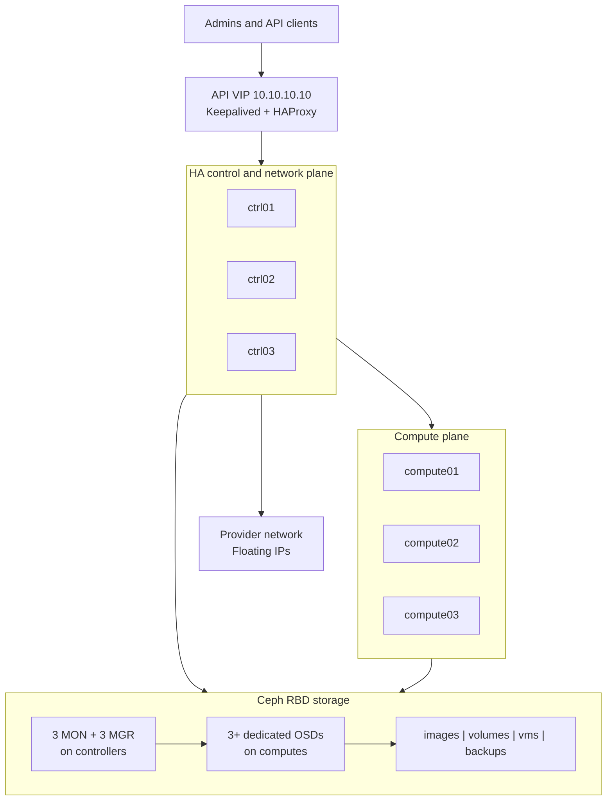

# Six-Node Highly Available OpenStack on CentOS

## Kolla-Ansible + OVN + External Ceph RBD

**Reference release:** OpenStack 2026.1 (Gazpacho), Kolla-Ansible `stable/2026.1`  
**Host operating system:** CentOS Stream 10  
**Topology:** 3 controller/network nodes + 3 compute nodes  
**Storage:** Ceph monitors/managers on controllers and Ceph OSDs on compute nodes  
**Deployment host:** `ctrl01`  
**Last reviewed:** 20 September 2026

> This is a reference build. Replace every sample IP address, interface name,
> DNS server, gateway, disk name, and password-related value with values from
> your own environment. Do not paste destructive storage commands until the
> device names have been checked on every host.

---

## 1. What this design makes highly available

| Layer | HA mechanism | Survives one node failure? |
|---|---|---:|
| OpenStack API endpoints | Keepalived VIP + HAProxy | Yes |
| Database | Three-node MariaDB Galera cluster | Yes |
| Messaging | Three-node RabbitMQ cluster | Yes |
| Identity, image, compute and network APIs | Service replicas on three controllers | Yes |
| Virtual networking | OVN databases/controllers across three nodes | Yes |
| Images, volumes and VM root disks | Ceph RBD, replica size 3/minimum size 2 | Yes |
| Compute capacity | Three Nova compute nodes | Yes, with reduced capacity |
| A running VM after its compute host dies | Manual evacuation, or a separately engineered instance-HA solution | Not automatically in this baseline |
| Whole site/datacenter | Separate DR site is required | No |

The OpenStack control plane remains available when one controller fails. Ceph
continues serving data when one OSD/compute node fails. A VM running on a failed
compute host stops until it is evacuated and restarted on a healthy compute.
Never evacuate a host until it is fenced or confirmed powered off; otherwise,
the same VM could run twice and corrupt data.

---

## 2. Architecture



Controller services include Keystone, Glance API, Nova API/scheduler/conductor,
Neutron server, OVN northbound/southbound databases, Horizon, MariaDB,
RabbitMQ, Memcached, HAProxy, and Keepalived. Compute nodes run Nova Compute,
libvirt, OVN Controller, and dedicated Ceph OSDs.

---

## 3. Release and operating-system gate

Run this on every node:

```bash
cat /etc/os-release
uname -r
```

Use the following rule:

| Installed OS | Recommended action |
|---|---|
| CentOS Stream 10 | Use this guide and Kolla-Ansible `stable/2026.1` |
| CentOS Stream 9 | Reinstall/upgrade to Stream 10 for a new production build. Stream 9 was supported by Kolla 2025.1, which is near the end of maintenance in September 2026. |
| CentOS Linux 7 or 8 | Stop. These are not supported for this deployment. Reinstall with CentOS Stream 10 or Rocky Linux 10. |

Kolla supports CentOS Stream 10 as a host OS, but does not publish CentOS
Stream 10-based service images. The official recommendation is to run the
published Rocky Linux 10 Kolla images, so this guide uses:

```yaml
kolla_base_distro: "rocky"
```

Do not mix OpenStack/Kolla branches. Kolla-Ansible, container images,
constraints, configuration templates, and upgrade documentation must all use
the same OpenStack series.

---

## 4. Example node and network plan

### 4.1 Nodes

| Host | Management/API | Geneve tunnel | Ceph client/storage | Provider NIC | Ceph OSD |
|---|---:|---:|---:|---|---|
| `ctrl01` | `10.10.10.11/24` | `10.10.20.11/24` | `10.10.30.11/24` | `ens256`, no IP | None |
| `ctrl02` | `10.10.10.12/24` | `10.10.20.12/24` | `10.10.30.12/24` | `ens256`, no IP | None |
| `ctrl03` | `10.10.10.13/24` | `10.10.20.13/24` | `10.10.30.13/24` | `ens256`, no IP | None |
| `compute01` | `10.10.10.21/24` | `10.10.20.21/24` | `10.10.30.21/24` | Not required in centralized-gateway mode | `/dev/sdb` |
| `compute02` | `10.10.10.22/24` | `10.10.20.22/24` | `10.10.30.22/24` | Not required in centralized-gateway mode | `/dev/sdb` |
| `compute03` | `10.10.10.23/24` | `10.10.20.23/24` | `10.10.30.23/24` | Not required in centralized-gateway mode | `/dev/sdb` |

### 4.2 Shared addresses and networks

| Purpose | Example |
|---|---|
| OpenStack internal API VIP | `10.10.10.10` |
| Management gateway | `10.10.10.1` |
| DNS | `10.10.10.2` or your corporate DNS |
| Management/API network | `10.10.10.0/24` |
| OVN/Geneve tunnel network | `10.10.20.0/24` |
| Ceph client/storage network | `10.10.30.0/24` |
| External/provider network | `192.168.50.0/24` |
| External gateway | `192.168.50.1` |
| Floating-IP pool | `192.168.50.100-192.168.50.200` |
| Tenant network | `10.20.0.0/24` |

The API VIP must be unused, outside DHCP, and on the same Layer-2 network as
the management interface of all three controllers. The provider NICs on the
controllers must reach the same Layer-2 external network. Do not assign an IP
address to a provider NIC; Kolla attaches it to `br-ex`.

For a production build, use bonded physical NICs and VLAN subinterfaces. Also
consider a separate Ceph replication network instead of sharing all Ceph client
and replication traffic on `10.10.30.0/24`.

---

## 5. Hardware baseline

### 5.1 Controllers

- 8 to 16 physical CPU cores
- 32 GB RAM minimum; 64 GB preferred
- 200 GB mirrored OS disk
- Three data interfaces plus an unnumbered provider interface, or equivalent
  bonded/VLAN interfaces
- Redundant power and an out-of-band management interface such as iDRAC/iLO/IPMI

### 5.2 Computes

- 16 or more physical CPU cores
- 64 GB or more RAM
- CPU virtualization enabled in BIOS: Intel VT-x or AMD-V
- Mirrored OS disk
- At least one dedicated, empty SSD/NVMe/HDD for Ceph OSD data
- Management, tunnel, and Ceph interfaces
- Out-of-band management for fencing

### 5.3 Important Ceph capacity fact

With only three OSDs and replica size 3, usable storage is approximately
one-third of raw storage before metadata and safety headroom. For example,
three 2-TB OSDs provide roughly 2 TB usable, not 6 TB. Production Ceph should
normally have multiple OSDs per compute and enough free capacity to recover
after a disk or host failure.

---

## 6. Switch and VLAN preparation

Before touching OpenStack, confirm:

1. All six management interfaces can communicate on `10.10.10.0/24`.
2. All six tunnel interfaces can communicate on `10.10.20.0/24`.
3. All six Ceph interfaces can communicate on `10.10.30.0/24`.
4. The three controller provider interfaces reach the external VLAN.
5. The external switch port mode matches the Neutron design:
   - Access/untagged port for one flat provider network.
   - Trunk/tagged port for multiple VLAN provider networks.
6. The underlay MTU is consistent end-to-end. Start with MTU 1500 unless the
   entire path is verified for jumbo frames.
7. No switch security feature blocks the Keepalived virtual MAC/IP or multiple
   VM MAC addresses behind the provider ports.

---

## 7. Prepare CentOS on all six nodes

Perform this phase from the physical/virtual console where possible. Changing
the active management connection over SSH can disconnect you.

### 7.1 Set hostnames

Run the matching command on each node:

```bash
sudo hostnamectl set-hostname ctrl01
sudo hostnamectl set-hostname ctrl02
sudo hostnamectl set-hostname ctrl03
sudo hostnamectl set-hostname compute01
sudo hostnamectl set-hostname compute02
sudo hostnamectl set-hostname compute03
```

Run only the one command that belongs to the current host.

### 7.2 Configure static network addresses

First identify real interface and NetworkManager connection names:

```bash
ip -br link
nmcli device status
nmcli connection show
```

The guide assumes:

- `ens160`: management/API
- `ens192`: Geneve tunnel
- `ens224`: Ceph client/storage
- `ens256`: unnumbered external provider interface on controllers only

Example for `ctrl01`; adjust the connection names and addresses:

```bash
sudo nmcli connection modify "ens160" \
  ipv4.method manual \
  ipv4.addresses 10.10.10.11/24 \
  ipv4.gateway 10.10.10.1 \
  ipv4.dns "10.10.10.2" \
  ipv6.method disabled

sudo nmcli connection modify "ens192" \
  ipv4.method manual \
  ipv4.addresses 10.10.20.11/24 \
  ipv4.never-default yes \
  ipv6.method disabled

sudo nmcli connection modify "ens224" \
  ipv4.method manual \
  ipv4.addresses 10.10.30.11/24 \
  ipv4.never-default yes \
  ipv6.method disabled

sudo nmcli connection modify "ens256" \
  ipv4.method disabled \
  ipv6.method disabled
```

Bring up the changed connections only after confirming that the management
address/gateway is correct:

```bash
sudo nmcli connection up "ens160"
sudo nmcli connection up "ens192"
sudo nmcli connection up "ens224"
sudo nmcli connection up "ens256"
```

Repeat with the node-specific IPs in the table. Compute nodes do not need
`ens256` in this centralized OVN gateway design.

### 7.3 Configure name resolution

Use corporate DNS records if available. Otherwise, add these entries to
`/etc/hosts` on all six nodes and on `ctrl01`, the deployment host:

```text
10.10.10.11 ctrl01
10.10.10.12 ctrl02
10.10.10.13 ctrl03
10.10.10.21 compute01
10.10.10.22 compute02
10.10.10.23 compute03
10.10.10.10 openstack-api
```

RabbitMQ requires the controller hostnames to resolve correctly. Test from
every node:

```bash
getent hosts ctrl01 ctrl02 ctrl03 compute01 compute02 compute03
ping -c 2 ctrl01
```

### 7.4 Update packages and enable time synchronization

Run on all six nodes:

```bash
sudo dnf update -y
sudo dnf install -y NetworkManager chrony curl python3 python3-pip sudo lvm2 openssh-server firewalld
sudo systemctl enable --now NetworkManager chronyd sshd firewalld
chronyc sources -v
timedatectl
```

All nodes must agree on time. Authentication, database clustering, messaging,
TLS, and logs become unreliable when clocks drift.

### 7.5 Create the automation user

Run on all six nodes:

```bash
sudo useradd --create-home --shell /bin/bash cloudadmin
sudo passwd cloudadmin
echo 'cloudadmin ALL=(ALL) NOPASSWD: ALL' | sudo tee /etc/sudoers.d/cloudadmin
sudo chmod 0440 /etc/sudoers.d/cloudadmin
sudo visudo --check
```

Use SSH keys, not a shared production password.

### 7.6 SELinux and firewall decision

The current Kolla security guide states that SELinux must be disabled because
complete policies for the Docker containers are not yet available.

Run on all six nodes:

```bash
sudo setenforce 0 || true
sudo sed -ri 's/^SELINUX=.*/SELINUX=disabled/' /etc/selinux/config
getenforce
```

For an isolated lab, Kolla can manage/disable the host firewall. This guide
instead leaves firewalld enabled and treats the private cluster interfaces as
trusted. Review this with the network/security team before production:

```bash
sudo firewall-cmd --permanent --zone=trusted --add-interface=ens160
sudo firewall-cmd --permanent --zone=trusted --add-interface=ens192
sudo firewall-cmd --permanent --zone=trusted --add-interface=ens224
sudo firewall-cmd --reload
sudo firewall-cmd --get-active-zones
```

Do not place the provider interface in a normal host IP zone; it is later owned
by the Neutron/OVS external bridge. The trusted networks must be isolated from
untrusted users.

### 7.7 Verify compute virtualization

Run on each compute:

```bash
egrep -c '(vmx|svm)' /proc/cpuinfo
lsmod | grep -E '^kvm'
```

A positive CPU-flag count is required for KVM. If these six hosts are themselves
VMs, enable nested virtualization in the parent hypervisor. Use QEMU emulation
only for a slow functional lab, never as the intended production configuration.

### 7.8 Verify the Ceph disks

Run on each compute:

```bash
lsblk -e7 -o NAME,PATH,SIZE,TYPE,FSTYPE,MOUNTPOINTS,MODEL,SERIAL
sudo wipefs --no-act /dev/sdb
```

`/dev/sdb` must be a dedicated, unmounted disk with no needed data. The later
Ceph OSD command destroys all data on the selected device. Prefer stable
`/dev/disk/by-id/...` paths in production.

### 7.9 Reboot and recheck

```bash
sudo reboot
```

After every node returns:

```bash
getenforce
chronyc tracking
ip -br address
ip route
```

Expected SELinux state is `Disabled`. Only the management interface should
have a default gateway.

---

## 8. Configure SSH from the deployment node

Log in to `ctrl01` as `cloudadmin`:

```bash
ssh-keygen -t ed25519 -a 100 -f ~/.ssh/id_ed25519
eval "$(ssh-agent -s)"
ssh-add ~/.ssh/id_ed25519
ssh-copy-id cloudadmin@ctrl01
ssh-copy-id cloudadmin@ctrl02
ssh-copy-id cloudadmin@ctrl03
ssh-copy-id cloudadmin@compute01
ssh-copy-id cloudadmin@compute02
ssh-copy-id cloudadmin@compute03
```

Test noninteractive access and sudo:

```bash
for host in ctrl01 ctrl02 ctrl03 compute01 compute02 compute03; do
  ssh "$host" 'hostname; sudo -n true'
done
```

Every command must return the expected hostname without prompting for a sudo
password.

---

## 9. Install Kolla-Ansible on ctrl01

Run as `cloudadmin` on `ctrl01`:

```bash
sudo dnf install -y git python3-devel libffi-devel gcc openssl-devel python3-libselinux
sudo python3 -m venv /opt/kolla-venv
sudo chown -R cloudadmin:cloudadmin /opt/kolla-venv
source /opt/kolla-venv/bin/activate
pip install --upgrade pip
pip install 'git+https://opendev.org/openstack/kolla-ansible@stable/2026.1'
kolla-ansible install-deps
```

Create configuration and inventory locations:

```bash
sudo mkdir -p /etc/kolla /opt/openstack/inventory
sudo chown -R cloudadmin:cloudadmin /etc/kolla /opt/openstack
cp -r /opt/kolla-venv/share/kolla-ansible/etc_examples/kolla/* /etc/kolla/
cp /opt/kolla-venv/share/kolla-ansible/ansible/inventory/multinode \
  /opt/openstack/inventory/multinode
```

Generate all internal service passwords once:

```bash
kolla-genpwd -p /etc/kolla/passwords.yml
chmod 0600 /etc/kolla/passwords.yml
```

Back up `/etc/kolla/passwords.yml` securely and offline. Losing it can make
recovery or reconfiguration impossible. Never commit it unencrypted to Git.

Add this to the `cloudadmin` shell profile if desired:

```bash
echo 'source /opt/kolla-venv/bin/activate' >> ~/.bashrc
```

---

## 10. Build the Kolla inventory

Edit only the initial role sections at the top of the copied sample inventory.
Keep all of the sample child groups below them unchanged.

```ini
[control]
ctrl01 ansible_host=10.10.10.11 ansible_user=cloudadmin ansible_become=true
ctrl02 ansible_host=10.10.10.12 ansible_user=cloudadmin ansible_become=true
ctrl03 ansible_host=10.10.10.13 ansible_user=cloudadmin ansible_become=true

[network]
ctrl01
ctrl02
ctrl03

[compute]
compute01 ansible_host=10.10.10.21 ansible_user=cloudadmin ansible_become=true
compute02 ansible_host=10.10.10.22 ansible_user=cloudadmin ansible_become=true
compute03 ansible_host=10.10.10.23 ansible_user=cloudadmin ansible_become=true

[monitoring]
ctrl01
ctrl02
ctrl03

[storage]
ctrl01
ctrl02
ctrl03

[deployment]
localhost ansible_connection=local
```

The `storage` group here means the hosts on which Kolla runs Cinder volume and
backup services. It does not mean that Ceph OSDs run there. The OSDs run on the
three computes and are managed independently by `cephadm`.

Validate inventory membership:

```bash
source /opt/kolla-venv/bin/activate
ansible-inventory -i /opt/openstack/inventory/multinode --graph
ansible -i /opt/openstack/inventory/multinode all -m ping
ansible -i /opt/openstack/inventory/multinode all -a 'hostname -f'
```

Do not continue until all six nodes return `SUCCESS`.

---

## 11. Configure `/etc/kolla/globals.yml`

The following is a complete baseline for the sample interfaces and addresses:

```yaml
---

# Container images: official recommendation for a CentOS Stream 10 host.
kolla_base_distro: "rocky"

# Management/API, overlay and storage networks.
network_interface: "ens160"
api_interface: "ens160"
tunnel_interface: "ens192"
storage_interface: "ens224"
neutron_external_interface: "ens256"

# Free address on the management/API L2 network.
kolla_internal_vip_address: "10.10.10.10"

# Choose an unused ID from 1-255 if other Keepalived clusters share this L2.
keepalived_virtual_router_id: "51"

# HAProxy and Keepalived are enabled by default; explicit here for clarity.
enable_haproxy: true
enable_keepalived: true
haproxy_host_ipv4_tcp_retries2: 6

# Keep firewalld enabled. Private cluster interfaces were assigned to trusted.
disable_firewall: false

# OVN networking with centralized external gateways on controller/network nodes.
neutron_plugin_agent: "ovn"
neutron_ovn_distributed_fip: false
enable_neutron_provider_networks: false

# Bare-metal compute. Use qemu only if this is a nested lab without KVM.
nova_compute_virt_type: "kvm"

# Web dashboard.
enable_horizon: true

# External Ceph provides image, block, backup and Nova ephemeral storage.
enable_cinder: true
enable_cinder_backup: true
cinder_backend_ceph: true
cinder_backup_driver: "ceph"
cinder_cluster_name: "cinder-ceph-cluster"
glance_backend_ceph: true
nova_backend_ceph: true

ceph_glance_user: "glance"
ceph_glance_pool_name: "images"
ceph_cinder_user: "cinder"
ceph_cinder_pool_name: "volumes"
ceph_cinder_backup_user: "cinder-backup"
ceph_cinder_backup_pool_name: "backups"
ceph_nova_user: "nova"
ceph_nova_pool_name: "vms"

# Hot MariaDB backup capability.
enable_mariabackup: true
```

Important points:

- If interface names differ between hosts, do not force one global interface
  name. Use inventory `host_vars`/`group_vars` for the differing hosts.
- Do not set `enable_neutron_provider_networks: true` unless compute nodes also
  have the correctly mapped external/provider NIC. It is not required for the
  centralized gateway design in this guide.
- This first build exposes the API/Horizon only on the private management VIP.
  Add trusted TLS and a separate external API VIP before exposing it beyond the
  admin network.

Check YAML syntax:

```bash
python -c 'import yaml; yaml.safe_load(open("/etc/kolla/globals.yml")); print("globals.yml OK")'
```

---

## 12. Bootstrap all OpenStack hosts

This installs and configures host-level Kolla dependencies, including the
container runtime:

```bash
source /opt/kolla-venv/bin/activate
kolla-ansible bootstrap-servers -i /opt/openstack/inventory/multinode
```

Validate Docker on all nodes:

```bash
ansible -i /opt/openstack/inventory/multinode all \
  -a 'sudo systemctl is-active docker && sudo docker version --format {{.Server.Version}}'
```

If the Jinja braces are interpreted by the shell/tool version, use this simpler
check instead:

```bash
ansible -i /opt/openstack/inventory/multinode all -a 'sudo docker info'
```

Do not run `kolla-ansible deploy` yet. Build and integrate Ceph first.

---

## 13. Deploy the Ceph storage cluster

Kolla-Ansible consumes an external Ceph cluster; it does not provision Ceph.
The following creates that cluster with `cephadm`.

### 13.1 Install Cephadm on ctrl01

Run on `ctrl01`:

```bash
sudo dnf search release-ceph
sudo dnf install -y centos-release-ceph-tentacle
sudo dnf install -y cephadm
cephadm version
```

Ceph Tentacle is the current maintained Ceph series in September 2026. Pin and
test the exact patch release through your normal package lifecycle rather than
allowing uncontrolled production upgrades.

### 13.2 Bootstrap the first monitor and manager

Use the Ceph/storage IP, not the management or floating-IP network:

```bash
sudo cephadm bootstrap \
  --mon-ip 10.10.30.11 \
  --ssh-user cloudadmin \
  --log-to-file
```

Install the Ceph CLI on `ctrl01` and verify the initial cluster:

```bash
sudo dnf install -y ceph-common
sudo systemctl is-active docker
sudo ceph -s
```

The CentOS Ceph SIG repository was configured in the preceding step, so do not
also use `cephadm add-repo`; the Ceph documentation treats the distribution
package and `cephadm add-repo` methods as alternative installation paths. The
Docker check confirms that installing Ceph packages did not disturb Kolla's
container runtime.

### 13.3 Authorize Cephadm SSH access

The bootstrap creates `/etc/ceph/ceph.pub`. Copy it to the passwordless-sudo
`cloudadmin` account on the other five nodes:

```bash
sudo install -m 0644 -o cloudadmin -g cloudadmin \
  /etc/ceph/ceph.pub /tmp/ceph.pub

ssh-copy-id -f -i /tmp/ceph.pub cloudadmin@ctrl02
ssh-copy-id -f -i /tmp/ceph.pub cloudadmin@ctrl03
ssh-copy-id -f -i /tmp/ceph.pub cloudadmin@compute01
ssh-copy-id -f -i /tmp/ceph.pub cloudadmin@compute02
ssh-copy-id -f -i /tmp/ceph.pub cloudadmin@compute03
rm -f /tmp/ceph.pub
```

### 13.4 Add all hosts using their Ceph addresses

`ctrl01` is already present from bootstrap:

```bash
sudo ceph orch host add ctrl02 10.10.30.12
sudo ceph orch host add ctrl03 10.10.30.13
sudo ceph orch host add compute01 10.10.30.21
sudo ceph orch host add compute02 10.10.30.22
sudo ceph orch host add compute03 10.10.30.23
sudo ceph orch host ls
```

Give the other controllers administrative copies of the Ceph configuration:

```bash
sudo ceph orch host label add ctrl02 _admin
sudo ceph orch host label add ctrl03 _admin
```

### 13.5 Place monitor and manager daemons

```bash
sudo ceph config set mon public_network 10.10.30.0/24
sudo ceph orch apply mon --placement="ctrl01,ctrl02,ctrl03"
sudo ceph orch apply mgr --placement="ctrl01,ctrl02,ctrl03"
sudo ceph orch ps --daemon-type mon
sudo ceph orch ps --daemon-type mgr
sudo ceph quorum_status --format json-pretty
```

Three monitors provide quorum after one controller failure. Ceph recommends
considering five monitors once a cluster has five or more nodes, but three
controller-aligned monitors are an understandable small-cluster compromise.

### 13.6 Add exactly the intended OSD disks

First inspect Ceph's device view:

```bash
sudo ceph orch device ls --wide
```

Confirm that `/dev/sdb` on each compute is reported as available and contains
no needed data. The next three commands irreversibly erase those disks:

```bash
sudo ceph orch daemon add osd compute01:/dev/sdb
sudo ceph orch daemon add osd compute02:/dev/sdb
sudo ceph orch daemon add osd compute03:/dev/sdb
```

Do not use `--all-available-devices` on a server where an unexpected disk could
appear. Verify the result:

```bash
sudo ceph -s
sudo ceph osd tree
sudo ceph osd df tree
```

### 13.7 Limit Ceph memory on hyperconverged computes

Because Nova and Ceph share the compute hosts, reduce Ceph's automatic memory
target ratio and leave memory for VMs and hypervisor services:

```bash
sudo ceph config set mgr mgr/cephadm/autotune_memory_target_ratio 0.2
sudo ceph config set osd osd_memory_target_autotune true
```

Tune this after load testing; `0.2` is a starting point, not a universal
production value.

### 13.8 Create RBD pools

```bash
sudo ceph osd pool create images 32
sudo ceph osd pool create volumes 32
sudo ceph osd pool create vms 32
sudo ceph osd pool create backups 32

sudo rbd pool init images
sudo rbd pool init volumes
sudo rbd pool init vms
sudo rbd pool init backups

for pool in images volumes vms backups; do
  sudo ceph osd pool set "$pool" size 3
  sudo ceph osd pool set "$pool" min_size 2
  sudo ceph osd pool set "$pool" pg_autoscale_mode on
done
```

Verify:

```bash
sudo ceph osd pool ls detail
sudo ceph df
```

### 13.9 Create least-privilege Ceph users

```bash
sudo ceph auth get-or-create client.glance \
  mon 'profile rbd' \
  osd 'profile rbd pool=images' \
  mgr 'profile rbd pool=images'

sudo ceph auth get-or-create client.cinder \
  mon 'profile rbd' \
  osd 'profile rbd pool=volumes, profile rbd pool=vms, profile rbd-read-only pool=images' \
  mgr 'profile rbd pool=volumes, profile rbd pool=vms'

sudo ceph auth get-or-create client.cinder-backup \
  mon 'profile rbd' \
  osd 'profile rbd pool=backups' \
  mgr 'profile rbd pool=backups'

sudo ceph auth get-or-create client.nova \
  mon 'profile rbd' \
  osd 'profile rbd pool=vms, profile rbd-read-only pool=images' \
  mgr 'profile rbd pool=vms'
```

List the created identities without printing their secret keys:

```bash
sudo ceph auth ls | grep '^client\.'
```

---

## 14. Supply Ceph configuration and keys to Kolla

Run on `ctrl01`.

### 14.1 Create Kolla override directories

```bash
sudo install -d -m 0750 -o cloudadmin -g cloudadmin \
  /etc/kolla/config/glance \
  /etc/kolla/config/cinder/cinder-volume \
  /etc/kolla/config/cinder/cinder-backup \
  /etc/kolla/config/nova
```

### 14.2 Generate a clean minimal Ceph configuration

Kolla warns that leading tabs from `ceph config generate-minimal-conf` break its
INI parser. Remove only the leading tab and copy the clean file:

```bash
sudo ceph config generate-minimal-conf | sed 's/^\t//' > /tmp/ceph.conf.kolla
cp /tmp/ceph.conf.kolla /etc/kolla/config/glance/ceph.conf
cp /tmp/ceph.conf.kolla /etc/kolla/config/cinder/ceph.conf
cp /tmp/ceph.conf.kolla /etc/kolla/config/nova/ceph.conf
rm -f /tmp/ceph.conf.kolla
```

Inspect it and confirm that `mon_host` contains reachable `10.10.30.x`
addresses:

```bash
sed -n '1,80p' /etc/kolla/config/glance/ceph.conf
```

### 14.3 Export service keyrings into the required paths

```bash
sudo ceph auth get client.glance \
  -o /etc/kolla/config/glance/ceph.client.glance.keyring

sudo ceph auth get client.cinder \
  -o /etc/kolla/config/cinder/cinder-volume/ceph.client.cinder.keyring

sudo ceph auth get client.cinder \
  -o /etc/kolla/config/cinder/cinder-backup/ceph.client.cinder.keyring

sudo ceph auth get client.cinder-backup \
  -o /etc/kolla/config/cinder/cinder-backup/ceph.client.cinder-backup.keyring

sudo ceph auth get client.cinder \
  -o /etc/kolla/config/nova/ceph.client.cinder.keyring

sudo ceph auth get client.nova \
  -o /etc/kolla/config/nova/ceph.client.nova.keyring
```

Protect the secrets while still allowing the deployment user to read them:

```bash
sudo chown -R cloudadmin:cloudadmin /etc/kolla/config
find /etc/kolla/config -name '*.keyring' -exec chmod 0600 {} \;
find /etc/kolla/config -name 'ceph.conf' -exec chmod 0640 {} \;
```

Validate the expected files:

```bash
find /etc/kolla/config -maxdepth 4 -type f -printf '%m %p\n' | sort
```

Expected key files are:

```text
/etc/kolla/config/glance/ceph.client.glance.keyring
/etc/kolla/config/cinder/cinder-volume/ceph.client.cinder.keyring
/etc/kolla/config/cinder/cinder-backup/ceph.client.cinder.keyring
/etc/kolla/config/cinder/cinder-backup/ceph.client.cinder-backup.keyring
/etc/kolla/config/nova/ceph.client.cinder.keyring
/etc/kolla/config/nova/ceph.client.nova.keyring
```

---

## 15. Run Kolla checks and deploy OpenStack

Run on `ctrl01`:

```bash
source /opt/kolla-venv/bin/activate

kolla-ansible prechecks -i /opt/openstack/inventory/multinode
kolla-ansible pull -i /opt/openstack/inventory/multinode
kolla-ansible deploy -i /opt/openstack/inventory/multinode
kolla-ansible validate-config -i /opt/openstack/inventory/multinode
kolla-ansible post-deploy -i /opt/openstack/inventory/multinode
```

Do not bypass failed prechecks. Fix DNS, interfaces, virtualization, storage,
time, firewall, or Ceph configuration and rerun them.

Install the OpenStack CLI using the matching constraints:

```bash
pip install python-openstackclient \
  -c https://releases.openstack.org/constraints/upper/2026.1
```

Verify the generated cloud entry:

```bash
chmod 0600 /etc/kolla/clouds.yaml
export OS_CLIENT_CONFIG_FILE=/etc/kolla/clouds.yaml
openstack --os-cloud kolla-admin token issue
openstack --os-cloud kolla-admin service list
openstack --os-cloud kolla-admin endpoint list
openstack --os-cloud kolla-admin compute service list
openstack --os-cloud kolla-admin network agent list
openstack --os-cloud kolla-admin volume service list
openstack --os-cloud kolla-admin hypervisor list
```

Set `OS_CLIENT_CONFIG_FILE=/etc/kolla/clouds.yaml` again in each new shell, or
add that export to the protected `cloudadmin` shell profile. OpenStackClient
does not search `/etc/kolla` by default.

Horizon is available from the management network at:

```text
http://10.10.10.10
```

The user is `admin`. Retrieve the password locally from the protected file only
when required:

```bash
grep '^keystone_admin_password:' /etc/kolla/passwords.yml
```

Do not paste that output into tickets, chat, or shell history.

---

## 16. Create the external and tenant networks

These sample external addresses must be replaced with a real unused allocation
from the network team.

### 16.1 External provider network

```bash
openstack --os-cloud kolla-admin network create public \
  --external \
  --share \
  --provider-network-type flat \
  --provider-physical-network physnet1

openstack --os-cloud kolla-admin subnet create public-subnet \
  --network public \
  --subnet-range 192.168.50.0/24 \
  --gateway 192.168.50.1 \
  --allocation-pool start=192.168.50.100,end=192.168.50.200 \
  --no-dhcp
```

### 16.2 Tenant network and router

```bash
openstack --os-cloud kolla-admin network create private

openstack --os-cloud kolla-admin subnet create private-subnet \
  --network private \
  --subnet-range 10.20.0.0/24 \
  --gateway 10.20.0.1 \
  --dns-nameserver 1.1.1.1

openstack --os-cloud kolla-admin router create tenant-router
openstack --os-cloud kolla-admin router set tenant-router --external-gateway public
openstack --os-cloud kolla-admin router add subnet tenant-router private-subnet
```

Verify OVN logical resources:

```bash
openstack --os-cloud kolla-admin network list
openstack --os-cloud kolla-admin subnet list
openstack --os-cloud kolla-admin router list
```

---

## 17. Upload a test image and create a VM

### 17.1 Upload CirrOS

Ceph recommends RAW images when Nova guest disks are stored in RBD. Download
the CirrOS QCOW2 image, convert it, and upload the RAW result:

```bash
sudo dnf install -y qemu-img

curl -fL \
  -o /tmp/cirros-0.6.3-x86_64.qcow2 \
  https://download.cirros-cloud.net/0.6.3/cirros-0.6.3-x86_64-disk.img

qemu-img convert -p -f qcow2 -O raw \
  /tmp/cirros-0.6.3-x86_64.qcow2 \
  /tmp/cirros-0.6.3-x86_64.raw
qemu-img info /tmp/cirros-0.6.3-x86_64.raw

openstack --os-cloud kolla-admin image create cirros-0.6.3 \
  --file /tmp/cirros-0.6.3-x86_64.raw \
  --disk-format raw \
  --container-format bare \
  --property hw_scsi_model=virtio-scsi \
  --property hw_disk_bus=scsi \
  --public
```

### 17.2 Flavor and key pair

```bash
openstack --os-cloud kolla-admin flavor create m1.small \
  --vcpus 1 --ram 2048 --disk 10

ssh-keygen -t ed25519 -f ~/.ssh/openstack-lab -N ''
openstack --os-cloud kolla-admin keypair create \
  --public-key ~/.ssh/openstack-lab.pub openstack-lab
```

### 17.3 Security-group rules

```bash
openstack --os-cloud kolla-admin security group rule create \
  --protocol icmp default

openstack --os-cloud kolla-admin security group rule create \
  --protocol tcp --dst-port 22 default
```

For production, restrict source CIDRs rather than opening SSH broadly.

### 17.4 Boot and address the instance

```bash
openstack --os-cloud kolla-admin server create test-vm \
  --image cirros-0.6.3 \
  --flavor m1.small \
  --network private \
  --key-name openstack-lab \
  --security-group default \
  --wait

FLOATING_IP=$(openstack --os-cloud kolla-admin floating ip create public \
  -f value -c floating_ip_address)

openstack --os-cloud kolla-admin server add floating ip test-vm "$FLOATING_IP"
openstack --os-cloud kolla-admin server show test-vm
```

Test:

```bash
ping -c 4 "$FLOATING_IP"
ssh -i ~/.ssh/openstack-lab cirros@"$FLOATING_IP"
```

### 17.5 Test Cinder on Ceph

```bash
openstack --os-cloud kolla-admin volume create --size 1 test-volume
watch -n 5 'openstack --os-cloud kolla-admin volume show test-volume -f value -c status'
```

Stop `watch` with Ctrl+C only after it reports `available`; if it reports
`error`, inspect Cinder and Ceph rather than continuing. Then attach it:

```bash
openstack --os-cloud kolla-admin server add volume test-vm test-volume
openstack --os-cloud kolla-admin volume list
```

On `ctrl01`, confirm that OpenStack objects exist in Ceph:

```bash
sudo rbd -p images ls
sudo rbd -p volumes ls
sudo rbd -p vms ls
sudo ceph -s
```

---

## 18. Validate high availability

Perform failure tests first in a lab or maintenance window with console access.

### 18.1 API VIP failover

Find the controller currently holding the VIP:

```bash
for host in ctrl01 ctrl02 ctrl03; do
  ssh "$host" "ip -4 -br address show ens160 | grep 10.10.10.10 || true"
done
```

Continuously test the endpoint from another terminal:

```bash
while true; do
  date
  curl --max-time 2 -s -o /dev/null -w '%{http_code}\n' http://10.10.10.10
  sleep 1
done
```

On the active VIP controller, stop only Keepalived:

```bash
sudo docker stop keepalived
```

Confirm the VIP moves to another controller and the API returns. Restore it:

```bash
sudo docker start keepalived
```

### 18.2 HAProxy backends

On each controller:

```bash
sudo docker ps --filter name=haproxy --filter name=keepalived
sudo docker logs --tail 50 haproxy
sudo docker logs --tail 50 keepalived
```

### 18.3 MariaDB Galera

On a controller:

```bash
sudo docker exec -it mariadb mariadb --batch -uroot -p \
  -e "SHOW STATUS LIKE 'wsrep_cluster_size'; SHOW STATUS LIKE 'wsrep_local_state_comment';"
```

Enter the protected `database_password` value from
`/etc/kolla/passwords.yml` when prompted; do not place it directly on the
command line.

Expected cluster size is `3`; local state should be `Synced`.

### 18.4 RabbitMQ

```bash
sudo docker exec rabbitmq rabbitmqctl cluster_status
```

All three controller RabbitMQ nodes should be visible.

### 18.5 OVN

```bash
sudo docker exec ovn_northd ovn-nbctl show
sudo docker exec ovn_northd ovn-sbctl show
```

Container names can differ slightly by release. Use `docker ps --format
'{{.Names}}' | grep ovn` to identify them.

### 18.6 Ceph

```bash
sudo ceph -s
sudo ceph health detail
sudo ceph quorum_status --format json-pretty
sudo ceph osd tree
```

The healthy steady-state result is `HEALTH_OK`, three monitors in quorum, and
all OSDs `up` and `in`.

### 18.7 Planned live migration

Identify the current host:

```bash
openstack --os-cloud kolla-admin server show test-vm \
  -f value -c OS-EXT-SRV-ATTR:host
```

Disable scheduling to the source compute and live-migrate to another one:

```bash
openstack --os-cloud kolla-admin compute service set \
  --disable compute01 nova-compute

openstack --os-cloud kolla-admin server migrate \
  --live-migration --host compute02 --wait test-vm

openstack --os-cloud kolla-admin server migration list --server test-vm
openstack --os-cloud kolla-admin server show test-vm \
  -f value -c OS-EXT-SRV-ATTR:host

openstack --os-cloud kolla-admin compute service set \
  --enable compute01 nova-compute
```

Change the source/destination names to match the actual placement. Ceph-backed
root disks avoid copying the root disk across hypervisors during migration.

### 18.8 Unplanned compute failure and evacuation

The safe sequence is:

1. Detect that the compute is unavailable.
2. Fence it using iDRAC/iLO/IPMI or physically confirm it is powered off.
3. Disable its Nova Compute service.
4. Evacuate affected VMs to healthy computes.
5. Confirm application and data integrity.
6. Repair and return the failed node.

Example after `compute01` has definitely been fenced:

```bash
openstack --os-cloud kolla-admin compute service set \
  --disable --disable-reason "Host fenced for failure recovery" \
  compute01 nova-compute

openstack --os-cloud kolla-admin server evacuate \
  --host compute02 --wait test-vm
```

Do not use evacuation as a substitute for fencing.

---

## 19. Operations and backups

### 19.1 Back up deployment configuration

Back up these files to encrypted storage after every change:

- `/etc/kolla/globals.yml`
- `/etc/kolla/passwords.yml`
- `/etc/kolla/config/`
- `/opt/openstack/inventory/`
- TLS certificates and private keys when TLS is enabled
- A record of exact Kolla-Ansible and OpenStack versions

The deployment host is not itself highly available. The cloud keeps running if
`ctrl01` fails, but another machine needs the backed-up automation state before
it can safely manage the cloud.

### 19.2 MariaDB backup

`enable_mariabackup: true` was set before deployment. Take a full hot backup:

```bash
kolla-ansible mariadb-backup -i /opt/openstack/inventory/multinode
```

Incremental backup:

```bash
kolla-ansible mariadb-backup \
  -i /opt/openstack/inventory/multinode --incremental
```

Kolla stores the result in the `mariadb_backup` Docker volume on the selected
database node. Copy it to independent backup storage and test restoration.

### 19.3 Cinder backup

```bash
openstack --os-cloud kolla-admin server remove volume test-vm test-volume
watch -n 5 'openstack --os-cloud kolla-admin volume show test-volume -f value -c status'
```

Stop `watch` after the volume is `available`, then create the backup:

```bash
openstack --os-cloud kolla-admin volume backup create \
  --name test-volume-backup test-volume
openstack --os-cloud kolla-admin volume backup list
sudo rbd -p backups ls
```

A backup in the same Ceph cluster protects against logical volume loss but is
not site disaster recovery. Replicate/export critical backups off-cluster.

### 19.4 Ceph checks

```bash
sudo ceph -s
sudo ceph health detail
sudo ceph df
sudo ceph osd df tree
sudo ceph orch ps
sudo ceph crash ls-new
```

### 19.5 Kolla health checks

```bash
kolla-ansible prechecks -i /opt/openstack/inventory/multinode
kolla-ansible validate-config -i /opt/openstack/inventory/multinode
ansible -i /opt/openstack/inventory/multinode all \
  -a 'sudo docker ps --format "table {{.Names}}\t{{.Status}}"'
```

If the Ansible command interprets the Docker template braces, run `docker ps`
directly on each host instead.

---

## 20. TLS before production exposure

The first deployment deliberately uses HTTP only on an isolated admin network
to make initial diagnosis simpler. Before production exposure:

1. Create DNS names for the internal/external VIPs.
2. Obtain certificates from a trusted enterprise/public CA.
3. Store the private key securely.
4. Enable Kolla TLS:

```yaml
kolla_enable_tls_internal: true
kolla_enable_tls_external: true
kolla_enable_tls_backend: true
kolla_copy_ca_into_containers: true
openstack_cacert: "/etc/pki/tls/certs/ca-bundle.crt"
```

5. Place certificates at the Kolla-documented paths.
6. Run certificates/prechecks/reconfigure in a maintenance window.
7. Verify every Keystone endpoint is HTTPS and test certificate renewal.

Kolla-generated private CA certificates are suitable for testing, not as the
final production trust design.

---

## 21. Recommended production additions

- Bonded NICs and redundant top-of-rack switches
- Separate Ceph client and replication networks
- More than one OSD per compute, with failure-domain and capacity planning
- Hardware fencing for every compute and controller
- Trusted TLS on internal, external, and backend APIs
- LDAP/AD federation or a managed identity design for Keystone
- Barbican and encrypted Cinder volume types
- Prometheus/Grafana plus centralized logs and external alert delivery
- Tested MariaDB, Ceph, Cinder, and configuration restore procedures
- An image lifecycle with signature and vulnerability controls
- A local/HA container registry for controlled Kolla image promotion
- Separate projects, quotas, application credentials, and least-privilege roles
- A second site or backup domain for disaster recovery
- Capacity headroom to evacuate one compute while meeting workload demand
- Formal change, patch, upgrade, rollback, and certificate-rotation procedures

---

## 22. Common problems

### VIP does not appear

Check:

```bash
sudo docker logs keepalived
ip -4 address show ens160
sudo firewall-cmd --get-active-zones
```

Typical causes are a used VIP, mismatched L2 networks, VRRP blocked by the
switch/hypervisor, or a duplicate Keepalived router ID.

### RabbitMQ cannot form a cluster

Check forward/reverse name resolution and time:

```bash
getent hosts ctrl01 ctrl02 ctrl03
chronyc tracking
sudo docker logs rabbitmq
```

RabbitMQ clustering must use resolvable hostnames, not inconsistent IP-only
identity.

### Instances have no external connectivity

Check:

```bash
openstack --os-cloud kolla-admin network agent list
openstack --os-cloud kolla-admin router show tenant-router
sudo docker exec ovn_northd ovn-sbctl show
ip link show ens256
```

The provider interface must be up with no host IP, connected to the correct
external VLAN, and mapped to the physical network used by the external network.

### Cinder volume stays in `error`

Check:

```bash
openstack --os-cloud kolla-admin volume service list
sudo docker logs --tail 200 cinder_volume
sudo ceph -s
sudo rbd -p volumes ls
```

Typical causes are a missing/misnamed keyring, incorrect Ceph pool/user, tabs in
`ceph.conf`, monitor reachability, or inadequate CephX capabilities.

### Nova cannot boot from Ceph

Check on the selected compute:

```bash
sudo docker logs --tail 200 nova_compute
sudo docker logs --tail 200 nova_libvirt
```

Confirm both Nova and Cinder keyrings were placed in
`/etc/kolla/config/nova/`, that the Nova user can access `vms`, and that the
Cinder user can access `volumes` and `vms`.

### KVM is unavailable

```bash
egrep -c '(vmx|svm)' /proc/cpuinfo
ls -l /dev/kvm
sudo dmesg | grep -i kvm
```

Enable virtualization in BIOS or nested virtualization in the parent
hypervisor. For a functional nested lab only, set:

```yaml
nova_compute_virt_type: "qemu"
```

---

## 23. Final acceptance checklist

- [ ] All nodes run the supported OS/release combination.
- [ ] DNS/hosts and NTP are correct on all six nodes.
- [ ] Management, tunnel, storage, and provider networks are isolated correctly.
- [ ] API VIP moves between all three controllers.
- [ ] HAProxy sends requests only to healthy backends.
- [ ] MariaDB reports cluster size 3 and `Synced` state.
- [ ] RabbitMQ reports all three nodes in its cluster.
- [ ] OVN northbound/southbound databases are healthy.
- [ ] All three computes are `up` and `enabled` in Nova.
- [ ] Ceph has three monitor quorum members and all OSDs `up/in`.
- [ ] Glance images, Cinder volumes, backups, and Nova disks use the intended pools.
- [ ] A VM obtains DHCP, metadata, east-west connectivity, and a floating IP.
- [ ] Live migration works between all compute pairs.
- [ ] A fenced compute can be evacuated without storage loss.
- [ ] MariaDB and Cinder backups are copied off-cluster and restore-tested.
- [ ] TLS, RBAC, monitoring, logging, alerting, and fencing are complete before production use.

---

## 24. Official references

- [Kolla-Ansible 2026.1 support matrix](https://docs.openstack.org/kolla-ansible/2026.1/user/support-matrix)
- [Kolla-Ansible 2026.1 quick start](https://docs.openstack.org/kolla-ansible/2026.1/user/quickstart.html)
- [Kolla-Ansible multinode deployment](https://docs.openstack.org/kolla-ansible/2026.1/user/multinode.html)
- [Kolla security, SELinux, and firewalld](https://docs.openstack.org/kolla-ansible/2026.1/user/security.html)
- [Kolla HAProxy and Keepalived HA](https://docs.openstack.org/kolla-ansible/2026.1/reference/high-availability/haproxy-guide.html)
- [Kolla Neutron/OVN networking](https://docs.openstack.org/kolla-ansible/2026.1/reference/networking/neutron.html)
- [Kolla external Ceph integration](https://docs.openstack.org/kolla-ansible/2026.1/reference/storage/external-ceph-guide.html)
- [Kolla Cinder guide](https://docs.openstack.org/kolla-ansible/2026.1/reference/storage/cinder-guide.html)
- [Kolla MariaDB backup and restore](https://docs.openstack.org/kolla-ansible/2026.1/admin/mariadb-backup-and-restore.html)
- [Kolla TLS guide](https://docs.openstack.org/kolla-ansible/2026.1/admin/tls.html)
- [Cephadm cluster deployment](https://docs.ceph.com/en/latest/cephadm/install/)
- [Ceph RBD with OpenStack](https://docs.ceph.com/en/latest/rbd/rbd-openstack/)
- [Current Ceph releases](https://docs.ceph.com/en/latest/releases/)
- [OpenStack release status](https://releases.openstack.org/)
