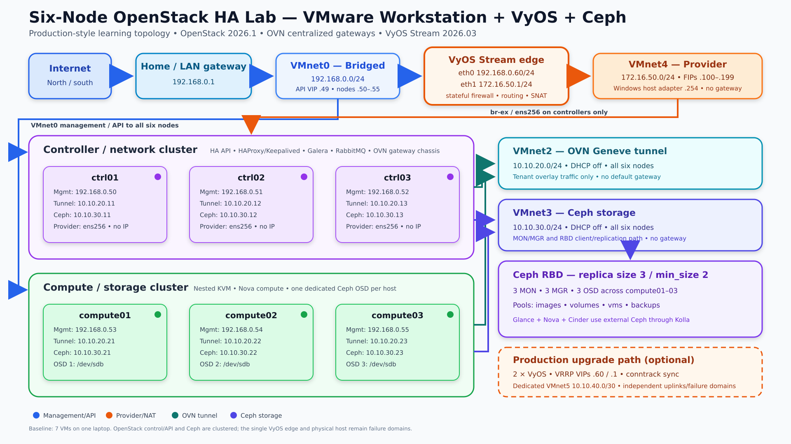
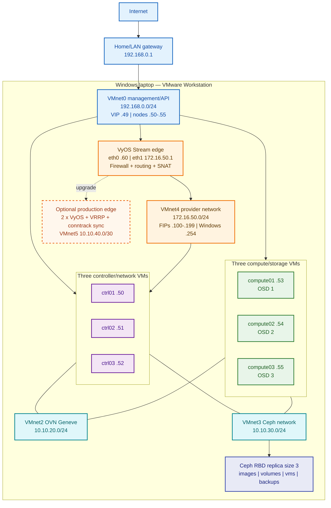

# Six-Node OpenStack HA Lab on VMware Workstation

## Kolla-Ansible 2026.1 + OVN + VyOS Stream + Ceph RBD

**Validated design date:** 22 September 2026  
**Revision:** Version 3 — replaced Cisco Catalyst 8000V with the free,
open-source VyOS Stream router/firewall; added ISO installation, stateful
firewall, NAT, backup, validation, troubleshooting, and an optional dual-VyOS
HA upgrade path; refreshed the architecture diagram and all dependent steps  
**OpenStack series:** 2026.1 “Gazpacho” (maintained SLURP release)  
**Deployment method:** Kolla-Ansible `stable/2026.1`  
**Host operating system:** CentOS Stream 10  
**Container base:** Rocky Linux 10 (`kolla_base_distro: "rocky"`)  
**Storage:** Ceph Tentacle with `cephadm`  
**OpenStack networking:** Neutron ML2/OVN, centralized external gateways  
**Lab platform:** VMware Workstation with nested virtualization
**VyOS image used by this revision:** Stream `2026.03` generic AMD64 ISO

> [!IMPORTANT]
> This is a **production-style learning topology**, not a real production
> platform. It copies production roles, quorum, network separation, HA APIs,
> and replicated storage. The laptop, VMware Workstation process, physical NIC,
> home gateway, and single VyOS virtual router are still single points of
> failure. Do not call this design site-resilient or use it for business data.

> [!CAUTION]
> Commands that create Ceph OSDs erase the selected disks. This guide assumes
> `/dev/sdb` is a new, empty virtual disk on each compute VM. Verify the device
> on every compute before running an OSD command.

---

## 0. VMware Workstation network setup — do this first

Complete this section before installing or configuring OpenStack. The same
network creation steps remain in Phase 1 so the original end-to-end procedure
is preserved; this top section gives you the exact Workstation settings before
you start creating or editing the VMs.

> [!IMPORTANT]
> Power off all seven VMs before adding, removing, or reordering virtual NICs.
> In each VM's settings, choose **Custom: Specific virtual network** and select
> the exact VMnet number. Choosing the generic **Host-only** option can attach a
> NIC to VMnet1 instead of VMnet2, VMnet3, or VMnet4.

### 0.1 Open the Virtual Network Editor as administrator

> [!NOTE]
> The **VM Settings → Network Adapter** window shown in the earlier screenshot
> only attaches a VM to a network. It never contains subnet-IP, subnet-mask, or
> VMware DHCP controls. Those fields are in **Edit → Virtual Network Editor**.
> Select **Change Settings** first; without elevation, some controls are hidden
> or read-only. If **Virtual Network Editor** is missing entirely, repair or
> install the full VMware Workstation package and run it as administrator.

1. Start VMware Workstation on the Windows laptop.
2. Select **Edit → Virtual Network Editor**.
3. Select **Change Settings** and approve the Windows administrator prompt.
4. Record the current VMnet0 bridge target before making any change.
5. Do not change VMnet0 to NAT or host-only. It must remain bridged to the
   physical Ethernet or Wi-Fi adapter that reaches gateway `192.168.0.1`.

### 0.2 Create VMnet2, VMnet3, and VMnet4

Use **Add Network** for each missing VMnet and configure the following values:

| VMnet | Workstation network type | Subnet IP | Mask | Host virtual adapter | Local VMware DHCP | Gateway/DNS on this VMnet |
|---|---|---|---|---|---|---|
| VMnet0 | Bridged to the active physical NIC | Existing `192.168.0.0` | `255.255.255.0` | Physical host uses its normal LAN NIC | Not used by this design | Existing LAN gateway `192.168.0.1` |
| VMnet2 | Host-only | `10.10.20.0` | `255.255.255.0` | Uncheck for stronger lab isolation; optional for troubleshooting | **Disabled** | None |
| VMnet3 | Host-only | `10.10.30.0` | `255.255.255.0` | Uncheck for stronger lab isolation; optional for troubleshooting | **Disabled** | None |
| VMnet4 | Host-only | `172.16.50.0` | `255.255.255.0` | **Enabled** so Windows can test floating IPs | **Disabled** | None on the Windows adapter |

For each of VMnet2, VMnet3, and VMnet4:

1. Select the VMnet in the Virtual Network Editor.
2. Select **Host-only (connect VMs internally in a private network)**.
3. Enter the subnet IP and mask from the table.
4. Clear **Use local DHCP service to distribute IP address to VMs**.
5. For VMnet2 and VMnet3, normally clear **Connect a host virtual adapter to
   this network**. If you keep it for troubleshooting, do not configure a
   gateway or DNS server on that Windows adapter and avoid the node IP ranges.
6. For VMnet4, select **Connect a host virtual adapter to this network**.
7. Select **Apply**, then **OK** after all three networks are correct.

Do not select VMware NAT for VMnet2, VMnet3, or VMnet4. North-south tenant
traffic must follow the production-style path through OVN, the controller
gateway chassis, VMnet4, and VyOS—not a hidden VMware NAT service.

### 0.3 Set the Windows VMnet4 adapter address

1. Press **Windows+R**, enter `ncpa.cpl`, and press Enter.
2. Open **VMware Network Adapter VMnet4 → Properties → Internet Protocol
   Version 4 (TCP/IPv4)**.
3. Configure IP address `172.16.50.254` and mask `255.255.255.0`.
4. Leave **Default gateway**, **Preferred DNS**, and **Alternate DNS** blank.
5. If VMware assigned `172.16.50.1`, replace it; `.1` is reserved for VyOS
   `eth1`.
6. Do not configure Windows IP addresses on the guest-only VMnet2 or VMnet3
   adapters unless you intentionally enabled them for troubleshooting.

Verify in PowerShell:

```powershell
Get-NetIPAddress -AddressFamily IPv4 |
  Where-Object InterfaceAlias -Like '*VMnet*' |
  Format-Table InterfaceAlias,IPAddress,PrefixLength

Get-NetIPConfiguration -InterfaceAlias 'VMware Network Adapter VMnet4'
```

VMnet4 must show `172.16.50.254/24` and no IPv4 default gateway.

### 0.4 Attach each VM's virtual NICs in a fixed order

Open **VM → Settings → Add → Network Adapter** and use the mapping below. For
every adapter, select **Connected** and **Connect at power on**.

| VM group | vNIC 1 | vNIC 2 | vNIC 3 | vNIC 4 | Extra disk |
|---|---|---|---|---|---|
| `ctrl01-03` | Custom VMnet0 | Custom VMnet2 | Custom VMnet3 | Custom VMnet4 | None required by this design |
| `compute01-03` | Custom VMnet0 | Custom VMnet2 | Custom VMnet3 | Not attached | New empty 100 GB or larger disk for `/dev/sdb` |
| `vyos-edge` | Custom VMnet0 (`eth0`) | Custom VMnet4 (`eth1`) | Not attached | Not attached | 10 GB or larger OS disk |

Keep the adapter type and order identical within each VM group. Open each
adapter's **Advanced** settings, record its MAC address, and later match those
MAC addresses to the CentOS interface names. The expected names in this guide
are `ens160`, `ens192`, `ens224`, and (controllers only) `ens256`, but the MAC
mapping—not the example name—is authoritative. Use **VMXNET3** adapters for
VyOS; its documentation warns of GRE/IPsec problems with the emulated E1000.

### 0.5 Pre-boot network checklist

- [ ] VMnet0 is bridged to the physical adapter that reaches `192.168.0.1`.
- [ ] VMnet2 is host-only `10.10.20.0/24`, with VMware DHCP disabled.
- [ ] VMnet3 is host-only `10.10.30.0/24`, with VMware DHCP disabled.
- [ ] VMnet4 is host-only `172.16.50.0/24`, with VMware DHCP disabled.
- [ ] Windows VMnet4 is `172.16.50.254/24`, with no gateway or DNS.
- [ ] Controllers have four vNICs; computes have three; VyOS has two.
- [ ] Every vNIC uses **Custom: Specific virtual network**, is connected, and
      connects at power-on.
- [ ] Compute nested virtualization and each compute's empty Ceph disk are
      configured before boot.

---

## 1. What you are building

The six CentOS Stream 10 VMs remain your OpenStack/Ceph nodes:

| VM | Existing VMnet0 IP | OpenStack role | Ceph role |
|---|---:|---|---|
| `ctrl01` | `192.168.0.50/24` | Controller + network + deployment host | MON + MGR |
| `ctrl02` | `192.168.0.51/24` | Controller + network | MON + MGR |
| `ctrl03` | `192.168.0.52/24` | Controller + network | MON + MGR |
| `compute01` | `192.168.0.53/24` | Nova compute | OSD on `/dev/sdb` |
| `compute02` | `192.168.0.54/24` | Nova compute | OSD on `/dev/sdb` |
| `compute03` | `192.168.0.55/24` | Nova compute | OSD on `/dev/sdb` |

Add one separate VyOS Stream VM. The public Stream ISO is downloadable without
any vendor account or subscription; this guide pins an exact image so the
commands remain repeatable.

| VM | Interface | VMware network | Address | Purpose |
|---|---|---|---:|---|
| `vyos-edge` | `eth0` | VMnet0 | `192.168.0.60/24` | Outside/LAN and management |
| `vyos-edge` | `eth1` | VMnet4 | `172.16.50.1/24` | OpenStack provider gateway |

The VyOS VM is therefore the **seventh VM**. Do not consume one of the six
OpenStack nodes for this purpose.

### 1.1 Very basic traffic explanation

1. You administer OpenStack through the HA API/Horizon VIP
   `192.168.0.49`.
2. OpenStack instances use a private tenant network such as `10.20.0.0/24`.
3. OVN routes tenant traffic through one of the three controller/network VMs.
4. The controller connects that traffic to VMnet4, the provider network.
5. VyOS receives the traffic at `172.16.50.1`, applies its stateful firewall,
   and performs source NAT/masquerade.
6. VyOS sends the translated traffic through VMnet0 to your existing gateway
   `192.168.0.1`, and then to the Internet.
7. Ceph stores images, VM disks, Cinder volumes, and backups across the three
   compute-node OSDs.

VyOS is an upstream Layer-3/firewall/NAT edge in this design. Kolla/Neutron
does not log in to or configure it; OpenStack controls OVN and `br-ex`, while
the VyOS configuration is managed independently.

### 1.2 Color architecture



The same topology is included below as copy-paste Mermaid source:



The downloadable PNG also marks the production upgrade path: deploy a second
VyOS VM, use VRRP virtual addresses and conntrack synchronization, and place
the routers and uplinks in independent failure domains. The executable steps
in this guide intentionally keep one edge VM so the base laptop build remains
practical; Section 8.7 gives the exact HA address plan and prerequisites.

---

## 2. Exact network layout

This guide assumes your existing LAN uses `192.168.0.0/24`. If the real subnet
mask is not `/24`, stop and replace it consistently before continuing.

### 2.1 VMware virtual networks

| VMware network | Type | Subnet | VMware DHCP | Connected devices | Purpose |
|---|---|---|---|---|---|
| VMnet0 | Bridged to the active physical NIC | `192.168.0.0/24` | Not used | All six nodes + VyOS `eth0` | SSH, Ansible, OpenStack APIs, Internet access |
| VMnet2 | Host-only | `10.10.20.0/24` | Disabled | All six nodes | OVN Geneve tunnels |
| VMnet3 | Host-only | `10.10.30.0/24` | Disabled | All six nodes | Ceph client/storage traffic |
| VMnet4 | Host-only | `172.16.50.0/24` | Disabled | Three controllers + VyOS `eth1` + Windows host adapter | Provider and floating IPs |

Do not configure a default gateway on VMnet2, VMnet3, or the OpenStack nodes'
VMnet4 interfaces. The only default gateway on each CentOS VM remains
`192.168.0.1` through VMnet0.

### 2.2 Node IP plan

The interface names below assume VMware presents adapters as `ens160`,
`ens192`, `ens224`, and `ens256`. You **must verify this mapping** by MAC address
before applying it.

| Host | `ens160` VMnet0 management | `ens192` VMnet2 tunnel | `ens224` VMnet3 Ceph | `ens256` VMnet4 provider |
|---|---:|---:|---:|---|
| `ctrl01` | `192.168.0.50/24` | `10.10.20.11/24` | `10.10.30.11/24` | Up, no IP |
| `ctrl02` | `192.168.0.51/24` | `10.10.20.12/24` | `10.10.30.12/24` | Up, no IP |
| `ctrl03` | `192.168.0.52/24` | `10.10.20.13/24` | `10.10.30.13/24` | Up, no IP |
| `compute01` | `192.168.0.53/24` | `10.10.20.21/24` | `10.10.30.21/24` | Not attached |
| `compute02` | `192.168.0.54/24` | `10.10.20.22/24` | `10.10.30.22/24` | Not attached |
| `compute03` | `192.168.0.55/24` | `10.10.20.23/24` | `10.10.30.23/24` | Not attached |

### 2.3 Shared and tenant addresses

| Item | Address/range |
|---|---|
| OpenStack internal API/Horizon VIP | `192.168.0.49` |
| Existing Internet gateway | `192.168.0.1` |
| VyOS outside/management | `192.168.0.60` |
| VyOS provider gateway | `172.16.50.1` |
| Windows VMnet4 host adapter | `172.16.50.254` |
| OpenStack floating-IP pool | `172.16.50.100-172.16.50.199` |
| Example tenant subnet | `10.20.0.0/24` |

Before using `.49`, `.60`, or the floating pool, reserve/exclude them from any
DHCP server and verify that they are unused.

From a Linux host on VMnet0, a duplicate-address check would be:

```bash
sudo arping -D -I <VMNET0_INTERFACE> -c 3 192.168.0.49
sudo arping -D -I <VMNET0_INTERFACE> -c 3 192.168.0.60
```

Expected result for an unused address is zero replies. From Windows, check your
router's DHCP lease table and use `ping` followed by `arp -a`; reserving the
addresses in the router is still required.

---

## 3. What is highly available

| Layer | HA method | One member may fail? |
|---|---|---:|
| OpenStack API VIP | Keepalived on three controllers | Yes |
| API traffic | HAProxy with three service backends | Yes |
| Database | Three-node MariaDB Galera | Yes |
| Messaging | Three-node RabbitMQ cluster | Yes |
| Keystone, Glance, Nova control, Neutron | Replicas across controllers | Yes |
| OVN databases/control | Three controller/network nodes | Yes |
| Images, VM disks, volumes, backups | Ceph RBD replica size 3, minimum size 2 | Yes, one OSD/compute |
| Running VM when a compute dies | Manual fenced evacuation in this baseline | Not automatic |
| Provider edge | One VyOS Stream VM in the baseline | No |
| Whole lab | One laptop/Workstation | No |

A failed compute causes its running instances to stop. Shared Ceph storage means
the disks remain available, but the VMs must be evacuated only after the failed
compute has been fenced or confirmed powered off.

---

## 4. Resource plan

Kolla's documented absolute minimum is 8 GB RAM and two interfaces per host,
but this multinode Ceph lab requires more. A practical allocation is:

| VM | vCPU | RAM | OS disk | Extra disk/NICs |
|---|---:|---:|---:|---|
| Each controller | 4 | 10-12 GB | 100 GB thin | Four vNICs total |
| Each compute | 6 | 12-16 GB | 100 GB thin | Three vNICs + one 100 GB or larger `/dev/sdb` |
| VyOS Stream edge | 2 | 4 GB | 10 GB thin | Two VMXNET3 vNICs |
| Optional second VyOS HA edge | 2 | 4 GB | 10 GB thin | Three VMXNET3 vNICs on both edge VMs after adding VMnet5 |

Recommended laptop capacity:

- 96 GB RAM minimum for a comfortable all-nodes-running lab; 128 GB preferred.
- 16 or more physical CPU threads.
- 1 TB SSD/NVMe with at least 500 GB free.
- Hardware virtualization enabled in BIOS/UEFI.
- VMware nested virtualization enabled on all three compute VMs.

With only 64 GB laptop RAM, a reduced 8 GB/controller and 10 GB/compute profile
may start, but memory pressure can make MariaDB, RabbitMQ, Ceph, or image pulls
fail unpredictably. Do not diagnose those failures as OpenStack defects until
host swapping and guest OOM events are ruled out.

Ceph replica size 3 means three 100 GB OSD disks provide roughly 100 GB usable
before metadata and recovery headroom—not 300 GB.

---

## 5. Phase 0 — safety and release gates

### 5.1 Confirm the operating system

Run on all six nodes:

```bash
cat /etc/os-release
uname -r
```

The OS must identify itself as **CentOS Stream 10**. “CentOS 10” is commonly
used informally, but Kolla's supported host entry is CentOS Stream 10.

Kolla does not publish CentOS Stream 10-based service images for this release;
the official support matrix recommends Rocky Linux 10 images. This is why the
guide later sets:

```yaml
kolla_base_distro: "rocky"
```

### 5.2 Record the current VM state

Before changing NICs or disks:

1. Shut down all six VMs cleanly.
2. Take a VMware snapshot named `before-openstack-networking`.
3. Record the MAC address of every current VMnet0 adapter.
4. Confirm the new Ceph disks contain no needed data.
5. Ensure `.49`, `.60`, and `172.16.50.100-199` are unused.

Snapshots are a lab convenience, not a backup strategy for a running Ceph
cluster. Do not snapshot/restore individual cluster members after Ceph and
Galera are active unless you understand quorum and time-consistency effects.

---

## 6. Phase 1 — create VMware networks

Open **VMware Workstation → Edit → Virtual Network Editor → Change Settings**.

### 6.1 Preserve VMnet0

Keep your working VMnet0 configuration:

- Type: Bridged.
- Bridge to: the physical Ethernet/Wi-Fi adapter that reaches
  `192.168.0.1`.
- Your existing static addresses `192.168.0.50-55` remain unchanged.

If “Automatic” bridging moves VMnet0 between physical adapters, select the
specific adapter instead. OpenStack HA is easier to troubleshoot when the
underlay does not change.

### 6.2 Create VMnet2

- Add Network: **VMnet2**.
- Select **Host-only**.
- Subnet IP: `10.10.20.0`.
- Subnet mask: `255.255.255.0`.
- Disable “Use local DHCP service”.
- A Windows host adapter is optional; it is not required by OpenStack.

### 6.3 Create VMnet3

- Add Network: **VMnet3**.
- Select **Host-only**.
- Subnet IP: `10.10.30.0`.
- Subnet mask: `255.255.255.0`.
- Disable “Use local DHCP service”.
- A Windows host adapter is optional.

### 6.4 Create VMnet4

- Add Network: **VMnet4**.
- Select **Host-only**.
- Subnet IP: `172.16.50.0`.
- Subnet mask: `255.255.255.0`.
- Disable “Use local DHCP service”.
- Enable the host virtual adapter so the Windows laptop can reach floating IPs.
- Set the Windows adapter to `172.16.50.254/24`, with **no gateway and no DNS**.

If VMware initially gives the host adapter `172.16.50.1`, change it because
`.1` belongs to VyOS `eth1`. In Windows, open `ncpa.cpl`, select **VMware Network
Adapter VMnet4**, and configure IPv4 manually.

### 6.5 Add adapters to the six VMs

Power off the VMs before adding adapters.

For each controller:

1. NIC 1 → VMnet0 (existing management).
2. NIC 2 → VMnet2 (OVN tunnel).
3. NIC 3 → VMnet3 (Ceph).
4. NIC 4 → VMnet4 (provider, no host IP).

For each compute:

1. NIC 1 → VMnet0.
2. NIC 2 → VMnet2.
3. NIC 3 → VMnet3.
4. Do not add VMnet4 in this centralized-gateway design.
5. Add a new, dedicated 100 GB or larger virtual disk for Ceph.

Use the same virtual NIC type and adapter order on equivalent nodes. Select
“Connected” and “Connect at power on” for every vNIC.

### 6.6 Enable nested virtualization on computes

For `compute01`, `compute02`, and `compute03`:

1. VM Settings → Processors.
2. Enable **Virtualize Intel VT-x/EPT or AMD-V/RVI**.
3. Enable virtualized CPU performance counters only if required for a separate
   exercise; OpenStack does not need them for this build.

Start all six VMs after completing the network changes.

---

## 7. Phase 2 — verify interface-to-VMnet mapping

On each CentOS VM:

```bash
ip -br link
nmcli device status
nmcli -f GENERAL.DEVICE,GENERAL.HWADDR,GENERAL.CONNECTION device show
```

In VMware Workstation, open each adapter's **Advanced** settings and compare its
MAC address with `GENERAL.HWADDR`. Build a mapping before assigning IPs.

Expected mapping in this guide:

```text
ens160  -> NIC 1 -> VMnet0
ens192  -> NIC 2 -> VMnet2
ens224  -> NIC 3 -> VMnet3
ens256  -> NIC 4 -> VMnet4 (controllers only)
```

If your names differ, replace them everywhere. Do not assume the fourth NIC is
`ens256` merely because this guide uses that name.

---

## 8. Phase 3 — install and configure the VyOS edge

### 8.1 Download the free VyOS Stream ISO

VyOS is an open-source routing and firewall platform. Its prebuilt LTS images
are subscription-oriented, but **VyOS Stream is available to everyone without
an account** and is the correct free image for this lab. Stream is a quarterly
technology preview intended for labs and non-critical production use; pin and
test a specific release instead of silently following nightly builds.

Use the official download page:

- [VyOS Stream downloads](https://vyos.net/get/stream/)
- Pinned image: [`vyos-2026.03-generic-amd64.iso`](https://community-downloads.vyos.dev/stream/2026.03/vyos-2026.03-generic-amd64.iso)
- Signature: [`vyos-2026.03-generic-amd64.iso.minisig`](https://community-downloads.vyos.dev/stream/2026.03/vyos-2026.03-generic-amd64.iso.minisig)

Download both files. If `minisign` is installed, verify the ISO with the public
key printed on the official VyOS Stream page:

```powershell
Set-Location "$HOME\Downloads"
minisign -Vm .\vyos-2026.03-generic-amd64.iso `
  -P RWTR1ty93Oyontk6caB9WqmiQC4fgeyd/ejgRxCRGd2MQej7nqebHneP
```

Continue only after `Signature and comment signature verified` is displayed.
If a newer Stream image exists, either use the pinned image above or revalidate
every VyOS command before changing this guide's version.

### 8.2 Create the VyOS VM in VMware Workstation

1. Select **File → New Virtual Machine → Custom**.
2. Select **I will install the operating system later**. Choose the closest
   available **64-bit Linux** guest type.
3. Name the VM `vyos-edge`.
4. Allocate 2 vCPU, 4 GB RAM, and a 10 GB or larger thin-provisioned disk.
5. Add two **VMXNET3** network adapters in this exact order:
   - vNIC 1 → **Custom: VMnet0** → expected VyOS interface `eth0`.
   - vNIC 2 → **Custom: VMnet4** → expected VyOS interface `eth1`.
6. Select **Connected** and **Connect at power on** for both adapters.
7. Attach `vyos-2026.03-generic-amd64.iso` to the virtual CD/DVD drive and
   enable **Connect at power on**.
8. Record both VMware MAC addresses from each adapter's **Advanced** dialog.
9. Boot the VM and choose the live-system entry.

VyOS documents 4 GB RAM and 10 GB storage as the current minimum. VMXNET3 is
preferred because VyOS documents GRE/IPsec issues with E1000 emulation.

### 8.3 Install VyOS to the virtual disk

The live-image credentials are username `vyos` and password `vyos`. At the
console:

```text
install image
```

Follow the wizard carefully:

1. Continue with installation and accept the default image name.
2. Set a strong, unique password for the `vyos` administrator.
3. Choose **KVM** as the default console for the Workstation graphical console.
4. Select the single 10 GB virtual disk shown by the wizard. The name may be
   `/dev/sda` or `/dev/vda`; select the displayed VM disk, not a guessed path.
5. Confirm erasure, use all free space, and use the default boot configuration.
6. When installation succeeds, disconnect the ISO from the virtual CD/DVD
   drive, then run:

```text
reboot
```

Log in with the new password and confirm the installed image and interfaces:

```text
show version
show interfaces
```

### 8.4 Verify interface order before assigning addresses

Match the MAC addresses reported by `show interfaces` to the MAC addresses
recorded in Workstation. This guide expects:

```text
eth0 -> vNIC 1 -> VMnet0 -> outside/management
eth1 -> vNIC 2 -> VMnet4 -> OpenStack provider network
```

If the mapping is reversed, either correct the vNIC order while the VM is off
or swap `eth0` and `eth1` in every VyOS command below. Do not continue with an
unverified mapping.

### 8.5 Configure routing, stateful firewall, NAT, and SSH

Perform the first configuration from the VMware console. The firewall permits
administration only from the management LAN, permits diagnostic ICMP from the
two connected networks, permits new provider-to-Internet forwarding, accepts
established/related return traffic, and drops every other new forwarded flow.

```text
configure

set system host-name 'vyos-edge'
set system domain-name 'openhelp.net'
set system name-server '192.168.0.1'
set system name-server '1.1.1.1'
set system time-zone 'UTC'

set interfaces ethernet eth0 description 'OUTSIDE_AND_MGMT_VMNET0'
set interfaces ethernet eth0 address '192.168.0.60/24'
set interfaces ethernet eth1 description 'OPENSTACK_PROVIDER_VMNET4'
set interfaces ethernet eth1 address '172.16.50.1/24'

set protocols static route 0.0.0.0/0 next-hop '192.168.0.1'

set service ssh port '22'
set service ssh listen-address '192.168.0.60'

set nat source rule 100 description 'SNAT_OPENSTACK_PROVIDER_TO_LAN'
set nat source rule 100 outbound-interface name 'eth0'
set nat source rule 100 source address '172.16.50.0/24'
set nat source rule 100 translation address 'masquerade'

set firewall global-options state-policy established action 'accept'
set firewall global-options state-policy related action 'accept'
set firewall global-options state-policy invalid action 'drop'

set firewall ipv4 input filter default-action 'drop'
set firewall ipv4 input filter rule 10 action 'accept'
set firewall ipv4 input filter rule 10 inbound-interface name 'lo'
set firewall ipv4 input filter rule 20 action 'accept'
set firewall ipv4 input filter rule 20 inbound-interface name 'eth0'
set firewall ipv4 input filter rule 20 protocol 'icmp'
set firewall ipv4 input filter rule 20 source address '192.168.0.0/24'
set firewall ipv4 input filter rule 30 action 'accept'
set firewall ipv4 input filter rule 30 inbound-interface name 'eth1'
set firewall ipv4 input filter rule 30 protocol 'icmp'
set firewall ipv4 input filter rule 30 source address '172.16.50.0/24'
set firewall ipv4 input filter rule 40 action 'accept'
set firewall ipv4 input filter rule 40 inbound-interface name 'eth0'
set firewall ipv4 input filter rule 40 protocol 'tcp'
set firewall ipv4 input filter rule 40 destination port '22'
set firewall ipv4 input filter rule 40 source address '192.168.0.0/24'

set firewall ipv4 forward filter default-action 'drop'
set firewall ipv4 forward filter rule 100 action 'accept'
set firewall ipv4 forward filter rule 100 inbound-interface name 'eth1'
set firewall ipv4 forward filter rule 100 outbound-interface name 'eth0'
set firewall ipv4 forward filter rule 100 source address '172.16.50.0/24'

commit
save
exit
```

`commit` activates the candidate configuration; `save` writes it to
`/config/config.boot` for the next boot. For later remote changes, prefer
`commit-confirm 5`, validate connectivity, run `confirm`, and then `save` so a
lost SSH session does not permanently lock you out.

For stronger administration, install an SSH public key for the `vyos` user,
test a second key-based session, and only then disable password authentication.
Keep the VMware console available as recovery access.

### 8.6 Validate and back up VyOS before OpenStack deployment

Run on VyOS in operational mode:

```text
show interfaces
show ip route
show configuration commands | match "interfaces ethernet|protocols static|nat source|service ssh"
show firewall ipv4 input filter
show firewall ipv4 forward filter
ping 192.168.0.1
ping 1.1.1.1
```

Expected routing pattern:

```text
S>* 0.0.0.0/0 ... via 192.168.0.1, eth0
C>* 172.16.50.0/24 ... eth1
C>* 192.168.0.0/24 ... eth0
```

From the Windows laptop:

```powershell
ping 192.168.0.60
ping 172.16.50.1
Test-NetConnection 192.168.0.60 -Port 22
```

Both addresses and TCP/22 must work before creating the OpenStack public
network. The NAT table will remain empty until OpenStack sends traffic. Back up
the saved configuration from a trusted Windows or Linux machine:

```powershell
scp vyos@192.168.0.60:/config/config.boot .\vyos-edge-config.boot
```

Store that file encrypted; it can contain password hashes, keys, and other
security-sensitive configuration.

### 8.7 Optional production-style dual-VyOS upgrade

The executable baseline deliberately uses one VyOS VM, matching the original
single-edge layout. To remove that edge VM as a single point of failure,
schedule a maintenance window and convert it to this active/standby design:

This adds one 2-vCPU/4-GB/10-GB VyOS VM (eight VMs total). Reserve `.61`, `.62`,
`.2`, and `.3`, verify that they are unused, and take encrypted configuration
backups before changing the live gateway addresses.

| Function | Shared virtual address | `vyos-edge-a` | `vyos-edge-b` |
|---|---:|---:|---:|
| VMnet0 outside | `192.168.0.60/24` | `192.168.0.61/24` | `192.168.0.62/24` |
| VMnet4 provider | `172.16.50.1/24` | `172.16.50.2/24` | `172.16.50.3/24` |
| Dedicated VMnet5 state sync | None | `10.10.40.1/30` | `10.10.40.2/30` |

Required implementation controls:

1. Add isolated VMnet5 `10.10.40.0/30`, DHCP off, no Windows host adapter.
2. Give each router a third VMXNET3 adapter (`eth2`) on VMnet5.
3. Replace the baseline physical interface addresses with the per-router
   addresses above; make `.60` and `.1` VRRP addresses.
4. Create two VRRP groups—one on `eth0`, one on `eth1`—with different VRIDs,
   identical priority per router, and one sync group so both sides fail over
   together. Use priority 200 on A and 100 on B.
5. Track the opposite data interface in each VRRP group. If VMware multicast is
   unreliable, use VyOS unicast VRRP with `peer-address` and
   `hello-source-address`.
6. Configure conntrack synchronization over `eth2` in unicast mode, bind it to
   the VRRP sync group, enable `startup-resync`, and allow UDP/3780 only from
   the peer on VMnet5.
7. On both routers, change NAT rule 100 from `masquerade` to the fixed virtual
   translation address `192.168.0.60`; otherwise a failover changes the source
   IP and existing sessions cannot survive.
8. Permit VRRP protocol 112 only between the two peer addresses on VMnet0 and
   VMnet4. Keep SSH limited to the management subnet.
9. Validate `show vrrp`, `show conntrack-sync statistics`, firewall counters,
   NAT sessions, and a controlled failover while a long-lived tenant flow is
   active. Restore full health before any other failure test.

This pair improves router-service availability but is still not independent
infrastructure when both VMs, both virtual switches, and both uplinks live on
one laptop. A real production design places the routers, switches, power, and
uplinks in separate failure domains.

---

## 9. Phase 4 — configure CentOS networking

Perform this phase from the VMware console when possible. An error on the
VMnet0 address or default route can disconnect SSH.

### 9.1 Select the node-specific values

On each node, run only its matching block.

`ctrl01`:

```bash
export NODE_NAME=ctrl01
export MGMT_IP=192.168.0.50
export TUNNEL_IP=10.10.20.11
export STORAGE_IP=10.10.30.11
export NODE_ROLE=controller
```

`ctrl02`:

```bash
export NODE_NAME=ctrl02
export MGMT_IP=192.168.0.51
export TUNNEL_IP=10.10.20.12
export STORAGE_IP=10.10.30.12
export NODE_ROLE=controller
```

`ctrl03`:

```bash
export NODE_NAME=ctrl03
export MGMT_IP=192.168.0.52
export TUNNEL_IP=10.10.20.13
export STORAGE_IP=10.10.30.13
export NODE_ROLE=controller
```

`compute01`:

```bash
export NODE_NAME=compute01
export MGMT_IP=192.168.0.53
export TUNNEL_IP=10.10.20.21
export STORAGE_IP=10.10.30.21
export NODE_ROLE=compute
```

`compute02`:

```bash
export NODE_NAME=compute02
export MGMT_IP=192.168.0.54
export TUNNEL_IP=10.10.20.22
export STORAGE_IP=10.10.30.22
export NODE_ROLE=compute
```

`compute03`:

```bash
export NODE_NAME=compute03
export MGMT_IP=192.168.0.55
export TUNNEL_IP=10.10.20.23
export STORAGE_IP=10.10.30.23
export NODE_ROLE=compute
```

Set the verified local interface names. Change these values if the MAC-address
mapping from Section 7 differs:

```bash
export MGMT_IF=ens160
export TUNNEL_IF=ens192
export STORAGE_IF=ens224
export PROVIDER_IF=ens256
```

Check the variables before making changes:

```bash
printf '%s\n' \
  "node=$NODE_NAME role=$NODE_ROLE" \
  "mgmt=$MGMT_IF:$MGMT_IP" \
  "tunnel=$TUNNEL_IF:$TUNNEL_IP" \
  "storage=$STORAGE_IF:$STORAGE_IP"
```

### 9.2 Set the hostname

```bash
sudo hostnamectl set-hostname "$NODE_NAME"
hostnamectl
```

### 9.3 Configure the existing VMnet0 profile

Find the active connection bound to the management device:

```bash
MGMT_CON="$(nmcli -g GENERAL.CONNECTION device show "$MGMT_IF")"
printf 'Management connection: %s\n' "$MGMT_CON"
```

The result must not be blank or `--`. Then configure it:

```bash
sudo nmcli connection modify "$MGMT_CON" \
  connection.id mgmt \
  connection.interface-name "$MGMT_IF" \
  ipv4.method manual \
  ipv4.addresses "$MGMT_IP/24" \
  ipv4.gateway 192.168.0.1 \
  ipv4.dns "192.168.0.1 1.1.1.1" \
  ipv4.never-default no \
  ipv6.method disabled \
  connection.autoconnect yes

sudo nmcli connection up mgmt
```

### 9.4 Configure the OVN tunnel profile

The following is safe to rerun because it creates the profile only when it is
missing, then applies the desired values:

```bash
nmcli -t -f NAME connection show | grep -qx tunnel || \
  sudo nmcli connection add type ethernet ifname "$TUNNEL_IF" con-name tunnel

sudo nmcli connection modify tunnel \
  connection.interface-name "$TUNNEL_IF" \
  ipv4.method manual \
  ipv4.addresses "$TUNNEL_IP/24" \
  ipv4.never-default yes \
  ipv6.method disabled \
  connection.autoconnect yes

sudo nmcli connection up tunnel
```

### 9.5 Configure the Ceph profile

```bash
nmcli -t -f NAME connection show | grep -qx storage || \
  sudo nmcli connection add type ethernet ifname "$STORAGE_IF" con-name storage

sudo nmcli connection modify storage \
  connection.interface-name "$STORAGE_IF" \
  ipv4.method manual \
  ipv4.addresses "$STORAGE_IP/24" \
  ipv4.never-default yes \
  ipv6.method disabled \
  connection.autoconnect yes

sudo nmcli connection up storage
```

### 9.6 Configure the provider interface on controllers only

Run this only when `NODE_ROLE=controller`:

```bash
if [ "$NODE_ROLE" = controller ]; then
  nmcli -t -f NAME connection show | grep -qx provider || \
    sudo nmcli connection add type ethernet ifname "$PROVIDER_IF" con-name provider

  sudo nmcli connection modify provider \
    connection.interface-name "$PROVIDER_IF" \
    ipv4.method disabled \
    ipv6.method disabled \
    connection.autoconnect yes

  sudo nmcli connection up provider
fi
```

The provider device must show `UP` but must have no IPv4/IPv6 address. Kolla
later attaches it to Open vSwitch bridge `br-ex`.

### 9.7 Verify each node

```bash
ip -br address
ip route
nmcli connection show --active
ping -c 3 192.168.0.1
ping -c 3 1.1.1.1
getent hosts docs.openstack.org
```

Expected routing pattern:

```text
default via 192.168.0.1 dev ens160
10.10.20.0/24 dev ens192 ...
10.10.30.0/24 dev ens224 ...
192.168.0.0/24 dev ens160 ...
```

There must be exactly one default route. Controllers also show `ens256` up
without an IP address.

---

## 10. Phase 5 — prepare CentOS on all six nodes

### 10.1 Configure consistent local name resolution

Until you have proper DNS records, append the following once to `/etc/hosts` on
all six nodes:

```bash
sudo tee -a /etc/hosts >/dev/null <<'EOF'

# OpenStack six-node lab
192.168.0.49 openstack-api.openhelp.net openstack-api
192.168.0.50 ctrl01.openhelp.net ctrl01
192.168.0.51 ctrl02.openhelp.net ctrl02
192.168.0.52 ctrl03.openhelp.net ctrl03
192.168.0.53 compute01.openhelp.net compute01
192.168.0.54 compute02.openhelp.net compute02
192.168.0.55 compute03.openhelp.net compute03
192.168.0.60 vyos-edge.openhelp.net vyos-edge
EOF
```

If you rerun the block, remove duplicate lab entries afterward. RabbitMQ needs
the controller hostnames to resolve consistently.

Validate:

```bash
getent hosts ctrl01 ctrl02 ctrl03 compute01 compute02 compute03
hostname -f
```

### 10.2 Update packages and install prerequisites

Run on all six nodes:

```bash
sudo dnf update -y
sudo dnf install -y \
  NetworkManager chrony curl git lvm2 openssh-server firewalld \
  python3 python3-pip python3-libselinux

sudo systemctl enable --now NetworkManager chronyd sshd firewalld
sudo reboot
```

After reboot:

```bash
chronyc tracking
chronyc sources -v
timedatectl
```

All six clocks must agree. Galera, RabbitMQ, Keystone tokens, TLS, and log
correlation are unreliable when time differs.

### 10.3 Disable SELinux as required by Kolla

Current Kolla documentation still states that SELinux must be disabled until
complete container policies are available.

```bash
sudo setenforce 0 || true
sudo sed -ri 's/^SELINUX=.*/SELINUX=disabled/' /etc/selinux/config
grep '^SELINUX=' /etc/selinux/config
```

Reboot once more if `getenforce` does not report `Disabled`:

```bash
sudo reboot
getenforce
```

### 10.4 Keep firewalld enabled for the lab

Kolla can work with firewalld when configured correctly. For this isolated lab,
place the three private cluster interfaces in `trusted`. VMnet0 is also trusted
here to avoid blocking VRRP/API/cluster ports; do not copy that broad trust to
an untrusted production LAN.

Run on all nodes:

```bash
sudo firewall-cmd --permanent --zone=trusted --change-interface=ens160
sudo firewall-cmd --permanent --zone=trusted --change-interface=ens192
sudo firewall-cmd --permanent --zone=trusted --change-interface=ens224
sudo firewall-cmd --reload
sudo firewall-cmd --get-active-zones
```

If your verified names differ, use those names. Do not assign `ens256` a host
IP or normal routed firewall role; Kolla/OVS owns it after deployment.

### 10.5 Create the automation account

Run on all six nodes:

```bash
id cloudadmin >/dev/null 2>&1 || \
  sudo useradd --create-home --shell /bin/bash cloudadmin

sudo passwd cloudadmin
echo 'cloudadmin ALL=(ALL) NOPASSWD: ALL' | \
  sudo tee /etc/sudoers.d/cloudadmin >/dev/null
sudo chmod 0440 /etc/sudoers.d/cloudadmin
sudo visudo --check
```

Use the same temporary password only long enough to install SSH keys, then lock
password SSH authentication according to your lab access plan.

### 10.6 Verify nested KVM on computes

Run on each compute:

```bash
egrep -c '(vmx|svm)' /proc/cpuinfo
ls -l /dev/kvm
lsmod | grep -E '^kvm'
```

Expected:

- CPU flag count greater than zero.
- `/dev/kvm` exists.
- `kvm_intel` or `kvm_amd` is loaded.

If these tests fail, power off the compute and recheck the VMware nested
virtualization setting. As a last-resort functional fallback, later set
`nova_compute_virt_type: "qemu"`; it will be much slower and is not the intended
production-like path.

### 10.7 Verify the new Ceph disks

Run on every compute:

```bash
lsblk -e7 -o NAME,PATH,SIZE,TYPE,FSTYPE,MOUNTPOINTS,MODEL,SERIAL
sudo wipefs --no-act /dev/sdb
sudo pvs
sudo vgs
sudo lvs
```

`/dev/sdb` must be the new unmounted Ceph disk. If it contains a filesystem,
partition, LVM signature, or needed data, stop. Do not change the later OSD
commands until the correct device has been identified.

---

## 11. Phase 6 — configure SSH from `ctrl01`

Log in to `ctrl01` as `cloudadmin` and create a key:

```bash
ssh-keygen -t ed25519 -a 100 -f ~/.ssh/id_ed25519
```

Copy it to all six nodes:

```bash
ssh-copy-id cloudadmin@ctrl01
ssh-copy-id cloudadmin@ctrl02
ssh-copy-id cloudadmin@ctrl03
ssh-copy-id cloudadmin@compute01
ssh-copy-id cloudadmin@compute02
ssh-copy-id cloudadmin@compute03
```

Test SSH and passwordless sudo:

```bash
for host in ctrl01 ctrl02 ctrl03 compute01 compute02 compute03; do
  ssh "$host" 'printf "%s: " "$(hostname)"; sudo -n true && echo OK'
done
```

Expected:

```text
ctrl01: OK
ctrl02: OK
ctrl03: OK
compute01: OK
compute02: OK
compute03: OK
```

Do not continue until all six succeed without password or host-key prompts.

---

## 12. Phase 7 — install Kolla-Ansible on `ctrl01`

Run the entire section as `cloudadmin` on `ctrl01`.

### 12.1 Install build dependencies

```bash
sudo dnf install -y \
  git python3-devel libffi-devel gcc openssl-devel python3-libselinux
```

### 12.2 Create a dedicated Python virtual environment

```bash
sudo python3 -m venv /opt/kolla-venv
sudo chown -R cloudadmin:cloudadmin /opt/kolla-venv
source /opt/kolla-venv/bin/activate
python -m pip install --upgrade pip
```

### 12.3 Install the matching stable branch

```bash
pip install 'git+https://opendev.org/openstack/kolla-ansible@stable/2026.1'
kolla-ansible install-deps
kolla-ansible --version
```

Do not mix Kolla branches, container image tags, upper constraints, or upgrade
instructions from different OpenStack series.

### 12.4 Create the configuration tree

```bash
sudo mkdir -p /etc/kolla /opt/openstack/inventory
sudo chown -R cloudadmin:cloudadmin /etc/kolla /opt/openstack

cp -r /opt/kolla-venv/share/kolla-ansible/etc_examples/kolla/* /etc/kolla/
cp /opt/kolla-venv/share/kolla-ansible/ansible/inventory/multinode \
  /opt/openstack/inventory/multinode

kolla-genpwd
chmod 0600 /etc/kolla/passwords.yml
```

Back up `/etc/kolla/passwords.yml` to encrypted offline storage. Never commit
it to Git or paste its contents into chat/tickets.

Optional shell convenience:

```bash
echo 'source /opt/kolla-venv/bin/activate' >> ~/.bashrc
```

---

## 13. Phase 8 — build the Kolla inventory

Edit `/opt/openstack/inventory/multinode`. Replace only the initial host lists
for the role groups shown below. Keep all child-group definitions from the
sample inventory.

```ini
[control]
ctrl01 ansible_host=192.168.0.50 ansible_user=cloudadmin ansible_become=true
ctrl02 ansible_host=192.168.0.51 ansible_user=cloudadmin ansible_become=true
ctrl03 ansible_host=192.168.0.52 ansible_user=cloudadmin ansible_become=true

[network]
ctrl01
ctrl02
ctrl03

[compute]
compute01 ansible_host=192.168.0.53 ansible_user=cloudadmin ansible_become=true
compute02 ansible_host=192.168.0.54 ansible_user=cloudadmin ansible_become=true
compute03 ansible_host=192.168.0.55 ansible_user=cloudadmin ansible_become=true

[monitoring]
ctrl01
ctrl02
ctrl03

[storage]
ctrl01
ctrl02
ctrl03

[deployment]
localhost ansible_connection=local
```

In the unmodified 2026.1 sample inventory, `cinder-volume` and `cinder-backup`
inherit from `cinder`, and `cinder` inherits from `control`, so the services run
on the three controllers. Keeping the same controllers in the `storage` group
makes the intended storage-service placement explicit and remains compatible
with the external-Ceph inventory guidance. It does **not** place Ceph OSDs on
the controllers; the OSDs remain on the three computes and are managed
separately by `cephadm`.

Validate inventory and connectivity:

```bash
source /opt/kolla-venv/bin/activate
ansible-inventory -i /opt/openstack/inventory/multinode --graph
ansible -i /opt/openstack/inventory/multinode all -m ping
ansible -i /opt/openstack/inventory/multinode all -a 'hostname -f'
```

Every host must return `SUCCESS` and its correct name.

### 13.1 Validate all three private networks with Ansible

```bash
ansible -i /opt/openstack/inventory/multinode all -a 'ip -br address'

for host in ctrl01 ctrl02 ctrl03 compute01 compute02 compute03; do
  ssh "$host" 'ping -c 1 10.10.20.11; ping -c 1 10.10.30.11'
done
```

Then test controller provider reachability before it becomes an OVS bridge:

```bash
for host in ctrl01 ctrl02 ctrl03; do
  ssh "$host" 'ip link show ens256'
done
```

The link must be `UP`, with no host IP address.

---

## 14. Phase 9 — configure `/etc/kolla/globals.yml`

Run on `ctrl01` as `cloudadmin`. Save the following as
`/etc/kolla/globals.yml`:

```yaml
---

# CentOS Stream 10 is the host OS. Official prebuilt CS10 service images are
# not published for this series, so use the recommended Rocky Linux 10 images.
kolla_base_distro: "rocky"
kolla_container_engine: "docker"

# VMnet0 carries management, internal APIs, Ansible, and default-route traffic.
network_interface: "ens160"
api_interface: "ens160"

# Dedicated OVN tunnel network.
tunnel_interface: "ens192"

# Kolla-Ansible 2026.1 removed the deprecated storage_interface variable.
# External Ceph reaches mon_host 10.10.30.11-13 through the host's connected
# 10.10.30.0/24 route on ens224, so do not add storage_interface here.

# Only controller/network nodes have ens256 in this centralized-gateway design.
neutron_external_interface: "ens256"
neutron_bridge_name: "br-ex"
neutron_physical_networks: "physnet1"

# Must be unused and reserved on the VMnet0 Layer-2 network.
kolla_internal_vip_address: "192.168.0.49"
keepalived_virtual_router_id: "51"

# HAProxy and Keepalived are enabled by default; explicit here for clarity.
enable_haproxy: true
enable_keepalived: true
haproxy_host_ipv4_tcp_retries2: 6

# Preserve the firewalld configuration prepared earlier.
disable_firewall: false

# Modern Neutron networking with centralized floating-IP gateways.
neutron_plugin_agent: "ovn"
neutron_ovn_distributed_fip: false
enable_neutron_provider_networks: false

# Nested virtualization. Change to qemu only if /dev/kvm cannot be exposed.
nova_compute_virt_type: "kvm"

# Dashboard.
enable_horizon: true

# External Ceph provides all OpenStack block/image/guest storage.
enable_cinder: true
enable_cinder_backup: true
cinder_backend_ceph: true
cinder_cluster_name: "cinder-ceph-cluster"
glance_backend_ceph: true
nova_backend_ceph: true

ceph_glance_user: "glance"
ceph_glance_pool_name: "images"

ceph_cinder_user: "cinder"
ceph_cinder_pool_name: "volumes"

ceph_cinder_backup_user: "cinder-backup"
ceph_cinder_backup_pool_name: "backups"

ceph_nova_user: "nova"
ceph_nova_pool_name: "vms"

# Enable supported hot backups of the Galera database.
enable_mariabackup: true
```

The VMnet3/`ens224` configuration from Phase 4 remains mandatory. Kolla does
not require a `storage_interface` global for an external Ceph cluster; the
generated `ceph.conf` supplies the monitor addresses and the CentOS routing
table selects `ens224` for `10.10.30.0/24`.

If actual interface names differ between host groups, do not force an incorrect
global value. Put per-host or per-group interface settings in inventory
`host_vars`/`group_vars`, as documented by Kolla.

Validate YAML:

```bash
python - <<'PY'
import yaml
with open('/etc/kolla/globals.yml', encoding='utf-8') as stream:
    yaml.safe_load(stream)
print('globals.yml syntax: OK')
PY
```

### 14.1 Why computes do not have VMnet4

The `network` group contains the three controllers. Kolla uses the external
interface on those nodes. Because distributed floating IPs and direct provider
networks on computes are disabled, computes do not need `ens256`.

This produces a centralized north-south path:

```text
instance -> compute OVN -> Geneve -> controller OVN gateway
         -> br-ex/ens256 -> VMnet4 -> VyOS -> VMnet0 -> Internet
```

---

## 15. Phase 10 — bootstrap the OpenStack hosts

Kolla bootstrapping installs and configures host-level dependencies, including
the supported container runtime configuration.

```bash
source /opt/kolla-venv/bin/activate
kolla-ansible bootstrap-servers -i /opt/openstack/inventory/multinode
```

Verify Docker on all nodes:

```bash
ansible -i /opt/openstack/inventory/multinode all \
  -a 'sudo systemctl is-active docker'

ansible -i /opt/openstack/inventory/multinode all \
  -a 'sudo docker version'

ansible -i /opt/openstack/inventory/multinode all \
  -a 'sudo docker info'
```

These brace-free Ansible commands avoid a conflict between Docker's Go-template
`{{...}}` syntax and Ansible's Jinja parser.

Do **not** run `kolla-ansible deploy` yet. First create Ceph and supply its
configuration and keys to Kolla.

---

## 16. Phase 11 — deploy Ceph with cephadm

Kolla-Ansible integrates with an existing external Ceph cluster; it does not
provision Ceph itself. This phase uses Ceph's own `cephadm` orchestrator.

### 16.1 Install the maintained Ceph series on `ctrl01`

```bash
sudo dnf search release-ceph
sudo dnf install -y centos-release-ceph-tentacle
sudo dnf install -y cephadm ceph-common
cephadm version
```

At the review date, Tentacle `20.2.4` is the current maintained release. The
repository command deliberately follows Ceph's documented CentOS Stream path.
Pin and test patch updates before treating any real environment as production.

### 16.2 Bootstrap the first monitor and manager

Use the Ceph/storage IP of `ctrl01`, not VMnet0:

```bash
sudo cephadm bootstrap \
  --mon-ip 10.10.30.11 \
  --ssh-user cloudadmin \
  --log-to-file
```

Check the initial cluster:

```bash
sudo ceph -s
sudo ceph orch host ls
sudo ceph orch ps
```

Do not combine the distribution-specific `centos-release-ceph-tentacle` method
with `cephadm add-repo`; Ceph documents those as alternative installation
methods.

### 16.3 Authorize cephadm on the other nodes

Bootstrap creates `/etc/ceph/ceph.pub`. Copy this public key to the
passwordless-sudo `cloudadmin` account on the remaining nodes:

```bash
sudo install -m 0644 -o cloudadmin -g cloudadmin \
  /etc/ceph/ceph.pub /tmp/ceph.pub

ssh-copy-id -f -i /tmp/ceph.pub cloudadmin@ctrl02
ssh-copy-id -f -i /tmp/ceph.pub cloudadmin@ctrl03
ssh-copy-id -f -i /tmp/ceph.pub cloudadmin@compute01
ssh-copy-id -f -i /tmp/ceph.pub cloudadmin@compute02
ssh-copy-id -f -i /tmp/ceph.pub cloudadmin@compute03

rm -f /tmp/ceph.pub
```

### 16.4 Add all nodes with their storage-network addresses

`ctrl01` already exists from bootstrap:

```bash
sudo ceph orch host add ctrl02 10.10.30.12
sudo ceph orch host add ctrl03 10.10.30.13
sudo ceph orch host add compute01 10.10.30.21
sudo ceph orch host add compute02 10.10.30.22
sudo ceph orch host add compute03 10.10.30.23

sudo ceph orch host label add ctrl02 _admin
sudo ceph orch host label add ctrl03 _admin
sudo ceph orch host ls
```

Expected host count: six. The `_admin` label places administrative Ceph config
and keyring files on all three controllers.

### 16.5 Place MON and MGR daemons on the controllers

```bash
sudo ceph config set mon public_network 10.10.30.0/24
sudo ceph orch apply mon --placement="ctrl01,ctrl02,ctrl03"
sudo ceph orch apply mgr --placement="ctrl01,ctrl02,ctrl03"
```

Wait until the cluster converges:

```bash
sudo ceph orch ps --daemon-type mon
sudo ceph orch ps --daemon-type mgr
sudo ceph quorum_status --format json-pretty
sudo ceph -s
```

The quorum must contain three monitors before continuing.

### 16.6 Re-verify the OSD devices

```bash
sudo ceph orch device ls --wide
```

The row for `/dev/sdb` on each compute must report `Available: Yes`. If it does
not, inspect the rejection reasons. Never replace `/dev/sdb` blindly with a
different path.

### 16.7 Create exactly three OSDs

> [!WARNING]
> The next commands erase the selected devices.

```bash
sudo ceph orch daemon add osd compute01:/dev/sdb
sudo ceph orch daemon add osd compute02:/dev/sdb
sudo ceph orch daemon add osd compute03:/dev/sdb
```

Do not use `--all-available-devices` in a learning cluster where another disk
might be attached later.

Verify:

```bash
sudo ceph -s
sudo ceph osd tree
sudo ceph osd df tree
```

Expected steady state:

```text
3 mons in quorum
3 mgr daemons (one active, standbys available)
3 osds: 3 up, 3 in
```

### 16.8 Limit Ceph memory on hyperconverged computes

Nova and Ceph share the compute VMs, so start with a conservative autotune
ratio:

```bash
sudo ceph config set mgr mgr/cephadm/autotune_memory_target_ratio 0.2
sudo ceph config set osd osd_memory_target_autotune true
```

This is a lab starting point, not a universal production value. Tune it using
measured VM, OSD, and host memory pressure.

### 16.9 Create RBD pools

Modern Ceph can choose initial PG counts and autoscale them:

```bash
sudo ceph osd pool create images
sudo ceph osd pool create volumes
sudo ceph osd pool create vms
sudo ceph osd pool create backups

sudo rbd pool init images
sudo rbd pool init volumes
sudo rbd pool init vms
sudo rbd pool init backups

for pool in images volumes vms backups; do
  sudo ceph osd pool set "$pool" size 3
  sudo ceph osd pool set "$pool" min_size 2
  sudo ceph osd pool set "$pool" pg_autoscale_mode on
done
```

Verify:

```bash
sudo ceph osd pool ls detail
sudo ceph osd pool autoscale-status
sudo ceph df
sudo ceph osd crush rule dump replicated_rule
```

Confirm the replicated CRUSH rule uses `host` as its failure domain so replicas
land on different compute hosts. Remember that the three virtual disks still
share one physical laptop storage device, so this is logical—not physical—disk
fault isolation.

### 16.10 Create least-privilege OpenStack Ceph users

```bash
sudo ceph auth get-or-create client.glance \
  mon 'profile rbd' \
  osd 'profile rbd pool=images' \
  mgr 'profile rbd pool=images'

sudo ceph auth get-or-create client.cinder \
  mon 'profile rbd' \
  osd 'profile rbd pool=volumes, profile rbd pool=vms, profile rbd-read-only pool=images' \
  mgr 'profile rbd pool=volumes, profile rbd pool=vms'

sudo ceph auth get-or-create client.cinder-backup \
  mon 'profile rbd' \
  osd 'profile rbd pool=backups' \
  mgr 'profile rbd pool=backups'

sudo ceph auth get-or-create client.nova \
  mon 'profile rbd' \
  osd 'profile rbd pool=vms, profile rbd-read-only pool=images' \
  mgr 'profile rbd pool=vms'
```

List identities without printing secret key material:

```bash
sudo ceph auth ls | grep '^client\.'
```

Expected service identities include:

```text
client.glance
client.cinder
client.cinder-backup
client.nova
```

---

## 17. Phase 12 — integrate Ceph with Kolla

Run on `ctrl01`.

### 17.1 Create Kolla override directories

```bash
sudo install -d -m 0750 -o cloudadmin -g cloudadmin \
  /etc/kolla/config/glance \
  /etc/kolla/config/cinder/cinder-volume \
  /etc/kolla/config/cinder/cinder-backup \
  /etc/kolla/config/nova
```

### 17.2 Generate a clean minimal `ceph.conf`

Kolla warns that leading tabs from `ceph config generate-minimal-conf` break
its INI parser. Remove only the leading tab:

```bash
sudo ceph config generate-minimal-conf | sed 's/^\t//' > /tmp/ceph.conf.kolla

cp /tmp/ceph.conf.kolla /etc/kolla/config/glance/ceph.conf
cp /tmp/ceph.conf.kolla /etc/kolla/config/cinder/ceph.conf
cp /tmp/ceph.conf.kolla /etc/kolla/config/nova/ceph.conf
rm -f /tmp/ceph.conf.kolla
```

Inspect it:

```bash
sed -n '1,100p' /etc/kolla/config/glance/ceph.conf
```

`mon_host` must contain reachable `10.10.30.11-13` monitor addresses.

### 17.3 Export the required keyrings

```bash
sudo ceph auth get client.glance \
  -o /etc/kolla/config/glance/ceph.client.glance.keyring

sudo ceph auth get client.cinder \
  -o /etc/kolla/config/cinder/cinder-volume/ceph.client.cinder.keyring

sudo ceph auth get client.cinder \
  -o /etc/kolla/config/cinder/cinder-backup/ceph.client.cinder.keyring

sudo ceph auth get client.cinder-backup \
  -o /etc/kolla/config/cinder/cinder-backup/ceph.client.cinder-backup.keyring

sudo ceph auth get client.cinder \
  -o /etc/kolla/config/nova/ceph.client.cinder.keyring

sudo ceph auth get client.nova \
  -o /etc/kolla/config/nova/ceph.client.nova.keyring
```

Protect them while allowing the deployment user to read them:

```bash
sudo chown -R cloudadmin:cloudadmin /etc/kolla/config
find /etc/kolla/config -name '*.keyring' -exec chmod 0600 {} \;
find /etc/kolla/config -name 'ceph.conf' -exec chmod 0640 {} \;
```

Verify exact paths:

```bash
find /etc/kolla/config -maxdepth 4 -type f -printf '%m %p\n' | sort
```

Expected files:

```text
/etc/kolla/config/glance/ceph.conf
/etc/kolla/config/glance/ceph.client.glance.keyring
/etc/kolla/config/cinder/ceph.conf
/etc/kolla/config/cinder/cinder-volume/ceph.client.cinder.keyring
/etc/kolla/config/cinder/cinder-backup/ceph.client.cinder.keyring
/etc/kolla/config/cinder/cinder-backup/ceph.client.cinder-backup.keyring
/etc/kolla/config/nova/ceph.conf
/etc/kolla/config/nova/ceph.client.cinder.keyring
/etc/kolla/config/nova/ceph.client.nova.keyring
```

Never display keyring contents in a ticket, terminal recording, or chat.

---

## 18. Phase 13 — precheck and deploy OpenStack

Run on `ctrl01` as `cloudadmin`:

```bash
source /opt/kolla-venv/bin/activate

kolla-ansible prechecks -i /opt/openstack/inventory/multinode
kolla-ansible pull -i /opt/openstack/inventory/multinode
kolla-ansible deploy -i /opt/openstack/inventory/multinode
kolla-ansible validate-config -i /opt/openstack/inventory/multinode
kolla-ansible post-deploy -i /opt/openstack/inventory/multinode
```

Run these sequentially. Do not bypass a failed precheck. Correct the reported
DNS, interface, MTU, time, virtualization, disk, firewall, or Ceph issue and
rerun the failed command.

### 18.1 Install the matching OpenStack CLI

```bash
pip install python-openstackclient \
  -c https://releases.openstack.org/constraints/upper/2026.1

chmod 0600 /etc/kolla/clouds.yaml
export OS_CLIENT_CONFIG_FILE=/etc/kolla/clouds.yaml
```

### 18.2 Validate core services

```bash
openstack --os-cloud kolla-admin token issue
openstack --os-cloud kolla-admin service list
openstack --os-cloud kolla-admin endpoint list
openstack --os-cloud kolla-admin compute service list
openstack --os-cloud kolla-admin hypervisor list
openstack --os-cloud kolla-admin network agent list
openstack --os-cloud kolla-admin volume service list
```

Expected high-level state:

- Three `nova-scheduler`/control-plane replicas where applicable.
- Three `nova-compute` services are `enabled` and `up`.
- OVN/Neutron agents and controller services are healthy.
- Cinder volume and backup services are `up`.
- Keystone token creation succeeds through VIP `192.168.0.49`.

List containers on each host:

```bash
ansible -i /opt/openstack/inventory/multinode all \
  -a 'sudo docker ps --no-trunc'
```

For a compact formatted view, bypass Ansible templating and run Docker's format
string through SSH:

```bash
for host in ctrl01 ctrl02 ctrl03 compute01 compute02 compute03; do
  printf '%s\n' "$host"
  ssh "$host" 'sudo docker ps --format "table {{.Names}}\t{{.Status}}"'
done
```

### 18.3 Access Horizon

Open from the Windows laptop:

```text
http://192.168.0.49
```

The username is `admin`. Retrieve the generated password locally only when
needed:

```bash
grep '^keystone_admin_password:' /etc/kolla/passwords.yml
```

Do not paste this output into documentation. This initial lab uses HTTP on a
trusted LAN; Section 25 explains the TLS production gap.

---

## 19. Phase 14 — create provider and tenant networks

Keep the CLI environment active on `ctrl01`:

```bash
source /opt/kolla-venv/bin/activate
export OS_CLIENT_CONFIG_FILE=/etc/kolla/clouds.yaml
```

### 19.1 Create the external flat provider network

```bash
openstack --os-cloud kolla-admin network create public \
  --external \
  --share \
  --provider-network-type flat \
  --provider-physical-network physnet1

openstack --os-cloud kolla-admin subnet create public-subnet \
  --network public \
  --subnet-range 172.16.50.0/24 \
  --gateway 172.16.50.1 \
  --allocation-pool start=172.16.50.100,end=172.16.50.199 \
  --no-dhcp
```

Do not include `.1` (VyOS), `.254` (Windows host), or any other reserved
address in the allocation pool.

### 19.2 Create a private tenant network and router

```bash
openstack --os-cloud kolla-admin network create private

openstack --os-cloud kolla-admin subnet create private-subnet \
  --network private \
  --subnet-range 10.20.0.0/24 \
  --gateway 10.20.0.1 \
  --dns-nameserver 1.1.1.1

openstack --os-cloud kolla-admin router create tenant-router
openstack --os-cloud kolla-admin router set tenant-router \
  --external-gateway public
openstack --os-cloud kolla-admin router add subnet \
  tenant-router private-subnet
```

### 19.3 Verify the logical topology

```bash
openstack --os-cloud kolla-admin network list
openstack --os-cloud kolla-admin subnet list
openstack --os-cloud kolla-admin router list
openstack --os-cloud kolla-admin router show tenant-router
```

The router's external address should come from `172.16.50.100-199`.

On VyOS, ARP should begin learning provider-side addresses:

```text
show arp
show firewall ipv4 forward filter
```

---

## 20. Phase 15 — upload an image and boot a test VM

### 20.1 Download and convert CirrOS to RAW

Ceph recommends RAW Glance images when VM disks use RBD.

```bash
sudo dnf install -y qemu-img

curl -fL \
  -o /tmp/cirros-0.6.3-x86_64.qcow2 \
  https://download.cirros-cloud.net/0.6.3/cirros-0.6.3-x86_64-disk.img

qemu-img info /tmp/cirros-0.6.3-x86_64.qcow2

qemu-img convert -p -f qcow2 -O raw \
  /tmp/cirros-0.6.3-x86_64.qcow2 \
  /tmp/cirros-0.6.3-x86_64.raw

qemu-img info /tmp/cirros-0.6.3-x86_64.raw
```

### 20.2 Upload the image to Glance/Ceph

```bash
openstack --os-cloud kolla-admin image create cirros-0.6.3 \
  --file /tmp/cirros-0.6.3-x86_64.raw \
  --disk-format raw \
  --container-format bare \
  --property hw_scsi_model=virtio-scsi \
  --property hw_disk_bus=scsi \
  --public

openstack --os-cloud kolla-admin image list
sudo rbd -p images ls
```

The image must be `active`, and the `images` pool must contain an RBD object.

### 20.3 Create a flavor, key pair, and security rules

```bash
openstack --os-cloud kolla-admin flavor create m1.small \
  --vcpus 1 --ram 2048 --disk 10

ssh-keygen -t ed25519 -f ~/.ssh/openstack-lab -N ''

openstack --os-cloud kolla-admin keypair create \
  --public-key ~/.ssh/openstack-lab.pub openstack-lab

openstack --os-cloud kolla-admin security group rule create \
  --protocol icmp default

openstack --os-cloud kolla-admin security group rule create \
  --protocol tcp --dst-port 22 default
```

For a real environment, restrict ingress to approved source CIDRs rather than
opening SSH to every source.

### 20.4 Boot the VM

```bash
openstack --os-cloud kolla-admin server create test-vm \
  --image cirros-0.6.3 \
  --flavor m1.small \
  --network private \
  --key-name openstack-lab \
  --security-group default \
  --wait

openstack --os-cloud kolla-admin server list
openstack --os-cloud kolla-admin server show test-vm
```

The server must become `ACTIVE`. If it becomes `ERROR`, inspect the fault:

```bash
openstack --os-cloud kolla-admin server show test-vm \
  -f yaml -c status -c fault -c OS-EXT-SRV-ATTR:host
```

### 20.5 Allocate and attach a floating IP

```bash
FLOATING_IP="$(openstack --os-cloud kolla-admin floating ip create public \
  -f value -c floating_ip_address)"

printf 'Allocated floating IP: %s\n' "$FLOATING_IP"

openstack --os-cloud kolla-admin server add floating ip \
  test-vm "$FLOATING_IP"

openstack --os-cloud kolla-admin floating ip list
```

### 20.6 Test from the Windows laptop

Because the Windows VMnet4 adapter is directly connected to
`172.16.50.0/24`, it can reach the floating IP without a static route:

```powershell
ping <FLOATING_IP>
ssh -i <PATH_TO_PRIVATE_KEY> cirros@<FLOATING_IP>
```

You can copy `~/.ssh/openstack-lab` securely to the Windows user profile or run
the SSH test from another trusted Linux VM attached to VMnet4.

### 20.7 Test instance Internet access through VyOS

Inside the CirrOS VM:

```sh
ip address
ip route
ping -c 3 10.20.0.1
ping -c 3 172.16.50.1
ping -c 3 8.8.8.8
```

On VyOS:

```text
show conntrack table ipv4
show firewall ipv4 forward filter
show arp
```

You should see translations from a `172.16.50.x` OVN router/floating address to
VyOS outside address `192.168.0.60`, plus increasing packet counters on forward
rule 100.

> [!NOTE]
> Other devices on your physical `192.168.0.0/24` LAN cannot automatically
> reach `172.16.50.0/24`. Add a route for `172.16.50.0/24` via
> `192.168.0.60` on the home router if it supports static routes. The Windows
> laptop itself does not need that route because VMnet4 is directly connected.

---

## 21. Phase 16 — test Cinder on Ceph

Create a 1 GiB volume:

```bash
openstack --os-cloud kolla-admin volume create --size 1 test-volume
openstack --os-cloud kolla-admin volume show test-volume
```

Wait until status is `available`, then attach it:

```bash
openstack --os-cloud kolla-admin server add volume test-vm test-volume
openstack --os-cloud kolla-admin volume list
openstack --os-cloud kolla-admin server volume list test-vm
```

Confirm RBD objects exist:

```bash
sudo rbd -p images ls
sudo rbd -p volumes ls
sudo rbd -p vms ls
sudo ceph -s
```

Expected:

- Glance object in `images`.
- Cinder volume in `volumes`.
- Nova guest disk in `vms`.
- Ceph reports all placement groups active and clean.

---

## 22. Phase 17 — validate high availability

Perform failure tests only after the steady-state checks pass. Test one failure
at a time, restore it, and wait for full health before starting the next test.

### 22.1 Find the API VIP owner

```bash
for host in ctrl01 ctrl02 ctrl03; do
  ssh "$host" "ip -4 -br address show ens160 | grep 192.168.0.49 || true"
done
```

Exactly one controller should hold `192.168.0.49`.

### 22.2 Test Keepalived failover

From one terminal on `ctrl01` or the Windows laptop, continuously test Horizon:

```bash
while true; do
  date -Is
  curl --max-time 2 -s -o /dev/null \
    -w 'HTTP %{http_code}\n' http://192.168.0.49
  sleep 1
done
```

On the controller currently holding the VIP:

```bash
sudo docker stop keepalived
```

Confirm the VIP moves to another controller and HTTP recovers. Then restore:

```bash
sudo docker start keepalived
```

If VRRP multicast is filtered by the bridged VMware/Wi-Fi path, keep the lab on
a wired adapter where possible and use Kolla's supported Keepalived unicast
configuration for your exact installed release. Do not invent an undocumented
variable or edit generated Keepalived files directly.

### 22.3 Check HAProxy

On each controller:

```bash
sudo docker ps --filter name=haproxy --filter name=keepalived
sudo docker logs --tail 100 haproxy
sudo docker logs --tail 100 keepalived
```

### 22.4 Check MariaDB Galera quorum

First obtain the database password securely from `/etc/kolla/passwords.yml`,
then enter it at the prompt rather than putting it in shell history:

```bash
sudo docker exec -it mariadb mariadb --batch -uroot -p \
  -e "SHOW STATUS LIKE 'wsrep_cluster_size'; SHOW STATUS LIKE 'wsrep_local_state_comment';"
```

Expected:

```text
wsrep_cluster_size       3
wsrep_local_state_comment Synced
```

### 22.5 Check RabbitMQ quorum

```bash
sudo docker exec rabbitmq rabbitmqctl cluster_status
```

All three controller nodes should be visible and healthy.

### 22.6 Check OVN

```bash
sudo docker exec ovn_northd ovn-nbctl show
sudo docker exec ovn_northd ovn-sbctl show
```

If the container names differ:

```bash
sudo docker ps --format '{{.Names}}' | grep ovn
```

### 22.7 Check Ceph quorum and replication

```bash
sudo ceph -s
sudo ceph health detail
sudo ceph quorum_status --format json-pretty
sudo ceph osd tree
sudo ceph pg stat
```

Healthy steady state is `HEALTH_OK`, three monitor quorum members, and all
three OSDs `up` and `in`.

### 22.8 Test planned live migration

Find the current host:

```bash
openstack --os-cloud kolla-admin server show test-vm \
  -f value -c OS-EXT-SRV-ATTR:host
```

Assuming it is on `compute01`, disable new scheduling there and migrate:

```bash
openstack --os-cloud kolla-admin compute service set \
  --disable compute01 nova-compute

openstack --os-cloud kolla-admin server migrate \
  --live-migration --host compute02 --wait test-vm

openstack --os-cloud kolla-admin server migration list --server test-vm

openstack --os-cloud kolla-admin server show test-vm \
  -f value -c OS-EXT-SRV-ATTR:host

openstack --os-cloud kolla-admin compute service set \
  --enable compute01 nova-compute
```

Change source/destination names to match the actual placement. Ceph-backed
guest disks avoid copying the full root disk between hypervisors.

### 22.9 Test a Ceph OSD failure

In a lab maintenance window, stop only the OSD daemon on one compute. Identify
its exact container/daemon first:

```bash
sudo ceph orch ps --host compute01 --daemon-type osd
```

Use `ceph orch daemon stop <exact-osd-daemon-name>`, then verify that Ceph is
degraded but available and that the Cinder/VM tests still work. Restore with:

```bash
sudo ceph orch daemon start <exact-osd-daemon-name>
```

Wait for `active+clean` before another failure test:

```bash
watch -n 5 'sudo ceph -s'
```

### 22.10 Unplanned compute failure and evacuation

The safe sequence is:

1. Detect the failed compute.
2. Fence it or confirm the VMware VM is powered off.
3. Disable its Nova Compute service.
4. Evacuate its instances to healthy computes.
5. Verify application and data integrity.
6. Repair and return the failed compute.

Example only after `compute01` is definitely off:

```bash
openstack --os-cloud kolla-admin compute service set \
  --disable --disable-reason "Host fenced for failure recovery" \
  compute01 nova-compute

openstack --os-cloud kolla-admin server evacuate \
  --host compute02 --wait test-vm
```

Never evacuate while the failed host might still be running the same VM. That
can create split-brain guest access and data corruption.

### 22.11 Understand the baseline VyOS limitation

Stopping the only `vyos-edge` VM disconnects floating-IP/Internet traffic. The
OpenStack control plane, tenant east-west networking, and Ceph can remain
healthy, but the edge is not HA. Section 8.7 describes the dual-VyOS VRRP and
conntrack-sync upgrade; a physical production design also needs independent
routers, switches, power, and uplinks.

---

## 23. Operations and backup procedures

### 23.1 Back up Kolla automation state

After every configuration change, back up these paths to encrypted storage
outside the six VMs:

```text
/etc/kolla/globals.yml
/etc/kolla/passwords.yml
/etc/kolla/config/
/opt/openstack/inventory/
TLS certificates and private keys when enabled
Exact Kolla-Ansible package/commit and container image versions
```

The deployment host is not itself HA. OpenStack keeps running if `ctrl01`
fails, but another trusted machine needs this automation state before it can
safely manage or reconfigure the cloud.

Record versions:

```bash
source /opt/kolla-venv/bin/activate
kolla-ansible --version
python -m pip show kolla-ansible
sudo docker images --digests
sudo ceph versions
```

### 23.2 MariaDB hot backup

Full backup:

```bash
kolla-ansible mariadb-backup -i /opt/openstack/inventory/multinode
```

Incremental backup:

```bash
kolla-ansible mariadb-backup \
  -i /opt/openstack/inventory/multinode --incremental
```

The backup initially resides in a Docker volume. Copy it to independent,
encrypted backup storage and perform a documented restore test.

### 23.3 Cinder backup to the Ceph backup pool

Detach the test volume first:

```bash
openstack --os-cloud kolla-admin server remove volume test-vm test-volume
openstack --os-cloud kolla-admin volume show test-volume
```

After status becomes `available`:

```bash
openstack --os-cloud kolla-admin volume backup create \
  --name test-volume-backup test-volume

openstack --os-cloud kolla-admin volume backup list
sudo rbd -p backups ls
```

A backup in the same Ceph cluster protects against logical volume loss, not
loss of the laptop/site. Export or replicate critical backups elsewhere.

### 23.4 Routine health commands

OpenStack:

```bash
openstack --os-cloud kolla-admin compute service list
openstack --os-cloud kolla-admin network agent list
openstack --os-cloud kolla-admin volume service list
openstack --os-cloud kolla-admin server list --all-projects
```

Ceph:

```bash
sudo ceph -s
sudo ceph health detail
sudo ceph df
sudo ceph osd df tree
sudo ceph orch ps
sudo ceph crash ls-new
```

Kolla:

```bash
kolla-ansible prechecks -i /opt/openstack/inventory/multinode
kolla-ansible validate-config -i /opt/openstack/inventory/multinode
```

VyOS:

```text
show interfaces
show ip route
show conntrack table ipv4
show firewall ipv4 input filter
show firewall ipv4 forward filter
show system commit
```

---

## 24. Safe restart order for the laptop lab

Avoid frequently powering off the whole cluster. When necessary:

### 24.1 Shutdown

1. Stop or shut down tenant VMs through OpenStack.
2. Confirm no Cinder backup, migration, or image upload is running.
3. Confirm `ceph -s` is healthy.
4. Shut down compute VMs one at a time.
5. Shut down `ctrl03`, then `ctrl02`, then `ctrl01`.
6. Shut down `vyos-edge`.
7. Exit VMware Workstation cleanly.

### 24.2 Startup

1. Start `vyos-edge` and verify both interfaces, the default route, firewall,
   and saved NAT configuration.
2. Start all three controllers.
3. Wait for Ceph MON quorum, MariaDB, RabbitMQ, HAProxy, and the VIP.
4. Start all three computes.
5. Wait for all three OSDs and Nova computes to become healthy.
6. Start tenant workloads.

Validation:

```bash
sudo ceph -s
openstack --os-cloud kolla-admin compute service list
openstack --os-cloud kolla-admin network agent list
openstack --os-cloud kolla-admin volume service list
```

Do not revert a random member to an old VMware snapshot after the distributed
systems have advanced. Restore the environment from a coordinated backup or a
known whole-lab checkpoint.

---

## 25. Production hardening gap

Before treating an equivalent physical deployment as production, add:

1. Two or more physical availability/failure domains—not one laptop.
2. Bonded NICs connected to redundant top-of-rack switches.
3. Separate management, API, tunnel, provider, Ceph public, and Ceph cluster
   networks/VLANs according to measured requirements.
4. Two VyOS edge routers/firewalls with tested VRRP, conntrack synchronization,
   health tracking, and—where appropriate—dynamic routing/BGP.
5. Proper IPAM, DHCP exclusions, DNS, NTP, and configuration management.
6. Trusted TLS for internal, external, and backend API traffic.
7. Hardware fencing for controllers and computes.
8. More OSDs, failure-domain-aware CRUSH placement, and recovery headroom.
9. Monitoring, centralized logs, alerting, and external notification paths.
10. LDAP/AD federation or an approved Keystone identity architecture.
11. Barbican, KMS integration, and encrypted Cinder volume types.
12. A controlled local/HA image registry and vulnerability scanning.
13. Tested database, Ceph, Cinder, configuration, and disaster-recovery restores.
14. Separate projects, quotas, application credentials, and least-privilege RBAC.
15. Capacity to lose one compute while still running all required workloads.
16. Formal patch, upgrade, rollback, certificate-rotation, and change processes.

### 25.1 TLS outline

After the base lab is stable, create trusted DNS names/certificates and enable
the Kolla TLS options appropriate to your endpoint design, for example:

```yaml
kolla_enable_tls_internal: true
kolla_enable_tls_external: true
kolla_enable_tls_backend: true
kolla_copy_ca_into_containers: true
openstack_cacert: "/etc/pki/tls/certs/ca-bundle.crt"
```

Use the exact certificate paths and certificate-generation steps from the
2026.1 Kolla TLS guide. Apply TLS with prechecks and `reconfigure` in a planned
window; verify every Keystone endpoint and certificate chain afterward.

---

## 26. Troubleshooting map

### 26.1 `ens160`/`ens192` names do not match

Cause: VMware adapter order or CentOS predictable naming differs.

Check:

```bash
ip -br link
nmcli -f GENERAL.DEVICE,GENERAL.HWADDR,GENERAL.CONNECTION device show
```

Match MAC addresses to VMware adapter settings and update NetworkManager and
Kolla variables. Do not rename an interface merely to imitate this guide.

### 26.2 API VIP `192.168.0.49` does not appear

Check:

```bash
sudo docker logs --tail 200 keepalived
ip -4 address show ens160
sudo firewall-cmd --get-active-zones
ping -c 2 192.168.0.50
ping -c 2 192.168.0.51
ping -c 2 192.168.0.52
```

Likely causes:

- `.49` is already in use or served by DHCP.
- Controllers are not on the same VMnet0 Layer 2 network.
- VRRP is filtered by the VMware/physical adapter path.
- Firewalld zone configuration is wrong.
- Another Keepalived cluster uses virtual router ID `51`.

### 26.3 RabbitMQ cluster does not form

```bash
getent hosts ctrl01 ctrl02 ctrl03
chronyc tracking
sudo docker logs --tail 200 rabbitmq
```

Use consistent hostname resolution and time on every controller. RabbitMQ
clustering must not see changing or contradictory node identities.

### 26.4 `prechecks` says the external interface is missing

Confirm all three controllers have NIC 4 attached to VMnet4:

```bash
for host in ctrl01 ctrl02 ctrl03; do
  ssh "$host" 'ip -br link show ens256; ip -br address show ens256'
done
```

The interface must be up with no IP. Computes intentionally lack it because
distributed FIPs/provider networks on computes are disabled.

### 26.5 Floating IP works locally but instance has no Internet

OpenStack checks:

```bash
openstack --os-cloud kolla-admin router show tenant-router
openstack --os-cloud kolla-admin floating ip list
openstack --os-cloud kolla-admin network agent list
sudo docker exec ovn_northd ovn-sbctl show
```

Controller checks:

```bash
ip link show br-ex
ovs-vsctl show
```

VyOS checks:

```text
show interfaces
show ip route
show configuration commands | match "nat source"
show firewall ipv4 forward filter
show conntrack table ipv4
show arp
```

Common causes are a wrong VMnet4 attachment, missing `ens256` bridge, incorrect
`physnet1` mapping, wrong external gateway, a reversed VyOS interface mapping,
firewall rule 100 not matching, a missing source-NAT rule, or no default route
to `192.168.0.1`.

### 26.6 Windows cannot reach a floating IP

Run in PowerShell:

```powershell
ipconfig
route print
ping 172.16.50.1
arp -a
```

The VMware Network Adapter VMnet4 must be `172.16.50.254/24` with no gateway.
Windows Firewall may block inbound ICMP to the Windows host, but outbound ping
and SSH to a permitted instance should work.

If provider frames are filtered in the nested switch path, power off the
controller VMs and verify VMware permits promiscuous/multiple-MAC traffic on
their VMnet4 vNICs. On ESXi the equivalent security policy is promiscuous mode,
MAC address changes, and forged transmits; Workstation behavior/version differs.

### 26.7 `/dev/kvm` is missing

```bash
egrep -c '(vmx|svm)' /proc/cpuinfo
ls -l /dev/kvm
sudo dmesg | grep -i kvm
```

Power off the compute and enable VMware nested virtualization. Check that host
BIOS virtualization and the Windows hypervisor/VBS configuration allow VMware
to expose it. Functional fallback only:

```yaml
nova_compute_virt_type: "qemu"
```

Then run Kolla prechecks and reconfigure/deploy as appropriate. QEMU emulation
will be slow.

### 26.8 Ceph rejects `/dev/sdb`

```bash
sudo ceph orch device ls --wide
ssh compute01 'lsblk -f; sudo pvs; sudo wipefs --no-act /dev/sdb'
```

Typical reasons are a partition table, filesystem, LVM metadata, mounted path,
or a disk smaller than Ceph's requirements. Confirm the disk identity before
cleaning it; never wipe a guessed device.

### 26.9 Ceph is `HEALTH_WARN` after creating pools

```bash
sudo ceph health detail
sudo ceph osd pool autoscale-status
sudo ceph pg stat
sudo ceph orch ps
```

Wait for placement groups to converge. With only three OSDs, every replica set
uses all three computes; one stopped OSD makes all pools degraded until it
returns.

### 26.10 Cinder volume remains in `error`

```bash
openstack --os-cloud kolla-admin volume service list
sudo docker logs --tail 200 cinder_volume
sudo docker logs --tail 200 cinder_backup
sudo ceph -s
sudo rbd -p volumes ls
```

Check keyring names/paths, `ceph.conf` tabs, Ceph monitor reachability, pool
names, and CephX capabilities.

### 26.11 Nova cannot boot on Ceph

On the selected compute:

```bash
sudo docker logs --tail 200 nova_compute
sudo docker logs --tail 200 nova_libvirt
```

Confirm `/etc/kolla/config/nova/` supplied both the Cinder and Nova keyrings,
the Nova user can write `vms`, and the uploaded image is RAW.

### 26.12 MTU-related intermittent failures

Keep all VMware underlay vNICs at MTU 1500 initially:

```bash
ip link show ens160
ip link show ens192
ip link show ens224
```

Do not enable jumbo frames on only part of the path. OVN must account for
Geneve overhead; troubleshoot path MTU before changing Neutron MTU values.

---

## 27. Final acceptance checklist

### VMware and VyOS

- [ ] VMnet0 remains bridged and all nodes reach `192.168.0.1`.
- [ ] VMnet2, VMnet3, and VMnet4 use the documented non-overlapping subnets.
- [ ] VMware DHCP is disabled on VMnet2/3/4.
- [ ] Windows VMnet4 adapter is `172.16.50.254/24` with no gateway.
- [ ] VyOS `eth0` is `192.168.0.60`; `eth1` is `172.16.50.1`.
- [ ] VyOS default route points to `192.168.0.1`.
- [ ] VyOS input and forward firewalls have the documented default-drop policy.
- [ ] VyOS conntrack and rule counters show translated OpenStack traffic.

### Hosts and networking

- [ ] All six nodes run CentOS Stream 10.
- [ ] Interface mappings were verified by MAC address.
- [ ] Only VMnet0 has a default gateway.
- [ ] All six nodes communicate across VMnet2 and VMnet3.
- [ ] Controller provider interfaces are up with no host IP.
- [ ] Compute nodes expose `/dev/kvm`.
- [ ] `/dev/sdb` on each compute is the intended empty Ceph disk.
- [ ] DNS/hosts and Chrony are consistent across all nodes.

### OpenStack HA

- [ ] API VIP `192.168.0.49` moves among controllers.
- [ ] HAProxy sends requests only to healthy backends.
- [ ] MariaDB reports cluster size 3 and `Synced`.
- [ ] RabbitMQ reports all three controller nodes.
- [ ] OVN northbound/southbound databases are healthy.
- [ ] Three Nova computes are `up` and `enabled`.

### Ceph and workloads

- [ ] Three Ceph monitors are in quorum.
- [ ] Three OSDs are `up` and `in`.
- [ ] Pools `images`, `volumes`, `vms`, and `backups` use size 3/minimum 2.
- [ ] Glance, Cinder, Nova, and backup objects appear in the correct pools.
- [ ] Test VM obtains DHCP/metadata and reaches its tenant gateway.
- [ ] Floating IP is reachable from the Windows VMnet4 adapter.
- [ ] Test VM reaches the Internet through VyOS source NAT.
- [ ] Cinder volume attaches successfully.
- [ ] Planned live migration works between computes.
- [ ] Fenced-host evacuation is documented and tested safely.

### Operations

- [ ] Kolla configuration/passwords are backed up encrypted and off-cluster.
- [ ] MariaDB backup is copied off the Docker volume and restore-tested.
- [ ] Cinder/Ceph backup is replicated or exported off the laptop.
- [ ] TLS, monitoring, logging, alerting, RBAC, and fencing gaps are recorded.

---

## 28. Official references

- [OpenStack release status — 2026.1 Gazpacho](https://releases.openstack.org/gazpacho/index.html)
- [Kolla-Ansible 2026.1 support matrix](https://docs.openstack.org/kolla-ansible/2026.1/user/support-matrix)
- [Kolla-Ansible release note — deprecated `storage_interface` removed](https://opendev.org/openstack/kolla-ansible/src/branch/stable/2026.1/releasenotes/notes/remove-deprecated-storage_interface-2221a8a214b685b9.yaml)
- [Kolla-Ansible 2026.1 quick start](https://docs.openstack.org/kolla-ansible/2026.1/user/quickstart.html)
- [Kolla-Ansible multinode deployment](https://docs.openstack.org/kolla-ansible/2026.1/user/multinode.html)
- [Kolla security, SELinux, and firewalld](https://docs.openstack.org/kolla-ansible/2026.1/user/security.html)
- [Kolla HAProxy and Keepalived guide](https://docs.openstack.org/kolla-ansible/2026.1/reference/high-availability/haproxy-guide.html)
- [Kolla Neutron/OVN networking](https://docs.openstack.org/kolla-ansible/2026.1/reference/networking/neutron.html)
- [Kolla external Ceph integration](https://docs.openstack.org/kolla-ansible/2026.1/reference/storage/external-ceph-guide.html)
- [Kolla Cinder HA and backend guide](https://docs.openstack.org/kolla-ansible/2026.1/reference/storage/cinder-guide.html)
- [Cephadm cluster deployment](https://docs.ceph.com/en/latest/cephadm/install/)
- [Ceph RBD with OpenStack](https://docs.ceph.com/en/latest/rbd/rbd-openstack/)
- [Ceph active releases](https://docs.ceph.com/en/latest/releases/)
- [VyOS Stream downloads and image signatures](https://vyos.net/get/stream/)
- [VyOS installation and release-type guidance](https://docs.vyos.io/en/rolling/installation/install.html)
- [VyOS on VMware and VMXNET3 guidance](https://docs.vyos.io/en/rolling/installation/virtual/vmware.html)
- [VyOS quick start](https://docs.vyos.io/en/rolling/quick-start.html)
- [VyOS NAT44 configuration](https://docs.vyos.io/en/rolling/configuration/nat/nat44.html)
- [VyOS IPv4 firewall configuration](https://docs.vyos.io/en/rolling/configuration/firewall/ipv4.html)
- [VyOS firewall global state policy](https://docs.vyos.io/en/rolling/configuration/firewall/global-options.html)
- [VyOS high availability and VRRP](https://docs.vyos.io/en/rolling/configuration/highavailability/index.html)
- [VyOS conntrack synchronization](https://docs.vyos.io/en/rolling/configuration/service/conntrack-sync.html)

---

## 29. Final design summary

Your existing `192.168.0.50-55` addresses remain the management/Ansible/API
addresses. Three added isolated VMware networks separate OVN tunnels, Ceph
traffic, and provider traffic. Kolla-Ansible builds the OpenStack control plane
with three-controller quorum; Cephadm builds replicated RBD storage on the
three computes; and the free VyOS Stream VM provides a default-deny edge
firewall, upstream provider gateway, and Internet source NAT. The design now
includes a documented dual-VyOS VRRP/conntrack-sync evolution path while
keeping the executable laptop baseline practical. It remains a
production-concept practice environment—not a site-resilient production cloud.
